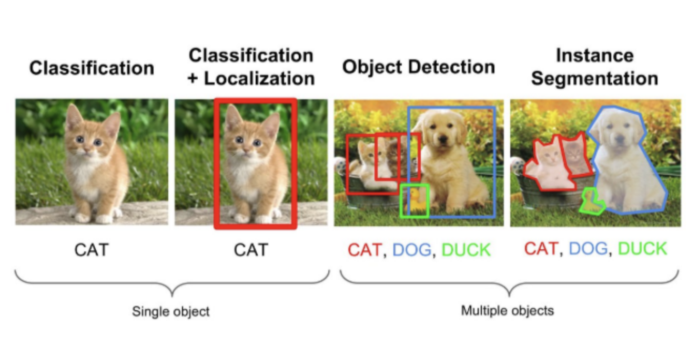

# AI

* Classification : Single object에 대해서 object의 클래스를 분류하는 문제이다.
* Classification + Localization : Single object에 대해서 object의 위치를 bounding box로 찾고(Localization) + 클래스를 분류하는 문제(Classification)이다.
* Object Detection : Multible objects에서 각각의 object에 대해 Classification + Localization을 수행하는 것이다.
* Image Segmentation : Object Detection과 유사하지만, 다른 점은 object의 위치를 bounding box가 아닌 실제 edge로 찾는 것이다.

## Classification
한 이미지에 있는 <a>물체가 무엇인지</a>를 알아내야 한다. Layer들을 쌓아가면서 그 물체의 특징을 점점 부각시키는 training을 한다. 그 방식은 filter 역할을 하는 convolution layer과 단위를 down시키는 pooling layer를 번갈아가며 사용하여 이미지의 feature를 추출하고 fully connected layer를 통해 classification을 진행한다. 그렇게 해서 Output으로 class들의 정확도를 출력한다. N개의 class에서 정답일 확률들을 나열하는 것이다. 대표적으로 CNN 네트워크가 쓰이며 구체적으로는 GoogLeNet, ResNet등이 있다. 

## Object Detection

## Image Segmentation