# 네트워크의 기초
* 네트워크
    * 컴퓨터 등의 장치들이 통신 기술을 이용하여 구축하는 여결망을 지칭하는 용어
    * 노드(node) + 링크(link)가 서로 연결되어 있거나 연결되어 있지 않은 집합체
        * node : 서버, 라우터, 스위치 등 네트워크 장치를 의미
        * link : 유선 or 무선

        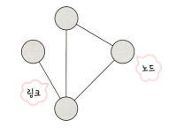

## 처리량과 지연시간
* 네트워크를 구축할 때는 <a>좋은</a> 네트워크로 만드는 것이 중요
* 좋은 네트워크란 많은 처리량을 처리할 수 있으며 지연 시간이 짧고 장애 빈도가 적으며 좋은 보안을 갖는 네트워크를 말한다.

### 처리량(throughput)
* 링크를 통해 전달되는 단위 시간당 데이터 양

    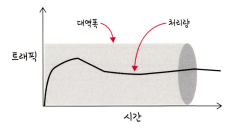

* 단위 : bps(bits per second), 초당 전송 또는 수신되는 비트 수
* 처리량은 사용자들이 많이 접속할 때마다 커지는 트래픽, 네트워크 장치 간의 대역폭(주어진 시간 동안 네트워크 연결을 통해 흐를 수 있는 최대 비트 수), 네트워크 중간에 발생하는 에러, 장치의 하드웨어 스펙에 영향을 받는다.

### 지연 시간(latency)
* 요청이 처리되는 시간, 어떤 메세지가 두 장치 사이를 왕복하는 데 걸린 시간

    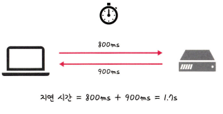

* 지연 시간은 매체 타입(무선, 유선), 패킷 크기, 라우터의 패킷 처리 시간에 영향을 받는다.

## 네트워크 토폴로지와 병목 현상

### 네트워크 토폴로지(network topology)
* 노드와 링크가 물리적으로 어떻게 배치되어 있는지에 대한 방식이자 연결 형태
* 즉 네트워크의 구조를 말함

### 네트워크 토폴로지의 종류
* 버스형 토폴로지(Bus Topology)
    * 단일 케이블에 네트워크의 모든 컴퓨터를 연결. 즉 네트워크 상에 있는 모든 host들이 하나의 케이블에 연결된 형태.
    * 하나의 케이블에 host들을 연결해야 하기 때문에 T커넥터를 사용

        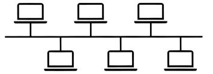

    * 장점
        1. 구축이 쉽고, 하나의 케이블에 연결되기 때문에 설치비용이 저렴하다.
        2. 하나의 컴퓨터에 문제가 생겨도 다른 컴퓨터 간의 데이터 통신에 영향을 주지 않는다.
        3. 관리와 확장이 쉽다.
    * 단점
        1. 케이블에 문제가 ㅅ생기면 모든 네트워크에 영향을 준다.
        2. 동시에 컴퓨터 간의 통신이 불가능하다.
        3. 문제 처리가 어렵고, 시간이 오래걸린다. (어떤 장치에 문제가 생겼는지 모르기 때문에 하나하나 찾아야 하기 때문에)
        4. 스푸핑이 가능하다.
            * 스푸핑은 LAN상에서 송신부의 패킷을 송신과 관련 없는 다른 host에 가지 않도록 하는 스위칭 기능을 마비시키거나 속여서 특정 노드에 해당 패킷이 오도록 처리하는 것을 말한다.

                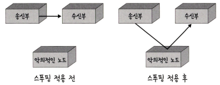

            * 앞의 그림처럼 스푸핑을 적용하면 올바르게 수신부로 가야 할 패킷이 악의적인 노드에 전달되게 된다.
* 링형 토폴로지(Ring Topology)
    * 버스형 토폴로지와 같이 하나의 케이블레 네트워크의 모든 컴퓨터 연결
    * 서로 이웃하는 것끼리 연결해 고리 구조를 형성하는 것

        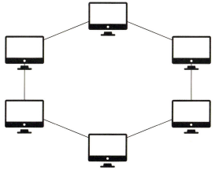

    * 장점
        1. 버스형 토폴로지와 같이 하나의 케이블에 연결되기 때문에 설치비용이 저렴하다.
        2. 똑같은 접속 기회를 제공하기 때문에 데이터간의 충돌이 발생하지 않는다.
        3. Token(토큰) 패싱을 통해 패킷의 충돌을 방지 가능하다.
            * Token을 잡는 사람이 먼저 데이터 전송을 할 수 있고 데이터 전송이 끝나면 Token은 다른 사람에게 넘어간다.
            * 토큰 패싱이란?
                * 토큰이라는 제어비트를 송신하고 해당 토큰을 확보해서 통신을 하는 방식
                * 통신 회선에 대한 제어 신호가 논리적으로 형성된 링에서 각 노드 간을 옮겨가면서 데이터를 전송하는 방식
        4. 넓은 지역에 구축이 가능하다.
    * 단점
        1. 통신의 효율성이 낮다.
        2. 한 노드가 문제가 생기면 문제 해결하기가 어렵다.
        3. 넓은 지역에 구축이 가능하기 때문에 비용이 많이 든다.
* 트리 토폴로지(Tree Topology)
    * 버스형 토폴로지를 변형한 형태
    * '계층형 토폴로지'라고 하며 트리 형태로 배치한 네트워크 구성을 의미
    * 하나의 노드에 여러 개의 노드가 트리형으로 연결되어 있고, 양방향으로 모든 노드에게 데이터를 전송한다.

        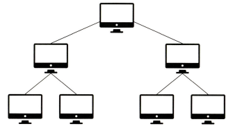

    * 장점
        1. 네트워크의 확장이 쉽고, 관리도 편하다.
        2. 통선 선로가 짧고, 통신 회선수가 절약된다.
    * 단점
        1. 상위 회선에 문제가 생기면 하위 회선 모두 문제가 생긴다.
        2. 네트워크 확장이 많아지면 트래픽이 집중되기도 한다.
* 성형 토폴로지(Star Topology)
    * 중앙의 노드를 중심으로 모든 노드들이 연결되는 형식, 즉 중앙에 위치한 노드를 중심으로 모든 노드들이 point-to-point 방식으로 직접 연결되어 중앙의 노드에서 다른 노드들을 제어한다.

        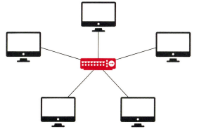

    * 장점
        1. 네트워크의 확장과 유지보수가 쉽다.
        2. 장애를 발견하기 쉽고, 그 장애를 빠르게 처리 가능하다.
        3. host들이 중앙에 집중되어 관리가 쉽다.
    * 단점
        1. 중앙에 집중되어 있기 때문에 중앙 시스템이 고장 나면 전체 시스템이 마비된다.
        2. 사용자가 많아지면 트래픽이 증가되어 속도가 저하된다.
* 망형 토폴로지(Mesh Topology)
    * 단말기들이 직접적으로 상호 연결되어 그물처럼 연결된 형태
    * 모든 네트워크와 컴퓨터가 개별적으로 연결된 것을 말한다.

        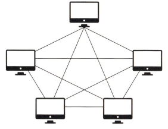

    * 장점
        1. 특정 통신 회선에 문제가 생겨도 다른 경로로 데이터 전송이 가능하다.
        2. 가용성이 높고, 효율성이 좋다.
    * 단점
        1. 네트워크 관리, 설치, 재구성이 어렵다.
        2. 많은 링크를 사용하기 때문에 설치비용이 많이 든다.

### 병목현상
* 병목현상이란?
    * 시스템 내에서 전체적인 처리 속도를 떨어뜨리게 되는 특정한 부분을 가리키는 용어
    * 시스템의 CPU나 메모리, 디스크 등의 자원 중 하나가 다른 자원들에 비해 처리 속도가 느려서, 전체적인 성능을 제한하는 경우를 말한다.
    * <a>병목현상을 찾을 때 토폴로지(네트워크 구조)가 중요한 기준이 된다.</a>
* 응답 성능에 대한 병목 현상 원인
    * 네트워크 대역폭 부족
    * 하드웨어 자원 부족
    * 어플리케이션 설계의 문제
    * 데이터베이스 부하
* 처리량(throughput), 지연시간(latency) 개선

    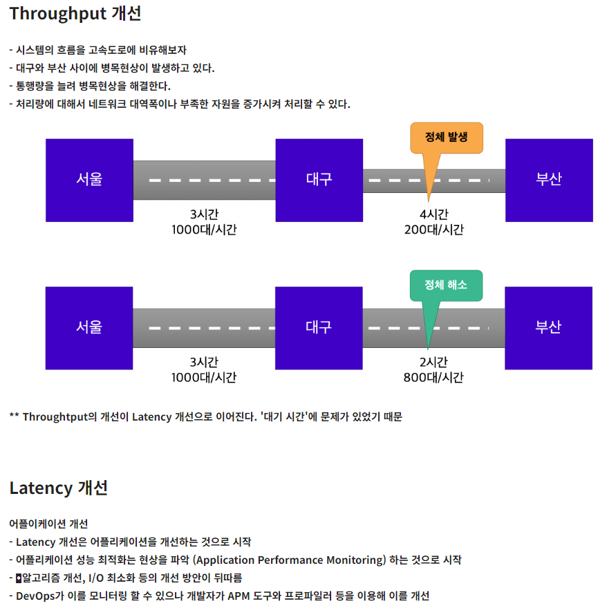

## 네트워크 분류
* 네트워크는 규모를 기반으로 뷴류한다.

### LAN
* Local Area Network
* 근거리 통신망을 의미하며 보통 집, 사무실, 학원 등 상대적으로 좁은 공간에서 사용한다.
* 전송 속도가 빠르며 혼잡하지 않다.

### MAN
* Metropolitan Area Network
* 서울시와 같은 시처럼 도시 규모에서 사용되는 네트워크를 의미한다.
* 전송 속도는 보통이며 LAN보다는 혼잡하다.

### WAN
* Wide Area Network
* 국가나 대륙과 같은 광범위한 지역을 연결하는 네트워크를 의미한다.
* 전송 속도는 낮으며 MAN보다 혼잡하다.

## 네트워크 성능 분석 명령어
* 어플리케이션 코드상에는 전혀 문제가 없는데 사용자가 서비스로부터 데이터를 가져오지 못하는 상황이 발생되기도 하며, 이는 네트워크 병목 현상일 가능성이 있다.
    * 병목현상의 주된 원인
        1. 네트워크 대역폭
        2. 네트워크 토폴로지
        3. 서버 CPU, 메모리 사용량
        4. 비효율적인 네트워크 구성
* 이때는 네트워크 관련 테스트와 네트워크와 무관한 테스트를 통해 '네트워크로부터 발생한 문제점'인 것을 확인한 후 네트워크 성능 분석을 해야 하며 이때 사용되는 명령어를 네트워크 성능 분석 명령어라 한다.

### ping
* Packet INternet Groper
* 네트워크 상태를 확인하려는 대상 노드를 향해 일정 크기의 패킷을 전송하는 명령어
* 해당 노드까지 패킷 수신 상태, 도달하기까지 시간, 네트워크 연결이 잘 돼있는지 확인할 수 있다.
* ICMP 프로토콜(OSI 3계층)을 사용한다

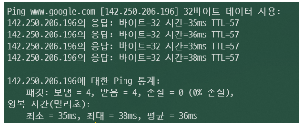

### netstat
* 접속되어 있는 서비스들의 네트워크 상태를 표시하는 데 사용되며 네트워크 접속, 라우팅 테이블, 네트워크 프로토콜 등 리스트를 보여준다.

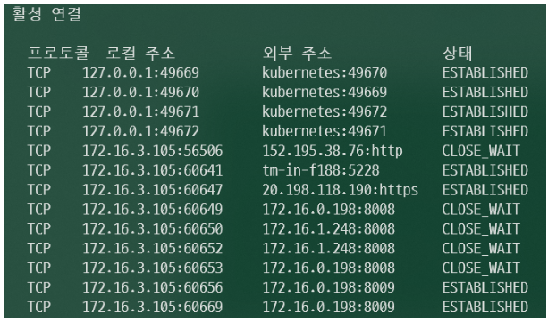

### nslookup
* DNS(도메인 이름 시스템, Domain Name System)에 관련된 내용을 확인하기 위해 사용하는 명령어이다. 특정 도메인에 매핑된 IP를 확인할 때 사용한다.

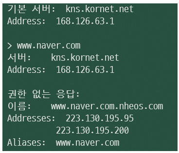

### tracert(Windows), traceroute(Linux)
* 목적지 노드까지 네트워크 경로를 확인할 때 사용하는 명령어이다. 목적지 노드까지 구간들 중 어느 구간에서 응답시간이 느려지는지를 확인할 수 있다.

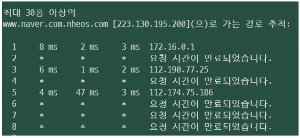

## 네트워크 프로토콜 표준화
* 네트워크 프로토콜 : 다른 장치들끼리 데이터를 주고받기 위한 설정된 공통된 인터페이스
    * 프로토콜 : 컴퓨터 또는 전자기기 간의 원활한 통신을 위해 지키기로 약속한 규약
* 이러한 프로토콜은 기업이나 개인이 발표해서 정하는 것이 아닌 IEEE 또는 IETF라는 표준화 단체가 이를 정한다.
    * IEEE : Institute of Electrical and Electronics Engineers, 미국전지전자기술자협회
    * IETF : Internet Engineering Task Force, 국제 인터넷 표준화 기구
* 예를들어 IEEE802.3은 유선 LAN 프로토콜로, 유선으로 LAN을 구축할 때 쓰이는 프로토콜이다. 이를 통해 만든 기업이 다른 장치라도 서로 데이터를 수신할 수 있다.
* 네트워크 프로토콜 표준화의 특징
    * 다양한 장비를 망에서 사용 가능
    * 표준화 설계 방식으로 확장 용이
    * 시장규모형성으로 융통성(돌려쓸 수 있는 특성)을 부여
    * 통신 방법 단순화(다양하지 않음)
* 프로토콜 표준화의 3S 원칙
    * 표준화(Standardization)
    * 단순화(Simplification)
    * 전문화(Specialization)