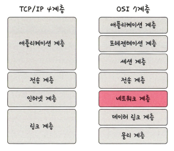
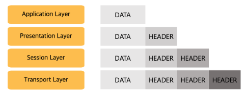
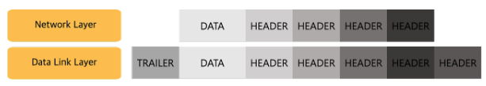

# 네트워크 계층
* 네트워크에는 다양한 기기 간 통신을 위해 약속된 구조가 있다.
* 개념적으로 나눈 OSI 7계층, 실제 인터넷 통신에 사용되는 TCP/IP 4계층이 존재

## 계층 구조

### OSI 7계층
* Open Systems Interconnection Reference Model 7 Layers
* 국제 표준화 기구(ISO, International Organization for Standardization)에서 <a>네트워크 통신이 이뤄지는 과정을 7단계로 나눈 네트워크 표준 모델</a>
* 데이터를 송신할 때는 높은 계층에서 낮은 계층으로 전달하고, 데이터가 수신부의 가장 낮은 계층에 도달하면 수신부에서는 낮은 게층에서 높은 계층으로 데이터를 전달한다.
* 각 계층은 독립적이며 데이터를 송신할 때 각 게층에서 필요한 정보를 추가해 데이터를 가공한다. 이 과정을 <a>데이터 캡슐화(data capsulation)</a>라고 한다.

#### 캡슐화

* 각 계층이 데이터를 송신할 때 각 계층에서 필요한 정보를 추가해 데이터를 가공한다. 이때 제어 정보를 담은 헤더(header)나 트레일러(trailer)가 붙는다.
* 헤더는 데이터 앞에 붙고 트레일러는 데이터 뒤에 붙는다.
* 데이터 캡슐화를 하는 이유는 수신부의 같은 계층에서 데이터 호환성을 높이고 오류의 영향을 최소화 하기 위해서이다.
* 송신부에서 데이터 캡슐화를 거친 결과물을 수신부로 보낸다. 그러면 수신부는 물리계층부터 응용 계층까지 거치며 받은 데이터에서 헤더와 트레일러를 분석해 제거하는 역캡슐화를 진행한다. 이 과정에서 각 게층은 필요한 제어 정보를 얻는다.

#### OSI 7계층의 각 계층의 역할
* 7계층(응용 계층 또는 어플리케이션 계층) : HTTP, FTP 등의 프로토콜을 응용 프로그램의 UI를 통해 제공한다.
    * 프로토콜(protocol) : 우리말로 통신 규약이라고 하며 <a>데이터를 송수신하기 위해 정한 규칙</a>을 의미한다.
* 6계층(표현 계층 또는 프레젠테이션 계층) : 데이터를 표준화된 형식으로 변경한다.
* 5계층(세션 계층) : 세션의 유지 및 해제 등 응용 프로그램 간 통신 제어와 동기화를 한다.
* 4계층(전송 계층) :신뢰성 있는 데이터를 전달하기 위한 계층으로, TCP, UDP 같은 전송 방식과 포트(port) 번호 등을 결정한다.
* 3계층(네트워크 계층) : 데이터를 송신부에서 수신부까지 보내기 위한 최적 경로를 선택하는 라우팅(routing)을 수행한다. 이때 선택한 최적 경로를 라우트(route)라고 한다. 네트워크 계층의 장비로는 라우터(router)가 있다.
* 2계층(데이터 링크 계층) : 데이터 흐름을 관리하며 데이터의 오류 검출 및 복구 등을 수행한다. 브리지(bridge), 스위치(switch), 이더넷(ethernet)이 데이터 링크 계층의 장비에 해당한다.
* 1계층(물리 계층) : 데이터를 비트(bit) 단위의 0과 1로 변환한 후 장비를 사용해 전송하거나 전기 신호를 데이터로 복원한다. 리피터(repeater), 허브(hub) 등이 물리 게층에 해당하는 장비다.

### TCP/IP 4계층
* <a>인터넷에서 데이터를 주고받기 위한 네트워크 프로토콜</a>을 의미한다.
* TCP(Transmission Control Protocol)
    * 전송 제어 프로토콜
    * 데이터를 나눈 단위인 패킷의 전달 여부와 전송 순서를 보장하는 통신 방식
* IP(Internet Protocol)
    * 인터넷 프로토콜
    * 패킷을 빠르게 보내기 위한 통신 방식
* TCP/IP 기반 프로토콜에는 대표적으로 HTTP가 있다.
* TCP/IP에 맞춰 네트워크 통신 표준인 <a>OSI 7계층을 단순화 한 것</a>이 TCP/IP 4계층이다.

#### TCP/IP 4계층의 각 계층의 역할
* 4계층(응용 계층 또는 어플리케이션 계층) : 사용자와 소프트웨어를 연결해 주는 계층으로, HTTP, HTTPS, DNS 등의 프로토콜이 작동한다. 응용 계층의 데이터 단위는 메세지 이다.(전송계층에서 보면 메세지 또한 데이터이다.)
    * FTP : 장치와 장치 간의 파일을 전송하는 데 사용되는 표준 통신 프로토콜
    * SSH : 보안되지 않은 네트워크에서 네트워크 서비스를 안전하게 운영하기 위한 암호화 네트워크 프로토콜
    * HTTP : World Wide Web을 위한 데이터 통신의 기초이자 웹 사이트를 이용하는 데 쓰는 프로토콜
    * SMTP : 전자 메일 전송을 위한 인터넷 표준 통신 프로토콜
    * DNS : 도메인 이름과 IP 주소를 매핑해주는 서버. 예를 들어 www.naver.com에 DNS 쿼리가 오면 [Root DNS] -> [.com DNS] -> [.naver DNS] -> [.www DNS] 과정을 거쳐 완벽한 주소를 찾아 IP 주소를 매핑한다. 이를 통해 IP 주소가 바뀌어도 사용자들에게 똑같은 도메인 주소로 서비스할 수 있다. 예를 들어 www.naver.com의 IP 주소가 222.111.222.111에서 222.111.222.122로 바뀌었음에도 똑같은 www.naver.com이라는 주소로 서비스가 가능하다.
* 3계층(전송 계층) : 데이터의 신뢰성을 보장하며, 포트 번호로 데이터를 적절한 응용 프로그램에 전달하는 역할을 한다. TCP, UDP 등의 프로토콜이 전송 계층에 속한다. 전송 계층의 데이터 단위는 세그먼트(segment)이다.(인터넷 계층에서 보면 세그먼트 또한 데이터이다.)
* 2계층(인터넷 계층) : 데이터를 최종 목적지까지 도달할 수 있게 하는 계층으로, IP가 대표적인 프로토콜이다. 인터넷 계층에서는 전송 게층으로부터 받은 데이터에 헤더를 붙여 캡슐화하는데, 이를 패킷(packet) 또는 데이터그램(datagram)이라고 한다. 인터넷 계층의 단위는 패킷이다.(네트워크 인터페이스 계층에서 보면 패킷 또한 데이터이다.)
    * 패킷(packet) : 네트워크에서 주고받는 데이터를 작게 분할한 단위를 나타낸다. 패킷에는 데이터의 송신 주소, 수신 주소 등의 정보가 포함되어 데이터를 목적지에 제대로 전달할 수 있게 한다.
* 1계층(네트워크 인터페이스 계층 또는 링크 계층) : 네트워크 접근 계층이라고도 하며, 데이터를 전기 신호로 변환하고 MAC 주소를 사용해 기기에 데이터를 전달한다. 이더넷, Wi-Fi 등이 해당 계층에 속하는 대표적인 프로토콜이다.
    * MAC 주소(Media Access Control address) : 48비트로 구성된 하드웨어 고유의 주소로, 네트워크 인터페이스 계층에서 사용한다.

#### TCP
* 전송 계층에 해당하는 네트워크 프로토콜로, <a>연결형 서비스를 지원하고 데이터의 신뢰성을 보장</a>한다.
* 특징
    * 송신부와 수신부의 연결을 확인하는 연결형 서비스다.
    * 패킷 교환 방식은 패킷이 전달되는 회선이 정해져 있는 가상 회선 방식이다.

    * 패킷의 전송 순서가 보장된다.
    * 패킷의 수신 여부를 확인한다.
    * 송신부와 수신부는 1:1 통신을 한다.
    * 데이터 손실이 없음을 보장하므로 신뢰성이 높다.
    * 데이터의 송수신 속도가 느리다.

## PDU

## 