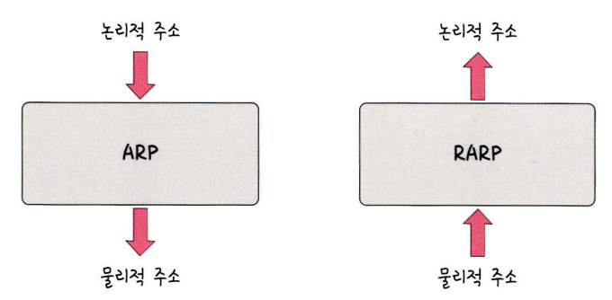
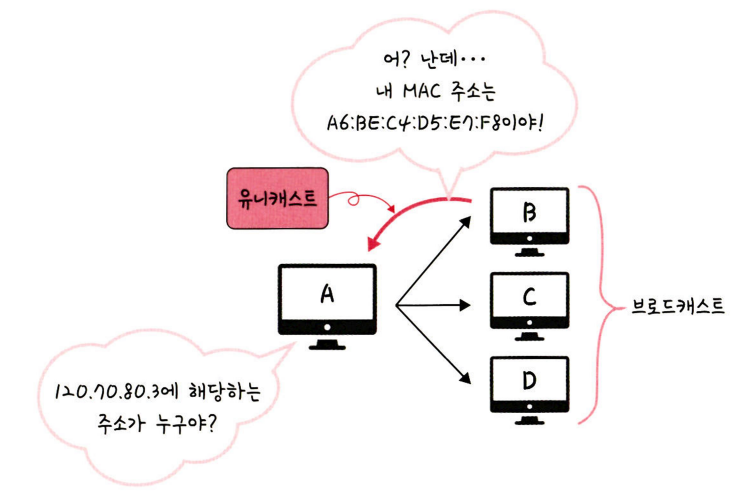
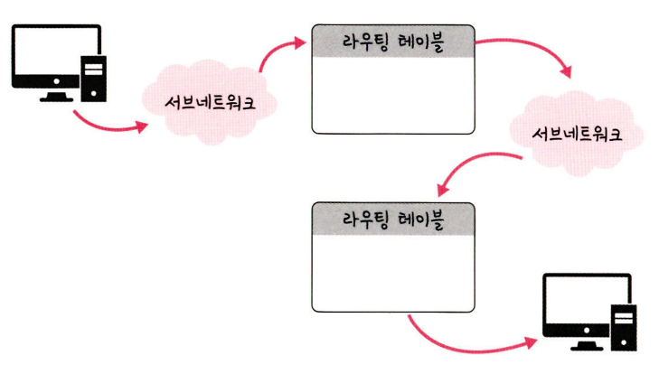
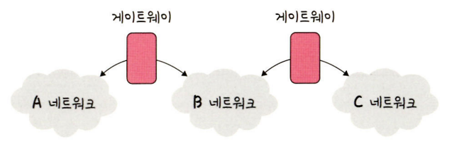
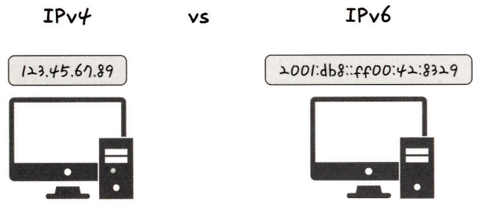
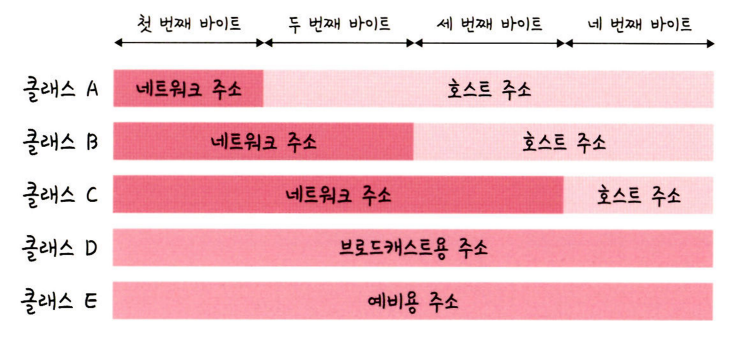
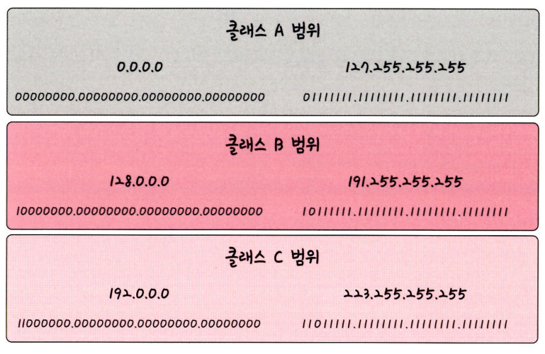
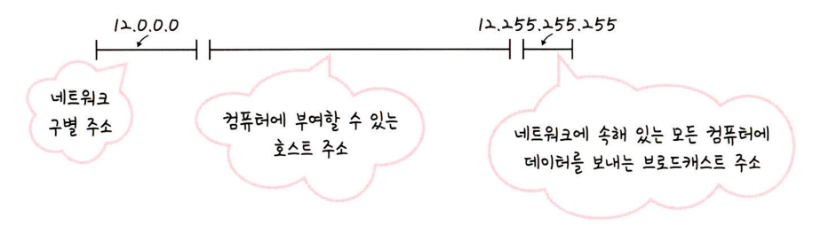

# IP 주소

## ARP
* Address Resolution Protocol
* IP 주소로부터 MAC 주소를 구하는 IP와 MAC 주소의 다리 역할을 하는 프로토콜
    * MAC : 2계층 주소
    * IP : 3계층 주소
    * Port : 4계층 주소
* ARP를 통해 가상 주소인 IP 주소를 실제 주소인 MAC 주소로 변환한다. 이와 반대로 RARP를 통해 실제 주소인 MAC 주소를 가상 주소인 IP 주소로 변환하기도 한다.

### ARP의 주소를 찾는 과정

장치 A가 ARP Request 브로드캐스트를 보내서 IP 주소인 120.70.80.3에 해당하는 MAC 주소를 찾는다. 이후 해당 주소에 맞는 장치 B가 'ARP reply 유니캐스트'를 통해서 MAC 주소를 반환하는 과정을 거쳐 IP 주소에 맞는 MAC 주소를 찾게 된다.

* 브로드캐스트 : 송신 호스트가 전송한 데이터가 네트워크에 연결된 모든 호스트에 전송되는 방식
* 유니캐스트 : 고유 주소로 식별된 네트워크 목적지에 1:1로 데이터를 전송하는 방식

## 홉바이홉 통신

* hop by hop : IP 주소를 통해 통신하는 과정
    * hop : 단어 자체로 '건너뛰는 모습'을 의미 -> 통신망에서 각 패킷이 여러 개의 라우터를 건너가는 모습을 비유적으로 표현한 것
* 각각의 라우터에 있는 라우팅 테이블의 IP를 기반으로 패킷을 전달하고 다시 전달해나갑니다.
* 통신 장치에 있는 '라우팅 테이블'의 IP를 통해 시작 주소부터 시작하여 다음 IP로 계속해서 이동하는 '라우팅'과정을 거쳐 패킷이 최종 목적지까지 도달하는 통신을 말한다.
    * 라우팅 : IP주소를 찾아가는 과정

### 라우팅 테이블
* routing table
* 송신지에서 수신지까지 도달하기 위해 사용되며 라우터에 들어가 있는 목적지 정보들과 그 목적지로 가기 위한 방법이 들어있는 리스트를 뜻한다.
* 라우팅 테이블에는 게이트웨이와 모든 목적지에 대해 해당 목적지에 도달하기 위해 거쳐야 할 다음 라우터의 정보를 가지고 있다.

### 게이트웨이

* gateway
* 서로 다른 통신망, 프로토콜을 사용하는 네트워크 간의 통신을 가능하게 하는 관문 역할을 하는 컴퓨터나 소프트웨어를 두루 일컫는 용어이다.
* 사용자는 인터넷에 접속하기 위해 수많은 톨게이트인 게이트웨이를 거쳐야 하며 게이트웨이는 서로 다른 네트워크상의 통신 프로토콜을 변환해주는 역할을 하기도 한다.
* 게이트웨이를 확인하는 방법은 라우팅 테이블을 통해 볼 수 있다. 라우팅 테이블은 윈도우의 명령 프롬프트에서 `netstat -r`명령어를 실행하여 확인할 수 있다.

## IP 주소 체계
* IP 주소 : IPv4, IPv6으로 나뉜다.

    

    * IPv4 : 32비트를 8비트 단위로 점을 찍어 표기하며, 123.45.67.89 같은 방식으로 IP주소를 나타낸다.
    * IPv6 : 64비트를 16비트 단위로 점을 찍어 표기하며, 2001:유8::ㄹㄹ00:42:8329 같은 방식으로 IP 주소를 나타낸다.
    * 추세는 IPv6로 가고 있지만 현재 가장 많이 쓰이는 주소 체계는 IPv4이다.

### 클래스 기반 할당 방식 (CIDR)
IP 주소 체계는 과거를 거쳐 발전해오고 있으며 처음에는 A, B, C, D, E 다섯 개의 클래스로 구분하는 클래스 기반 할당방식(CIDR)를 사용했다. 앞부분은 네트워크 주소, 뒷부분은 컴퓨터에 부여하는 주소인 호스트 주소를 놓아서 사용했다.

클래스 A, B, C는 일대일 통신으로 사용되고, 클래스 D는 멀티캐스트 통신, 클래스 E는 앞으로 사용할 예비용으로 쓰는 방식이다.

맨 왼쪽에 있는 비트를 '구분 비트'라고 한다. 앞의 그림처럼 클래스 A의 경우 맨 왼쪽에 있는 비트가 0이다. 클래스 B는 10이다. 클래스 C는 110이다. 이를 통해 클래스 간의 IP가 나눠진다. 클래스 A에서 가질 수 있는 IP 범위는 00000000.00000000.00000000.00000000~01111111.11111111.11111111.11111111입니다. 이를 십진수로 표현하면 0.0.0.0~127.255.255.255이다. 다른 네트워크도 이런 식의 주소 범위를 가진다. 또한 네트워크의 첫 번째 주소는 네트워크 주소로 사용되고 가장 마지막 주소는 브로드캐스트용 주소로 네트워크에 속해 있는 모든 컴퓨터에 데이터를 보낼 때 사용된다. 

예를 들어 클래스 A로 12.0.0.0이란 네트워크를 부여받았다고 하면 12.0.0.1~12.255.255.254의 호스트 주소를 부여받은 것입니다. 이때 첫 번째 주소인 12.0.0.0은 네트워크 구별 주소로 사용하면 안 되고 가장 마지막 주소인 12.255.255.255의 경우 브로드캐스트용으로 남겨두어야 하니 이 또한 사용하면 안된다. 그렇기 때문에 그 사이에 있는 12.0.0.1~12.255.255.254를 컴퓨터에 부여할 수 있는 호스트 주소로 사용할 수 있다.

* 이 방식은 사용하는 주소보다 버리는 주소가 많은 단점이 있고 이를 해소하기 위해 DHCP, IPv6, NAT가 나왔다.

### DHCP(Dynamic Host Configuration Protocol)
IP 주소 및 기타 통신 매개변수를 자동으로 할당하기 위한 네트워크 관리 프로토콜이다. 이 기술을 통해 네트워크 장치의 IP주소를 수동으로 설정할 필요 없이 인터넷에 접속할 때마다 자동으로 IP주소를 할당할 수 있다. 많은 라우터와 게이트웨이 장비에 DHCP 기능이 있으며 이를 통해 대부분의 가정용 네트워크에서 IP주소를 할당한다.

<a>CIDR, DHCP 찾아보고 좀더 공부하기</a>

## 