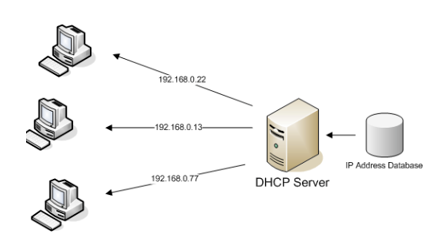
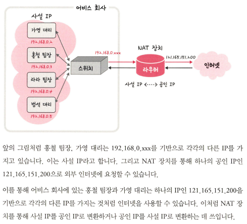

# IP 주소

## ARP
* Address Resolution Protocol
* IP 주소로부터 MAC 주소를 구하는 IP와 MAC 주소의 다리 역할을 하는 프로토콜
    * MAC : 2계층 주소
    * IP : 3계층 주소
    * Port : 4계층 주소
* ARP를 통해 가상 주소인 IP 주소를 실제 주소인 MAC 주소로 변환한다. 이와 반대로 RARP를 통해 실제 주소인 MAC 주소를 가상 주소인 IP 주소로 변환하기도 한다.

### ARP의 주소를 찾는 과정

장치 A가 ARP Request 브로드캐스트를 보내서 IP 주소인 120.70.80.3에 해당하는 MAC 주소를 찾는다. 이후 해당 주소에 맞는 장치 B가 'ARP reply 유니캐스트'를 통해서 MAC 주소를 반환하는 과정을 거쳐 IP 주소에 맞는 MAC 주소를 찾게 된다.

* 브로드캐스트 : 송신 호스트가 전송한 데이터가 네트워크에 연결된 모든 호스트에 전송되는 방식
* 유니캐스트 : 고유 주소로 식별된 네트워크 목적지에 1:1로 데이터를 전송하는 방식

## 홉바이홉 통신

* hop by hop : IP 주소를 통해 통신하는 과정
    * hop : 단어 자체로 '건너뛰는 모습'을 의미 -> 통신망에서 각 패킷이 여러 개의 라우터를 건너가는 모습을 비유적으로 표현한 것
* 각각의 라우터에 있는 라우팅 테이블의 IP를 기반으로 패킷을 전달하고 다시 전달해나갑니다.
* 통신 장치에 있는 '라우팅 테이블'의 IP를 통해 시작 주소부터 시작하여 다음 IP로 계속해서 이동하는 '라우팅'과정을 거쳐 패킷이 최종 목적지까지 도달하는 통신을 말한다.
    * 라우팅 : IP주소를 찾아가는 과정

### 라우팅 테이블
* routing table
* 송신지에서 수신지까지 도달하기 위해 사용되며 라우터에 들어가 있는 목적지 정보들과 그 목적지로 가기 위한 방법이 들어있는 리스트를 뜻한다.
* 라우팅 테이블에는 게이트웨이와 모든 목적지에 대해 해당 목적지에 도달하기 위해 거쳐야 할 다음 라우터의 정보를 가지고 있다.

### 게이트웨이

* gateway
* 서로 다른 통신망, 프로토콜을 사용하는 네트워크 간의 통신을 가능하게 하는 관문 역할을 하는 컴퓨터나 소프트웨어를 두루 일컫는 용어이다.
* 사용자는 인터넷에 접속하기 위해 수많은 톨게이트인 게이트웨이를 거쳐야 하며 게이트웨이는 서로 다른 네트워크상의 통신 프로토콜을 변환해주는 역할을 하기도 한다.
* 게이트웨이를 확인하는 방법은 라우팅 테이블을 통해 볼 수 있다. 라우팅 테이블은 윈도우의 명령 프롬프트에서 `netstat -r`명령어를 실행하여 확인할 수 있다.

## IP 주소 체계
* IP 주소 : IPv4, IPv6으로 나뉜다.

    

    * IPv4 : 32비트를 8비트 단위로 점을 찍어 표기하며, 123.45.67.89 같은 방식으로 IP주소를 나타낸다.
    * IPv6 : 64비트를 16비트 단위로 점을 찍어 표기하며, 2001:유8::ㄹㄹ00:42:8329 같은 방식으로 IP 주소를 나타낸다.
    * 추세는 IPv6로 가고 있지만 현재 가장 많이 쓰이는 주소 체계는 IPv4이다.

### 클래스 기반 할당 방식 (CIDR)
IP 주소 체계는 과거를 거쳐 발전해오고 있으며 처음에는 A, B, C, D, E 다섯 개의 클래스로 구분하는 클래스 기반 할당방식(CIDR)를 사용했다. 앞부분은 네트워크 주소, 뒷부분은 컴퓨터에 부여하는 주소인 호스트 주소를 놓아서 사용했다.

클래스 A, B, C는 일대일 통신으로 사용되고, 클래스 D는 멀티캐스트 통신, 클래스 E는 앞으로 사용할 예비용으로 쓰는 방식이다. 클래스 A는 대규모 네트워크, 클래스 B는 중규모 네트워크, 클래스 C는 소규모 네트워크에 사용된다. 그 이유는 호스트 주소로 할당할수 있는 IP 주소의 개수가 다르기 때문이다. (많다면 대규모, 적다면 소규모 네트워크에 사용)

맨 왼쪽에 있는 비트를 '구분 비트'라고 한다. 앞의 그림처럼 클래스 A의 경우 맨 왼쪽에 있는 비트가 0이다. 클래스 B는 10이다. 클래스 C는 110이다. 이를 통해 클래스 간의 IP가 나눠진다. 클래스 A에서 가질 수 있는 IP 범위는 00000000.00000000.00000000.00000000~01111111.11111111.11111111.11111111입니다. 이를 십진수로 표현하면 0.0.0.0~127.255.255.255이다. 다른 네트워크도 이런 식의 주소 범위를 가진다. 또한 네트워크의 첫 번째 주소는 네트워크 주소로 사용되고 가장 마지막 주소는 브로드캐스트용 주소로 네트워크에 속해 있는 모든 컴퓨터에 데이터를 보낼 때 사용된다. 

예를 들어 클래스 A로 12.0.0.0이란 네트워크를 부여받았다고 하면 12.0.0.1~12.255.255.254의 호스트 주소를 부여받은 것입니다. 이때 첫 번째 주소인 12.0.0.0은 네트워크 구별 주소로 사용하면 안 되고 가장 마지막 주소인 12.255.255.255의 경우 브로드캐스트용으로 남겨두어야 하니 이 또한 사용하면 안된다. 그렇기 때문에 그 사이에 있는 12.0.0.1~12.255.255.254를 컴퓨터에 부여할 수 있는 호스트 주소로 사용할 수 있다.

* 이 방식은 사용하는 주소보다 버리는 주소가 많은 단점이 있고 이를 해소하기 위해 DHCP, IPv6, NAT가 나왔다.

### DHCP(Dynamic Host Configuration Protocol)
DHCP란 호스트의 IP주소와 각종 TCP/IP 프로토콜의 기본 설정을 클라이언트에게 자동적으로 제공해주는 프로토콜을 말한다. DHCP는 네트워크에 사용되는 IP주소를 DHCP서버가 중앙집중식으로 관리하는 클라이언트/서버 모델을 사용하게 된다. DHCP지원 클라이언트는 네트워크 부팅과정에서 DHCP서버에 IP주소를 요청하고 이를 얻을 수 있다. 네트워크 안에 컴퓨터에 자동으로 네임 서버 주소, IP주소, 게이트웨이 주소를 할당해주는 것을 의미하고, 해당 클라이언트에게 일정 기간 임대를 하는 동적 주소 할당 프로토콜이다.

* 장점
    * PC의 수가 많거나 PC자체 변동사항이 많은 경우 IP 설정이 자동으로 되기 때문에 효율적으로 사용 가능하고, IP를 자동으로 할당해주기 때문에 IP 충돌을 막을 수 있다.
* 단점
    * DHCP 서버에 의존되기 때문에 서버가 다운되면 IP 할당이 제대로 이루어지지 않는다.
* DHCP의 구성
    1. DHCP 서버
        * DHCP 서버는 네트워크 인터페이스를 위해서 IP주소를 가지고 있는 서버에서 실행되는 프로그램으로 일정한 범위의 IP주소를 다른 클라이언트에게 할당하여 자동으로 설정하게 해주는 역할을 한다. DHCP서버는 클라이언트에게 할당된 IP주소를 변경없이 유지해 줄 수 있다. 클라이언트에게 IP 할당 요청이 들어오면 IP를 부여해주고 할당 가능한 IP들을 관리해주게 된다.
    2. DHCP 클라이언트
        * 클라이언트들은 시스템이 시작하면 DHCP서버에 자신의 시스템을 위한 IP 주소를 요청하고, DHCP 서버로부터 IP 주소를 부여 받으면 TCP/IP 설정은 초기화되고 다른 호스트와 TCP/IP를 사용해서 통신을 할 수 있게 된다. 즉 서버에서 IP를 할당받으면 TCP/IP 통신을 할 수 있다.

            
* DHCP 프로토콜의 원리
    * DHCP를 통한 IP 주소 할당은 “임대”라는 개념을 가지고 있는데 이는 DHCP 서버가 IP 주소를 영구적으로 단말에 할당하는 것이 아니고 임대기간(IP Lease Time)을 명시하여 그 기간 동안만 단말이 IP 주소를 사용하도록 하는 것이다. 단말은 임대기간 이후에도 계속 해당 IP 주소를 사용하고자 한다면 IP 주소 임대기간 연장(IP Address Renewal)을 DHCP 서버에 요청해야 하고 또한 단말은 임대 받은 IP 주소가 더 이상 필요치 않게 되면 IP 주소 반납 절차(IP Address Release)를 수행하게 된다.

### NAT (Network Address Translation)
패킷이 라우팅 장치를 통해 전송되는 동안 패킷의 IP 주소 정보를 수정하여 IP 주소를 다른 주소로 매핑하는 방법이다. IPv4 주소 체계만으로는 많은 주소들을 모두 감당하지 못하는 단점이 있는데, 이를 해결하기 위해 NAT로 공인 IP와 사설 IP로 나눠 많은 주소를 처리한다. NAT를 가능하게 하는 소프트웨어는 ICS, RRAS, Netfilter 등이 있다.

* 공유기와 NAT
    * NAT를 쓰는 이유는 주로 여러 대의 호스트가 하나의 공인 IP 주소를 사용하여 인터넷에 접속하기 위함이다. 예를 들어 인터넷 회선 하나를 개통하고 인터넷 공유기를 달아서 여러 PC를 연결하여 사용할 수 있는데, 이것이 가능한 이유는 인터넷 공유기에 NAT 기능이 탑재되어 있기 때문이다.
* NAT을 이용한 보안
    * NAT을 이용하면 내부 네트워크에서 사용하는 IP 주소와 외부에 드러나는 IP 주소를 다르게 유지할 수 있기 때문에 내부 네트워크에 대한 어느 정도의 보안이 가능해진다.
* NAT의 단점
    * NAT은 여러명이 동시에 인터넷을 접속하게 되므로 실제로 접속하는 호스트 숫자에 따라서 접속 속도가 느려질 수 있다는 단점이 있다.

## IP 주소를 이용한 위치 정보
IP 주소는 인터넷에서 사용하는 네트워크 주소이기 때문에 이를 통해 동 또는 구까지 위치 추적이 가능하다.

<a>서브넷 마스크에 관해 공부할 것</a>