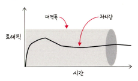
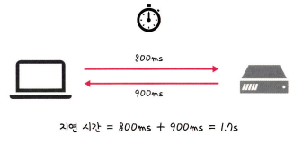
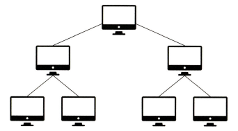
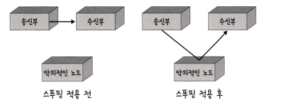
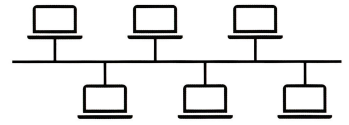
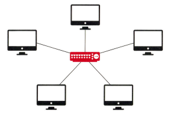
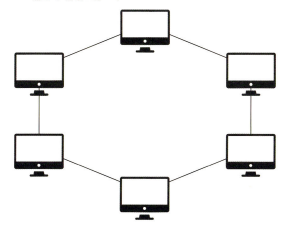
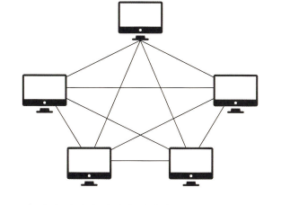
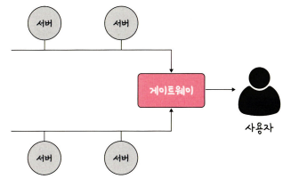
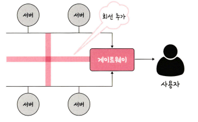

# 네트워크의 기초
* 네트워크 : 노드(node)와 링크(link)가 서로 연결되어 있거나 연결되어 있지 않은 집합체
    * 노드 : 서버, 라우터, 스위치 등 네트워크 장치를 의미
    * 링크 : 유선 또는 무선을 의미

## 처리량과 지연 시간
* 네트워크를 구축할 때는 "좋은" 네트워크를 만드는 것이 중요
    * "좋은" 네트워크 : 많은 양을 처리할 수 있으며 지연 시간이 짧고, 장애 빈도가 적으며 좋은 보안을 갖춘 네트워크
* 처리량(throughput) : 링크를 통해 전달되는 단위 시간당 데이터 양
    * 단위 : bps(bits per second), 초당 전송 또는 수신되는 비트 수
    * 처리량은 사용자들이 많이 접속할 때마다 커지는 트래픽, 네트워크 장치 간의 대역폭, 네트워크 중간에 발생하는 에러, 장치의 하드웨어 스펙에 영향을 받는다.
        * 대역폭 : 주어진 시간 동안 네트워크 연결을 통해 흐를 수 있는 최대 비트 수

        

* 지연 시간(latency) : 요청이 처리되는 시간, 어떤 메세지가 두 장치 사이를 왕복하는데 걸린 시간
    * 매체 타입(유선, 무선), 패킷 크기, 라우터의 패킷 처리 시간에 영향을 받는다.

        

## 네트워크 토폴로지와 병목 현상

### 네트워크 토폴로지(network topology)
* 노드와 링크가 어떻게 배치되어 있는지에 대한 방식이자 연결 형태

* 트리(tree) 토폴로지
    * 계층형 토폴로지
    * 노트의 추가, 삭제가 쉬우며 특정 노드에 트래픽이 집중될 때 하위 노드에 영향을 끼칠 수 있다.

    

* 버스(bus) 토폴로지
    * 중앙 통신 회선 하나에 여러 개의 노드가 연결되어 공유되는 네트워크 구성을 말하며, 근거리 통신망(LAN)에서 사용
    * 설치 비용이 적고 신뢰성이 우수하며 중앙 통신 회선에 노드를 추가하거나 삭제하기 쉽다. 그러나 스푸핑이 가능하다는 문제점이 존재한다.
        * 스푸핑(spoofing) : LAN상에서 송신부의 패킷을 송신과 관련 없는 다른 호스트에 가지 않도록 하는 스위치 기능을 말하며 마비시키거나 속여서 특정 노드에 해당 패킷이 오도록 처리하는 것

            

    

* 스타(star, 성형) 토폴로지
    * 중앙에 있는 노드에 모두 연결된 네트워크 구성
    * 노드를 추가하거나 에러를 탐지하기 쉽고 패킷의 충돌 발생 가능성이 적다.
    * 어떠한 노드에 장애가 반생해도 쉽게 에러를 발견할 수 있으며 장애 노드가 중앙 노드가 아닐 경우 다른 노드에 영향을 끼치는 것이 적다.
    * 중앙 노드에 장애가 발생하면 전체 네트워크를 사용할 수 없고 설치 비용이 고가이다.

    

* 링형(ring) 토폴로지
    * 각각의 노드가 양 옆의 두 노드와 연결하여 전체적으로 고리처럼 하나의 연속된 길을 통해 통신을 하는 망 구성 방식
    * 데이터는 노드에서 노드로 이동하게 되며, 각각의 노드는 고리 모양의 길을 통해 패킷을 처리
    * 노드의 수가 증가되어도 네트워크상의 손실이 거의 없고 충돌이 발생되는 가능성이 적고 고장 발견을 쉽게 할수 있다.
    * 네트워크 구성 변경이 어렵고 회선에 장애가 발생하면 전체 네트워크에 영향을 크게 끼친다.

    

* 메시(mesh) 토폴로지
    * 망형 토폴로지, 그물망처럼 연결되어 있는 구조
    * 한 단말 장치에 장애가 발생해도 여러 개의 경로가 존재하므로 네트워크를 계속 사용할 수 있고 트래픽도 분산처리가 가능하다.
    * 하지만 노드의 추가가 어렵고 구축 비용과 운용 비용이 고가인 단점이 있다.

    

### 병목 현상
* 병목 현상(bottleneck)
    * 전체 시스템의 성능이나 용량이 하나의 구성 요소로 인해 제한을 받는 현상. 서비스에서 이벤트를 열었을 때 트래픽이 많이 생기고 그 트래픽을 잘 관리하지 못한다면 병목 현상이 생겨 사용자는 웹 사이트로 들어가지 못한다.
* 네트워크의 구조라고도 일컫는 토폴로지가 중요한 이유는 병목 현상을 찾을 때 중요한 기준이 되기 때문이다.

* 위의 그림처럼 서비스를 만들었는데 병목 현상이 일어나 사용자가 서비스를 이용할 때 지연 시간이 길게 발생
* 이때 지연시간을 짧게 만들기 위해 대역폭을 크게 설정하여도 성능이 개선되지 않음 -> 네트워크 토폴로지 확인 후 서버와 서버 간 그리고 게이트웨이로 이어지는 회선을 추가하여 해결

## 네트워크 분류
* 네트워크는 규모를 기반으로 분류할 수 있다.
    * LAN(Local Area Network) : 사무실과 개인적으로 소유 가능한 규모
    * MAN(Metropolitan Area Network) : 시 정도의 규모
    * WAN(Wide Area Network) : 세계 규모
* LAN
    * 근거리 통신망을 의미
    * 같은 건물이나 캠퍼스 같은 좁은 공간에서 운영
    * 전송 속도가 빠르고 혼잡하지 않음
* MAN
    * 대도시 지역 네트워크를 의미
    * 전송 속도는 평균, LAN보다는 더 많이 혼잡
* WAN
    * 광역 네트워크를 의미
    * 국가 또는 대륙 같은 더 넓은 지역에서 운영
    * 전송 속도는 낮으며 MAN보다 더 혼잡

## 네트워크 성능 분석 명령어
* 어플리케이션 코드상에는 전혀 문제가 없는데 사용자가 서비스로부터 데이터를 가져오지 못하는 상황이 발생되기도 하며 이는 네트워크 병목 현상일 가능성이 있다.
* 네트워크 병목현상의 주된 원인
    * 네트워크 대역폭
    * 네트워크 토폴로지
    * 서버 CPU, 메모리 사용량
    * 비효율적인 네트워크 구성
* 병목현상 발생 시, 네트워크 관련 테스트와 네트워크와 무관한 테스트를 통해 '네트워크로부터 발생한 문제점'인 것을 확인한 후 네트워크 성능 분석을 실행해야 한다.
* 네트워크 성능 분석 명령어
    * `ping`
        * Packet Internet Groper
        * 네트워크 상태를 확인하려는 대상 노드를 향해 일정 크기의 패킷을 전송하는 명령어 -> 해당 노드의 패킷 수신 상태와 도달하기까지 시간을 알 수 있으며 해당 노드까지 네트워크가 잘 연결되어 있는지 확인할 수 있다.
        * 