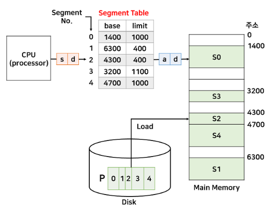
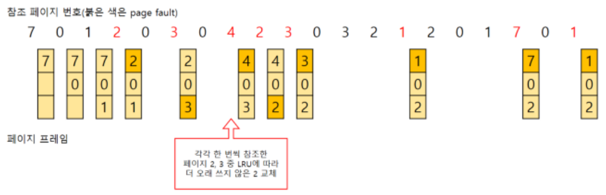

# 운영 체제(OS)
* operation system

## 운영체제와 컴퓨터

### 운영체제의 역할과 구조
* 운영체제의 역할
    1. CPU 스케줄링과 프로세스 관리
        * CPU 소유권을 어떤 프로세스에 할당할지, 프로세스의 생성과 삭제, 자원 할당 및 반환을 관리
    2. 메모리 관리
        * 한정된 메모리를 어떤 프로세스에 얼만큼 할당해야 하는지 관리
    3. 디스크 파일 관리
        * 디스크 파일을 어떠한 방법으로 보관할지 관리
    4. I/O 디바이스 관리
        * I/O 디바이스들인 마우스, 키보드와 컴퓨터 간에 데이터를 주고 받는 것을 관리
            * I/O : input과 output의 약자로 컴퓨터 및 주변장치에 대해 데이터를 전송하는 프로그램, 운영 혹은 장치를 일컫는 말이다. 대개의 경우 입력에 함께 출력이 발생하지만 키보드와 마우스처럼 입력을 위한 기기, 프린터처럼 출력에만 사용되는 기기도 있다. 프로세서와 메모리, 확장 슬롯, 마더보드에서 일어나는 데이터 전송도 I/O라고 한다.
* 운영체제의 구조

    

    * 유저 프로그램이 맨 위에 있고 그 다음으로 GUI, 시스템콜, 커널, 드라이버가 있으며 가장 밑에 하드웨어가 있는 구조이다. 이때 유저 프로그램과 하드웨어를 제외한 부분이 운영체제를 지칭한다. GUI가 없고 CUI만 있는 리눅스 서버도 존재한다.
        * GUI(Graphical User Interface) : 사용자가 전자장치와 상호 작용할 수 있도록 하는 사용자 인터페이스의 한 형태. 단순 명령어 창이 아닌 아이콘을 마우스로 클릭하는 단순한 동작으로 컴퓨터와 상호 작용할 수 있도록 해준다. 대표적으로 DESKTOP(PC)의 하단바가 대표적이다.

            

        * CUI(Character User Interface) : CLI(Command-Line Interface)라고도 부른다. 그래픽이 아닌 명령어로 처리하는 인터페이스. 오직 텍스트로만 이루어진 창이다. 대표적으로 CMD창이 있다.

            

        * 드라이버 : 하드웨어를 제어하기 위한 소프트웨어
    * 시스템콜
        * 운영체제가 커널에 접근하기 위한 인터페이스
        * 유저 프로그램이 운영체제의 서비스를 받기 위해 커널 함수를 호출할때 사용
        * 유저 프로그램이 I/O 요청으로 트랩(trap)이 발동하면 올바른 I/O 요청인지 확인한 후 유저 모드가 시스템 콜을 통해 커널 모드로 변환되어 실행된다.
            * 예를 들어 I/O 요청인 fs.readFile()이라는 파일 시스템의 파일을 읽는 함수가 발동했다면 유저 모드에서 파일을 읽지 않고 커널 모드로 들어가 파일을 읽고 다시 유저 모드로 돌아가 유저 프로그램의 로직을 수행한다. -> 이 과정을 통해 컴퓨터 자원에 대한 직접 접근을 차단하여 프로그램을 다른 프로그램으로부터 보호할 수 있다.

                

        * 프로세스나 스레드에서 OS로 어떠한 요청을 할 때 시스템콜이라는 인터페이스와 커널을 거쳐 OS에 전달된다.
        * 시스템콜은 하나의 추상화 계층이다. 이를 통해 네트워크 통신이나 데이터베이스와 같은 낮은 단계의 영역 처리에 대한 부분을 많이 신경 쓰지 않고 프로그램을 구현할 수 있는 장점이 있다.
* modebit
    * 시스템콜이 작동될 때 modebit을 참고하여 유저 모드와 커널 모드를 구분한다.
        * 유저 모드 : 유저가 접근할 수 있는 영역을 제한적으로 두며 컴퓨터 자원에 함부로 침범하지 못하는 모드
        * 커널 모드 : 모든 컴퓨터 자원에 접근할 수 있는 모드
        * 커널 : OS의 핵심 부분이자 시스템콜 인터페이스를 제공하며 보안, 메모리, 프로세스, 파일 시스템, I/O 디바이스, I/O 요청 관리 등 OS의 중추적인 역할을 한다.
    * modebit은 1 또는 0의 값을 가지는 플래그 변수
    * 0은 커널모드, 1은 유저모드로 설정되며, 유저모드일 경우에는 시스템콜을 못하게 막아서 한정된 일만 가능하게 한다.
    * for example : 카메라를 켜는 프로그램을 있다고 하자
        * 만약 유저 모드를 기반으로 카메라가 켜진다면, 사용자가 의도하지 않았는데 공격자가 카메라를 키는 등의 나쁜 행위를 하기 쉽다.
        * 커널 모드를 거쳐 OS를 통해 작동한다고 해도 전부를 막을수 없어도 운영체제를 통해 작동하게 한다면 막기가 수월해진다. 이러한 장치가 modebit이다.

            

### 컴퓨터의 요소

* 컴퓨터는 CPU, DMA 컨트롤러, 메모리, 타이머, 디바이스 컨트롤러 등으로 이루어져 있다.

#### CPU
* Central Processing Unit
* 산술논리연산장치, 제어장치, 레지스터로 구성되어 있는 컴퓨터 장치
    * 제어장치(CU : Control Unit) : 프로세스 조작을 지시하는 CPU의 한 부품. 입출력 장치 간 통신을 제어하고 명령어들을 읽고 해석하며 데이터 처리를 위한 순서를 결정한다.
    * 레지스터 : CPU안에 있는 매우 빠른 임시기억장치이다. CPU와 직접 연결되어 있어 연산 속도가 메모리보다 훨씬 빠르다. CPU는 자체적으로 데이터를 저장할 방법이 없기 때문에 레지스터를 거쳐 데이터를 전달한다.
    * 산술논리연산장치(ALU : Arithmetic Logic Unit) : 덧셈, 뺄셈 같은 두 숫자의 산술 연산과 베타적 논리합, 논리곱 같은 논리 연산을 계산하는 디지털 회로이다.
* CPU의 연산 처리

    

    1. 제어장치가 메모리에 계산할 값을 로드한다. 또한 레지스터에도 로드한다.
    2. 제어장치가 레지스터에 있는 값을 계산하라고 ALU에 명령한다.
    3. 제어장치가 계산된 값을 다시 '레지스터에서 메모리로' 계산한 값을 저장한다.
* 인터럽트에 의해 단순히 메모리에 존재하는 명령어를 해석해서 실행한다.
    * OS가 관리자라면 커널이 프로그램을 메모리에 올려 프로세스를 만들면 CPU가 일꾼이 되어 처리한다.
* 인터럽트
    * 어떤 신호가 들어왔을 때 CPU를 잠깐 정지시키는 것을 의미한다.
    * 키보드, 마우스 등 IO 디바이스로 인한 인터럽트, 0으로 숫자를 나누는 산술 연산에서의 인터럽트, 프로세스 오류 등으로 발생한다.
    * 인터럽트가 발생하면 인터럽트 헨들러 함수가 모여 있는 인터럽트 벡터로 가서 인터럽트 핸들러 함수(인터럽트가 발생했을 때 이를 핸들링하기 위한 함수)가 실행된다. 인터럽트 간에는 우선순위가 있고 이에 따라 실행되며 인터럽트는 하드웨어 인터럽트, 소프트웨어 인터럽트 두가지로 나뉜다.
    1. 하드웨어 인터럽트
        * IO 디바이스에서 발생하는 인터럽트
        * 인터럽트 라인이 설계된 이후 순차적으로 인터럽트 실행을 중지하고 OS에 시스템콜을 요청해서 원하는 디바이스로 향해 디바이스에 있는 작은 로컬 버퍼에 접근하여 일을 수행한다.
    2. 소프트웨어 인터럽트
        * 트랩(trap)이라고도 한다. 프로세스 오류 등으로 프로세스가 시스템콜을 호출할 때 발동한다.

#### DMA 컨트롤러
* I/O 디바이스가 메모리에 직접 접근할 수 있도록 하는 하드웨어 장치
* CPU에만 너무 많은 인터럽트 요청이 들어오기 때문에 CPU 부하를 막아주며 CPU의 일을 부담하는 보조 일꾼 느낌이다.
* 하나의 작업을 CPU와 DMA 컨트롤라가 동시에 하는 것을 방지한다.

#### 메모리
* 전자회로에서 데이터나 상태, 명령어 등을 기록하는 장치
* 보통 RAM(Random Access Memory)를 일컬어 메모리라고도 한다.
* CPU가 계산을 담당한다면 메모리는 기억을 담당한다.
* 메모리가 크면 클수록 많은 일을 동시에 할 수 있다.

#### 타이머
* 몇 초 안에는 작업이 끝나야 한다는 것을 정하고, 특정 프로그램에 시간 제한을 다는 역할
* 시간이 많이 걸리는 프로그램이 작동할 때 제한을 걸기 위해 존재

#### 디바이스 컨트롤러
* Divice Controller는 컴퓨터와 연결되어 있는 IO 디바이스들의 작은 CPU를 말한다.

## 메모리
* CPU는 메모리에 올라와 있는 프로그램의 명령어들을 실행할 뿐이다.

### 메모리 계층
* 메모리 계층은 레지스터, 캐시, 메모리, 저장장치로 구성되어 있다.

    

    * 레지스터 : CPU안에 있는 작은 메모리. 휘발성, 속도 가장 빠름, 기억 용량이 가장 적음
    * 캐시 : L1, L2 캐시를 지칭. 휘발성, 속도 빠름, 기억용량이 적음. L3 캐시도 있다.
    * 주기억장치 : RAM을 뜻한다. 휘발성, 속도 보통, 기억용량 보통
    * 보조기억장치 : HDD, SDD를 지칭. 휘발성, 속도 낮음, 기억용량 많음
* 램은 하드디스크로부터 일정량의 데이터를 복사해서 임시 저장하고 이를 필요할 때마다 CPU에 빠르게 전달하는 역할을 한다.
* 계층 위로 올라갈수록 가격은 비싸지는데 용량은 작아지고 속도는 빨라지는 특성이 있다.

#### 캐시(cache)
* 캐시는 데이터를 미리 복사해 놓은 임시 저장소이자 빠른 장치와 느린 장치에서 속도 차이에 따른 병목 현상을 줄이기 위한 메모리를 말한다.
* 데이터를 접근하는 시간이 오래 걸리는 경우를 해결하고 무언가를 다시 계산하는 시간을 절약할 수 있다.
* 실제로 메모리와 CPU 사이의 속도 차이가 너무 크기 때문에 그 중간에 레지스터 계층을 두어 속도 차이를 해결한다.
* 속도 차이를 해결하기 위해 계층과 계층 사이에 있는 계층을 캐싱 계층이라고 한다.
    * 예를 들어 캐시 메모리와 보조기억장치 사이에 있는 주기억장치를 보조기억장치의 캐싱 계층이라고 할 수 있다.

#### 캐시히트와 캐시미스
* 캐시히트 : 캐시에서 원하는 데이터를 찾은 경우
    * 캐시히트를 하게 되면 해당 데이터를 제어장치를 거쳐 가져온다.
    * 캐시히트의 경우 위치도 가깝고 CPU 내부 버스를 기반으로 작동하기 때문에 빠르다.
* 캐시미스 : 데이터가 캐시에 없다면 주메모리로 가서 데이터를 찾아오는 것
    * 캐시미스가 발생하면 메모리에서 가져오게 되는데 이는 시스템 버스를 기반으로 작동하기 때문에 느리다.

    

* 캐시매핑 : 캐시가 히트되기 위해 매핑하는 방법. 레지스터는 주 메모리에 비해 굉장히 작고 주 메모리는 굉장히 크기 때문에 작은 레지스터가 캐시 계층으로써 역할을 잘 해주려면 매핑을 어떻게 하느냐가 중요하다.
    1. 직접 매핑(directed mapping) : 메모리가 1~100이 있고 캐시가 1~10이 있다면 1:1~10, 2:1~20, ... 이런 식으로 매핑하는것. 처리가 빠르지만 충돌이 많다.
    2. 연관 매핑(associative mapping) : 순서를 일치시키지 않고 관련 있는 캐시와 메모리를 매핑. 충돌이 적지만 모든 블록을 탐색해야 해서 속도가 느리다.
    3. 집합 연관 매핑(set associative mapping) : 직접 매핑과 연관 매핑을 합쳐 놓은 것. 순서는 일치시키지만 집합을 둬서 저장하여 블록화되어 있기 때문에 검색은 더 효율적이다. 예를 들어 메모리가 1~100이 있고 캐시가 1~10이 있다면 캐시 1~5에는 1~50의 데이터를 무작위로 저장시키는 것이다.

### 메모리 관리
* OS의 대표적인 할 일 중 하나가 메모리 관리이다.
* 컴퓨터 내의 한정된 메모리를 극한으로 활용하기 위함

#### 가상 메모리(virtual memory)
* 메모리 관리 기법의 하나. 실제 이용 가능한 메모리 자원을 추상화하여 이를 사용하는 사용자들에게 매우 큰 메모리로 보이게 만드는 것

    

* 가상적으로 주어진 가상 주소(logical address)가 있고 실제 메모리상에 있는 주소를 실제 주소(physical address)라고 한다. 가상주소는 메모리관리장지(MMU)에 의해 실제 주소로 변환되며 이 덕분에 사용자는 실제 주소를 의식할 필요없이 프로그램을 구축할 수 있다.
* 가상 메모리는 가상 주소와 실제 주소가 매핑되어 있고 프로세스의 주소 정보가 들어있는 '페이지 테이블'로 관리됩니다. 이때 속도 향상을 위해 TLB를 사용한다.
    * TLB : 메모리와 CPU 사이에 있는 주소 변환을 위한 캐시. 페이지 테이블에 있는 리스트를 보관하며 CPU가 페이지 테이블까지 가지 않도록 하여 속도를 향상시킬 수 있는 캐시 계층이다.
    * 페이지(page) : 가상 메모리를 사용하는 최소 크기 단위
    * 프레임(frame) : 실제 메모리를 사용하는 최소 크기 단위
* 스와핑
    * 가상 메모리에는 존재하지만 실제 메모리인 RAM에는 현재 없는 데이터나 코드에 접근할 경우 page fault가 발생한다. 이를 방지하기 위해 당장 사용하지 않는 영역을 하드디스크로 옮겨 필요할 때 다시 RAM으로 불러와 올리고 사용하지 않으면 다시 하드디스크로 내림을 반복하여 RAM을 효과적으로 관리하는 것
* 페이지폴트(page fault)
    * 프로세스의 주소 공간에는 존재하지만 지금 이 컴퓨터의 RAM에는 없는 데이터에 접근했을 경우에 발생.
    * 이때 OS는 다음 과정으로 해당 데이터를 메모리로 가져와서 마치 페이지 폴트가 발생하지 않은 것처럼 프로그램이 작동하게 해준다.
    * 페이지 폴트와 스와핑의 과정
        1. CPU는 물리 메모리를 확인하여 해당 페이지가 없으면 trap을 발생해서 OS에 알린다.
        2. OS는 CPU의 동작을 잠시 멈춘다.(인터럽트)
        3. OS는 페이지 테이블을 확인하여 가상 메모리에 페이지가 존재하는지 확인하고, 없으면 프로세스를 중단하고 현재 물리 메모리에 비어 있는 프레임이 있는지 찾는다. 물리 메모리에도 없다면 스와핑이 발동된다.
        3. 비어있는 프레임에 해당 페이지를 로드하고, 페이지 테이블을 최신화한다.
        4. 중단되었던 CPU를 다시 시작한다.

#### 스레싱(Thrashing)
* 메모리의 페이지 폴트율이 높은 것을 의미하며 이는 컴퓨터의 심각한 성능 저하를 초래한다.

    

* 스레싱은 메모리에 너무 많은 프로세스가 동시에 올라가게 되면 스와핑이 많이 일어나서 발생한다.
* 페이지 폴트가 일어나면 CPU 이용률이 낮아진다.
* CPU 이용률이 낮아지면 OS는 CPU가 한가하다고 인식하고 가용성을 높이기 위해 더 많은 프로세스를 메모리에 올리게 된다. -> 악순환 반복으로 스레싱 발생
* 해결 방법
    * 메모리를 늘리는 방법
    * HDD를 사용한다면 HDD를 SDD로 바꾸는 방법이 있다.
        * HDD : 하드디스크 드라이브(Hard Disk Drive). 컴퓨터의 주요 저장장치로 사용된다. 가격이 저렴하고 장기 보존이 가능, 넉넉한 저장공간으로 사용가능하다. 하지만 속도가 느리고 소비전력이 크며 충격에 약하며 소음과 발열이 있다.
        * SSD(= SDD) : 솔리드 스테이트 드라이브(Solid State Drive 또는 Solid state Disk) 반도체를 이용하여 정보를 저장하는 장치. 읽기/쓰기가 매우 빠르며 저전력으로 소음이 적다. 그러나 HDD보다 용량 당 가격이 비싸다. 
    * OS에서 스레싱을 해결하는 방법은 작업 세트와 PFF가 있다.
* 작업 세트
    *  프로세스 과거 사용 이력인 지역성(locality)를 통해 결정된 페이지 집합을 만들어서 미리 메모리에 로드 하는 것.
    * 미리 메모리에 로드하면 탐색에드는 비용을 줄일 수 있고 스와핑 또한 줄일 수 있다.
* PFF
    * Page Fault Frequency
    * 페이지 폴트 빈도를 조절하는 방법으로 상한선과 하한선을 만드는 방법.
    * 만약 상한선에 도달한다면 페이지를 늘리고 하한선에 도달한다면 페이지를 줄인다.

#### 메모리 할당
* 메모리에 프로그램을 할당할 때는 시작 메모리 위치, 메모리 할당 크기를 기반으로 할당하며 연속할당과 불연속 할당으로 나뉜다.

##### 연속 할당
* 메모리에 연속적으로 공간을 할당하는 것
* 연속 할당에는 고정 분할 방식과 가변 분할 방식이 있다.
* 고정 분할 방식(fixed partition allocation)
    * 메모리를 미리 나누어 관리하는 방식
    * 메모리가 미리 나뉘어 있기 때문에 융통성이 없고 내부 단편화가 발생
* 가변 분할 방식(variable partition allocation)
    * 매 시점 프로그램의 크기에 맞게 동적으로 메모리를 나눠 사용
    * 내부 단편화는 발생하지 않고 외부 단편화가 발생할 수 있다.
    * 가변 분할 방식에는 최초적합(first-fit), 최적적합(best-fit), 최악적합(worst-fit)이 있다.
        * 최초적합(first-fit) : 위쪽이나 아래쪽부터 시작해서 홀을 찾으면 바로 할당한다.
        * 최적적합(best-fit) : 프로세스의 크기 이상인 공간 중 가장 작은 홀부터 할당한다.
        * 최악적합(worst-fit) : 프로세스의 크기와 가장 많이 차이가 나는 홀에 할당한다.
            * 홀(hole) : 할당할 수 있는 비어있는 메모리 공간
* 내부 단편화 vs 외부 단편화
    * 내부 단편화(internal fragmentation) : partition의 크기가 프로세스의 크기보다 커서 메모리가 남지만, 다른 프로세스가 사용할수 없는 상태

        

        * 100MB 공간(partition)에 Process C를 할당했기 때문에 20MB의 여유 메모리가 존재하지만 Process C가 할당되어 있어 사용할 수 없다.
    * 외부 단편화(External Fragmentation) : 남아있는 메모리의 크기가 실행하고자 하는 프로세스보다 크지만, 연속적이지 않은 공간에 존재하여 실행하지 못하는 현상. 메모리 할당 및 해제 작업의 반복으로 작은 메모리가 중간중간에 존재할 수 있는데 이렇게 사용하지 않는 메모리가 존재해서 총 메모리 공간은 충분하지만 실제로 할당할 수 없는 상황을 말함.

        

        * 50MB의 두 여유 메모리가 존재하여 총 100MB의 여유 메모리가 존재하지만 연속적이지 않은 공간에 존재하여 80MB의 Process C를 실행할 수 없다.
        * Compaction(흩어져 있던 공간을 하나의 연속적인 공간으로 합치는 기법)을 통해 외부 단편화를 줄일 수 있지만 구현이 복잡하다.

##### 불연속 할당
* 메모리를 연속적으로 할당하지 않는 불연속 할당은 현대 OS가 쓰는 방법으로 페이징 기법이 있다.
* 메모리를 동일한 크기의 페이지로 나누고 프로그램마다 페이지 테이블을 두어 이를 통해 메모리에 프로그램을 할당하는 것.
* 페이징 기법 외에도 세그멘테이션 등이 있다.
    * 페이징(paging)
        * 프로세스의 주소 공간을 고정된 사이즈의 페이지 단위로 나누어 물리적 메모리에 불연속적으로 할당하는 방식
        * 메모리는 frame이라는 고정크기로 분할되고, 프로세스는 page라는 고정크기로 분할 된다.
        * 페이지와 프레임은 크기가 동일
        * 페이지와 프레임을 대응시키는 page mapping과정이 필요하며 paging table을 생성해야 한다.
        * 연속적이지 않은 공간도 활용할 수 있기 때문에 외부 단편화 문제 해결
        * 페이지 테이블에는 각 페이지 번호와 해당 페이지가 할당된 프레임의 시작 물리 주소를 저장

            

        * 프로세스의 크기가 페이지 크기의 배수가 아닐 경우 마지막 페이지에 내부 단편화가 발생하고 페이지의 크기가 클수록 내부 단편화가 커진다. -> 페이지 단위를 작게 하면 내부 단편화 문제를 해결할 수 있지만 page mapping 과정이 많아져 비효율적이다.
    * 세그멘테이션(segmentation)
        * 프로세스는 서로 크기가 다른 논리적인 블록 단위인 segment로 분할하여 메모리에 할당
        * 각 세그먼트는 연속적인 공간에 저장
        * 세그먼트들의 크기가 서로 다르기 때문에 프로세스가 메모리에 적재될 때 빈 공간을 찾아 할당하는 기법
        * paging과 마찬가지로 mapping을 위한 segment tablbe이 필요

            
        
        * 프로세스가 필요한 메모리 공간만큼 메모리를 할당해 주기 때문에 내부 단편화 문제는 발생하지 않지만, 중간에 메모리를 해제하면 생기는 외부 단편화 문제가 발생
* paging vs segmentation
    * paging은 고정 크기를 갖고 내부 단편화 발생 가능성이 있다.
    * segmentation은 가변 크기를 갖고 외부 단편화 발생 가능성이 있다.

#### 페이지 교체 알고리즘
* 페이징 기법으로 메모리를 관리하는 OS에서 필요한 페이지가 주기억장치에 적재되지 않았을 경우(페이지 부재) 어떤 페이지 프레임을 선택하여 교체할 것인지를 결정하는 방법을 뜻한다.
* 페이지 교체 알고리즘에는 OPT, FIFO, LRU, LFU, MFU, NUR 등이 있다.
    * 페이지 교체 알고리즘에서 나오는 그림은 왼쪽에서 오른쪽 순서로 시간의 흐름이며 상단의 번호가 실행할 process번호이다.
1. OPT(Optimal) : 앞으로 가장 오랫동안 사용되지 않을 페이지 교체

    

    * 가장 이상적임
    * 프로세스가 앞으로 사용할 페이지를 미리알아야 하지만 불가능하다.
    * 비교 연구 목적을 위해 사용된다.
2. FIFO(First-In-First-Out) :  가장 먼저 들어온 페이지를 교체

    

    * 메모리에 가장 먼저 올라온 페이지를 먼저 내보낸다.
    * 간단하고, 초기화 코드에 대해 적절한 방법이다.
    * 들어온 시간을 저장하거나 올라온 순서를 큐에 저장
    * 직관적으로 생각할 때 프레임의 수가 많아질수록 결함의 회수는 감소한다.
3. LRU(Least Recently Used) :  가장 오랫동안 사용하지 않은 페이지를 교체

    

    * 가장 오랫동안 사용하지 않았던 데이터라면 앞으로도 사용할 확률이 적을것이라는 가정을 한다.
    * 시간지역성(temporal locality)성질을 고려한다.
        * 최근에 참조된 페이지가 가까운 미래에 다시 참조될 가능성이 높은 성질
    * 사용된 시간을 알수 있는 부분을 저장하여 가장 오랫동안 참조되지 않은 페이지를 제거(페이지마다 카운터 필요)
    * 큐로 구현 가능. 사용한 데이터를 큐에서 제거하여 맨 위로 다시 올리고, 프레임이 모자랄 경우 맨 아래에 있는 데이터를 삭제
    * 프로세스가 주기억장치에 접근할 때마다 참조된 페이지 시간을 기록해야 하므로 막대한 오버헤드가 발생. 카운터나 큐, 스택과 같은 별도의 하드웨어가 필요
        * 카운터 : 각 페이지 별로 존재하는 논리적 시계로, 해당 페이지가 사용될때마다 0으로 초기화 시킨후 시간을 증가시켜 시간이 가장 오래된 페이지를 교체하는데 도움을 준다.
4. LFU(Least Frequently Used) : 참조 횟수가 가장 낮은 페이지를 교체
    
    

    * 페이지의 참조 횟수로 교체할 페이지 결정, 교체 대상이 여러 개라면 가장 오랫동안 사용하지 않은 페이지를 교체
    * LRU는 직전 참조된 시점만을 반영하지만, LFU는 참조횟수를 통해 장기적 시간규모에서의 참조성향을 고려할 수 있다.
    * 최근에 불러온 페이지가 교체될 수 있다. 구현이 복잡하며 막대한 오버헤드 발생
5. MFU(Most Frequently Used) : 참조 횟수가 가장 많은 페이지 교체

    

    * 가장 많이 사용된 페이지가 앞으로는 사용되지 않을 것이라는 가정을 한다.
6. NUR(Not Used Recently, Not Recently Used) :  클럭 알고리즘

    

    * LRU처럼 가장 최근에 참조되지 않은 페이지를 선택하지만 교체되는 페이지의 참조 시점이 가장 오래되었음을 보장하지 않음
    * 최근에 참조되었음을 의미하는 1과 참조되지 않음을 의미하는 0 참조 비트(Reference Bit)를 조사
        1. 프레임 내의 페이지가 참조될 때 하드웨어에 의해 1로 자동 세팅
        2. 클럭 알고리즘은 한바퀴 돌았음에도 참조되지 않은 페이지의 참조 비트 값을 0으로 바꾼후 지나감
        3. 참조 비트가 0인 페이지를 방문하면 해당 페이지를 교체

## 프로세스와 스레드
* 프로세스(process) : 컴퓨터에서 실행되고 있는 프로그램을 말하며 CPU 스케줄링의 대상이 되는 작업(task)이라는 용어와 거의 같은 의미로 사용된다.
* 스레드() : 프로세스 내 작업의 흐름

### 프로세스와 컴파일 과정
* 프로세스는 프로그램으로부터 인스턴스화 된것을 말한다.
    * 예를 들어 프로그램은 구글 크롬 프로그램(chrome.exe)과 같은 실행 파일이고, 이를 두 번 클릭하면 구글 크롬 '프로세스'가 시작되는 것이다.
* 컴파일 : 프로그램은 컴파일러가 컴파일 과정을 거쳐 컴퓨터가 이해할 수 있는 기계어로 번역되어 실행될 수 있는 파일이 되는 것을 의미한다. 별도의 컴파일 과정 없이 한번에 한줄씩 읽으면서 실행하는 인터프리터 언어(python 등)로 된 프로그램과 다르다.
* 컴파일 과정

    

    1. 전처리 : 소스 코드의 주석을 제거 및 헤더 파일을 병합하여 매크로를 치환
    2. 컴파일러 : 오류 처리, 코드 최적화 작업을 하며 어셈블리어로 변환
    3. 어셈플러 : 어셈블리어는 목적 코드로 변환된다. 이때의 확장자는 OS마다 다른데 리눅스의 경우 `.o`이다. 예를 들어 `CS.c`라는 파일을 만들었다면 `CS.o`라는 파일이 만들어지게 된다.
    4. 링커 : 프로그램 내에 있는 라이브러리 함수 또는 다른 파일들과 목적 코드를 결합하여 실행파일을 만든다. 실행파일의 확장자는 `.exe`또는 `.out`이라는 확장자를 갖는다.
* 정적 라이브러리 vs 동적 라이브러리
    * 정적 라이브러리(static library) : 프로그램 빌드 시 라이브러리가 제공하는 모든 코드를 실행 파일에 넣는 방식. 시스템환경 등 외부 의존도가 낮은 장점이 존재하지만 코드 중복 등 메모리 효율성이 떨어지는 단점이 존재한다.
    * 동적 라이브러리(dynamic library) : 프로그램 실행 시 필요할 때만 DLL이라는 함수 정보를 통해 참조하는 방식. 메모리 효율성에서 큰 장점이 존재하나 외부의존도가 높아지는 단점이 존재한다.
        * SLL(Static Link Library) : 정적 링크라고 하며 컴파일 시점에 라이브러리가 링커에 의해 연결되어 실행 파일의 일부분이 된다.
        * DLL(Dynamic Link Library) : 동적 링크라고 하며 실행 파일에서 해당 라이브러리의 기능을 사용 시에만, 라이브러리 파일을 참조하여(혹은 다운르도 받아) 기능을 호출한다. 정적 링크와 다르게 컴파일 시점에 실행 파일에 함수를 복사하지 않고, 함수의 위치 정보만 갖고 그 함수를 호출할 수 있게 한다.

### 프로세스의 상태
* 프로세스가 만들어져 시스템에 존재하는 동안 여러 사건들에 의해 일련의 상태 변화를 거친다. Created, Active State(Ready, Running, Blocked), Suspended State(suspended Ready, Suspended Blocked), Terminated 상태 등이 있다.

    

* Active State vs Suspended State
    * Active : 메모리 공간의 일정량을 부여받은 상태
    * Suspended : 메모리가 회수된 상태
    * Active <-> Suspended : Swapping
        * Active -> Suspended : Swap out
        * Active <- Suspended : Swap in
    * 스와핑도 결국은 입출력이기 때문에 발생하는 횟수가 적으면 좋다. 스와핑과 프로세스의 우선순위가 충돌하는 경우, 스와핑을 줄일 수 있는 방법을 택하는 것이 좋다.
* PCB(Process Contral Block)
    * 하나의 프로세스가 시스템에 존재할 때의 모습
    * 프로세스에 대한 모든 것을 표현한 것이 PCB이다.
    * OS가 프로세스를 관리한다는 것은 PCB의 생성, 수정, 리스트 연결, 삭제 등의 행위 이다.
    * PCB의 작업은 매우 빈번한 일이기에 PCB는 메모리에 저장시킨다.
* 프로세스의 state
    1. Created(생성)
        * 사용자가 요청한 작업이 커널에 등록되고 PCB가 만들어져 프로세스가 만들어진 상태
        * Created -> Ready : 메모리 공간을 검사하여 충분한 공간이 있다면 메모리를 할당하고 준비상태로 바꾼다.
        * Created -> Suspended Ready : 공간이 없으면 메모리를 할당하지 않고 보류 준비로 바꾼다.
    2. Ready(준비)
        * CPU를 할당 받기 위해 기다리고 있는 상태. CPU만 주어지면 바로 실행할 준비가 된 상태이다.
        * Ready -> Running(Dispatch) : CPU를 할당 받으면 실행상태로 바뀌고 실행된다.
        * Ready -> Suspended Ready : 준비 상태였다가 메모리를 뺏긴 상태
    3. Running(실행)
        * CPU를 할당받아 실행 중인 상태
        * Running -> Ready (Timeout) : CPU를 받아 실행하다가 시간 할당량을 소진하여 뺏긴 상태
        * Running -> Blocked : 실행 상태의 프로세스가 입출력이 필요하게 되어 시스템 호출을 하고, 입출력 처리의 종료를 기다리는 상태. 이때 CPU는 바로 준비 상태의 프로세스 하나를 선택해 실행한다.
    4. Blocked(대기)
        * 프로세스가 실행되다가 입출력 처리를 요청하거나, 바로 확보될 수 없는 자원을 요청하면 CPU를 양도하고 요청한 일이 완료되기를 기다린다.
        * Blocked -> Ready : 입출력이 완료되어 CPU할당을 기다리는 상태
        * Blocked -> Suspended Blocked : 메모리의 여유 공간 확보를 위해 대기 상태에서 메모리를 뺏겨 보류 대기 상태로 바뀜
    5. Terminated(종료)
        * 프로세스가 종료될 때 아주 잠시 거치는 상태
        * 모든 자원이 회수되고 PCB를 삭제한다.
    6. Suspended Ready(보류 준비)
        * 생성된 프로세스가 바로 메모리를 받지 못할 때, 준비 또는 실행 상태에서 메모리를 일게 될 때 가지는 상태
        * 충분한 메모리 공간의 확보를 위해 준비 상태의 프로세스를 보류시키는 경우
        * Running -> Suspended Ready : 높은 우선순위의 보류 대기 상태 프로세스가 준비 상태가 되어, 실행 상태의 프로세스로부터 CPU를 뺏긴 경우
        * Suspended Blocked -> Suspended Ready : 보류 대기 상태에 있던 프로세스가 기다리던 입출력이 완료된 경우
        * Suspended Ready -> Ready : 다시 메모리를 받은 경우
    7. Suspended Blocked(보류 대기)
        * 대기 상태일 때 메모리 공간을 잃은 상태
        * Blocked -> Suspended Blocked : 메모리 공간 확보를 위해 메모리를 잃은 상태. 준비 상태인 프로세스가 아예 없는 경우 발생하기도 한다.
        * Suspended Blocked -> Blocked : 메모리가 확보되어 대기가 된 경우
        * Suspended Blocked -> Suspended Ready : 입출력이나 기다리던 사건이 종료된 경우

### 프로세스의 메모리 구조
* OS는 프로세스에 적절한 메모리를 할당하는데 다음 구조를 기반으로 할당한다.

    

    * 위에서부터 스택, 힙, 데이터 영역(BSS segment, Data segment), 코드 영역(code segment)로 나뉜다. 스택은 위 주소부터 할당되고 힙은 아래 주소부터 할당된다.
* 스택
    * 스택에는 지역변수, 매개변수, 함수가 저장되고 컴파일 시에 크기가 결정되며 '동적'인 특징을 갖는다
    * 스택 영역은 함수가 함수를 재귀적으로 후철하면서 동적으로 크기가 늘어날 수 있는데 이때 힙과 스택의 메모리 영역이 겹치면 안되기 때문에 힙과 스택 사이의 공간일 비워 놓는다.
* 힙
    * 힙은 동적 할당할 때 사용되며 런타임 시 크기가 결정된다. 예를 들어 벡터와 같은 동적 배열은 당연히 힙의 동적에 할당된다. 힙은 '동적'인 특징을 갖는다.
* 데이터 영역
    * 데이터 영역은 전역변수, 정적변수가 저장되고 정적인 특징을 갖는 프로그램이 종료되면 사라지는 변수가 들어있는 영역이다.
    * BSS 영여과 Data영역으로 나뉜다.
        * BSS(Block Stated Symbol) 영역(BSS segment) : 초기화가 되지 않은 변수가 0으로 초기화되어 저장됨
        * Data 영역(Data segment) : 0이 아닌 다른 값으로 할당된 변수들이 저장된다.
* 코드 영역
    * 프로그램이 내장되어 있는 소스코드가 들어가는 영역
    * 이 영역은 수정 불가능한 기계어로 저장되어 있으며 '정적'인 특징을 갖는다.

### PCB

### 멀티 프로세싱

### 스레드와 멀티스레딩

### 공유 자원과 임계 영역

### 교착 상태

## CPU 스케줄링 알고리즘

