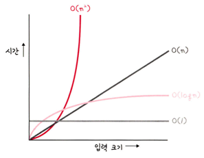
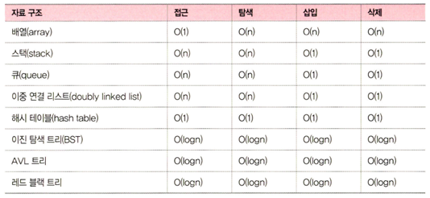
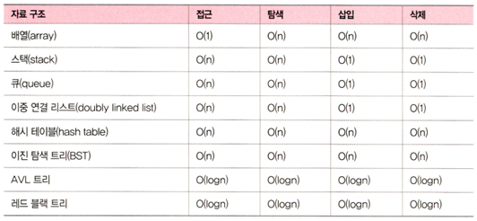
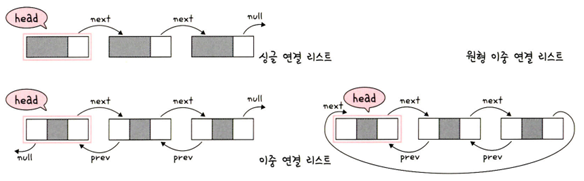
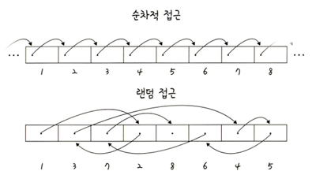
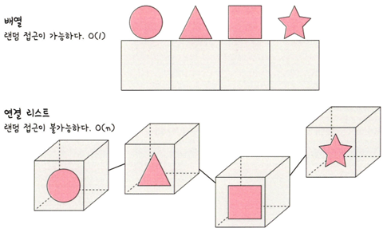
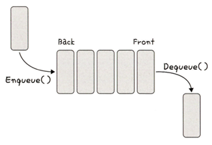
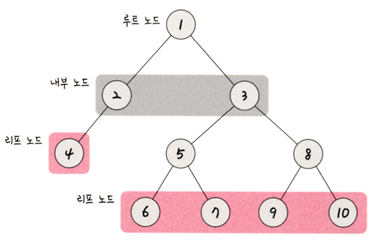
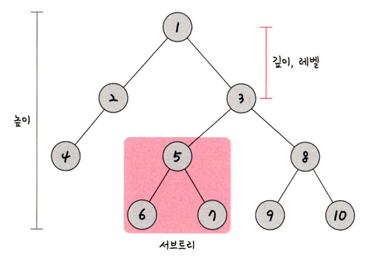
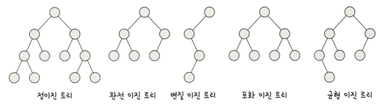

# 자료 구조
* 자료 구조(data structure)는 효율적으로 데이터를 관리하고 수정, 삭제, 탐색, 저장할 수 있는 데이터 집합을 말한다.

## 복잡도
* 복잡도는 시간 복잡도와 공간 복잡도로 나뉜다.

### 시간 복잡도
* 문제를 해결하는 데 걸리는 시간과 입력의 함수 관계
* 어떠한 알고리즘의 로직이 '얼마나 오랜 시간'이 걸리는 지를 나타내는데 사용
* 보통 빅오 표기법으로 나타낸다.
    * 빅오 표기법이란 입력 범위 n을 기준으로 로직이 몇 번 반복되는지 나타내는 것이다.
    * '가장 영향을 많이 끼치는' 항의 상수 인자를 빼고 나머지 항을 없앤것
* 시간 복잡도가 필요한 이유
    * 효율적인 코드로 개선하는데 쓰이는 척도

    

### 공간 복잡도
* 프로그램을 실행시켰을 때 필요로 하는 자원 공간의 양
* 정적 변수로 선언된 것 외에도 동적으로 재귀적인 함수로 인해 공간을 계속해서 필요로 할 경우도 포함

### 자료 구조에서의 시간 복잡도
* 보통 시간 복잡도를 생각할 때 평균, 최악의 시간 복잡도를 고려하며 사용한다.

## 선형 자료 구조
* 선형 자료 구조란 요소가 일렬로 나열되어 있는 자료 구조를 말한다.

### 연결 리스트
* 연결 리스트는 데이터를 감싼 노드를 포인터로 연결해서 공간적인 효율성을 극대화시킨 자료 구조이다.
* 삽입과 삭제가 O(1)이 걸리며 탐색에는 O(n)이 걸린다.
* prev 포인터와 next 포인터로 앞과 뒤의 노드를 연결시킨 것이 연결 리스트이다.
* 연결 리스트의 종류
    * 싱글 연결 리스트 : next 포인터만 가진다
    * 이중 연결 리스트 : next 포인터와 prev 포인터를 가진다
    * 원형 이중 연결 리스트 : 이중 연결 리스트와 같지만 마지막 노드의 next 포인터가 헤드 노드를 가리키는 것을 말한다.

    

### 배열
* 배열(array)은 같은 타입의 변수들로 이루어져 있고, 크기가 정해져 있으며, 인접한 메모리 위치에 있는 데이터를 모아놓은 집합이다.
* 중복을 허용하고 순서가 있다.
* 여기서 설명하는 배열은 '정적 배열'을 기반으로 설명
* 탐색에 O(1)이 되어 랜덤 접근(random access)가 가능
* 삽입과 삭제에는 O(n)이 걸린다.
* 데이터 추가와 삭제를 많이 하는 것은 연결 리스트, 탐색을 많이 하는 것은 배열로 하는 것이 좋다.
* 배열은 인덱스에 해당하는 원소를 빠르게 접근해야 하거나 간단하게 데이터를 쌓고 싶을 때 사용한다.
* 랜덤 접근과 순차적 접근
    * 랜덤 접근 = 직접 접근
        * 동일한 시간에 배열과 같은 순차적인 데이터가 있을 때 임의의 인덱스에 해당하는 데이터에 접근할 수 있는 기능
    * 순차적 접근
        * 데이터를 저장된 순서대로 검색해야 하는 기능

    

### 배열과 연결 리스트 비교
* 배열은 상자를 순서대로 나열한 데이터 구조이며 몇 번째 상자인지만 알면 해당 상자의 요소를 끄집어낼 수 있다.
* 연결 리스트는 상자를 선으로 연결한 형태의 데이터 구조이며, 상자 안의 요소를 알기 위해서는 하나씩 상자 내부를 확인해봐야 한다는 점이 다릅니다.

* 탐색은 배열이 빠르고 연결 리스트는 느리다.
    * 배열의 경우 상자 위에 있는 요소를 탐색하면 되는 반면에, 연결 리스트는 상자를 열어야 하고 주어진 선을 기반으로 순차적으로 열어야 한다.
* 데이터 추가 및 삭제는 연결 리스트가 더 빠르고 배열은 느리다.
    * 배열은 모든 상자를 앞으로 옮겨야 추가가 가능하지만, 연결 리스트는 선을 바꿔서 연결해주기만 하면 되기 때문이다.

### 벡터
* 벡터(vector)는 동적으로 요소를 할당할 수 있는 동적 배열이다.
* 컴파일 시점에 개수를 모른다면 벡터를 써야 한다.
* 또한, 중복을 허용하고 순서가 있고 랜덤 접근이 가능하다.
* 탐색의 맨 뒤의 요소를 삭제하거나 삽입하는데 O(1)의 시간이 걸리고 맨뒤나 맨 앞이 아닌 요소를 삭제하고 삽입하는데 O(n)의 시간이 걸린다.

### 스택
* 가장 마지막으로 들어간 데이터가 가장 첫 번째로 나오는 성질을 가진 자료 구조이다. (LIFO : Last In First Out)
* 재귀적인 함수, 알고리즘에 사용되며 웹 브라우저 방문 기록 등에 쓰인다.
* 삽입 : O(1), 탐색 : O(n)

### 큐
* 먼저 집어넣은 데이터가 먼저 나오는 성질(FIFO, First In First Out)을 지닌 자료 구조
* 스택과 반대되는 개념
* 삽입 : O(1), 탐색 : O(n)
* CPU 작업을 기다리는 프로세스, 스레드 행렬 또는 네트워크 접속을 기다리는 행렬, 너비 우선 탐색, 캐시 등에 사용된다.

## 비선형 자료 구조
* 일렬로 나열하지 않고 자료 순서나 관계가 복잡한 구조를 말한다.
* 일반적으로 트리나 그래프를 말한다.

### 그래프
* 정점과 간선으로 이루어진 자료 구조
    * 정점(vertex) : 지점 (=노드)
    * 간선(edge) : 지점으로 가는 길
        * 양방향 간선 : 한 정점에서 다른 정점으로 오고 갈수 있는 간선
        * 단방향 간선 : 한 정점에서 다른 정점으로 갈수만 있는 간선
* 가중치
    * 간선과 정점 사이에 드는 비용
        * 1번 노드와 2번 노드까지 가는 비용이 한 칸이라면 1번 노드에서 2번 노드까지의 가중치는 한칸이다.

### 트리
* 그래프 중 하나로 그래프의 특징처럼 정점과 간선으로 이루어져 있고, 트리 구조로 배열된 일종의 계층적 데이터의 집합
* 루트 노드, 내부 노드, 리프 노드 등으로 구성
* 트리로 이루어진 집합을 '숲'이라고 한다.

* 트리의 특징
    * 부모, 자식 계층 구조를 가진다.
        * 5번 노드는 6번 노드와 7번 노드의 부모 노드이고, 6번 노드와 7번 노드는 5번 노드의 자식 노드입니다. 같은 경로상에서 어떤 노드보다 위에 있으면 부모, 아래에 있으면 자식 노드가 된다.
    * V - 1 = E 라는 특징이 있다. 즉 간선의 수는 노드의 수 - 1 이다.
    * 임의의 두 노드 사이의 경로는 '유일무이'하게 '존재'한다. 즉, 트리 내의 어떤 노드와 어떤 노드까지의 경로는 반드시 있다.
* 트리의 구성 : 루트 노드, 내부 노드, 리프 노드로 이루어져 있다.
    * 루트 노드 : 가장 위에 있는 노드. 트리 문제가 나오고 트리를 탐색할 때 루트 노드를 중심으로 탐색하면 문제가 쉽게 풀리는 경우가 많다.
    * 내부 노드 : 루트 노드와 내부 노드 사이에 있는 노드를 의미한다.
    * 리프 노드 : 자식 노드가 없는 노드를 뜻한다.

* 트리의 높이와 레벨
    * 깊이 : 트리에서의 깊이는 각 노드마다 다르며, 루트 노드부터 특정 노드까지 최단 거리로 갔을 때의 거리를 의미한다. 4번 노드의 깊이는 2이다.
    * 높이 : 트리의 높이는 루트 노드부터 리프 노드까지 거리 중 가장 긴 거리를 의미하며, 앞 그림의 트리 높이는 3이다.
    * 레벨 : 트리의 레벨은 주어지는 문제마다 조금씩 다르지만 보통 깊이와 같은 의미를 지닌다. 1번 노드를 0레벨이라고 하고 2번 노드, 3번 노드까지의 레벨을 1레벨이라고 할수 있고, 1번 노드를 1레벨이라고 한다면 2번 노드와 3번 노드는 2레벨이 된다.
    * 서브 트리 : 트리 내의 하위 집합을 서브트리라고 한다. 트리 내에 있는 부분집합이라고도 보면 된다. 5번, 6번, 7번 노드가 이 트리의 하위 집합으로 서브트리이다.

#### 이진 트리
* 이진 트리는 자식의 노드 수가 두 개 이하인 트리를 의미한다.

* 이진 트리의 종류
    * 정이진 트리(full binary tree) : 자식노드가 0 또는 두개인 이진트리
    * 완전 이진 트리(complete binary tree) : 왼쪽에서부터 채워져 있는 이진트리. 마지막 레벨을 제외하고는 모든 레벨이 완전히 채워져 있으며, 마지막 레벨의 경우 왼쪽부터 채워져 있다.
    * 변질 이진 트리(degenerate binary tree) : 자식 노드가 하나밖에 없는 이진 트리
    * 포화 이진 트리(perfect binary tree) : 모든 노드가 꽉 차 있는 이진 트리
    * 균형 이진 트리(balanced binary tree) : 왼쪽과 오른쪽 노드의 높이 차이가 1 이하인 이진 트리를 의미. map, set을 구성하는 레드 블랙 트리는 균형 이진 트리중 하나이다.
* 이진 탐색 트리

### 힙

### 우선순위 큐

### 맵

### 셋

### 해시 테이블

