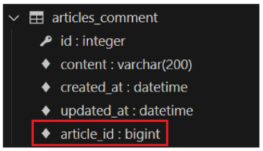
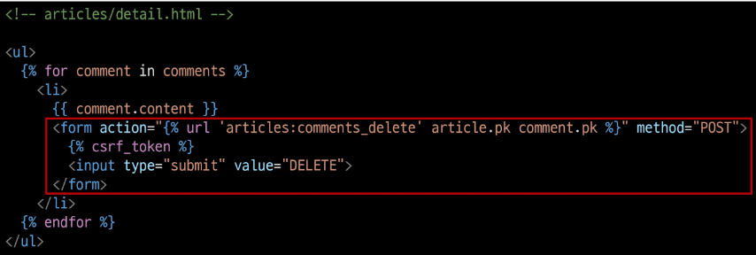

# Many to one relationships

## Many to one relationships
* Many to one relationships N:1 or 1:N
    * 한 테이블의 0개 이상의 레코드가 다른 테이블의 레코드 한 개와 관련된 관계
* Comment - Article
    * 0개 이상의 댓글은 1개의 게시글에 작성될 수 있다.
* Comment(N) - Article(1)
    * 0개 이상의 댓글은 1개의 게시글에 작성될 수 있다.
    * N:1에서 외래키는 N에 해당하는 테이블에 존재 해야 한다.

        

### 댓글 모델
* `ForeignKey()`
    * N:1 관계 설정 모델 필드
* 댓글 모델 정의
    * ForeignKey 클래스의 인스턴스 이름은 참조하는 모델 클래스 이름의 **단수형**으로 작성하는 것을 권장
    * 외래 키는 ForeignKey 클래스를 작성하는 위치와 관계없이 테이블 필드 마지막에 생성된다.

        

* `ForeignKey(to, on_delete)`
    * to 위치에 들어갈 것 : 참조하는 모델 class 이름
    * on_delete 위치에 들어갈 것 : 외래 키가 참조하는 객체(1)가 사라졌을 때, 외래 키를 가진 객체(N)를 어떻게 처리할 지를 정의하는 설정 (데이터 무결성)
        * on_delete의 `CASCADE`
            * 부모 객체(참조 된 객체)가 삭제 됐을 때 이를 참조하는 객체도 삭제
            * [공식 문서 참조](https://docs.djangoproject.com/en/4.2/ref/models/fields/#arguments)
* Migration 이후 댓글 테이블 확인
    * 댓글 테이블의 article_id 필드 확인
    * '참조 대상 클래스 이름' + '_' + '클래스 이름'
        * 참조하는 클래스 이름의 소문자(단수형)으로 작성하는 것이 권장 되었던 이유

            

### 댓글 생성 연습
1. `shell_plus`실행 및 게시글 작성
    ```python
    $ python manage.py shell_plus

    # 게시글 작성
    Article.objects.create(title='title', content='content')
    ```
2. 댓글 생성
    ```python
    # Comment 클래스의 인스턴스 comment 생성
    comment = Comment()

    # 인스턴스 변수 저장
    comment.content = 'first comment'

    # 에러 발생
    django.db.utils.IntegrityError : NOT NULL constraint failed:
    articles_comment_article_id
    # articles_comment 테이블의 ForeignKeyField, article_id 값이 저장 시 누락되었기 때문
    ```
3. `shell_plus`실행 및 게시글 작성
    ```python
    # 게시글 조회
    article = Article.objects.get(pk=1)

    # 외래 키 데이터 입력
    comment.article = article
    # 또는 comment.article_id = article.pk 처럼 pk 값을 직접 외래 키 커럼에 넣어 줄 수도 있지만 권장하지 않음

    # 댓글 저장 및 확인
    comment.save()
    ```
4. comment 인스턴스를 통한 article 값 참조하기
    ```python
    comment.pk
    => 1

    comment.content
    => 'first comment'

    # 클래스 변수명인 article로 조회 시 해당 참조하는 게시물 객체를 조회할 수 있음
    comment.article
    => <Article: Article object (1)>

    # article_pk는 존재하지 않는 필드이기 때문에 사용 불가
    comment.article_id
    => 1
    ```
5. comment 인스턴스를 통한 article 값 참조하기
    ```python
    # 1번 댓글이 작성된 게시물의 pk 조회
    comment.article.pk
    => 1

    # 1번 댓글이 작성된 게시물의 content 조회
    comment.article.content
    => 'content'
    ```
6. 두번째 댓글 생성
    ```python
    comment = Comment(content='second comment', article=article)
    comment.save()

    comment.pk
    => 2

    comment
    => <Comment: Comment object (2)>

    comment.article.pk
    => 1
    ```
7. 작성된 댓글 데이터 확인

    


## 관계 모델 참조
* 참조
    * N:1 관계에서 N에서 1을 참조하거나 조회하는것, N->1

### 역참조
* 역참조
    * N:1 관계에서 1에서 N을 참조하거나 조회하는 것, 1->N
    * N은 외래 키를 가지고 있어 물리적으로 참조가 가능하지만 1은 N에 대한 참조 방법이 존재하지 않아 별도의 역참조 기능이 필요
    * 사용 예시
        * `article.comment_set.all()`
            * 모델인스턴스.related_manager(역참조 이름).QuerySet_API
            * 특정 게시글에 작성된 댓글 전체를 조회하는 명령
* related manager
    * N:1 혹은 M:N 관계에서 역참조 시에 사용하는 매니저
    * `objects`매니저를 통해 QuerySet API를 사용했던 것처럼 related manager를 통해 QuerySet API를 사용할 수 있게 된다.
    * 이름 규칙
        * N:1 관계에서 생성되는 Related manager의 이름은 참조하는 **"모델명_set"** 이름 규칙으로 만들어진다.
        * 특정 댓글의 게시글 참조 (Comment -> Article)
            * comment.article
        * 특정 게시글의 댓글 목록 참조 (Article -> Comment)
            * article.comment**_set**.all()
    * related manager 연습
        * `shell_plus` 실행 및 1번 게시글 조회
            ```python
            $ python manage.py shell_plus

            article = Article.object.get(pk=1)
            ```
        * 1번 게시글에 작성된 모든 댓글 조회하기(역참조)
            ```python
            >>> article.comment_set.all()
            <QuerySet [<Comment: Comment object (1)>,
            <Comment : Comment object (2)>]>
            ```
        * 1번 게시글에 작성된 모든 댓글의 내용 출력
            ```python
            comments = article.comment_set.all()

            for comment in comments :
                print(comment.content)
            ```


## 댓글 구현

### CREATE - 댓글 CREATE 구현
* 사용자로부터 댓글 데이터를 입력 받기 위한 CommentForm 정의

    

* detail view 함수에서 CommentForm을 사용하여 detail 페이지에 렌더링

    

* Comment 클래스의 외래 키 필드 article 또한 데이터 입력이 필요한 필드이기 때문에 출력되고 있는 것. 하지만 외래 키 필드 데이터는 **사용자로부터 입력 받는 값이 아닌 view 함수 내에서 다른 방법으로 전달 받아 저장**되어야 한다.

    

* CommentForm의 출력 필드를 조정하여 외래 키 필드가 출력되지 않도록 한다.

    

* detail 페이지의 URL을 살펴보면 `path('<int:pk>/', views.detail, name='detail)`에서 해당 게시글의 pk갑이 사용 되고 있음. 댓글의 외래 키 데이터에 필요한 정보가 바로 게시글의 pk값
* url 작성 및 action 작성

    

* comments_create view 함수 정의 -> url에서 넘겨받은 pk인자를 게시글을 조회하는데 사용

    

* article 객체를 저장하는 방법
    * `save(commit=False)` : DB에 저장하지 않고 인스턴스만 반환 (Create, but don't save the new instance)
    * `save(commit=False)`를 통해서 DB에 저장하기 전 인스턴스만 반환하여 조작이 필요하다면 조작 후 저장이 가능하다.

    

* 댓글 작성 후 테이블 확인

    


### READ - 댓글 READ 구현
* detail view 함수에서 전체 댓글 데이터를 조회

    

* 전체 댓글 출력 및 확인

    


### DELETE - 댓글 DELETE 구현
* 댓글 삭제 url 작성

    

* 댓글 삭제 view 함수 정의

    

* 댓글 삭제 버튼 작성

    

* 댓글 삭제 버튼 출력 확인 및 삭제 테스트

    


## 참고
* admin site 등록 : Comment 모델을 admin site에 등록해 CRUD 동작 확인하기

    

* 댓글이 없는 경우 대체 콘텐츠 출력 : DTL의 `for empty`태그 활용

    

* 댓글 개수 출력하기
    1. DTL filter - `length` 사용

        

    2. QuerySet API - `count()` 사용

        