# Many to one relationship 2
* User와 다른 모델 간의 모델 관계 설정
    1. User & Article
        * Article(N) - User(1) : 0개 이상의 게시글은 1명의 회원에 의해 작성 될 수 있다.
    2. User & Comment
        * Comment(N) - User(1) : 0개 이상의 댓글은 1명의 회원에 의해 작성 될 수 있다.

## Article & User

### 모델 관계 설정
* user 왜래 키 정의

    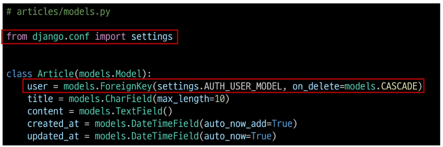

* User 모델을 참조하는 2가지 방법
    * django 프로젝트 '내부적인 구동 순서'와 '반환 값'에 따른 이유
    * 기억할 것은 **User 모델은 직접 참조하지 않는다는 것**

||`get_user_model()`|`settings.AUTH_USER_MODEL`|
|:---:|:---:|:---:|
|반환값|User Object(객체)|`accounts.User` (문자열)|
|사용 위치|**models.py가 아닌 다른 모든 위치**|**models.py**|

* migration
    * 기존에 테이블이 있는 상황에서 필드를 추가 하려하기 때문에 발생하는 과정
    * 기본적으로 모든 필드에는 NOT NULL 제약 조건이 있기 때문에 데이터가 없이는 새로운 필드가 추가되지 못함
    * '1'을 입력하고 Enter 진행(다음 화면에서 직접 기본 값 입력)

    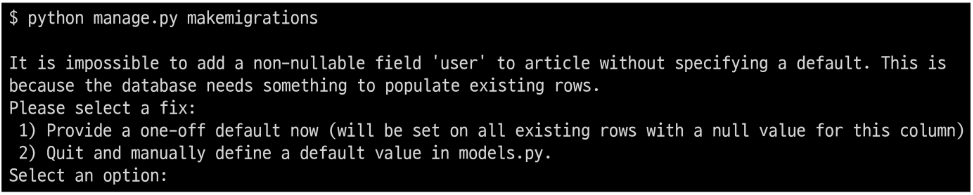

    * 추가하는 외래 키 필드에 어떤 데이터를 넣을 것인지 직접 입력해야 한다.
    * 마찬가지로 '1'을 입력하고 Enter 진행
    * 기존에 작성된 게시글이 있다면 모두 1번 회원이 작성한 것으로 처리 됨

    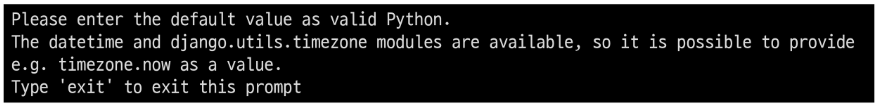

    * migrations 파일 생성 후 migrate 진행
        ```python
        $ python manage.py migrate
        ```
    * `articles_article` 테이블에 user_id 필드 생성 확인

    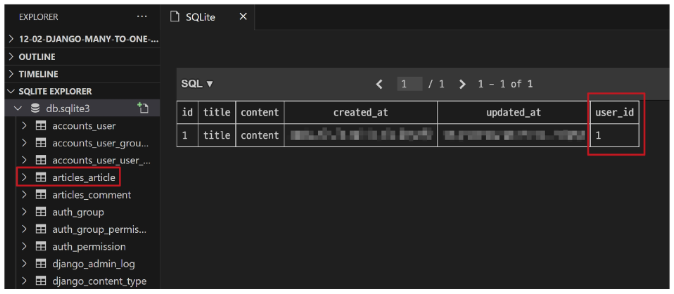


### 게시글 CREATE
* 기존 ArticleForm 출력 변화 확인
* User 모델에 대한 ㅗ이래 키 데이터 입력을 받기 위해 불필요한 input이 출력

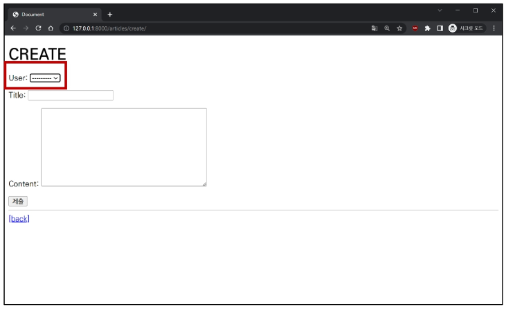

* ArticleForm 출력 필드 수정

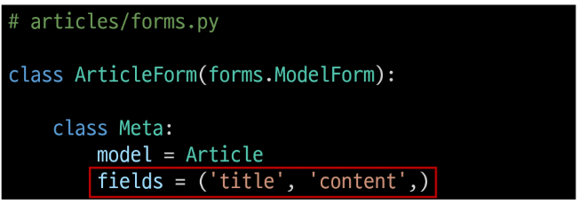

* 게시글 작성 시 에러 발생
* user_id 필드 데이터가 누락되었기 때문

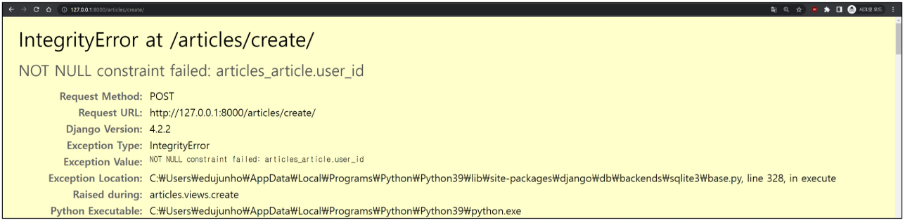

* 게시글 작성 시 작성자 정보와 함께 저장될 수 있도록 save의 commit 옵션 활용

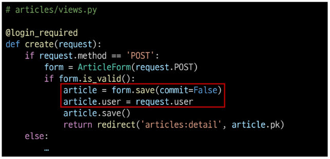

* 게시글 작성 후 테이블 확인

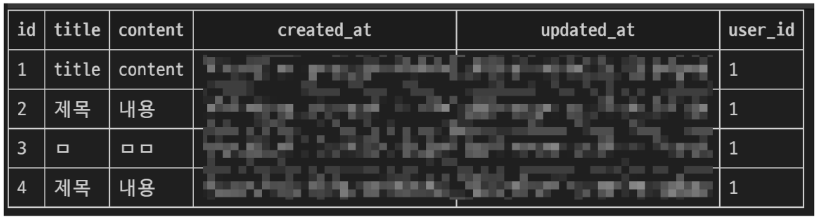


### 게시글 READ
* 각 게시글의 작성자 이름 출력

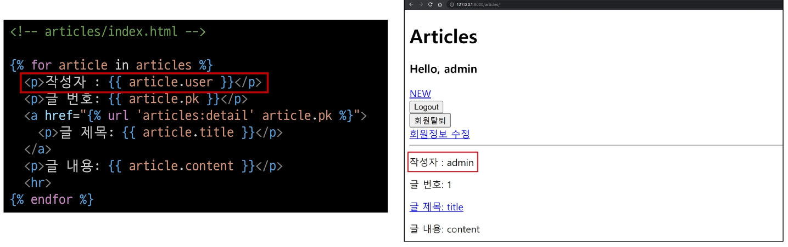

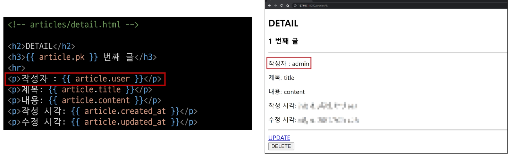


### 게시글 UPDATE
* 본인의 게시글만 수정 할 수 있도록 하기
    * 게시글 수정 요청 사용자와 게시글 작성 사용자를 비교

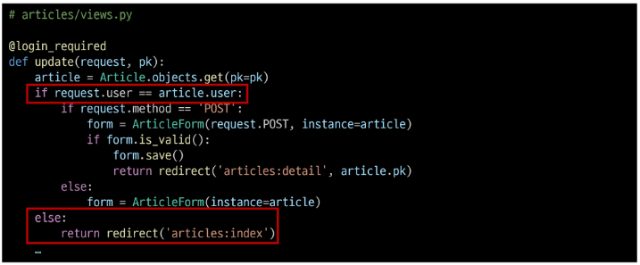

* 해당 게시글의 작성자가 아니라면, 수정/삭제 버튼을 출력하지 않도록 하기

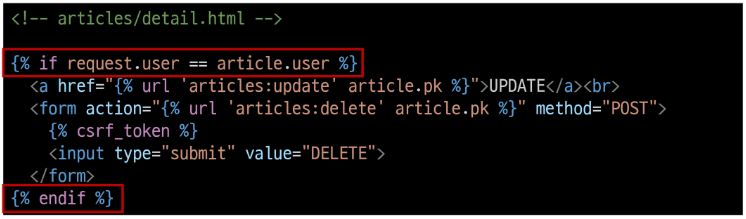


### 게시글 DELETE
* 본인의 게시글만 삭제 할 수 있도록 하기
    * 삭제를 요청하려는 사용자와 게시글을 작성한 사용자를 비교

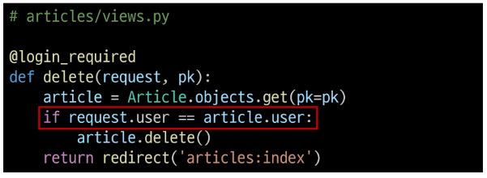


## Comment & User

### 모델 관계 설정
* user 왜래 키 정의

    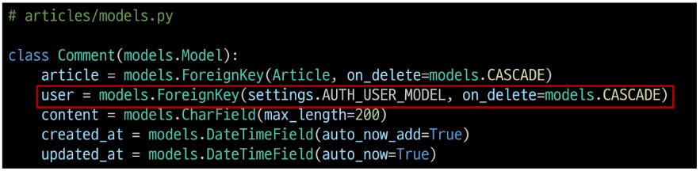

* Migration
    * 이전에 Article과 User 모델 관계 설정 때와 동일한 상황
    * 기존 Comment 테이블에 새로운 필드가 빈 값으로 추가 될 수 없기 때문에 기본 값 설정 과정이 필요
        ```python
        $ python manage.py makemigrations
        # 공통 과정 생략
        $ python manage.py migrate
        ```
    * Migration 후 comment 테이블에 생성된 user_id 필드 확인

    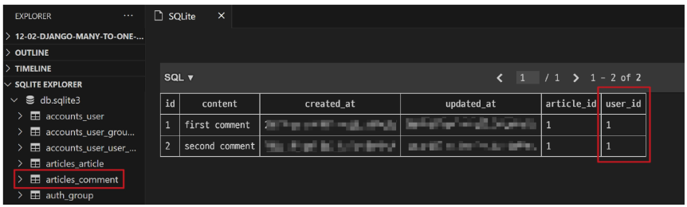


### 댓글 CREATE
* 댓글 작성 시 이전에 게시글 작성 할 때와 동일한 에러 발생
* 댓글의 user_id 필드 데이터가 누락되었기 때문

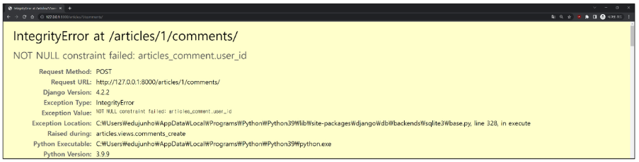

* 댓글 작성 시 작성자 정보와 함께 저장할 수 있도록 저장

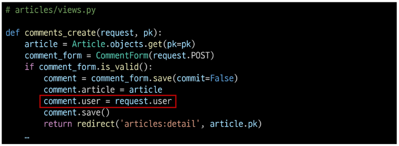

* 댓글 작성 후 테이블 확인

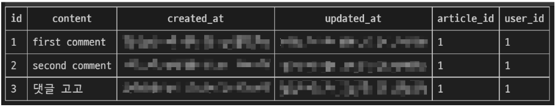


### 댓글 READ
* 댓글 출력 시 댓글 작성자와 함께 출력

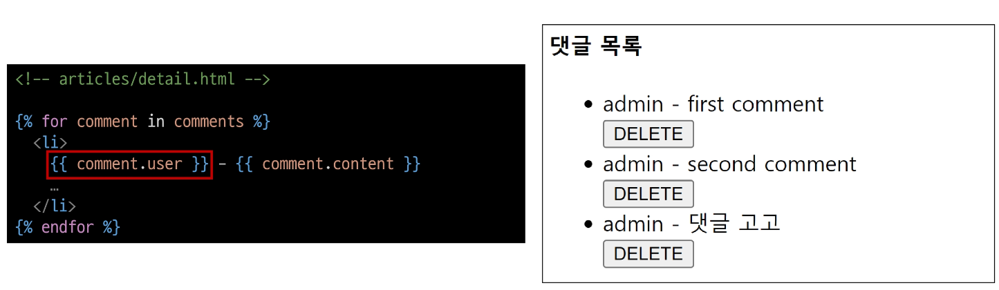


### 댓글 DELETE
* 본인 댓글만 삭제 할 수 있도록 하기
    * 댓글 삭제 요청 사용자와 댓글 작성 사용자를 비교

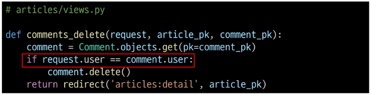

* 해당 댓글의 작성자가 아니라면, 댓글 삭제 버튼을 출력하지 않도록 함

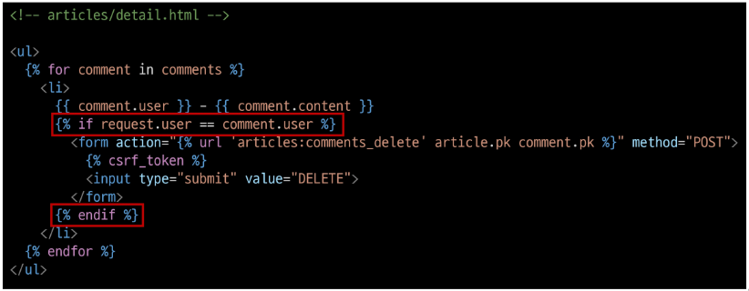


## 참고
* 인증된 사용자만 댓글 작성 및 삭제

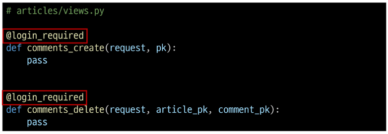