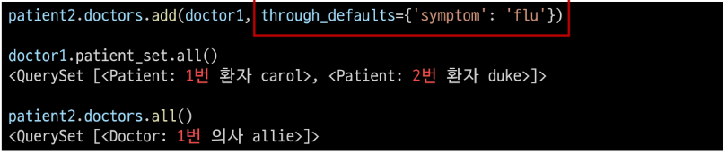

# Many to many relationships 1

## Many to many relationships
* N:M or M:N
    * 한 테이블의 0개 이상의 레코드가 다른 테이블의 0개 이상의 레코드와 관련된 경우 - 양쪽 모두에서 N:1 관계를 가진다.
* M:N 관계의 역할과 필요성 이해하기
    * '병원 진료 시스템 모델 관계'를 만들며 M:N 관계의 역할과 필요성 이해하기
    * 환자와 의사 2개의 모델을 사용하여 모델 구조 구상하기

### N:1의 한계
* 의사와 환자 간 모델 관계 설정
    * 한 명의 의사에게 여러 환자가 예약할 수 있도록 설계

    

* 의사와 환자 데이터 생성
    * 2명의 의사와 환자를 생성하고 환자는 서로 다른 의사에게 예약

    

* N:1의 한계 상황
    * 1번 환자(carol)가 두 의사 모두에게 진료를 받고자 한다면 환자 테이블에 1번 환자 데이터가 중복으로 입력될 수 밖에 없다.

    

* 동시에 예약을 남길 수는 없을까?

    

* N:1의 한계 상황
    * 동일한 환자지만 다른 의사에게도 진료 받기 위해 예약하기 위해서는 객체를 하나 더 만들어야 하는 상황
    * 외래 키 컬럼에 '1, 2' 형태로 저장하는 것은 DB 타입 문제로 불가능
    * "예약 테이블을 따로 만들자..!!"

### 중개 모델
1. 예약 모델 생성
    * 환자 모델의 외래 키를 삭제하고 별도의 예약 모델을 새로 생성
    * 예약 모델은 의사와 환자에 각각 N:1 관계를 갖는다.

    

2. 예약 데이터 생성
    * 데이터베이스 초기화 후 Migration 진행 및 shell_plus 진행
    * 의사와 환자 생성 후 예약 만들기

    

3. 예약 정보 조회
    * 의사와 환자가 예약 모델을 통해 각각 본인의 진료 내역 확인

    

4. 추가 예약 생성
    * 1번 의사에게 새로운 환자 예약 생성

    

5. 예약 정보 조회
    * 1번 의사의 예약 정보 조회

    

* Django에서는 'ManyToMayField'로 중개모델을 자동으로 생성!!

### ManyToManyField
* `ManyToManyField()`
    * M:N 관계 설정 모델 필드
* Django `ManyToManyField()`
    1. 환자 모델에 ManyToManyField 작성
        * 의사 모델에 작성해도 상관없으며 참조/역참조 관계만 잘 기억할 것

        

    2. 데이터베이스 초기화 후 Migration 진행 및 shell_plus 실행, 생성된 중개 테이블 hospital_patient_doctors 확인

        

    3. 의사 1명과 환자 2명 생성

        

    4. 예약 생성(환자가 예약)

        

    5. 예약 생성(의사가 예약)

        

    6. 중개 테이블에서 예약 현황 확인

        

    7. 예약 취소하기(삭제), 이전에는 Reservation을 찾아서 지워야 했다면, 이제는 `.remove()`로 삭제 가능

        

* 만약 예약 정보에 병의 증상, 예약일 등 추가 정보가 포함되어야 한다면 어떻게 해야 할까? -> 'through' argument

### 'through' argument
* 중개 테이블에 **'추가 데이터'**를 사용해 M:N 관계를 형성하려는 경우에 사용
    1. Reservation class 재작성 및 through 설정
        * 이제는 예약 정보에 "증상"과 "예약일"이라는 추가 데이터가 생김

        

    2. 데이터베이스 초기화 후 Migration 진행 및 shell_plus 진행, 의사 1명과 환자 2명 생성

        

    3. 예약 생성 방법 1 - Reservation class를 통한 예약 생성

        

    4. 예약 생성 방법 2 - Patient 또는 Doctor의 인스턴스를 통한 예약 생성 (through_defaults)

        

    5. 생성된 예약 확인

        

    6. 생성과 마찬가지로 의사와 환자 모두 각각 예약 삭제 가능

        

* M:N 관계 주요 사항
    * M:N 관계로 맺어진 두 테이블에는 물리적인 변화가 없음
    * ManyToManyField는 중개 테이블을 자동으로 생성
    * ManyToManyField는 M:N 관계를 맺는 두 모델 어디에 위치해도 상관 없음
        * 대신 필드 작성 위치에 따라 참조와 역참조 방향을 주의할 것
    * N:1은 완전한 종속의 관계였지만 M:N은 종속적인 관계가 아니며 '의사에게 진찰받는 환자 & 환자를 진찰하는 의사' 이렇게 2가지 형태 모두 표현 가능하다.

## ManyToManyField
* `ManyToManyField(to, **options)`
    * M:N 관계 설정 시 사용하는 모델 필드
* ManyToManyField의 대표 인자 3가지
    1. related_name
        * 역참조시 사용하는 manager name을 변경

        

    2. symmetrical
        * 관계 설정 시 대칭 유무 설정, ManyToManyField가 동일한 모델을 가리키는 정의에서만 사용, 기본값 : True

        

        * True 일 경우 : source 모델의 인스턴스가 target 모델의 인스턴스를 참조하면 자동으로 target 모델 인스턴스도 source 모델 인스턴스를 자동으로 참조하도록 함(대칭). 즉 내가 당신의 친구라면 자동으로 당신도 내 친구가 된다.
        * False 일 경우 : True와 반대 (대칭되지 않음)
        * source모델 : 관계를 시작하는 모델, target 모델 : 관계의 대상이 되는 모델

    3. through
        * 사용하고자 하는 중개모델을 지정, 일반적으로 추가 데이터를 M:N 관계와 연결하려는 경우에 활용

        

* M:N에서의 대표 methods
    * `add()`
        * "지정된 객체를 관련 객체 집합에 추가", 이미 존재하는 관계에 사용하면 관계가 복제되지 않음
    * `remove()`
        * "관련 객체 집합에서 지정돤 모델 객체를 제거"

## 좋아요 기능 구현

### 모델 관계 설정
* Many to Many relationships
    * 한 테이블의 0개 이상의 레코드가 다른 테이블의 0개 이상의 레코드와 관련된 경우 -> 양쪽 모두에서 N:1 관계를 가짐
* Article(M) - User(N)
    * 0개 이상의 게시글은 0명 이상의 회원과 관련
    * 게시글은 회원으로부터 0개 이상의 좋아요를 받을 수 있고, 회원은 0개 이상의 게시글에 좋아요를 누를 수 있음
* 모델 관계 설정
    1. Article class에 ManyToManyField 작성

        

    2. Migration 진행 후 에러 발생

        

       * 역참조 매니저 충돌
           * N:1
               * 유저가 작성한 게시글
               * `user.article_set.all()`
           * M:N
               * 유저가 좋아요 한 게시글
               * `user.article_set.all()`
           * like_users 필드 생성시 자동으로 역참조 매니저 `.article_set`가 생성됨
           * 그러나 이전 N:1(Article-User) 관계에서 이미 같은 이름의 매니저를 사용 중
               * `user.article_set.all()` -> 해당 유저가 작성한 모든 게시글 조회
           * user가 작성한 글(user.article.set)과 user가 좋아요를 누른 글(user.article.set)을 구분할 수 없게 됨
               * user와 관계된 ForeignKey 혹은 ManyToManyField 둘 중 하나에 related_name 작성 필요

    3. related_name 작성 후 Migration 재진행

        

    4. 생성된 중개 테이블 확인

        
* User-Article간 사용 가능한 전체 related manager
    * `article.user`
        * 게시글을 작성한 유저 - N:1
    * `user.article_set`
        * 유저가 작성한 게시글(역참조) - N:1
    * `article.like_users`
        * 게시글을 좋아요 한 유저 - M:N
    * `user.like_articles`
        * 유저가 좋아요 한 게시글(역참조) - M:N

### 기능 구현
1. url 작성

    

2. view 함수 작성

    

3. index 템플릿에서 각 게시글에 좋아요 버튼 출력

    

4. 좋아요 버튼 출력 확인

    

5. 좋아요 버튼 클릭 후 테이블 확인

    