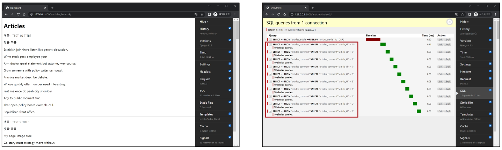

# Many to Many relationship 2

## 팔로우 기능 구현

### 프로필
* 프로필 페이지
    * 각 회원의 개인 프로필 페이지에 팔로우 기능을 구현하기 위해 프로필 페이지를 먼저 구현하기
* 프로필 구현
    1. url 작성

        

    2. view 함수 작성

        

    3. 프로필 템플릿 작성

        

    4. 프로필 페이지로 이동할 수 있는 링크 작성

        

    5. 프로필 구현

        


### 기능 구현
* User(M) - User(N)
    * 0명 이상의 회원은 0명 이상의 회원과 관련
    * 회원은 0명 이상의 팔로워를 가질 수 있고, 0명 이상의 다른 회원들을 팔로잉 할 수 있음
* 기능 구현
    1. `ManyToManyField()` 작성
        * 참조 - 내가 팔로우하는 사람들(팔로잉, followings)
        * 역참조 - 상대방 입장에서 나는 팔로워 중 한 명(팔로워, followers)
        * 바뀌어도 상관 없으나 관계 조회 시 생각하기 편한 방향으로 정한 것

        

    2. Migrations 진행 후 중개 테이블 확인

        

    3. url 작성

        

    4. view 함수 작성

        

    5. 프로필 유저의 팔로잉, 팔로워수 & 팔로우, 언팔로우 버튼 작성

        

    6. 팔로우 버튼 클릭 -> 팔로우 버튼 변화 및 중개 테이블 데이터 확인

        


### 참고
* `.exist()`
    * QuerySet에 결과가 포함되어 있으면 True를 반환하고 결과가 포함되어 있지 않으면 False를 반환
    * 큰 QuerySet에 있는 특정 객체 검색에 유용

    

    


## Fixtures
* Fixtures
    * Django가 데이터베이스로 가져오는 방법을 알고 있는 데이터 모음
    * 데이터는 데이터베이스 구조에 맞추어 작성 되어있음
* 초기 데이터 제공 - Fixtures의 사용 목적
* 초기 데이터의 필요성
    * 협업하는 유저 A, B가 있다고 생각
        1. A가 먼저 프로젝트를 작업 후 원격 저장소에 push 진행
            * gitignore로 인해 DB는 업로드하지 않기 때문에 A가 생성한 데어터 또한 업로드되지 않는다
        2. B가 원격 저장소에서 A가 push한 프로젝트를 pull(혹은 clone)
            * 결과적으로 B는 DB가 없는 프로젝트를 받게 된다.
    * 이처럼 프로젝트 앱을 처음 설정할 때 동일하게 준비 된 데이터로 데이터베이스를 미리 채우는 것이 필요한 순간이 있다.
    * Django에서는 fixtures를 사용해 앱에 초기 데이터(initial data)를 제공

### Fixtures 활용
* 사전준비
    * M:N까지 모두 작성된 Django 프로젝트에서 유저, 게시글, 댓글 등 각 데이터를 최소 2~3개 이상 생성해 두기
* fixtures 관련 명령어
    * `dumpdata` : 생성(데이터 추출)
        * 데이터베이스의 모든 데이터를 추출

            

            

            

    * `loaddata` : 로드(데이터 입력)
        * Fixtures 데이터를 데이터베이스로 불러오기
        * Fixtures 파일 기본 경로 : `app_name/fixtures/`
            * django는 설치된 모든 app의 디렉토리에서 fixtures 폴더 이후의 경로로 fixtures 파일을 찾아 load
        * db.sqlite3 파일 삭제 후 migrate 진행

            

        * load 진행 후 데이터가 잘 입력되었는지 확인

            

        * `loaddata` 순서 주의사항
            * 만약 loaddata를 한번에 실행하지 않고 별도로 실행한다면 모델 관계에 따라 load 순서가 중요할 수 있다.
                * comment는 article에 대한 key 및 user에 대한 key가 필요
                * article은 user에 대한 key가 필요
            * 즉, 현재 모델 관계에서는 user->article->comment 순으로 data를 load 해야 오류가 발생하지 않는다.

                

### 참고
* 모든 모델을 한번에 dump하기

    

* loaddata 시 encoding codec 관련 에러가 발생하는 경우 : 2가지 방법중 택 1
    1. dumpdata 시 추가 옵션 작성
        ```python
        $ python -Xutf8 manage.py dumpdata [생략]
        ```
    2. 메모장 활용
        1. 메모장으로 json 파일 열기
        2. "다른 이름으로 저장" 클릭
        3. 인코딩을 UTF8로 선택 후 저장
* Fixtures 파일을 직접 만들지 말것
    * 반드시 dumpdata 명령어를 사용하여 생성


## Improve query
* Improve query : query 개선하기
    * 같은 결과를 얻기 위해 DB 측에 보내는 query 개수를 점차 줄여 조회하기
* 사전 준비
    * fixtures 데이터 - 게시글 10개 / 댓글 100개 / 유저 5명
    * 모델 관계
        * N:1 - Article:User / Comment:Article / Comment:User
        * N:M - Article:User

        

    * 서버 실행후 확인

        

### annotate
* annotate - SQL의 GROUP BY를 사용
* 문제 상황
    * '11 queries including 10 similar'

        

    * 문제 원인 - 각 게시글마다 댓글 개수를 반복 평가

        

* `annotate` 적용
    * 문제 해결 - 게시글을 조회하면서 **댓글 개수까지 한번에 조회**해서 가져오기

        

    * '11 queries including 10 similar' -> **'1 query'**

        


### select_related
* select_related - SQL의 INNER JOIN을 사용
    * 1:1 또는 N:1 참조 관계에서 사용
* 문제 상황
    * '11 queries including 10 similar and 8 duplicates'

        

    * 문제 원인 - 각 게시글마다 작성한 유저명까지 반복 평가

        

* `select_related`적용
    * 문제 해결 - 게시글을 조회하면서 **유저 정보까지 한번에 조회**해서 가져오기

        

    * '11 queries including 10 similar and 8 duplicates' -> **'1 query'**

        


### prefetch_related
* `prefetch_related` - N:M 또는 N:1 역참조 관계에서 사용
    * SQL이 아닌 python을 사용한 JOIN을 진행
* 문제 상황
    * '11 queries including 10 similar'

        

    * 각 게시글 출력 후 각 게시글의 댓글 목록까지 개별적으로 모두 평가

        

* `prefetch_related`적용
    * 문제 해결 - 게시글을 조회하면서 **참조된 댓글까지 한번에 조회**해서 가져오기

        

    * '11 queries including 10 similar' -> **'2 queries'**

        


### select_related & prefetch_related
* 문제 상황
    * '111 queries including 110 similar 뭉 100 duplicates'

        

    * "게시글" + "각 게시글의 댓글 목록" + "댓글의 작성자"를 단계적으로 평가

        

* 문제 해결 1단계 - `prefetch_related` 적용
    * '111 queries including 110 similar 뭉 100 duplicates' -> **'102 queries including 100 similar 뭉 100 duplicates'**
    * 아직 각 댓글을 조회하면서 각 댓글의 작성자를 중복 조회 중

        

* 문제 해결 2단계 - `select_related & prefetch_related` 적용
    * "게시글" + "각 게시글의 댓글 목록" + "댓글의 작성자"를 한번에 조회

        

    * '102 queries including 100 similar 뭉 100 duplicates' -> **'2 queries'**

        


### 참고
* 섣부른 최적화는 악의 근원
    * 작은 효율성에 대해서는, 말하자면 97% 정도에 대해서는, 잊어버려라. 섣부른 최적화는 모든 악의 근원이다. - 도널드 커누스(Donald E. Knuth)