# Intro & Design Pattern

## Web Application
* Web application (web service) 개발
    * 인터넷을 통해 사용자에게 제공되는 SW 프로그램을 구축하는 과정
    * 다양한 디바이스(모바일, 태블릿, PC 등)에서 웹 브라우저를 통해 접근하고 사용할 수 있다.

### 클라이언트와 서버
* 웹의 동작 방식
    * client - server 구조

        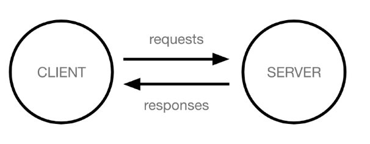

    * client(클라이언트) : 서비스를 요청하는 주체 (웹 사용자의 인터넷이 연결된 장치, 웹 브라우저)
    * server(서버) : 클라이언트의 요청에 응답하는 주체(웹 페이지, 앱을 저장하는 컴퓨터)
    * example : 우리가 웹 페이지를 보게 되는 과정
        1. 웹 브라우저(client)에서 'google.com'(주소)을 입력
        2. 브라우저는 인터넷에 연결된 전세계 어딘가에 있는 구글 컴퓨터(server)에게 'google 홈페이지.html' 파일을 **요청**
        3. 요청을 받은 구글 컴퓨터는 데이터베이스에서 'google 홈페이지.html'파일을 찾아 **응답**
        4. 전달받은 'google 홈페이지.html' 파일을 사람이 볼 수 있도록 웹 브라우저가 해석해주면서 사용자는 구글의 메인 페이지를 보게 된다.

### Frontend & backend
* Frontend(프론트엔드)
    * 사용자 인터페이스(UI)를 구성하고, 사용자가 어플리케이션과 상호작용할 수 있도록 한다.
    * HTML, CSS, JS, Frontend Framework 등
* Backend(백엔드)
    * 서버 측에서 동작하며, 클라이언트의 요청에 대한 처리와 데이터베이스와의 상호작용 등을 담당
    * 서버 언어(python, java 등) 및 Backend Framework, DB(데이터베이스), API, 보안 등

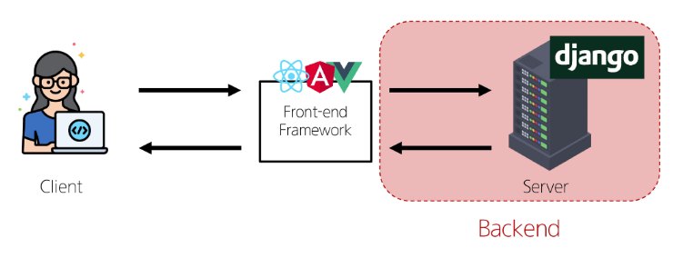


## Framework

### Web Framework
* 웹 서비스 개발에 필요한 것
    * 로그인, 로그아웃, 회원관리, 데이터베이스, 보안 등 많은 기술들이 필요
    * 전부 개발자가 모두 직접 작성하는것은 현실적으로 어려움
    * 잘 만들어진 것을 가져와 잘 사용하는 것도 능력인 시대
    * 절대로 no base에서 시작하지 않는다.
* Web Framework
    * 웹 어플리케이션을 빠르게 개발할 수 있도록 도와주는 도구
    * 개발에 필요한 기본 구조, 규칙, 라이브러리 등을 제공

### Django Framework
* django
    * python 기반의 대표적인 web framework
* why django???
    * 다양성
        * python 기반으로 소셜 미디어 및 빅데이터 관리 등 광범위한 서비스 개발에 적합
    * 확장성
        * 대량의 데이터에 대해 빠르고 유연하게 확장할 수 있는 기능을 제공
    * 보안
        * 취약점으로부터 보호하는 보안 기능이 기본적으로 내장되어 있음
    * 커뮤니티 지원
        * 개발자를 위한 지원, 문서 및 업데이트를 제공하는 활성화 된 커뮤니티
    * 검증된 웹 프레임워크
        * 대규모 서비스에서도 안정적인 서비스 제공
        * spotify, instagram, dropbox, delivery hero 등 많은 대규모 서비스에서도 django를 사용하고 있다(python만 사용하지는 않는다 다양한 기술과 언어들 등이 사용되므로 오해는 하지 말자)

### 가상 환경
* 가상 환경
    * python 어플리케이션과 그에 따른 패키지들을 **격리**하여 관리할 수 있는 **독립적인** 실행 환경
    * 가상환경은 들어가는 개념이 아닌 스위치처럼 내가 키고 끄는 개념
    * 가상환경 파일은 사실상 어디에 있든 상관은 없지만 대체로 내가 사용하는 폴더 내에서 생성후 사용을 권장한다
    * 생성한 가상환경 파일 내부의 파일들은 "절대로" 한자도 건드리지 말것
    * 내가 가상 환경을 킨 곳에서만 적용 -> 다른곳에서 UI를 켜서 확인해보면 활성화되어있지 않다 -> 즉 여러 가상 환경을 위치에 따라 여러개 활성화시킬수 있다(충돌 없이)
* 가상 환경이 필요한 시나리오
    * 가상환경이 필요한 이유를 간단하게 이해해보기
    * 시나리오 1
        1. 한 개발자가 2개의 프로젝트 A, B를 진행해야 한다
        2. 프로젝트 A는 requests 패키지 버전1을 사용해야 한다
        3. 프로젝트 B는 requests 패키지 버전2을 사용해야 한다
        4. 하지만 python 환경에서 패키지는 1개의 버전만 존재할 수 있다.
        5. A, B 프로젝트의 다른 패키지 버전 사용을 위한 **독립적인 개발 환경**이 필요
        * 서로 다른 프로젝트에 영향을 끼치지 않기 위해 독립적인 개발 환경이 필요하다 -> 버전에 문제가 생기지 않기 위해서
    * 시나리오 2
        1. 한 개발자가 2개의 프로젝트 A, B를 진행해야 한다
        2. 프로젝트 A는 water라는 패키지를 사용해야 한다
        3. 프로젝트 B는 fire라는 패키지를 사용해야 한다
        4. 하지만 python 환경에서 두 패키지를 동시에 사용하면 충돌이 발생하기 때문에 설치할 수 없다.
        5. A, B 프로젝트의 패키지 충돌을 피하기 위해 각각 **독립적인 개발환경**이 필요
        * 패키지 충돌을 막기 위해서 독립적인 개발환경이 필요하다.

    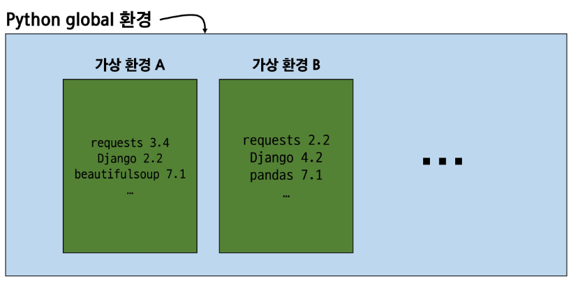

* 여러 명령어
    * 가상환경 `venv` 생성
        * `python -m venv venv`
        * `python -m venv`까지 venv를 생성하기 위한 명령어, 이후에 나오는 `venv`가 생성한 venv의 이름이다.
    * 가상 환경 활성화
        * `source venv/Scripts/activate`
        * 가상환경 venv를 활성화 시키는 명령어
    * 설치된 패키지 목록 확인
        * `pip list`
        * 의존성(의존성 패키지)
            * 한 소프트웨어 패키지가 다른 패키지의 기능이나 코드를 사용하기 때문에 그 패키지가 존재해야만 제대로 작동하는 관계
            * 사용하려는 패키지가 설치되지 않았거나, 호환되는 버전이 아니면 오류가 발생하거나 예상치 못한 동작을 보일 수 있다.
            * 하나의 패키지를 설치해도 하나만 설치되는 것이 아닌 여러 패키지가 동시에 설치된다. 하나의 패키지가 여러 패키지에 영향을 끼치기 때문이다 -> 버전 정보가 바뀌면 충돌이 일어나기 때문에 하나의 패키지만 업데이트 불가 -> 패키지가 영향을 끼치는 여러 패키지를 동시에 업데이트 해야 한다.(버전을 맞춰줘야 한다.)
    * 의존성 패키지 목록 생성
        * `pip freeze` : 버전 정보를 확인할 수 있는 문자열을 나열시켜 **보여주는** 명령어
        * `pip freeze > requirements.txt` : requirements.txt에 현재 내가 사용하고 있는 패키지 목록을 이름을 requirements라는 txt파일을 생성하여 그곳에 저장해준다.
        * txt파일 이름을 굳이 requirements가 아니더라도 생성은 되지만 암묵적인 python개발자들과의 약속이라고 생각하면 된다.
        * 새로운 패키지를 추가할 때마다 패키지 목록을 최신화해야 한다.

            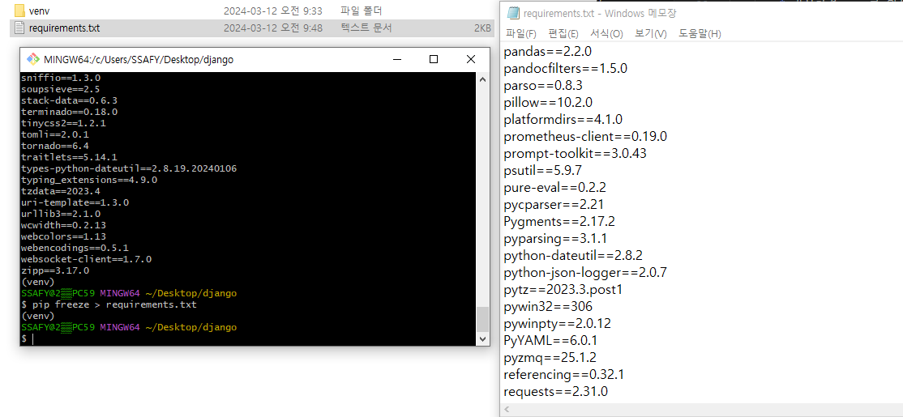

* 패키지 목록이 필요한 이유
    * 여러 개발자가 다른 장소에서 개발을 하기 위해서는 한 개발자가 사용한 패키지 목록을 동일하게 사용해야 clone을 받아 실행할수 있지만 패키지가 없다면 clone을 받아도 실행 불가능 -> **패키지 목록**이 공유되어야 한다.

### Django 프로젝트
* Django 프로젝트 생성 전 루틴
    0. `.gitignore` 파일 생성
    1. 가상환경 생성
        ```python
        # 1. 가상환경(venv) 생성
        # python -m venv '가상 환경 이름'
        $ python -m venv venv
        ```
    2. 가상환경 활성화
        ```python
        # 2. 가상환경 활성화
        # source '가상 환경 이름'/S + tab/act + tab
        # tab key를 누른다면 자동완성해준다.
        $ source venv/Scripts/activate
        ```
    3. Django 설치 or 패키지 설치
        ```python
        # 3. Django 설치
        $ pip install django
        ```
        ```python
        # 3. 패키지 설치
        $ pip install -r requirements.txt
        ```
        * python 3.10 이상일 경우는 Django 5버전이 설치된다. 버전정보가 맞아야 하기 때문에 꼭 확인을 해야 한다.
    4. 의존성 파일 생성 : 패키지 설치시마다 진행
        ```python
        # 4. 의존성 파일 생성
        # pip freeze > 'text 파일명'.txt
        # 반드시 txt 이름이 requirements일 필요는 없지만 암묵적인 약속
        $ pip freeze > requirements.txt
        ```
    5. `git` 저장소 생성
    6. Django 프로젝트 생성
        ```python
        # 6. Django 프로젝트 생성
        # $ django-admin startproject 'project name'
        $ django-admin startproject firstpjt
        # firstpjt 라는 이름의 프로젝트 생성
        ```
    7. Django 서버 실행
        ```python
        # 7. Django 서버 실행
        $ python manage.py runserver
        # manage.py와 동일한 경로에서 진행
        ```
* 서버 생성 확인
    * 서버를 실행하면 terminal 창 하단에 IP를 통한 url이 뜬다.
        * ctrl + 클릭을 하면 url을 따로 입력하지 않아도 바로 이동 가능하다.

    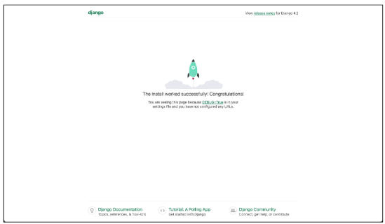

* 가상 환경을 사용하는 이유
    * 의존성 관리 : 라이브러리 및 패키지를 각 프로젝트마다 독립적으로 사용 가능
    * 팀 프로젝트 협업 : 모든 팀원이 동일한 환경과 의존성 위에서 작업하여 버전간 충돌을 방지
* LTS (Long-Term-Support)
    * 프레임워크나 라이브러리 등의 소프트웨어에서 장기간 지원되는 안정적인 버전을 의미할 때 사용
    * 기업이나 대규모 프로젝트에서는 소프트웨어 업그레이드에 많은 비용과 시간이 필요하기 때문에 안정적이고 장기간 지원되는 버전이 필요
* Django란 정확히 Frontend, Backend 어디에 속하는가?
    * Django는 둘다 가능한 Full Stack framework이다.
    * 하지만 Django가 제공하는 Frontend 기능은 다른 전문적인 Fronten framework에 비해 많이 미흡하다.
    * 엄밀히 따지면 Full Stack 영역에서 Backend에 속한다고 볼 수 있다.
    * Full Stack 또는 Backend Framework라 부른다.


## Django Design Pattern
* 디자인 패턴
    * 소프트웨어 설계에서 발생하는 문제를 해결하기 위한 일반적인 해결책 (공통적인 문제를 해결하는 데 쓰이는 형식화 된 관행)
        * '어플리케이션의 구조는 이렇게 구성하자'라는 관행
* MVC 디자인 패턴(Model-데이터, View-사용자 인터페이스, Controller-비즈니스 로직)
    * 어플리케이션을 구조화하는 대표적인 패턴
    * '데이터', '사용자 인터페이스', '비즈니스 로직'으로 분리
        * 시각적 요소와 뒤에서 실행되는 로직을 서로 영향 없이, 독립적이고 쉽게 유지 보수할 수 있는 어플리케이션을 만들기 위해서..
* MTV 디자인 패턴(Model, Template, View)
    * Django에서 어플리케이션을 구조화하는 패턴 (기존 MVC 패턴과 동일하나 단순히 명칭을 다르게 정의한 것)
    * view -> template, controller -> view : 단순한 명칭 변경

### Project & App
* Django project
    * 어플리케이션의 집합
    * DB 설정, URL 연결, 전체 앱 설정 등을 처리
* Django application
    * 독립적으로 작동하는 기능 단위 모듈
    * 각자 특정한 기능을 담당하며 다른 앱들과 함께 하나의 프로젝트를 구성
* 앱을 사용하기 위한 순서 : 반드시 순서를 지켜야 한다.
    1. 앱 생성
        * 앱의 이름은 **복수형**으로 지정하는 것을 권장(말은 권장이지만 이 역시 암묵적인 룰이다...)
        ```python
        # $ python manage.py startapp 'app 이름'
        $ python manage.py startapp articles
        ```
    2. 앱 등록
        * 반드시 앱을 생성한 후에 등록해야 한다. (등록후 생성 불가)
        ```python
        # settings.py

        # Application definition

        INSTALLED_APPS = [
            # 'articles' 즉 app이름을 넣어주어야 한다.
            'articles',
            'django.contrib.admin',
            'django.contrib.auth',
            'django.contrib.contenttypes',
            'django.contrib.sessions',
            'django.contrib.messages',
            'django.contrib.staticfiles',
        ]
        ```

* 프로젝트 구조
    * `settings.py` : 프로젝트의 모든 설정을 관리
    * `urls.py` : 요청 들어오는 url에 따라 이에 해당하는 적절한 views를 연결
    * `__init__.py` : 해당 폴더를 패키지로 인식하도록 설정하는 파일
    * `asgi.py` : 비동기식 웹 서버와의 연결 관리 설정
    * `wsgi.py` : 웹 서버와의 연결 관련 설정
    * `manage.py` : django 프로젝트와 다양한 방법으로 상호작용하는 커맨드라인 유틸리티

    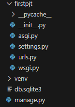

* 앱 구조
    * `admin.py` : 관리자용 페이지 설정
    * `models.py` : DB와 관련된 Model을 정의, MTV 패턴의 M
    * `views.py` : HTTP 요청을 처리하고 해당 요청에 대한 응답을 변환 (url, model, template과 연계), MTV 패턴의 V
    * `apps.py` : 앱의 정보가 작성된 곳
    * `test.py` : 프로젝트 테스트 코드를 작성하는 곳

    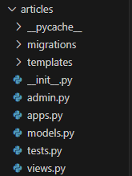


### 요청과 응답

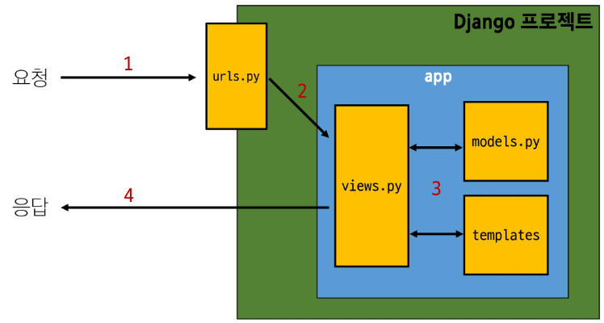

1. URLs
    * 'http://127.0.01:8000/index/'로 요청이 왔을 때 views 모듈의 view함수 index를 호출
    ```python
    # urls.py

    from django.contrib import admin
    from django.urls import path
    # articles 패키지에서 views 모듈을 가져오는 것
    from articles import views

    urlpatterns = [
        # url 경로는 반드시'/'(slash)로 끝나야 한다.
        path('admin/', admin.site.urls),
        path('index/', views.index),
    ]
    ```

    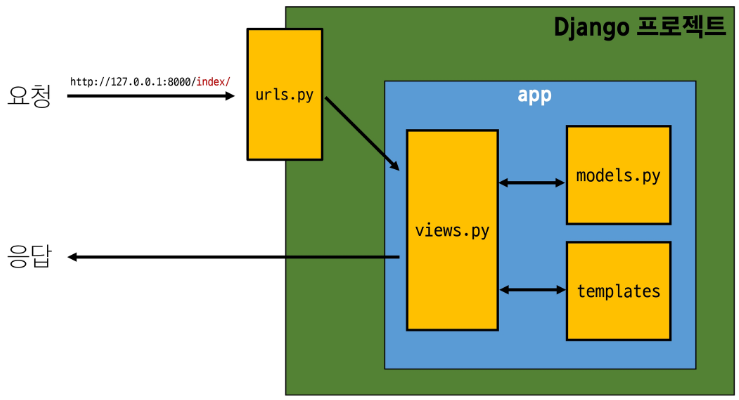

2. View
    * 특정 경로에 있는 template과 request 객체를 결합해 응답 객체를 반환하는 index view 함수를 정의
        * 모든 view함수는 첫번째 인자로 request요청 객체를 **필수적으로** 받음
        * 매개변수 이름이 request가 아니여도 상관 없지만 암묵적인 규칙이다.
    ```python
    from django.shortcuts import render

    # 메인 페이지를 만드는 index라는 이름의 함수를 작성
    def index(request) :
        # render 함수는 요청객체, templates 이후의 경로를 입력한다.
        return render(request, 'index.html')
    ```
3. Template
    1. articles 앱 폴더 안에 templates 폴더 생성
        * 폴더명은 반드시 `templates`여야 하며 개발자가 직접 생성해야 한다.
        * render함수에서 `templates`를 인식하기 때문에 반드시 이름 그대로 생성한다.
    2. templates 폴더 안에 articles 폴더 생성
        * articles를 중복으로 사용하는 이유는 편의성 때문이다.
    3. articles 폴더 안에 templates 파일 생성

    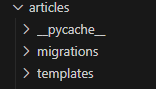

* Django에서 template를 인식하는 경로 규칙
    * `app폴더/templates/articles/index.html`
    * `app폴더/templates/example.html`
    * Django는 `~templates/`까지 기본 경로로 인식하기 때문에 view 함수에서 template 경로 작성 시 이 지점 이후의 경로를 작성해야 한다.
* 데이터 흐름에 따른 코드 작성
    * 코드는 데이터의 흐름에 따라 작성하는 것을 권장한다.
    * 데이터의 흐름 : URLs -> View -> Template

    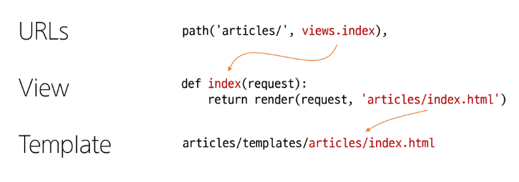


## +@
* MTV 디자인 패턴 정리
    * Model
        * 데이터와 관련된 로직을 관리
        * 응용프로그램의 데이터 구조를 정의하고 데이터베이스의 기록을 관리
    * Template
        * 레이아웃과 화면을 철
        * 화면상의 사용자 인터페이스 구조와 레이아웃을 정의
    * View
        * Model & Template과 관련한 로직을 처리해서 응답을 반환
        * 클라이언트의 요청에 대해 처리를 분기하는 역할
        * view 예시
            * 데에터가 필요하다면 model에 접그냏서 데이터를 가져오고
            * 가져온 데이터를 template로 보내 화면을 구성하고
            * 구성된 화면을 응답으로 만들어 클라이언트에게 반환

    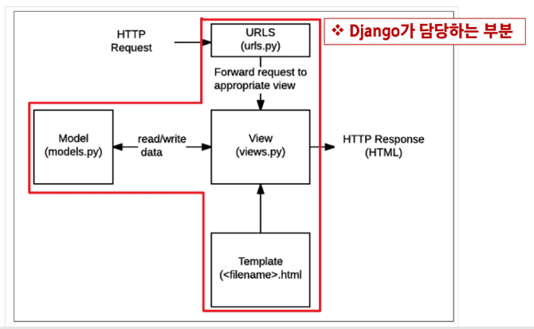

* render 함수
    * 주어진 탬플릿을 주어진 컨텍스트 데이터와 결합하고 렌더링 된 텍스트와 함께 HttpResponse 응답 객체를 반환하는 함수
    1. request
        * 응답을 생성하는 데 사용되는 요청 객체
    2. template_name
        * 템플릿 이름의 경로
    3. context
        * 템플릿에서 사용할 데이터(딕셔너리 타입으로 작성)
    * `render(request, template_name, context)`
* Django의 규칙
    1. urls.py에서 url경로는 반드시 '/'로 끝남
    2. views.py에서 모든 view 함수는 **첫번째 인자로 요청 객체**를 받음
        * 매개변수 이름은 반드시 request로 지정
    3. Django는 **정해진 경로**에 있는 template 파일만 일ㄺ어올 수 있음
        * app폴더/templates/이후
* 프레임워크의 규칙
    * 프레임워크를 사용할 때는 일정한 규칙을 따라야 하며 이는 저마다의 설계 철학이나 목표를 반영하고 있음
        * 일관성 유지, 보안 강화, 유지보수성 향상, 최적화 등과 같은 이유
    * 프레임워크는 개발자에게 도움을 주는 도구와 환경을 제공하기 위해 규칙을 정해 놓은 것이며 우리는 이를 잘 활용하여, 특정 기능을 구현하는 방법을 표준화하고 개발 프로세스를 단순화할 수 있도록 해야 함