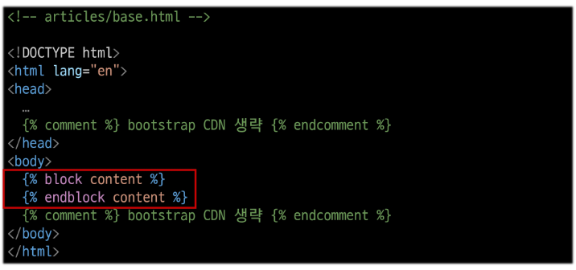

# Template & URLs

## Template System
* 데이터 **표현**을 제어하면서, **표현**과 관련된 부분을 담당
* HTML의 콘텐츠를 변수 값에 따라 바꾸고 싶다면
    ```python
    from django.shortcuts import render

    def index(request) :
        context = {
            'name' : 'Jane'
        }
        return render(request, 'articles/index.html', context)
    ```
    ```html
    <body>
        <h1>Hello, {{ name }}</h1>
    </body>
    ```
* DTL = Django Template Language
    * Template에서 조건, 반복, 변수 등의 프로그래밍적 기능을 제공하는 시스템
* DTL Syntax
    1. Variable
        * `render` 함수의 세번째 인자로 딕셔너리 데이터를 사용
        * 딕셔너리 key에 해당하는 문자열이 template에서 사용 가능한 변수명이 됨
        * dot(`.`)를 사용하여 변수 속성에 접근할 수 있음
        * 접근이 바로 가능한 경우 : `{{ varialble}}`
        * 한번 접근 해도 또 딕셔너리로 나오는 경우 추가로 접근이 필요하다. 이러한 경우 : `{{ variable.attribute }}`
    2. Filters
        * 표시할 변수를 수정할 때 사용 (변수 + '|' + 필터)
        * chained(연결)이 가능하며 일부 필터는 인자를 받기도 함
        * 약 60개의 built-in template filters를 제공
        * 기본 형태  : `{{ variable|filter }}`
        * filter에 인자를 받기도 한다 : `{{ name|truncatewords:30 }}` 글자가 많은 경우 글자를 30자로 제한하는 filter
    3. Tags
        * 반복 또는 논리를 수행하여 제어 흐름을 만듦. but 보여지지는 않는다.
        * 일부 태그는 시작과 종료 태그가 필요
        * 약 24개의 built-in template tags를 제공
        * `% tag %`
        * if 태그의 예시 : 시작태그 - ``, 종료 태그 - ``
    4. Comments
        * DTL에서의 주석
        * 한줄 주석 : `{# #}`
        * 여러줄 주석
            ```html
            
            ...
            
            ```
    * DTL 예시
        ```python
        # urls.py
        urlpatterns = [
            path('admin/', admin.site.urls),
            path('index/', views.index),
            path('dinner/', views.dinner),
        ]
        ```
        ```python
        # views.py
        import random

        def dinner(request):
            foods = [
                '국밥',
                '국수',
                '카레',
                '탕수육',
            ]
            picked = random.choice(foods)
            context = {
                'foods' : foods,
                'picked' : picked
            }
            return render(request, 'articles/dinner.html', context)
        ```
        ```html
        <!DOCTYPE html>
        <html lang="en">
        <head>
        <meta charset="UTF-8">
        <meta name="viewport" content="width=device-width, initial-scale=1.0">
        <title>Document</title>
        </head>
        <body>
        <p>{{ picked }} 메뉴는 {{ picked|length }}글자입니다.</p>
        <h2>메뉴판</h2>
        <ul>
            
            <li>{{ food }}</li>
            
        </ul>

        
            <p>메뉴가 소진되었습니다.</p>
        
            <p>아직 메뉴가 남았습니다.</p>
        
        </body>
        </html>
        ```

        

        

### 템플릿 상속
* 기본 템플릿 구조의 한계
    * 모든 템플릿에 bootstrap을 적용하기 위해서는 모든 템플릿에 bootstrap CDN을 작성
    * 이것을 방지하기 처음 한번 스켈레톤 작성 -> 이후부턴 상속을 받는다
        * 처음 한번만 bootstrap CDN을 작성
* 템플릿 상속 (Template inheritance)
    * **페이지의 공통요소를 포함**하고, **하위 템플릿이 재정의 할 수 있는 공간**을 정의하는 기본 'skeleton' 템플릿을 작성하여 상속 구조를 구축
* 상속 구조 만들기
    1. skeleton 역할을 하게 되는 상위 템플릿 작성

        
    
    2. 기존 하위 템플릿의 변화

        
* `extends` tag
    * ``
    * 자식(하위)템플릿이 부모 템플릿을 확장한다는 것을 알림
        * 반드시 자식 템플릿 최상단에 작성되어야 함 (2개 이상 사용 불가)
* `block` tag
    * ``
    * 하위 템플릿에서 재정의 할 수 있는 블록을 정의 (상위 템플릿에 작성하며 하위 템플릿이 작성할 수 있는 공간을 지정하는 것)

    


## HTML form (요청과 응답)
* 데이터를 보내고 가져오기
    * HTML 'form' element를 통해 사용자와 어플리케이션 간의 상호작용 이해하기
    * HTML 'form'은 HTTP요청을 서버에 보내는 가장 편리한 방법
    ```html
    

    
        <!-- fake naver -->
        <form action="https://search.naver.com/search.naver">
            <label for="">검색 : </label>
            <input type="text" id="message" name="query">
            <input type="submit">
        </form>
    
    ```

    

    

* 'form' element
    * 사용자로부터 할당된 데이터를 서버로 전송
        * 웹에서 사용자 정보를 입력하는 여러 방식(text, password, checkbox 등)을 제공
* fake naver : 검색을 하면 naver에 요청하여 가져오도록 만드는 방법

    

    

    

    

* form의 핵심 속성 2가지 : `action` & `method`
    * 데이터를 **어디(action)**로 **어떤 방식(method)**으로 요청할지
    * `action`
        * 입력 데이터가 전송될 URL을 지정 (목적지)
        * 만약 이 속성을 지정하지 않으면 데이터는 현재 form이 있는 페이지의 URL로 보내짐
        * `action`에 들어가는 url을 비워둔다면 현재 주소(현재 페이지)로 data를 전송하게 된다.
    * `method`
        * 데이터를 어떤 방식으로 보낼 것인지 정의
        * 데이터의 HTTP request methods(GET, POST)를 지정
            * `GET` : url에 노출되도록 사용 ex) 검색기능
            * `POST` : 노출이 되지 않길 원하는 경우 사용 ex) 로그인
        * `method`를 설정하지 않으면 기본값인 `GET`으로 설정된다.
* `input` element
    * 사용자의 데이터를 입력 받을 수 있는 요소 (type 속성 값에 따라 다양한 유형의 입력 데이터를 받음)
    * `name` attribute : input의 핵심 속성
        * 입력한 데이터에 붙이는 이름(key)
            * 데이터를 제출했을 때 서버는 name 속성에 설정된 값을 통해서만 사용자가 입력한 데이터에 접근할 수 있음
        * name에 아무것도 적지 않은 것은 마치 python에서 input()을 받을때 `n = int(input())`처럼 저장하는 것이 아닌 `int(input())`으로 받기만 하는것과 동일하다.
* Query String Parameters
    * 사용자의 입력 데이터를 URL 주소에 파라미터를 통해 서버로 보내는 방법
    * 문자열은 앰퍼샌드('&')로 연결된 key=value쌍으로 구성되며, 기본 URL과는 물음표('?')로 구분됨
    * 예시
        * `http://host:port/path?key=value&key=value`

### form 활용
* HTTP request 객체
    * form으로 전송한 데이터 뿐만 아니라 모든 요청 관련 데이터가 담겨 있음 (view 함수의 첫 번째 인자)

        

    * form 데이터를 가져오는 방법

        

* 사용자 입력 데이터를 받아 그대로 출력하는 서버 만들기
    1. throw 로직 만들기

        

    2. catch 로직 작성

        
    
    3. catch 로직 마무리

        


### 추가 템플릿 경로 지정
* 템플릿 기본 경로 외 커스텀 경로 추가

    

    

* BASE_DIR
    * settings에서 경로지정을 편하게 하기 위해 최상단 지점을 지정 해놓은 변수

    

* DTL 주의사항
    * python처럼 일부 프로그래밍 구조(if, for 등)를 사용할 수 있지만 명칭을 그렇게 설계 했을 뿐이지 **python 코드로 실행되는 것이 아니며 python과는 관련없음**
    * 프로그래밍적 로직이 아니라 표현을 위한 것임을 명심하기
    * 프로그래밍적 로직은 되도록 view 함수에서 작성 및 처리할 것
    * 공식 문서를 참고해 다양한 태그와 필터 사용해보기
        * [공식문서](https://www.djangoproject.com/)


## Django URLs
* 요청과 응답에서 Django URLs의 역할

    

* URL dispatcher : 운항 관리자, 분배기
    * URL 패턴을 정의하고 해당 패턴이 일치하는 요청을 처리할 view 함수를 연결(매핑)

### 변수와 URL
* 현재 URL 관리의 문제점
    * 템플릿의 많은 부분이 중복되고, URL의 일부만 변경되는 상황이라면 계속해서 비슷한 URL과 템플릿을 작성해 나가야 한다.
    ```python
    urlpatterns = [
        path('articles/1/', ...),
        path('articles/2/', ...),
        path('articles/3/', ...),
        path('articles/4/', ...),
        path('articles/5/', ...),
        path('articles/6/', ...),
        ...,
    ]
    ```
* Variable Routing
    * URL 일부에 변수를 포함시키는 것 (변수는 view함수의 인자로 전달 할 수 있음)
* Variable routing 작성법
    * `<path_converter:variable_name>`
        ```python
        path('articles/<int:num>/', views.detail)
        path('hello/<str:name>/', views.greeting)
        ```
    * path converters : URL 변수의 타입을 지정(str, int 등 5가지 타입 지원)

### 참고
* Trailing Slashes
    * Django는 URL 끝에 `/`가 없다면 자동으로 붙임
    * 기술적인 측면에서 'foo.com/bar'와 'foo.com/bar/'는 서로 다른 URL이다.
    * 그래서 Django는 검색 엔진이 혼동하지 않게 하기 위해 무조건 붙이는 것을 선택
    * 그러사 모든 프레임워크가 이렇게 동작하는 것이 아님을 유의할 것