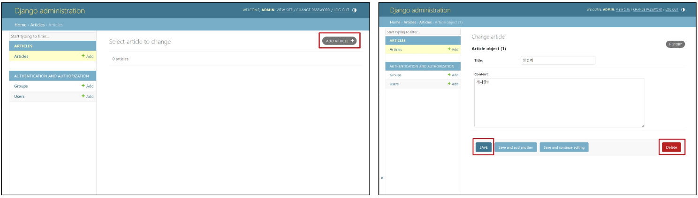

# Model

## Django URLs
* 요청과 응답에서 Django URLs의 역할

    

* URL dispatcher(운항 관리자, 분배기)
    * URL 패턴을 정의하고 해당 해턴이 일치하는 요청을 처리할 view 함수를 연결(매핑)

### App과 URL
* App URL mapping
    * 각 앱에 URL을 정의하는 것
        * 프로젝트와 각 앱이 URL을 나누어 관리를 편하게 하기 위함
    * 2번째 앱 pages 생성후 발생할 수 있는 문제
        * view 함수 이름이 같거나 같은 패턴의 URL 주소를 사용하게 되는 경우 아래 코드와 같이 해결해 볼수 있으나 더 좋은 방법이 필요
            * URL을 각자의 app에서 관리하자

                

                

                

                
    * `include()`
        * 프로젝트 내부 앱들의 URL을 참조할 수 있도록 매핑하는 함수
            * URL의 일치하는 부분까지 잘라내고, 남은 문자열 부분은 후속 처리를 위해 include된 URL로 전달
        * include가 적용된 이후 변경된 프로젝트 urls.py

            


### URL 이름 지정
* url 구조 변경에 따른 문제점
    * 기존 'articles/'주소가 'articles/index/'로 변경됨에 따라 해당 주소를 사용하는 모든 위치를 찾아가 변경해야 한다
        * url에 이름을 지어주면 이름만 기억하면 된다!
* Naming URL patterns
    * URL에 이름을 지정하는 것 (path 함수의 name 인자를 정의해서 사용)

    

    * url 표기 변화
        * a태그의 href 속성 값 뿐만 아니라 form의 action 속성 처럼 url을 작성하는 모든 위치에서 변경

        
    
    * url tag
        * ``
        * 주어진 URL 패턴의 이름과 일치하는 절대 경로 주소를 반환

### URL 이름 공간
* url 이름 지정 후 남은 문제
    * articles 앱의 url이름과 pages 앱의 url이름이 같은 상황
    * 단순히 이름만으로는 완벽하게 분리할 수 없음 
    * 이름에 key를 붙이자!!
*  `app_name` 속성지정 -> app_name 변수 값 설정
    * 변수명 절대 바꾸지 말것!!
    * URL tag의 최종 변화
        * 마지막으로 url 태그가 사용되는 모든 곳의 표기 변경하기
        * `` -> ``

        


## Django Model

### Model
* model을 통한 DB 관리

    

* Django Model
    * DB의 테이블을 정의하고 데이터를 조작할 수 있는 기능들을 제공
        * 테이블 구조를 설계하는 '청사진(blueprint)'
* model 클래스 작성
    ```python
    # articles/models.py

    # id 필드는 Django가 자동 생성
    # '필드' == '열' 을 의미한다.

    class Article(models.Model) :
        title = models.CharField(max_length = 10)
        content = models.TextField()
    ```
    * 작성한 모델 클래스는 최종적으로 DB에 테이블 구조를 만든다(엑셀 표처럼)
    * django.db.models 모듈의 Model이라는 부모 클래스를 상속 받음
        * Model은 model에 관련된 모든 코드가 이미 작성 되어있는 클래스
            * 개발자는 가장 중요한 **테이블 구조를 어떻게 설계할지에 대한 코드만 작성하도록** 하기 위한 것 (상속을 활용한 프레임워크의 기능 제공)
    1. 클래스 변수명
        * 테이블의 각 "필드(열) 이름"
        * 예시코 드에서 `title`, `content` 에 해당
    2. model field 클래스
        * 테이블 필드의 "데이터 타입"
        * 예시 코드에서 `CharField`, `TextField`에 해당
    3. model Field 클래스의 키워드 인자 (필드 옵션)
        * 테이블 필드의 "제약조건" 관련 설정
            * 제약 조건 : 데이터가 올바르게 저장되고 관리되도록 하기 위한 규칙
                * 숫자만 저장되도록, 문자가 100자 까지만 저장되도록 등
        * 예시 코드에서 `max_length = 10`에 해당

### Migrations
* Migrations
    * model 클래스의 변경사항(필드 생성, 수정 삭제 등)을 DB에 최종 반영하는 방법
* Migrations 과정

    

* Migrations 핵심 명령어
    * `$ python manage.py makemigrations` : model class를 기반으로 최종설계도 (migration) 작성
    * `$ python manage.py migrate` : 최종 설계도를 DB에 전달하여 반영
* migrate 후 DB 내에 생성 된 테이블 확인
    * article 모델 클래스로 만들어진 articles_article 테이블

        

* 추가 migrations
    * 이미 생성된 테이블에 필드를 추가해야 한다면
        * 추가 모델 필드 작성

            

        * 이미 기존 테이블이 존재하기 때문에 필드를 추가할 때 필드의 기본 값 설정이 필요
        * 1번은 현재 대화를 유지하면서 직접 기본 값을 입력하는 방법
        * 2번은 현재 대화에서 나간 후 models.py에 기본 값 관련 설정을 하는 방법

            

        * 추가하는 필드의 기본 값을 입력해야 하는 상황
        * 날짜 데이터이기 때문에 직접 입력하기 보다 Django가 제안하는 기본 값을 사용하는 것을 권장
        * 아무것도 입력하지 않고 enter를 누르면 Django가 제안하는 기본 값으로 설정 됨

            
        
        * migrations 과정 종료 후 2번째 migration 파일이 생성됨을 확인
        * 이처럼 django는 설계도를 쌓아가면서 추후 문제가 생겼을 시 복구하거나 되돌릴 수 있도록 함 (마치 `git commit`과 유사)

            

        * migrate 후 테이블 필드 변화 확인

            

* model class에 변경사항(1)이 생겼다면 반드시 새로운 설계도를 생성(2)하고, 이를 DB에 반영(3)해야 한다.
    1. model class 변경
    2. makemigrations
    3. migrate

### Model Field
* DB 테이블의 **필드(열)**을 정의하며, 해당 필드에 저장되는 **데이터 타입**과 **제약 조건**을 정의
* `charField()` : 길이의 제한이 있는 문자열을 넣을 때 사용 (필드의 최대 길이를 결정하는 max_length는 필수 인자)
* `TextField()` : 글자의 수가 많을 때 사용
* `DateTimeField()` : 날짜와 시간을 넣을 때 사용
    * DatetimeField의 선택인자
        * `auto_now` : 데이터가 **저장될 때마다** 자동으로 현재 날짜 시간을 저장
        * `auto_now_add` : 데이터가 **처음 생성될 때만** 자동으로 현재 날짜시간을 저장

### Admin site
* Automatic admin interface
    * Django는 추가 설치 및 설정 없이 자동으로 관리자 인터페이스 제공
        * 데이터 확인 및 테이스트 등을 진행하는데 매우 유용
    1. admin 계정 생성
        * email은 선택사항이기 때문에 입력하지 않고 진행 가능
        * password 입력 시 보안상 terminal에 출력되지 않으니 무시하고 입력
        * `python manage.py createsuperuser`
    2. DB에 생성된 admin 계정 확인

        

    3. admin에 모델 클래스 등록
        * admin.py에 작성한 모델 클래스를 등록해야만 admin site에서 확인가능

            

    4. admin site 로그인 후 등록된 모델 클래스 확인

        

    5. 데이터 생성, 수정, 삭제 테스트

        

    6. 테이블 확인

        

## 참고
* DB 초기화

    

* Migrations 기타 명령어
    * `$ python manage.py showmigrations`
        * migrations 파일들이 migrate 됐는지 안됐는지 여부를 확인하는 명령어
        * [X] 표시가 있으면 migrate가 완료되었음을 의미
    * `$ python manage.py sqlmigrate articles 0001`
        * 해당 migrations 파일이 SQL 언어로 어떻게 번역 되어 DB에 전달되는지 확인하는 명령어
* 첫 migrate 시 출력 내용이 많은 이유는?
    * Django 프로젝트가 동작하기 위해 미리 작성 되어있는 기본 내장 app들에 대한 migration 파일들이 함께 migrate 되기 때문

        
* SQLite
    * 데이터베이스 관리 시스템 중 하나이며 Django의 기본 데이터베이스로 사용됨(파일로 존재하며 가볍고 호환성이 좋음)
* CRUD
    * 소프트웨어가 가지는 기본적인 데이터 처리 기능
    * Create(저장), Read(조회), Update(갱신), Delete(삭제)