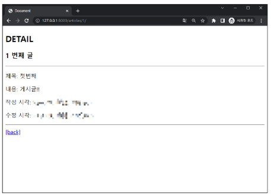
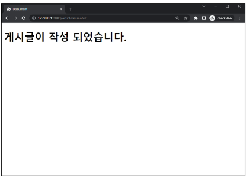

# ORM
* Object-Relational-Mapping
* 객체 지향 프로그래밍 언어를 사용하여 호환되지 않는 유형의 시스템 간에 데이터를 변환하는 기술
* ORM의 역할
    * 사용하는 언어가 다르기 때문에 소통 불가 -> ORM이 중간에서 이를 해석

        


# QuerySet API
* ORM에서 데이터를 검색, 필터링, 정렬 및 그룹화 하는데 사용하는 도구
    * API를 사용하여 SQL이 아닌 Python 코드로 데이터를 처리

        
        
        * 다중데이터의 경우 'QuerySet', 단일데이터의 경우 'instance'로 반환

* QuerySet API 구문
    * `Article.objects.all()`
        * `Article` : model class
        * `objects` : manager
        * `all()` : Queryset API
* QuerySet API 구문 동작 예시

    

* Query
    * 데이터베이스에 특정한 데이터를 보여 달라는 요청
    * "쿼리문을 작성한다" : 원하는 데이터를 얻기 위해 데이터베이스에 요청을 보낼 코드를 작성한다.
    * python으로 작성한 코드가 ORM에 의해 SQL로 변환되어 데이터베이스에 전달되며, 데이터베이스의 응답 데이터를 ORM이 QuerySet이라는 자료 형태로 변환하여 우리에게 전달
* QuerySet
    * 데이터베이스에게서 전달 받은 객체 목록(데이터 모음)
        * 순회가 가능한 데이터로써 1개 이상의 데이터를 불러와 사용할 수 있다.
    * Django ORM을 통해 만들어진 자료형
    * 단, 데이터베이스가 단일한 객체를 반환 할 때는 QuerySet이 아닌 모델(Class)의 인스턴스로 반환됨
    * QuerySet API는 python의 모델 클래스와 인스턴스를 활용해 DB에 데이터를 저장, 조회, 수정, 삭제 하는 것


# QuerySet API 실습
* 외부 라이브러리 설치 및 설정
```
$ pip install ipython
$ pip install django-extensions
```
```python
# settings.py
INSTALLED_APPS = [
    'articles',
    'django_extensions',
    ...,
]
```
```
$ pip freeze > requirements.txt
```

* Django shell
    * Django 환경 안에서 실행되는 python shell
    * 입력하는 QuerySet API 구문이 Django 프로젝트에 영향을 미침
    * Django shell 실행
        ```
        $ python manage.py shell_plus
        ```

## Create
* 외부 라이브러리 설치 및 설정
    ```
    $ pip install ipython
    $ pip install django-extensions
    ```
    ```python
    # settings.py

    INSTALLED_APPS = [
        'articles',
        'django_extensions',
    ]
    ```
    ```
    $ pip freeze > requirements.txt
    ```

* Django shell
    * Django 환경 안에서 실행되는 python shell
    * 입력하는 QuerySet API 구문이 Django 프로젝트에 영향을 미침
    * 실행 : `$ python manage.py shell_plus`

## Read

## Update

## Delete


# ROM with View
* Django shell에서 연습했던 QuerySet API를 직접 view 함수에서 사용하기

## Read
* 2가지 Read(조회) 진행
    1. 전체 게시글 조회

        

        

    2. 단일 게시글 조회

        

        

* 단일 게시글 페이지 링크

    

    


## Create
* create 로직을 구현하기 위해 필요한 view함수의 개수는?
    * 2개 -> throw / catch
    * 사용자 입력 데이터를 받을 페이지를 렌더링 -> new
        * new 기능 구현

            

            

            

    * 사용자가 입력한 데이터를 받아 DB에 저장 -> create
        * create 기능 구현
            * create를 하는 세가지 방법이 있지만 데이터가 올바른지 "유효성"를 한 이후에 저장을 하기 때문에 3번째 방법은 자주 사용되지 않는다. 첫번째 또는 두번째를 사용하지만 대부분 content를 한줄에 담고 그 다음부터 save()직전까지 유효성 검사를 진행하는 두번째 방법을 사용하는것을 권장한다.

            

            

            


## HTTP request methods
* HTTP : 네트워크 상에서 데이터를 주고 받기 위한 약속
* HTTP request methods : 데이터(리소스)에 대한 어떤 요청(행동)을 원하는지를 나타내는 것
    * `GET` method : 특정 리소스를 **조회**하는 요청
        * 데이터를 전달할 때 URL에서 Query String 형식으로 보내짐

            

    * `POST` method : 특정 리소스에 **변경(생성, 수정, 삭제)을 요구하는** 요청
        * 데이터는 전달할 때 HTTP Body에 담겨 보내짐

        

* HTTP response status code
    * 특정 HTTP 요청이 성공적으로 완료되었는지를 3자리 숫자로 표현하기로 약속한 것
        * [response status code document](https://developer.mozilla.org/en-US/docs/Web/HTTP/Status)
            * 100~199, 200~299, 300~399는 거의 볼일이 없다.
            * 400~499는 client error -> 사용자 잘못
            * 500~599는 server error -> 서버(또는 서버 생성자) 잘못
        * for example

            

            * 403 Forbidden : 서버에 요청이 전달되었지만, **권한** 때문에 거절되었다는 것을 의미

            

            * "CSRF token이 누락되었다"라는 응답
* CSRF : Cross-Site-Request-Forgery
    * 사이트 간 요청 위조
    * 사용자가 자신의 의지와 무관하게 공격자가 의도한 행동을 하여 특정 웹 페이지를 보안에 취약하게 하거나 수정, 삭제 등의 작업을 하게 만드는 공격 방법
    * DTL의 csrf_token 태그를 사용하여 손쉽게 사용자에게 토큰 값 부여 가능
    * 요청 시 토큰 값도 함께 서버로 전송될 수 있도록 한다.

        

* 요청 시 CSRF Token을 함께 보내야 하는 이유
    * Django 서버는 해당 요청이 DB에 데이터를 하나 생성하는(DB에 영향을 주는) 요청에 의해 **"Django가 직접 제공한 페이지에서 요청을 보낸 것인지"**에 대한 확인 수단이 필요한 것
    * 겉모습이 똑같은 위조 사이트나 정상적이지 않은 요청에 대한 방어 수단
    * 기존 : 요청 데이터 -> 게시글 작성
    * 변경 : 요청 데이터 + **인증토큰** -> 게시글 작성
* POST일 때만 Token을 확인하는 이유
    * POST는 단순 조회를 위한 GET과 달리 특정 리소스에 변경(생성, 수정, 삭제)을 요구하는 의미와 기술적인 부분을 가지고 있기 때문
    * DB에 조작을 가하는 요청은 반드시 인증 수단이 필요
    * DB에 대한 변경사항을 만드는 요청이기 때문에 토큰을 사용해 최소한의 신원 확인을 하는 것
* 게시글 작성 결과
    * 게시글 생성 후 개발자 도구를 사용해 Form Data가 전송되는 것 확인
    * 더 이상 URL에 Query String 형태로 보냈던 데이터가 표기되지 않음

        


## redirect
* 게시글 작성 후 완료를 알리는 페이지를 응답하는 것
    * 게시글을 조회 요청이 아닌 작성 요청이기 때문에 게시글 저장 후 페이지를 응답하는 것은 POST 요청에 대한 적절한 응답이 아님
* 데이터 저장 후 페이지를 주는 것이 아닌 다른 페이지로 사용자를 보내야 한다.
    * "사용자를 보낸다" == "사용자가 GET요청을 한번 더 보내도록 해야 한다"
* `redirect()` : 클라이언트가 인자에 작성된 주소로 다시 요청을 보내도록 하는 함수, create view 함수 개선

    

* redirect() 함수 특징
    * 해당 redirect에서 클라이언트는 detail url로 요청을 다시 보내게 된다.
    * 결과적으로 detail view함수가 호출되어 detail view함수의 반환 결과인 detail 페이지를 응답 받는다.
    * 결국 사용자는 게시글 작성 후 작성된 게시글의 detail 페이지로 이동하는 것으로 느끼게 되는 것
* 게시글 작성 결과
    * 게시글 작성 후 생성 된 게시글의 detail페이지로 redirect 되었는지 확인
    * create 요청 이후에 detail로 다시 요청을 보냈다는 것을 알 수 있다.

        


## Delete
* 데이터 삭제
    * 삭제하려는 데이터 조회 후 delete method 호출

        ```python
        # 삭제할 인스턴스 조회
        >>> article = Article.objects.get(pk=1)

        # delete 매서드 호출 (삭제 된 객체가 반환)
        >>> article.delete()
        (1, {'articles.Article' : 1})

        # 삭제한 데이터는 더이상 조회할 수 없음
        >>> Article.objects.get(pk=1)
        DoesNotExist: Article matching query does not exist.
        ```


## Update
* Update 로직을 구현하기 위해 필요한 view함수의 개수는?
    * 2개가 필요하다.
    * `edit` : 사용자 입력 데이터를 받을 페이지를 렌더링
    * `update` : 사용자가 입력한 데이터를 받아 DB에 저장
* `edit` 구현
    * `articles/url.py`, `articles/views.py`

        

    * 수정 시 이전 데이터가 출력 될 수 있도록 작성하기

        

    * edit 페이지로 이동하기 위한 하이퍼링크 작성

        

* `update` 구현
    * `articles/urls,py`, `articles/views.py`

        

    * 작성 후 게시글 수정 테스트

        


## 참고
* GET과 POST

||GET|POST|
|---|---|---|
|데이터 전송 방식|URL의 Query string parameter|HTTP body|
|데이터 크기 제한|브라우저 제공 URL의 최대 길이|제한 없음|
|사용 목적|데이터 검색 및 조회|데이터 제출 및 조작|

* GET 요청이 필요한 경우
    * 캐싱 및 성능
        * GET 요청은 캐시(Cache)될 수 있고, 이전에 요청한 정보를 새로 요청하지 않고 사용할 수 있음
        * 특히, 동일한 검색 결과를 여러 번 요청하는 경우 GET 요청은 캐시를 활용하여 더 빠르게 응답할 수 있다.
    * 가시성 및 공유
        * GET 요청은 URL에 데이터가 노출되어 있기 때문에 사용자가 해당 URL을 북마크하거나 다른 사람과 공유하기가 용이
    * RESTful API 설계
        * HTTP method의 의미에 따라 동작하도록 디자인된 API의 일관성을 유지할 수 있음
* 캐시(Cache)
    * 데이터나 정보를 임시로 저장해두는 메모리나 디스크 공간
    * 이전에 접근한 데이터를 빠르게 검색하고 접근할 수 있도록 함
* HTTP request methods를 활용한 효율적인 URL 구성
    * 동일한 URL 한 개로 method에 따라 서버에 요구하는 행동을 다르게 요구
        * (GET) articles/1/ : 1번 게시글 조회 요청
        * (POST) articles/2/ : 2번 게시글 조작 요청