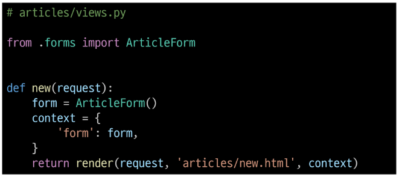
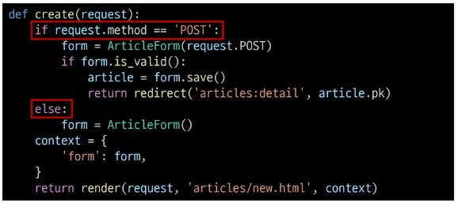

# Django Form
* HTML 'form'
    * 지금까지 사용자로부터 데이터를 받기위해 활용한 방법. 그러나 비정상적 혹은 악의적인 요청을 필터링 할 수 없음
    * 유효한 데이터인지에 대한 확인이 필요
* 유효성 검사
    * 수집한 데이터가 정확하고 유효한지 확인하는 과정
    * 유효성 검사 구현
        * 유효성 검사를 구현하기 위해서는 입력값, 형식, 중복, 범위, 보안 등 많은 것들을 고려해야 한다
        * 이런 과정과 기능을 직접 개발하는 것이 아닌 Django가 제공하는 Form 을 사용

## Form Class
* Django Form
    * 사용자 입력 데이터를 수집하고, 처리 및 유효성 검사를 수행하기 위한 도구
    * 유효성 검사를 단순화하고 자동화 할 수 있는 기능을 제공
* Form class 정의

    

* Form class를 적용한 변화

    

    

    

* Form rendering options : label, input 쌍을 특정 HTML 태그로 감싸는 옵션

    

    

    * [공식 문서 참조](https://docs.djangoproject.com/en/4.2/topics/forms/#form-rendering-options)

## Widgets
* HTML 'input' element의 '표현'을 담당
* Widget 사용
    * Widget은 단순히 input 요소의 속성 및 출력되는 부분을 변경하는 것

        
    
    * [공식 문서 참조](https://docs.djangoproject.com/ko/4.2/ref/forms/widgets/#built-in-widgets)

# Djnago ModelForm
* Form vs ModelForm
    * Form : 사용자 입력 데이터를 DB에 저장하지 않을 때 (ex.로그인)
    * ModelForm : 사용자 입력 데이터를 DB에 저장해야 할 때 (ex.게시글 작성, 회원가입)
* ModelForm
    * Model과 연결된 Form을 자동으로 생성해주는 기능을 제공
    * Form + Model
* ModelForm class 정의
    * 기존 ArticleForm class 수정
      * model = 어떤 모델과 연동?
      * fields = 그 모델에서 어떤 필드를 쓸지?

        

* Meta class
    * ModelForm의 정보를 작성하는 곳
    * 'fields'및 'exclude' 속성 : exclude 속성을 사용하여 모델에서 포함되지 않을 필드를 지정할 수도 있음

        

* ModelForm을 적용한 create 로직

    

    * 제목 input에 공백을 입력 후 에러 메세지 출력 확인 -> 유효성 검사의 결과

    

* `is_valid()`
    * 여러 유효성 검사를 실행하고, 데이터가 유효한지 여부를 boolean으로 반환
* 공백 데이터가 유효하지 않은 이유와 error message가 출력되는 과정
    * 별도로 명시하지 않았지만 모델 필드에서 기본적으로 빈 값은 허용되지 않는 제약조건이 설정되어 있다
    * 빈 값은 `is_valid()`에 의해 False로 평가되고 form객체에는 그에 맞는 error message가 포함되어 다음 코드로 진행된다.

        

* ModelForm을 적용한 edit 로직

    

* 유효성 검사를 적용한 update 로직

    

* `save()`
    * DB 객체를 만들고 저장
    * `save()` method가 생성과 수정을 구분하는 방법
        * 키워드 인자 instance 여부를 통해 생성할 지, 수정할 지를 결정

            

* Django Form 정리
    * 사용자로부터 데이터를 수집하고 처리하기 위한 강력하고 유연한 도구
    * HTML form의 생성, 데이터 유효성 검사 및 처리를 쉽게 할 수 있도록 도움

# Handling HTTP requests
## View 함수 구조 변화
* new & create view 함수간 공통점과 차이점
    * 공통점 : CRUD에서 둘다 C를 담당, 데이터 생성을 구현하기 위함
    * 차이점 : new는 GET method 요청만을, create는 POST method 요청만을 처리
* HTTP request method 차이점을 활용해 동일한 목적을 가지는 2개의 view 함수를 하나로 구조화
* new & create 함수 결합

    

* 새로운 create view 함수
    * new와 create view 함수의 공통점과 차이점을 기반으로 하나의 함수로 결합

        

    * 두 함수의 유일한 차이점이었던 request method에 따른 분기 (GET vs POST)

        
    
    * `requests method == POST`인 경우 과거 create 함수 구조였던 객체 생성 및 저장 로직 처리

        

    * `requests method != POST`인 경우 단순히 form instance생성 ( 절대 GET과 POST만 존재하는 것이 아니다 다른 request method도 존재)

        

    * form은 아래 두가지 중 하나로 context로 넘겨진다.
        1. `is_valid()`를 통과하지 못해 error message를 담은 form instance
        2. `else`문의 form instance

        

* new & create view함수를 결합함으로써 기존 new 관련 코드 수정
    1. 사용하지 않는 new url 제거

        

    2. new url을 create url로 변경

        

    3. new 템플릿을 create 템플릿으로 변경

        

* request method에 따른 요청의 변화

|request method|path|action|
|---|---|---|
|GET|articles/create/|게시글 생성 문서를 줘!|
|POST|articls/create/|게시글을 생성해줘!

* 새로운 update view 함수
    * 기존 edit과 update view 함수 결합

        

* 기존 edit 관련 코드 수정
    * 사용하지 않는 edit url 제거

        
    
    * edit 템플릿을 update 템플릿으로 변경

        

# 참고
* ModelForm 키워드 인자 data와 instance 살펴보기
    * ModelForm의 부모 클래스인 BaseModelForm의 생성자 함수 예시

        

    * [문서 참조](https://github.com/django/django/blob/main/django/forms/models.py#L343)
* Widget 응용
    * Meta class를 사용 : 일괄 적용

        

    * attribute를 이용하여 조건을 이용하여 개별 적용

        
* field를 수동으로 렌더링 하기

    

    * [공식 문서 참조](https://docs.djangoproject.com/en/4.2/topics/forms/#rendering-fields-manually)