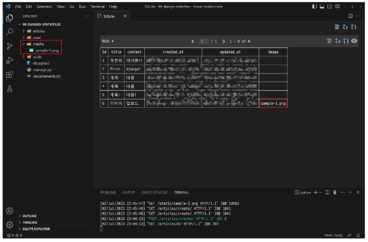

# Static files

## Static files
* Static files : 정적 파일
    * 서버 측에서 변경되지 않고 고정적으로 제공되는 파일 (이미지, JS, CSS 파일 등)
* 웹 서버와 정적 파일
    * 웹 서버의 기본동작은 **특정 위치(URL)에 있는 자원**을 요청(HTTP request) 받아서 응답(HTTP response)을 처리하고 제공하는 것
    * 이는 '자원에 접근 가능한 주소가 있다'라는 의미
    * 웹 서버는 요청 받은 URL로 서버에 존재하는 정적 자원을 제공함
        * **정적 파일을 제공하기 위한 경로(URL)**가 있어야 한다.

### static files 제공하기
1. 기본 경로에서 제공하기
    * Static files 기본 경로 : `app폴더/static/`
    * 기본 경로 static file 제공하기
        * `articles/static/articles/` 경로에 이미지 파일 배치

            

        * static tag를 사용해 이미지 파일에 대한 경로 제공

            

        * STATIC_URL 확인

            

            * STATIC_URL
                * 기본 경로 및 추가 경로에 위치한 정적 파일을 참조하기 위한 URL
                    * 실제 파일이나 디렉토리가 아니며, URL로만 존재
                * URL + STATIC_URL + 정적파일 경로
                    * `https://127.0.0.1:8000/static/articles/sample-1.png`

                

2. 추가 경로에서 제공하기
    * `STATICFILES_DIRS`에 문자열 값으로 추가 경로 설정
    * `STATICFILES_DIRS` : 정적 파일의 기본 경로 외에 추가적인 경로 목록을 정의하는 리스트
    * 추가 경로 static file 제공하기
        * 임의의 추가 경로 설정

            

        * 추가 경로에 이미지 파일 배치

            

        * static tag를 사용해 이미지 파일에 대한 경로 제공

            

        * 이미지를 제공받기 위해 요청하는 Request URL 확인

            

* 정적 파일을 제공하려면 요청에 응답하기 위한 **URL**이 필요


## Media files
* Media files
    * 사용자가 웹에서 업로드하는 정적 파일(user-uploaded)

### 이미지 업로드
* `ImageField()` : 이미지 업로드에 사용하는 모델 필드
    * 이미지 객체가 직접 저장되는 것이 아닌 **'이미지 파일의 경로'**가 문자열로 DB에 저장
* 미디어 파일 제공을 위한 사전 준비
    1. `settings.py`에 **MEDIA_ROOT**, **MEDIA_URL** 설정
        * `MEDIA_ROOT` : 실제 미디어 파일들이 위치하는 디렉토리의 절대 경로

            

        * `MEDIA_URL` : `MEDIA_ROOT`에서 제공되는 미디어 파일에 대한 주소를 생성(STATIC_URL과 동일한 역할)

            

    2. 작성한 **MEDIA_ROOT**와 **MEDIA_URL**에 대한 url 지정
        * 업로드 된 파일을 제공하는 URL == `settings.MEDIA_URL`
        * 위 URL을 통해 참조하는 파일의 실제 위치 == `settings.MEDIA_ROOT`

            
    * [공식 문서 참조](https://docs.djangoproject.com/en/4.2/howto/static-files/#serving-files-uploaded-by-a-user-during-development)

* 이미지 업로드
    * `blank=True`속성을 작성해 빈 문자열이 저장될 수 있도록 제약 조건 설정
        * 게시글 작성 시 이미지 없이 작성 가능하도록

            

            * 기존 필드 사이에 작성해도 실제 테이블 생성시에는 가장 우츠(뒤)에 추가된다.
    * migration 진행
        * `ImageField`를 사용하려면 반드시 Pillow 라이브러리가 필요

            ```python
            $ pip install Pillow

            $ python manage.py makemigrations
            $ python manage.py migrate

            $ pip freeze > requirements.txt
            ```

    * form 요소의 enctype 속성 추가

        

    * view 함수에서 업로드 파일에 대한 추가 코드 작성

        

    * 이미지 업로드 입력 양식 확인

        

    * 이미지 업로드 결과 확인(DB)
        * DB에는 파일 자체가 아닌 **파일 경로**가 저장

        

### 업로드 이미지 제공
* 업로드 이미지 제공하기
    * 'url'속성을 통해 업로드 파일의 경로 값을 얻을 수 있다
      * `article.image.url` : 업로드 파일의 경로
      * `article.image` : 업로드 파일의 파일 이름

        

    * 업로드 이미지 출력 확인 및 MEDIA_URL 확인

        

    * 이미지를 업로드 하지 않는 게시물은 detail template을 렌더링 할수 없음
    * 이미지 데이터가 있는 경우만 이미지를 출력할 수 있도록 처리

        

* 업로드 이미지 수정
    * 수정 페이지 form요소에 enctype 속성 추가

        

    * update view 함수에서 업로드 파일에 대한 추가 코드 작성

        


## 참고
* `upload_to` argument
    * `ImageField()`의 `upload_to` 인자를 사용해 미디어 파일 추가 경로 설정

        

    * `request.FILES`가 두번째 위치 인자인 이유
        * `ModelForm` 상위 클래스 `BaseModelForm`의 생성자 함수 키워드 인자 참고

            