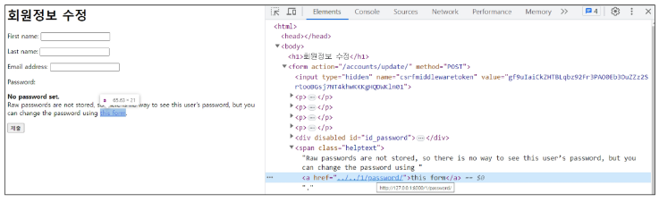

# Authentication System2
## 회원 가입
* 회원 가입 : User객체를 Create하는 과정
* `UserCreationForm()` : 회원 가입시 사용자 입력 데이터를 받는 built-in ModelForm
* 회원 가입 페이지 작성

    

    

* 회원 가입 로직

    

* 회원 가입 로직 error
    * 회원가입 진행 후 error page 확인

        

    * 회원가입에 사용하는 `UserCreationForm`이 기존 유저 모델로 인해 작성된 클래스이기 때문이다.
        * 대체한 유저 모델 변경 필요

            

        * [문서 참조](https://github.com/django/django/blob/main/django/contrib/auth/forms.py#L201)
    
    * 커스텀 유저 모델을 사용하려면 다시 작성해야 하는 Form
        * `UserCreationForm`, `UserChangeForm`
            * 두 Form 모두 `class Meta : model = User`가 작성된 Form

            

* `get_user_model()`
    * '현재 프로젝트에서 활성화된 사용자 모델(active user model)'을 반환하는 함수
* User모델을 직접 참조하지 않는 이유
    * `get_user_model()`을 사용해 User모델을 참조하면 커스텀 User 모델을 자동으로 반환해주기 때문
    * Django는 필수적으로 User클래스를 직접 참조하는 대신 `get_user_model()`을 사용해 참조해야 한다고 강조하고 있음
* 회원 가입 로직에 커스텀 form 사용

    


## 회원 탈퇴
* 회원 탈퇴 : User 객체를 Delete하는 과정
* 회원 탈퇴 로직 작성

    

    


## 회원정보 수정
* 회원정보 수정 : User 객체를 Update 하는 과정
* `UserChangeForm()` : 회원정보 수정 시 사용자 입력 데이터를 받는 built-in ModelForm
* 회원 정보 수정 페이지 작성

    

    

    

* `UserChangeForm` 사용 시 문제점
    * User 모델의 모든 정보들(fields)까지 모두 출력되어 수정이 가능하기 때문에 일반 사용자들이 접근해서는 안되는 정보는 출력하지 않도록 해야 함
        * `CustomUserChangeForm`에서 접근 가능한 필드를 다시 조정
            * [공식 문서 참조](https://docs.djangoproject.com/en/4.2/ref/contrib/auth/)

            

            

* 회원정보 수정 로직

    


## 비밀번호 변경
* 비밀번호 변경 : 인증된 사용자의 Session 데이터를 Update하는 과정
* `PasswordChangeForm()` : 비밀번호 변경 시 사용자 입력 데이터를 받는 built-in Form
* 비밀번호 변경 페이지 작성
    * django는 비밀번호 변경 페이지를 회원정보 수정 form에서 별도 주소로 안내
        * `/user_pk/password/`

        

        

        

* 비밀번호 변경 로직 작성

    

* 세션 무효화 방지하기
    * 암호 변경시 세션 무효화
        * 비밀번호가 변경되면 기존 세션과의 회원 인증 정보가 일치하지 않게되어 로그인 상태가 유지되지 못하고 로그아웃 처리됨
        * 비밀번호가 변경되면서 기존 세션과의 회원 인증 정보가 일치하지 않기 때문
* `update_session_auth_hash(request, user)` : 암호 변경 시 세션 무효화를 막아주는 함수
    * 암호가 변경되면 새로운 password의 Session Data로 기존 session을 자동으로 갱신
    * `update_session_auth_hash(request, user)` 적용

        


## 로그인 사용자에 대한 접근 제한
* 로그인 사용자에 대해 접근을 제한하는 2가지
    1. `is_authenticated`속성 (attribute)
        * 사용자가 인증 되었는지 여부를 알 수 있는 User model의 속성
            * 모든 User 인스턴스에 대해 항상 True인 읽기 전용 속성이며, 비인증 사용자에 대해서는 항상 False
        * 적용하는 방법
            * 로그인과 비로그인 상태에서 화면에 출력되는 링크를 다르게 설정하기

                

            * 인증된 사용자라면 로그인/회원가입 로직을 수행할 수 없도록 하기

                

    2. `login_required` 데코레이터 (decorator)
        * 인증된 사용자에 대해서만 view 함수를 실행시키는 데코레이터
            * 비인증 사용자의 경우 `/accounts/login/`주소로 redirect 시킨다.
        * 적용하는 방법
            * 인증된 사용자만 게시글을 작성/수정/삭제 할 수 있도록 수정

                

            * 인증된 사용자만 로그아웃/탈퇴/수정/비밀번호 변경 할 수 있도록 수정

                


## 참고
* `is_authenticated` 속성
    * [문서 참조](https://github.com/django/django/blob/main/django/contrib/auth/base_user.py#L85)

        ```python
        @property
        def is_authenticated(self) :
            """
            Always return True. This is a way to tell if the user has been authenticated in templates
            """
            return True
        ```
* 회원가입 후 로그인까지 이어서 진행하려면?

    

* 탈퇴와 함께 기존 사용자의 Session Date 삭제 방법
    * 사용자 객체 삭제 이후 로그아웃 함수 호출
    * 단, "탈퇴(1) 후 로그아웃(2)"의 순서가 바뀌면 안된다.
    * 먼저 로그아웃이 진행되면 해당 요청 객체 정보가 없어지기 때문에 탈퇴에 필요한 유저 정보 또한 없어지기 때문

        

* `PasswordChangeForm`의 인자 순서
    * `PasswordChangeForm`이 다른 Form과 달리 user 객체를 첫 번째 인자로 받는 이유는 부모 클래스인 `SetPasswordForm`의 생성자 함수 구성을 따르기 때문이다.
    * [문서 참조](https://github.com/django/django/blob/4.2/django/contrib/auth/forms.py#L378)
* auth built-in form 코드 참고
    * `UserCreationForm()`
        * [문서 참조](https://github.com/django/django/blob/4.2/django/contrib/auth/forms.py#L149)
    * `UserChangeForm()`
        * [문서 참조](https://github.com/django/django/blob/4.2/django/contrib/auth/forms.py#L170)
    * `PasswordChangeForm()`
        * [문서 참조](https://github.com/django/django/blob/4.2/django/contrib/auth/forms.py#L422)