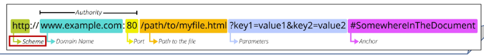

# REST API 1

## REST API
* API -  Application Programming Interface
    * 두 소프트웨어가 서로 통신할 수 있게 하는 메커니즘
    * 클라이언트-서버처럼 서로 다른 프로그램에서 요청과 응답을 받을 수 있도록 만든 체계
* API 예시

    

    * 기상 데이터가 들어있는 기상청의 시스템
    * 스마트 폰의 날씨 앱, 웹 사이트의 날씨 정보 등 다양한 서비스들이 이 기상청 시스템으로부터 데이터를 요청해서 받아 감
    * 날씨 데이터를 얻기 위해서는?
        * 기상청 시스템에는 정보들을 요청하는 지정된 형식이 있다.
        * 지역, 날짜, 조회할 내용들(온도, 바람 등)을 제공하는 메뉴얼
    * **"이렇게 요청을 보내면, 이렇게 정보를 제공 해줄 것이다"**라는 메뉴얼
        * 소프트웨어와 소프트웨어 간 지정된 정의(형식)으로 소통하는 수단 -> API
    * 스마트폰의 날씨 앱은 기상청에서 제공하는 API를 통해 기상청 시스템과 대화하여 매일 최신 날씨 정보를 표시할 수 있다.
* API 역할
    * 예를 들어 우리집 냉장고에 전기를 공급해야 한다고 가정해보자
    * 우리는 그냥 냉장고의 플러그를 소켓에 꽂으면 제품이 작동한다
    * 중요한 것은 우리가 가전 제품에 "전기를 공급하기 위해 직접 배선을 하지 않았다"는 것
    * 이는 매우 위험하면서도 비효율적인 일이기 때문
        * 복잡한 코드를 추상화하여 대신 사용할 수 있는 몇가지 더 쉬운 구문을 제공
* Web API
    * 웹서버 또는 웹 브라우저를 위한 API
    * 현대 웹 개발은 하나부터 열까지 직접 개발하기보다 여러 Open API들을 활용하는 추세
    * 대표적인 Third Party Open API 서비스 목록
        - Youtube API
        - Google Map API
        - Naver Papago API
        - Kakao Map API
* REST - Representational State Transfer
    * API Server를 개발하기 위한 일종의 소프트웨어 설계 "방법론"
        * 모두가 API Server를 설계하는 구조가 다르니 이렇게 맞춰서 설계하는 게 어때? -> "규칙 X"
* RESTful API
    * REST 원리를 따르는 시스템을 RESTful 하다고 부른다.
    * **"자원을 정의"**하고 **"자원에 대한 주소를 지정"**하는 전반적인 방법을 서술
    * 각각 API 서버 구조를 작성하는 모습이 너무 다르니 어느정도 약속을 만들어서 다같이 API 서버를 구성하자
* REST API
    * REST라는 설계 디자인 약속을 지켜 구현한 API
    * 예시

        

* REST에서 자원을 사용하는 법 3가지
    1. 자원의 "식별"
        * URI
    2. 자원의 "행위"
        * HTTP Methods
    3. 자원의 "표현"
        * JSON 데이터
        * 궁극적으로 표현되는 데이터 결과물

### 자원의 식별
* URI - Uniform Resource Identifier (통합 자원 식별자)
    * 인터넷에섯 리소스(자원)를 식별하는 문자열
        * 가장 일반적인 URI는 웹 주소로 알려진 URL
* URL - Uniform Resource Locator (통합 자원 위치)
    * 웹에서 주어진 리소스의 주소
        * 네트워크 상에 리소스가 어디 있는지를 알려주기 위한 약속

            

* Schema (or Protocol)
    * 브라우저가 리소스를 요청하는데 사용해야 하는 규약
    * URL의 첫 부분은 브라우저가 어떤 규약을 사용하는지를 나타냄
    * 기본적으로 웹은 http(s)를 요구하며 메일을 열기위한 mailto:, 파일을 전송하기 위한 ftp: 등 다른 프로토콜도 존재

        

* Domain Name
    * 요청 중인 웹 서버를 나타냄
    * 어떤 웹 서버가 요구되는 지를 가리키며 직접 IP 주소를 사용하는 것도 가능하지만, 사람이 외우기 어렵기 때문에 주로 Domain Name으로 사용
    * 예를 들어 도메인 google.com의 IP 주소는 142.251.42.142

        

* Port
    * 웹 서버 리소스에 접근하는데 사용되는 기술적인 문(Gate)
    * HTTP 프로토콜의 표준 포트
        * HTTP-80
        * HTTPS-443
    * 표준 포트만 작성 시 생략 가능

        

* Path
    * 웹 서버의 리소스 경로
    * 초기에는 실제 파일이 위치한 물리적 위치를 나타냈지만, 오늘날은 실제 위치가 아닌 추상화된 형태의 구조를 표현
    * 예를 들어 /articles/create/라는 주소가 실제 articles 폴더 안에 create 폴더안을 나타내는 것은 아님

        

* Parameters
    * 웹 서버에 제공하는 추가적인 데이터
    * '&' 기호로 구분되는 key-value 쌍 목록
    * 서버는 리소스를 응답하기 전에 이러한 파라미터를 사용하여 추가 작업을 수행할 수 있음

        

* Anchor
    * 일종의 "북마크"를 나타내며 브라우저에 해당 지점에 있는 콘텐츠를 표시
    * fragment identifier(부분 식별자)라고 부르는 '#' 이후 부분은 서버에 전송되지 않음
    * [공식문서](https://docs.djangoproject.com/en/4.2/intro/install/#quick-install-guide) 요청에서 #quick-install-guide는 서버에 전달되지 않고 브라우저에게 해당 지점으로 이동할수 있도록 한다.

        


### 자원의 행위
* HTTP Request Methods
    * 리소스에 대한 행위(수행하고자 하는 동작)를 정의
        * HTTP verbs 라고도 한다.
* 대표적인 HTTP Request Methods
    1. `GET`
        * 서버에 리소스이 표현을 요청
        * GET을 사용하는 요청은 데이터만 검색해야 한다.
    2. `POST`
        * 데이터를 지정된 리소스에 제출
        * 서버의 상태를 변경
    3. `PUT`
        * 요청한 주소의 리소스를 수정
    4. `DELETE`
        * 지정된 리소스를 삭제
* HTTP response status codes
    * 특정 HTTP 요청이 성공적으로 완료 되었는지 여부를 나타냄
    * 5개의 응답 그룹
        - Informational responses (100-199)
        - Successful responses (200-299)
        - Redirection responses (300-399)
        - Client error responses (400-499)
        - Server error responses (500-599)

### 자원의 표현
* 그동안 서버가 응답(자원을 표현)했던 것
    * 지금까지 Django 서버는 사용자에게 페이지(html)만 응답하고 있었음
    * 하지만 서버가 응답할 수 있는 것은 페이지 뿐만 아니라 다양한 데이터 타입을 응답할 수 있음
    * REST API는 이 중에서도 **JSON** 타입으로 응답하는 것을 권장
* 응답 데이터 타입의 변화
    1. 페이지(html)만을 응답했던 서버

        

    2. 이제는 JSON 데이터를 응답하는 REST API 서버로의 변환

        

    3. Django는 더 이상 Template부분에 대한 역할을 담당하지 않게 되며, 본격적으로 Front-end와 Back-end가 분리되어 구성 됨

        

    4. 이제부터 Django를 사용해 RESTful API 서버를 구축할 것

        

* 사전 준비
    * 가상 환경 생성, 활성화 및 패키지 설치
    * migrate 진행
    * 준비된 fixtures 파일을 load하여 초기 데이터 입력
        ```
        $ python manage.py loaddata articles.json
        ```
    * [페이지](http://127.0.0.1:8000/api/v1/articles/) 요청 테스트

        

* python으로 json 응답 받기
    * 제공된 python-request-sample.py 확인

        


## DRF with Single Model

### DRF
* DRF - Django REST framework
    * Django에서 Restful API 서버를 쉽게 구축할 수 있도록 도와주는 오픈소스 라이브러리
* 프로젝트 준비
    * 사전 제공된 DRF 프로젝트 기반 시작
    1. 가상환경 생성, 활성화 및 패키지 설치
    2. migrate 진행
    3. 준비된 fixtures 파일을 load 하여 초기 데이터 입력
        ```
        $ python manage.py loaddata articles.json
        ```
* Postman
    * Postman 설치
        * [Postman 설치](https://www.postman.com/downloads/)
        * Workspaces - My workspace

            
    * Postman
        * API를 구축하고 사용하기 위한 플랫폼
        * API를 빠르게 만들 수 있느 ㄴ여러 도구 및 기능을 제공
    * Postman 화면 구성

        

* URL과 HTTP requests methods 설계

||GET|POST|PUT|DELETE|
|:---:|:---:|:---:|:---:|:---:|
|articles/|전체 글 조회|글 작성|||
|articles/1/|1번글 조회||1번 글 수정|1번 글 삭제|


### GET
* Serialization - 직렬화
    * 여러 시스템에서 활용하기 위해 데이터 구조나 객체 상태를 나중에 재구성할 수 있는 포맷으로 변환하는 과정
    * 예시
        * 데이터 구조나 객체 상태를 나중에 재구성할 수 있는 포맷으로 변환하는 과정

            

            

    * 어떠한 언어나 환경에서도 나중에 다시 쉽게 사용할 수 있는 포맷으로 변환하는 과정

        

* Serializer
    * Serialization을 진행하여 Serialized data를 반환해주는 클래스
* ModelSerializer
    * Django 모델과 연결된 Serializer 클래스
        * 일반 Serializer와 달리 사용자 입력 데이터를 받아 자동으로 모델 필드에 맞추어 Serialization을 진행
* GET - List
    * 게시글 데이터 목록 조회하기
    * 게시글 데이터 목록을 제공하는 `ArticleListSerializer` 정의

        

    * url 및 view 함수 작성

        

    * 응답 확인

        

* ModelSerializer의 인자 및 속성

    

    * many 옵션
        * Serialize대상이 QuerySet인 경우 입력
    * data 속성
        * Serialized data 객체에서 실제 데이터를 추출

* 과거 view 함수와의 비교
    * 똑같은 데이터를 HTML에 출력되도록 페이지와 함께 응답했던 과거의 view함수, JSON 데이터로 serialization하여 페이지 없이 응답하는 현재의 view 함수

        

* `api_view` decorator
    * DRF view 함수에서는 **필수로 작성**되며 view함수를 실행하기 전 HTTP 메서드를 확인
    * 기본적으로 GET 메서드만 허용되며 다른 메서드 요청에 대해서는 405 Method Not Allowed로 응답
    * DRF view 함수가 응답해야 하는 HTTP 메서드 목록을 작성
* GET - Detail
    * 단일 게시글 데이터 조회하기
        * 각 게시글의 상세 정보를 제공하는 `ArticleSerializer` 정의

        

    * url 및 view 함수 작성

        

    * 응답 확인

        


### POST
* 게시글 데이터 생성하기
    1. 데이터 생성이 성공했을 경우 201 Created 응답
    2. 데이터 생성이 실패 했을 경우 400 Bad request 응답
* article_list view 함수 구조 변경 (method에 따른 분기처리)

    

* POST 응답 확인

    

* 새로 생성된 게시글 데이터 확인

    


### DELETE
* 게시글 데이터 삭제하기
    * 요청에 대한 데이터 삭제가 성공했을 경우는 204 No Content 응답

        

    * delete 응답 확인

        


### PUT
* 게시글 데이터 수정하기
    * 요청에 대한 데이터 수정이 성공했을 경우는 200 0K 응답

        

    * PUT 응답 확인

        

    * GET 수정된 데이터 확인

        

* `particial` argument
    * 부분 업데이트를 허용하기 위한 인자
    * 예를 들어 particial 인자 값이 False인 경우 게시글 title만을 수정하려고 해도 반드시 content 값도 요청시 함께 전송해야 함
    * 기본적으로 serializer는 모든 필수 필드에 대한 값을 전달 받기 때문
        * 즉, 수정하지 않는 다른 필드 데이터도 모두 전송해야 하며 그렇지 않으면 유효성 검사에서 오류가 발생

        


## 참고
* `raise_exception`
    * `is_valid()`의 선택 인자
    * 유효성 검사를 통과하지 못할 경우 `ValidationError` 예외를 발생시킨다.
    * DRF에서 제공하는 기본 예외 처리기에 의해 자동으로 처리되며 기본적으로 HTTP 400 응답을 반환

        