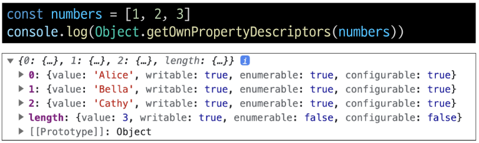

# Reference Type

## 함수
* Function : 참조 자료형에 속하며 모든 함수는 Function object
    * 참조 자료형(Reference type)
        * Objects(객체) : Object(객체가 아닌 type), Array, Function
        * 객체의 주소가 저장되는 자료형 : 가변, 주소가 복사

### 함수 정의
* 함수 구조
    ```js
    function name ([param[, param, [..., param]]]) {
        statements
        return value
    }
    ```
    * function 키워드
    * 함수의 이름
    * 함수의 매개변수
    * 함수의 body를 구성하는 statements
    * return 값이 없다면 undefined를 반환
* 함수 정의 2가지 방법
    * 선언식(function declaration)
        ```js
        function funcName () {
            statements
        }
        ```
        ```js
        function add (num1, num2) {
            return num1 + num2
        }

        add(1, 2) // 3
        ```
    * 표현식(function expression)
        ```js
        const  funcName = function () {
            statements
        }
        ```
        ```js
        const sub = function (num1, num2) {
            return num1 - num2
        }

        sub(2, 1) // 1
        ```
* 함수 표현식 특징
    * 함수 이름이 없는 '익명 함수'를 사용할 수 있음
    * 선언식과 달리 표현식으로 정의한 함수는 호이스팅 되지 않으므로 함수를 정의하기 전에 먼저 사용할 수 없음
        ```js
        // 선언식
        add(1, 2) // 3

        function add (num1, num2) {
            return num1 + num2
        }
        ```
        ```js
        // 표현식
        sub(2, 1)
        // ReferenceError: Cannot access 'sub' before initialization

        const sub = function (num1, num2) {
            return num1 - num2
        }
        ```
* 함수 선언식과 표현식 종합

||선언식|표현식|
|:---:|:---:|:---:|
|특징|익명 함수 사용 불가능<br> 호이스팅 있음|익명 함수 사용 가능<br> 호이스팅 없음|
|기타||사용 권장|

### 매개변수
* 매개변수 정의 방법
    1. 기본 함수 매개변수 (Default function parameter)
        * 전달하는 인자가 없거나 undefined가 전달될 경우 이름 붙은 매개변수를 기본값으로 초기화
            ```js
            const greeting = function (name = 'Anonymous') {
                return `Hi ${name}`
            }

            greeting() // Hi Anonymous
            ```
    2. 나머지 매개변수 (Rest parameters)
        * 임의의 수의 인자를 '배열'로 허용하여 가변 인자를 나타내는 방법
        * 작성 규칙
            - 함수 정의 시 나머지 매개변수는 하나만 작성할 수 있음
            - 나머지 매개변수는 함수 정의에서 매개변수 마지막에 위치해야 함
                ```js
                const myFunc = function (param1, param2, ...restPrams) {
                    return [param1, param2, restPrams]
                }

                myFunc(1, 2, 3, 4, 5) // [1, 2, [3, 4, 5]]
                myFunc(1, 2) // [1, 2, []]
        * 매개변수와 인자 개수가 불일치 할 때
            * 매개변수 개수 > 인자 개수
            * 누락된 인자는 undefined로 할당
                ```js
                const threeArgs = function (param1, param2, param3) {
                    return [param1, param2, param3]
                }

                threeArgs() // [undefined, undefined, undefined]
                threeArgs(1) // [1, undefined, undefined]
                threeArgs(2, 3) // [2, 3, undefined]
            * 매개변수 개수 < 인자 개수
            * 초과 입력한 인자는 사용하지 않음
                ```js
                const noArgs = function () {
                    return 0
                }
                noArgs(1, 2, 3) // 0

                const twoArgs = function (param1, param2) {
                    return [param1, param2]
                }
                twoArgs(1, 2, 3) // [1, 2]
                ```

### Spread syntax
* '...' : Spread syntax(전개 구문)
* 전개 구문
    * 배열이나 문자열과 같이 반복 가능한 항목을 펼치는 것(확장, 전개)
    * 전개 대상에 따라 역할이 다름
        * 배열이나 객체의 요소를 개별적인 값으로 분리하거나 다른 배열이나 객체의 요소를 현재 배열이나 객체에 추가하는 등
* 전개 구문 활용처
    1. 함수와의 사용
        1. 함수 호출 시 인자 확장
            ```js
            // spread-syntax
            function myFunc(x, y, z) {
                return x + y + z
            }

            let numbers = [1, 2, 3]
            console.log(myFunc(...numbers)) // 6
        2. 나머지 매개변수(압축)
            ```js
            // spread-syntax
            function myFunc2(x, y, ...restArgs) {
                return [x, y, restArgs]
            }

            console.log(myFunc2(1, 2, 3, 4, 5)) // [1, 2, [3, 4, 5]]
            console.log(myFunc2(1, 2)) // [1, 2, []]
            ```
    2. 객체와의 사용 (객체 파트에서 진행)
    3. 배열과의 활용 (배열 파트에서 진행)

### 화살표 함수
* 화살표 함수 표현식(Arrow function expressions)
    * 함수 표현식의 간결한 표현법
* 화살표 함수 작성 결과
    ```js
    // before
    const arrow = function (name) {
        return `hello, ${name}`
    }

    //after
    const arrow = name => `hello, ${name}`
    ```
* 화살표 함수 작성 과정
    1. function 키워드 제거 후 매개변수와 중괄호 사이에 화살표(=>) 작성
        ```js
        const arrow1 = function (name) {
            return `hello, ${name}`
        }

        // 1. function 키워드 삭제 후 화살표 작성
        const arrow2 = (name) => { return `hello, ${name}`}
        ```
    2. 함수의 매개변수가 하나 뿐이라면, 매개변수의 `()` 제거 가능(단, 생략하지 않는 것을 권장)
        ```js
        const arrow1 = function (name) {
            return `hello, ${name}`
        }

        // 1. function 키워드 삭제 후 화살표 작성
        const arrow2 = (name) => { return `hello, ${name}`}

        // 2. 인자가 1개일 경우에만 ()생략 가능
        const arrow2 = name => { return `hello, ${name}`}
        ```
    3. 함수 본문의 표현식이 한줄이라면, `{}`와 `return`제거 가능
        ```js
        const arrow1 = function (name) {
            return `hello, ${name}`
        }

        // 1. function 키워드 삭제 후 화살표 작성
        const arrow2 = (name) => { return `hello, ${name}`}

        // 2. 인자가 1개일 경우에만 ()생략 가능
        const arrow2 = name => { return `hello, ${name}`}

        // 3. 함수 본문이 return을 포함한 표현식이 1개일 경우에 {} & return 삭제 가능
        const arrow3 = name => `hello, ${name}`
        ```

### 화살표 함수 심화
```js
// 1. 인자가 없다면 () or _ 로 표시 가능
const noArgs1 = () => 'No args'
const noArgs1 = _ => 'No args'

// 2-1. object를 return 한다면 return을 명시적으로 작성해야 함
const returnObject1 = () => { return { key:'value'} }

// 2-2. return을 작성하지 않으려면 객체를 소괄호로 감싸야 함
const returnObject2 = () => ({ key: 'value' })
```


## 객체
* Object
    * 키로 구분된 데이터 집합(data collection)을 저장하는 자료형

### 구조 및 속성
* 객체 구조
    * 중괄호(`{}`)를 이용해 작성
    * 중괄호 안에는 `key:value`쌍으로 구성된 속성(property)를 여러 개 작성 가능
    * key는 문자형만 허용
    * value는 모든 자료형 허용
        ```js
        const user = {
            name : 'Alice',
            'key with space' : true,
            greeting : function() {
                return 'hello'
            }
        }
* 속성 참조
    * 점(`.`, chaining perator) 또는 대괄호(`[]`)로 객체 요소 접근
    * key 이름에 띄어쓰기 같은 구분자가 있으면 대괄호 접근만 가능
        ```js
        const user = {
            name : 'Alice',
            'key with space' : true,
            greeting : function() {
                return 'hello'
            }
        }

        // 조회
        console.log(user.name) // Alice
        console.log(user['key with space']) // true

        // 추가
        user.address = 'korea'
        console.log(user) // {name: 'Alice', 'key with space': true, address: 'korea', greeting: f}
        
        // 수정
        user.name = 'Bella'
        console.log(user.name) // Bella

        // 삭제
        delete user.name
        console.log(user) // {'key with space': true, address: 'korea', greeting: f}
        ```
* `in`연산자
    * 속성이 객체에 존재하는지 여부를 확인
        ```js
        const user = {
            name : 'Alice',
            'key with space' : true,
            greeting : function() {
                return 'hello'
            }
        }

        console.log('greeting' in user) // true
        console.log('country' in user) // true
        ```

### 객체와 함수
* Method
    * 객체 속성에 정의된 함수
    * 예시
        * `object.method()` 방식으로 호출
        * 메서드는 객체를 '행동'할 수 있게 함
            ```js
            const user = {
            name : 'Alice',
            'key with space' : true,
            greeting : function() {
                return 'hello'
                }
            }

            console.log(user.greeting()) // hello
            ```

### this
* Method : 객체 속성에 정의된 함수
    * `this`키워드를 사용해 객체에 대한 특정한 작업을 수행 할 수 있음
* 'this' keyword
    * 함수나 메서드를 호출한 객체를 가리키는 키워드
    * 함수 내에서 객체의 속성 및 메서드에 접근하기 위해 사용
* 예시
    ```js
    // this-keyword

    const person = {
        name : 'Alice',
        greeting : function () {
            return `Hello my name is ${this.name}`
        }
    }

    console.log(person.greeting()) // Hello my name is Alice
    ```
* JavaScript에서 this는 함수를 **호출하는 방법**에 따라 가리키는 대상이 다름

|호출 방법|대상|
|:---:|:---:|
|단순 호출|전역 객체|
|메서드 호출|메서드를 호출한 객체|

* this 호출
    1. 단순 호출 시 this
        * 가리키는 대상 => 전역 객체
            ```js
            const myFunc = function () {
                return this
            }

            console.log(myFunc()) // window
            ```
    2. 메서드 호출시 this
        * 가리키는 대상 => 메서드를 호출한 객체
            ```js
            const myObj = {
                data: 1, 
                myFunc: function () {
                    return this
                }
            }

            console.log(myObj.myFunc()) // myObj
            ```
* 중첩된 함수에서의 this 문제점과 해결책
    ```js
    // before
    const myObj2 = {
        numbers: [1, 2, 3],
        myFunc: function () {
            this.numbers.forEach(function (number) {
                console.log(this) // window
            })
        }
    }

    console.log(myObj2.myFunc())
    // forEach의 인자로 작성된 함수는 일반적인 함수 호출이기 때문에 this가 전역 객체를 가리킴

    // after
    const myObj3 = {
        numbers: [1, 2, 3],
        myFunc: function () {
            this.numbers.forEach((number) => {
                console.log(this) // myObj3
            })
        }
    }

    console.log(myObj3.myFunc())
    // 화살표 함수는 자신만의 this를 가지지 않기 때문에 외부 함수(myFunc)에서의 this 값을 가져옴
    ```
* JavaScript 'this' 정리
    * JavaScript의 함수는 호출될 때 this를 암묵적으로 전달 받음
    * JavaScript에서 this는 함수가 "호출되는 방식"에 따라 결정되는 현재 객체를 나타냄
    * python의 self와 Java의 this가 선언 시 이미 값이 정해지는 것에 비해 JavaScript의 this는 **함수가 호출되기 전까지 값이 할당되지 않고 호출 시에 결정**됨 (동적 할당)
    * this가 미리 정해지지 않고 호출 방식에 의해 결정되는 것은
        * 장점 : 함수(메서드)를 하나만 만들어 여러 객체에서 재사용할 수 있다는것
        * 단점 : 이런 유연함이 실수로 이어질 수 있다는 것
    * 개발자는 this의 동작 방식을 충분히 이해하고 장점을 취하면서 실수를 피하는 데에 집중


### 추가 객체 문법
1. 단축 속성
    * 키 이름과 값으로 쓰이는 변수의 이름이 같은 경우 단축 구문을 사용할 수 있음
        ```js
        // before
        const name = 'Alice'
        const age = 30

        const user = {
            name: name,
            age: age,
        }
        ```
        ```js
        // after
        const name = 'Alice'
        const age = 30
        const user = {
            name,
            age,
        }
        ```
2. 단축 메서드
    * 메서드 선언 시 function 키워드 생략 가능
        ```js
        // before
        const myObj1 = {
            myFunc: function () {
                return 'Hello'
            }
        }
        ```
        ```js
        // after
        const myObj2 = {
            myFunc() {
                return 'Hello'
            }
        }
        ```
3. 계산된 속성 (computed property name)
    * 키가 대괄호([])로 둘러싸여 있는 속성
    * 고정된 값이 아닌 변수 값을 사용할 수 있음
        ```js
        const product = prompt('물건 이름을 입력해주세요')
        const prefix = 'my'
        const suffix = 'property'

        const bag = {
            [product]: 5,
            [prefix + suffix]: 'value',
        }

        console.log(bag) // {연필: 5, myproperty: 'value'}
        ```
4. 구조 분해 할당 (destructing assignment)
    * 배열 또는 객체를 분해하여 객체 속성을 변수에 쉽게 할당할 수 있는 문법
        ```js
        // before
        const userInfo = {
            firstName: 'Alice',
            userId: 'alice123',
            email: 'alice123@gmail.com'
        }

        const firstName = userInfo.name
        const userId = userInfo.userId
        const email = userInfo.email
        ```
        ```js
        // after
        const userInfo = {
            firstName: 'Alice',
            userId: 'alice123',
            email: 'alice123@gmail.com'
        }

        const {firstName} = userInfo
        const {firstName, userId} = userInfo
        const {firstName, userId, email} = userInfo

        console.log(firstName, userId, email)
        // Alice alice123 alice123@gmail.com
        ```
    * '함수의 매개변수'로 객체 구조 분해 할당 활용 가능
        ```js
        const person = {
            name: 'Bob',
            age: 35,
            city: 'London',
        }

        function printInfo({ name, age, city }) {
            console.log(`이름: ${name}, 나이: ${age}, 도시: ${city}`)
        }

        // 함수 호출 시 객체를 구조 분해하여 함수의 매개변수로 전달
        printInfo(person) // 이름: Bob, 나이: 35, 도시: London
        ```
5. Object with '전개 구문'
    * "객체 복사" - 객체 내부에서 객체 전개
    * 얕은 복사에 활용 가능
        ```js
        const obj = {b: 2, c: 3, d: 4}
        const newObj = {a: 1, ...obj, e: 5}

        console.log(newObj) // {a: 1, b: 2, c: 3, d: 4, e: 5}
        ```
6. 유용한 객체 메서드
    * `Object.keys()`
    * `object.values()`
        ```js
        const profile = {
            name : 'Alice',
            age : 30,
        }

        console.log(Object.keys(profile)) // ['name', 'age']

        console.log(Object.values(profile)) // ['Alice', 30]
        ```
7. Optional chaining('?.')
    * 만약 Optional chaining을 사용하지 않는다면 다음과 같이 `&&` 연산자를 사용해야 한다.
        ```js
        const user = {
            name: 'Alice',
            greeting: function () {
                return 'hello'
            }
        }

        console.log(user.address && user.address.street) // undefined
        ```
    * 장점
        * 참조가 누락될 가능성이 있는 경우 연결된 속성으로 접근할 때 더 짧고 간단한 표현식을 작성할 수 있음
        * 어떤 속성이 필요한지에 대한 보증이 확실하지 않은 경우에 객체의 내용을 보다 편리하게 탐색할 수 있음
    * 주의 사항
        1. Optional chaining은 존재하지 않아도 괜찮은 대상에만 사용해야 한다. (남용 X)
            - 왼쪽 평가대상이 없어도 괜찮은 경우에만 선택적으로 사용
            - 중첩 객체를 에러 없이 접근하는 것이 사용 목적이기 때문
            ```js
            // 이전 예시 코드에서 user 객체는 논리상 반드시 있어야 하지만 address는 필수 값이 아님
            // user에 값을 할당하지 않은 문제가 있을 때 바로 알아낼 수 있어야 하기 때문

            // Bad
            user?.address?.street

            // Good
            user.address?.street
            ```
        2. Optional chaining 앞의 변수는 반드시 선언되어 있어야 한다.
            ```js
            console.log(myObj?.address) // Uncaught ReferenceError: myObj is not defined
            ```
    * 정리
        1. `obj?.prop`
            * obj가 존재하면 obj.prop를 반환하고, 그렇지 않으면 undefined를 반환
        2. `obj?.[prop]`
            * obj가 존재하면 obj[prop]를 반환하고, 그렇지 않으면 undefined를 반환
        3. `obj?.method()`
            *  obj가 존재하면 obj.method()를 호출하고, 그렇지 않으면 undefined를 반환

### JSON
* JSON
    * "JavaScript Object Notation"
    * Key-Value 형태로 이루어진 자료 표기법
    * JavaScript의 Object와 유사한 구조를 가지고 있지만 JSON은 형식이 있는 **"문자열"**
    * JavaScript에서 JSON을 사용하기 위해서는 Object 자료형으로 변경해야 함
* Object <-> JSON 변환하기
    ```js
    const jsObject = {
        coffee: 'Americano',
        iceCream: 'Cookie and cream',
    }
    ```
    ```js
    // Object -> JSON
    const objToJson = JSON.stringify(jsObject)
    console.log(objToJson) // {coffee: 'Americano', iceCream: 'Cookie and cream'}
    console.log(typeof objToJson) // string
    ```
    ```js
    // JSON -> Object
    const JsonToObj = JSON.parse(objToJson)
    console.log(JsonToObj) // {coffee: 'Americano', iceCream: 'Cookie and cream'}
    console.log(typeof JsonToObj) // object
    ```

### new 연산자
* JS에서 객체를 하나 생성한다고 한다면 하나의 객체를 선언하여 생성
    ```js
    const member = {
        name: 'Alice',
        age: 22,
        sId: 20240417,
    }
    ```
* 동일한 형태의 객체를 또 만들려면 또 다른 객체를 선언하여 생성해야 한다 -> 불편함
    ```js
    const member = {
        name: 'Bella',
        age: 20,
        sId: 20240418,
    }
    ```
* `new`연산자 예시
    ```js
    function Member(name, age, sId) {
        this.name = name
        this.age = age
        this.sId = sId
    }

    const member3 = new Member('Bella', 21, 20240418)

    console.log(member3) // Member { name: 'Bella', age: 21, sId: 20240418 }
    console.log(member3.name) // Bella
    ```
* `new constructor[([arguments])]`
    * 사용자 정의 객체 타입을 생성
    * 매개변수
        - constructor : 객체 인스턴스의 타입을 기술(명세)하는 함수
        - arguments : constructor와 함께 호출될 값 목록


## 배열
* Object
    * 키로 구분된 데이터 집합(data collection)을 저장하는 자료형
    * 이제는 **순서가 있는 collection**이 필요
* Array
    * 순서가 있는 데이터 집합을 저장하는 자료 구조
* 배열 구조
    * 대괄호('[]')를 이용해 작성
    * 요소 자료형 : 제약 없음
    * length속성을 사용해 배열에 담긴 요소가 몇 개인지 알 수 있음
        ```js
        const names = ['Alice', 'Bella', 'Cathy']

        console.log(name[0]) // Alice
        console.log(name[1]) // Bella
        console.log(name[2]) // Cathy

        console.log(names.length) // 3
        ```

### 배열 메서드
* 주요 메서드

|메서드|역할|
|:---:|:---:|
|push / pop|배열 끝 요소를 추가/제거|
|unshift / shift|배열 앞 요소를 추가/제거|

* `push()`
    * 배열 끝에 요소를 추가
        ```js
        const names = ['Alice', 'Bella', 'Cathy']

        names.push('Dan')
        console.log(names) // ['Alice', 'Bella', 'Cathy', 'Dan']
        ```
* `pop()`
    * 배열 끝 요소를 제거하고, 제거한 요소를 반환
        ```js
        const names = ['Alice', 'Bella', 'Cathy', 'Dan']

        console.log(names.pop()) // Dan
        console.log(names) // ['Alice', 'Bella', 'Cathy']
        ```
* `unshift()`
    * 배열 앞에 요소를 추가
        ```js
        names.unshift('Eric')
        console.log(names) // ['Eric', 'Alice', 'Bella', 'Cathy']
        ```
* `shift()`
    * 배열 앞 요소를 제거하고, 제거한 요소를 반환
        ```js
        console.log(names.shift()) // Eric
        console.log(names) // ['Alice', 'Bella', 'Cathy']
        ```

### Array Helper Method
* Array Helper Method
    * 배열 조작을 보다 쉽게 수행할 수 있는 특별한 메서드 모음
    *  ES6에 도입
    * 배열의 각 요소를 **순회**하며 각 요소에 대해 함수(**콜백함수**)를 호출
        * `forEach()`, `map()`, `filter()`, `every()`, `some()`, `reduce()` 등
        * 메서드 호출 시 인자로 함수(**콜백함수**)를 받는 것이 특징
* 콜백 함수(Callback function)
    * 다른 함수에 인자로 전달되는 함수
    * 외부 함수 내에서 호출되어 일종의 루틴이나 특정 작업을 진행
        ```js
        const numbers1 = [1, 2, 3]

        numbers1.forEach(function (num) {
            console.log(num ** 2)
        })

        // 1
        // 4
        // 9
        ```
        ```js
        const numbers2 = [1, 2, 3]
        const callBackFunction = function (num) {
            console.log(num ** 2)
        }

        numbers2.forEach(callBackFunction)

        // 1
        // 4
        // 9
        ```
* 주요 Array Helper Methods

|메서드|역할|
|:---:|---|
|`forEach`|* 배열 내의 모든 요소 각각에 대해 함수(콜백함수)를 호출<br>* 반환 값 없음|
|`map`|* 배열 내의 모든 요소 각각에 대해 함수(콜백함수)를 호출<br>* 함수 호출 결과를 모아 새로운 배열을 반환|

* `forEach()`
    * 배열의 각 요소를 반복하며 모든 요소애 대해 함수(콜백 함수)를 호출
    * 구조
        ```js
        arr.forEach(callback(item[, index[, array]]))
        ```
        ```js
        array.forEach(function (item, index, array) {
            // do something
        })
        ```
        * 콜백함수는 3가지 매개변수로 구성
            1. item : 처리할 배열의 요소
            2. index : 처리할 배열 요소의 인덱스 (선택 인자)
            3. array : forEach를 호출한 배열 (선택 인자)
        * 반환 값
            - undefined
    * 예시
        ```js
        const names = ['Alice', 'Bella', 'Cathy']

        // 일반 함수 표기
        names.forEach(function (name) {
            console.log(name)
        })

        // 화살표 함수 표기
        names.forEach((name) => {
            console.log(name)
        })

        // 두 경우 모두 동일하게 출력
        // Alice
        // Bella
        // Cathy
        ```
    * 활용
        ```js
        const names = ['Alice', 'Bella', 'Cathy']

        names.forEach(function (name, index, array) {
            console.log(`${name} / ${index} / ${array}`)
        })

        // Alice / 0 / Alice, Bella, Cathy
        // Bella / 0 / Alice, Bella, Cathy
        // Cathy / 0 / Alice, Bella, Cathy
        ```
* `map()`
    * 배열의 모든 요소에 대해 함수(콜백 함수)를 호출하고, 반환 된 호출 결과 값을 모아 **새로운 배열을 반환**
    * 구조
        ```js
        arr.map(callback(item[, index[, array]]))
        ```
        ```js
        const newArr = array.map(function (item, index, array) {
            // do something
        })
        ```
        * forEach의 매개 변수와 동일
        * 반환 값
            - 배열의 각 요소에 대해 실행한 "callback의 결과를 모은 새로운 배열"
            - forEach 동작 원리와 같지만 forEach와 달리 새로운 배열을 반환함
    * 예시
        * 배열을 순회하며 각 객체의 name 속성 값을 추출하기 (`for of`와 비교)
        ```js
        const persons = [
            { name: 'Alice', age: 20 },
            { name: 'Bella', age: 21 }
        ]

        // for ... of
        let result1 = []
        for (const person of persons) {
            result1.push(person.name)
        }
        console.log(result1) // ['Alice, 'Bella']

        // map()
        const result2 = persons.map(function (person) {
            return person.name
        })
        console.log(result2) // ['Alice', 'Bella']
        ```
    * 활용
        ```js
        const names = ['Alice', 'Bella', 'Cathy']

        const result3 = names.map(function (name) {
            return name.length
        })

        const result4 = names.map((name) => {
            return name.length
        })

        console.log(result3) // [5, 5, 5]
        console.log(result4) // [5, 5, 5]
        ```
        ```js
        const numbers = [1, 2, 3]

        const doubleNumber = numbers.map((number) => {
            return number * 2
        })

        console.log(double.Number) // [2, 4, 6]
        ```
* python에서의 map함수와 비교
    * python의 map에 square 함수를 인자로 념겨 numbers 배열의 각 요소를 square 함수의 인자로 사용하였음
        ```py
        numbers = [1, 2, 3]

        def square(num) :
            return num ** 2

        num_numbers = list(map(square, numbers))
        ```
    * map 메서드에 callBackFunc함수를 인자로 넘겨 numbers 배열의 각 요소를 callBackFunc함수의 인자로 사용하였음
        ```js
        const numbers = [1, 2, 3]

        const callBackFunction = function (number) {
            return number ** 2
        }

        const newNumbers = numbers.map(callBackFunction)
        ```
* 배열 순회 종합

|방식|특징|비고|
|:---:|---|:---:|
|`for loop`|* 배열의 인덱스를 이용하여 각 요소에 접근<br>* `break`, `continue` 사용 가능||
|`for ...of`|* 배열 요소에 바로 접근 가능<br>* `break`, `continue` 사용 가능||
|`forEach`|* 간결하고 가독성이 높음<br>* callBack 함수를 이용하여 각 요소를 조작하기 용이<br>* `break`, `continue` 사용 불가능|**사용 권장**|

```js
const names = ['Alice', 'Bella', 'Cathy']

// for loop
for (let idx = 0; idx < names.length; idx++) {
    console.log(names[idx])
}

// for ...of
for (const name of names) {
    console.log(name)
}

// forEach
names.forEach((name) => {
    console.log(name)
})
```

* 기타 Array Helper Methods
    * MDN 문서를 참고해 사용해보기

        |메서드|역할|
        |:---:|:---:|
        |`filter`|콜백 함수의 반환 값이 참인 요소들만 모아서 새로운 배열을 반환|
        |`find`|콜백 함수의 반환 값이 참이면 해당 요소를 반환|
        |`some`|배열의 요소 중 적어도 하나라도 콜백함수를 통과하면 true를 반환하며 즉시 배열 순회를 중지, 반면에 모두 통과하지 못하면 false를 반환|
        |`every`|배열의 모든 요소가 콜백 함수를 통과하면 true를 반환, 반면에 하나라도 통과하지 못하면 즉시 false를 반환하고 배열 순회 중지|

### 추가 배열 문법
* "배열 복사"
    ```js
    let parts = ['어깨', '무릎']
    let lyrics = ['머리', ...parts, '발']

    console.log(lyrics) // ['머리', '어깨', '무릎', '발']
    ```

### 참고
* 콜백함수 구조를 사용하는 이유
    1. 함수의 재사용성 측면
        * 함수를 호출하는 코드에서 콜백 함수의 동작을 자유롭게 변경할 수 있음
        * 예를 들어, map 함수는 콜백 함수를 인자로 받아 배열의 각 요소를 순회하며 콜백 함수를 실행
        * 이 때, 콜백 함수는 각 요소를 변환하는 로직을 담당, map 함수를 호출하는 코드는 간결하고 가독성이 높아짐
    2. 비동기적 처리 측면
        * `setTimeout`함수는 콜백 함수를 인자로 받아 일정 시간이 지난 후에 실행
        * 이때, `setTimeout` 함수는 비동기적으로 콜백 함수를 실행하므로, 다른 코드의 실행을 방해하지 않는다.
            ```js
            console.log('a')

            setTimeout(() => {
                console.log('b')
            }, 3000)

            console.log('c')

            // 출력 순서
            // a
            // c
            // b
            ```
* `forEach`에서 `break`하는 대안
    * `forEach`에서는 `break`키워드를 사용할 수 없음
    * 대신 `some`과 `every`의 특징을 활용해 마치 `break`를 사용하는 것처럼 활용할 수 있음
        ```js
        const array = [1, 2, 3, 4, 5]

        // some 동작 예시
        const isEvenNumber = array.some(function (element) {
            return element % 2 === 0
        })

        console.log(isEvenNumber) // true

        // every 동작 예시
        const isAllEvenNumber = array.every(function (element) {
            return element % 2 === 0
        })

        console.log(isAllEvenNumber) // false
        ```
    * `some`을 활용한 예시
        - 콜백 함수가 true를 반환하면 즉시 순회를 중단하는 특징을 활용
            ```js
            const names = ['Alice', 'Bella', 'Cathy']

            names.some(function (name) {
                if (name === 'Bella') {
                    return true
                }
                return false
            })
            ```
    * `every`를 활용한 예시
        - 콜백 함수가 false를 반환하면 즉시 순회를 중단하는 특징을 활용
            ```js
            const names = ['Alice', 'Bella', 'Cathy']

            names.every(function (name) {
                console.log(name) // Alice, Bella
                if (name === 'Bella') {
                    return false
                }
                return true
            })
            ```
* "배열은 객체다"
    * 배열도 키와 속성들을 담고 있는 참조 타입의 객체
    * 배열의 요소를 대괄호 접근법을 사용해 접근하는 건 객체 문법과 같음
        - 배열의 키는 숫자
    * 숫자형 키를 사용함으로써 배열은 객체 기본 기능 이외에도 "순서가 있는 컬렉션"을 제어하게 해주는 특별한 메서드를 제공하는 것
    * 배열은 인덱스를 키로 가지며 length 속성을 갖는 특수한 객체

        