# Controlling event

## 이벤트
* 일상속의 이벤트
    * 컴퓨터 키보드를 눌러 텍스트를 입력하는 것
    * 전화벨이 울려 전화가 왔음을 알리는 것
    * 손을 흔들어 인사하는 것
    * 전화기의 버튼을 눌러서 통화를 시작하는것
    * 리모컨을 사용하여 채널을 변경하는 것
* 웹에서의 이벤트
    * 화면을 스크롤 하는 것
    * 버튼을 클릭했을 때 팝업 창이 출력되는 것
    * 마우스 커서의 위치에 따라 드래그 앤 드롭하는 것
    * 사용자의 키보드 입력 값에 따라 새로운 요소를 생성하는 것
    * 웹에서의 모든 동작은 **이벤트 발생과 함께 한다.**

### event 객체
* event : 무언가 일어났다는 신호, 사건
    * 모든 DOM 요소는 이러한 event를 만들어 낸다.
* 'event' object
    * DOM에서 이벤트가 발생했을 때 생성되는 객체
    * 이벤트의 종류
        * mouse, input, keyboard, touch ...
        * [공식 문서](https://developer.mozilla.org/en-US/docs/Web/API/Event)
* DOM요소는 event를 받고 받은 event를 '처리'(**event handler 이벤트 처리기**) 할 수 있음

### event handler
* event handler : 이벤트가 발생했을 때 실행되는 함수
    * 사용자의 행동에 어떻게 반응할지를 JavaScript 코드로 표현한 것
* `.addEventListener()` : 대표적인 이벤트 핸들러 중 하나
    * 특정 이벤트를 DOM요소가 수신할 때마다 콜백함수를 호출

        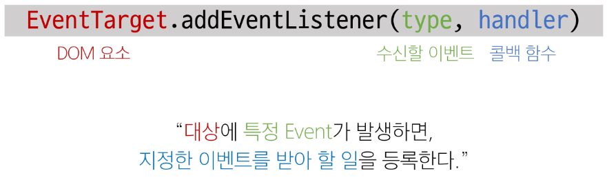

    * `addEventListener`의 인자
        * type
            * 수신할 이벤트 이름
            * 문자열로 작성 (ex. 'click')
        * handler
            * 발생한 이벤트 객체를 수신하는 콜백 함수
            * 콜백 함수는 발생한 event object를 유일한 매겨변수로 받음
* `addEventListener` 활용
    * 버튼을 클릭하면 버튼 요소 출력하기
        * 버튼에 이벤트 처리기를 부착하여 클릭 이벤트가 발생하면 이벤트가 발생한 버튼 정보를 출력

            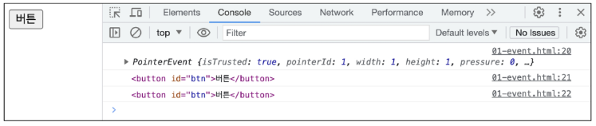

    * 요소에 `addEventListener`를 부착하게 되면 내부 this 값은 대상 요소를 가리키게 된다. (event 객체의 currentTarget 속성 값과 동일)

        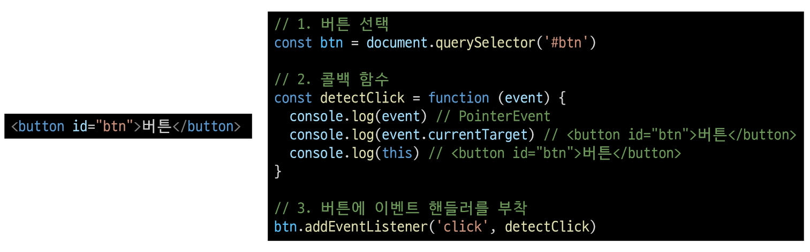

* `addEventListener`의 콜백 함수 특징
    * 발생한 이벤트를 나타내는 event 객체를 유일한 매개변수로 받는다.
    * 반환값이 없다.

        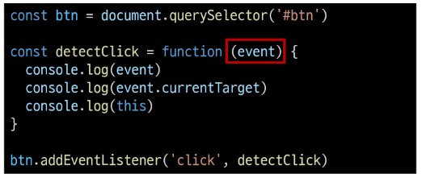

### 버블링
* 개요
    * `form > div > p` 형태의 중첩된 구조에 각각 이벤트 핸들러가 있을 때 만약 `
` 요소를 클릭하면 어떻게 될까?

        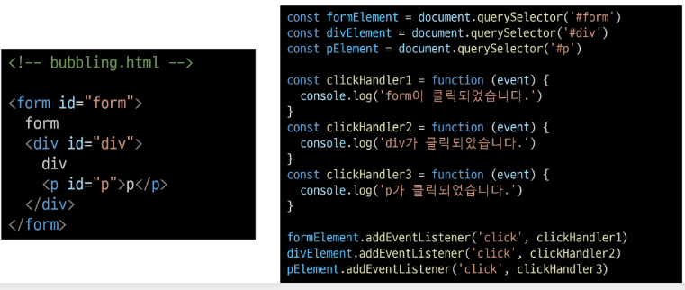

    * `
` 요소만 클릭했는데도 불구하고 모든 핸들러가 동작함
        * 왜 p를 클릭했는데 div와 form에 할당된 핸들러까지 동작할까?

            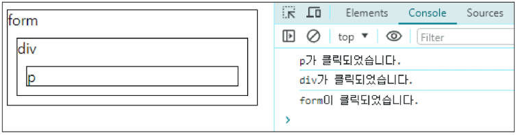

* 버블링 (Bubbling)
    * 한 요소에 이벤트가 발생하면, 이 요소에 할당된 핸들러가 동작하고, 이어서 부모 요소의 핸들러가 동작하는 현상
    * 가장 최상단의 조장 요소(document)를 만날 때까지 이 과정을 반복되면서 요소 각각에 할당된 핸들러가 동작
        * 이벤트가 제일 깊은 곳에 있는 요소에서 시작해 부모 요소를 거슬러 올라가며 발생하는 것이 마치 물속 거품과 닮았기 때문
        * 가장 안쪽의 `
` 요소를 클릭하면 `p -> div -> form` 순서로 3개의 이벤트 핸들러가 모두 동작했던 것
* 이벤트가 정확히 어디서 발생했는지 접근할 수 있는 방법
    * `event.currentTarget`
        * 속성
            * "현재" 요소
            * 항상 이벤트 핸들러가 연결된 요소만을 참조하는 속성
            * `this`와 같음
    * `event.target`
        * 속성
            * 이벤트가 발생한 가장 안쪽의 요소(target)를 참조하는 속성
            * 실제 이벤트가 시작된 요소
            * 버블링이 진행 되어도 변하지 않음
* `target` & `currentTarget`
    * 세 요소 중 가장 최상위 요소인 `outerouter` 요소에만 핸들러가 부착
    * 각 요소를 클릭 했을 때 evnet의 `target`과 `currentTarget`의 차이 비교

        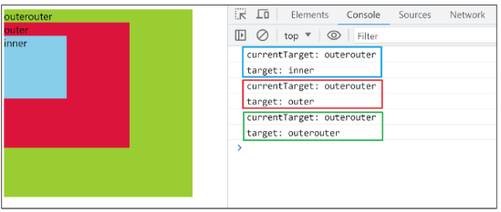

    * `currentTarget`
        * 핸들러가 연결된 outerouter 요소만을 가리킴
    * `target`
        * 실제 이벤트가 발생하는 요소를 가리킴
    * 핸들러는 outerouter에만 할당되어 있지만 하위 요소 outer와 inner를 클릭해도 해당 핸들러가 동작함
    * 클릭 이벤트가 어디서 발생했든 상관없이 outerouter까지 이벤트가 버블링 되어 핸들러를 실행시키기 때문

        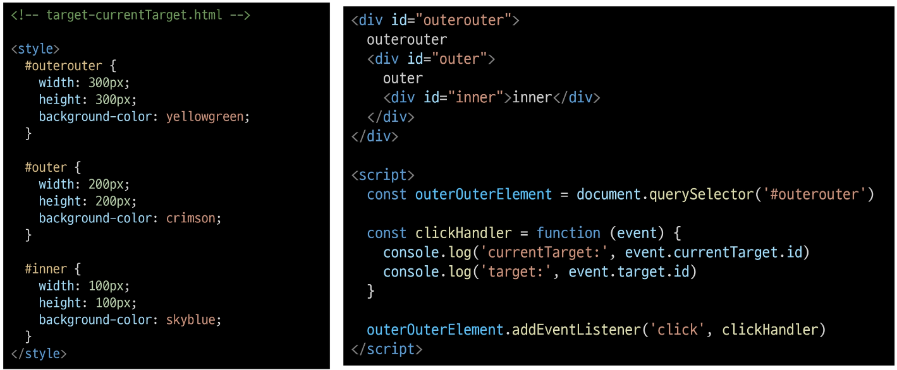

* 캡쳐링(capturing)
    * 이벤트가 하위 요소로 전파되는 단계(버블링과 반대)

        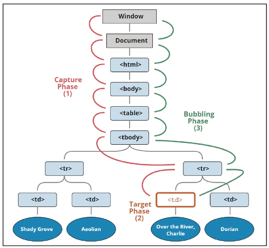

* 캡쳐링과 버블링
    * table 안에 tb를 클릭하면 이벤트는 최상위 요소부터 아래로 전파
    * 실제 이벤트가 발생한 지점(event.target)에서 실행된 후 다시 위로 전파
        * 이 과정에서 상위 요소에 할당된 이벤트 핸들러가 호출되는 것
    * 캡쳐링은 실제 다루는 경우가 거의 없으므로 버블링에 집중...!!
* 버블링이 필요한 이유
    * 만약 다음과 같이 각자 다른 동작을 수행하는 버튼이 여러개 있다고 가정
    * 그렇다면 각 버튼마다 서로 다른 이벤트 핸들러를 할당해야 할까?

        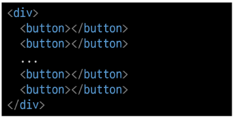

    * 각 버튼의 **공통 조상인 div 요소에 이벤트 핸들러 단 하나만 할당**하기
    * 요소의 공통조상에 이벤트 핸들러를 단 하나만 할당하면 여러 요소를 한꺼번에 다룰 수 있음
    * 공통 조상에 할당한 핸들러에서 `event.target`을 이용하면 실제 어떤 버튼에서 이벤트가 발생했는지 알 수 있기 때문

        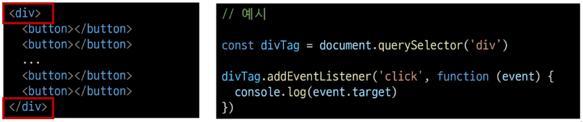

## evnet handler 활용
* event handler 활용 실습
    1. 버튼을 클릭하면 숫자를 1씩 증가해서 출력하기

        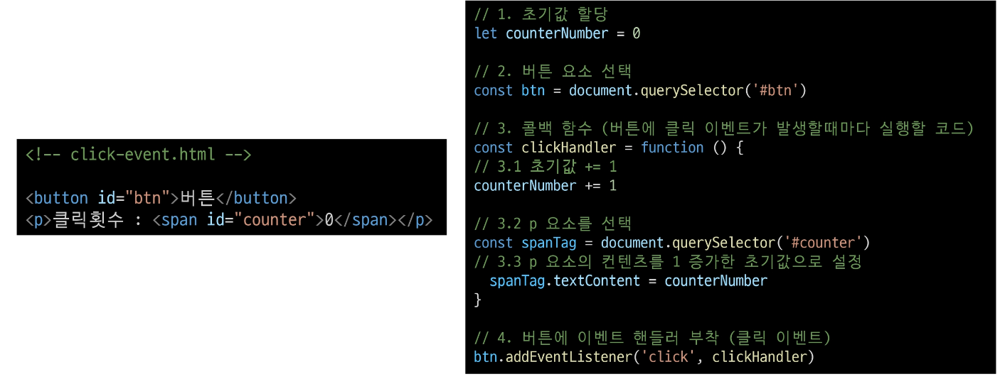

        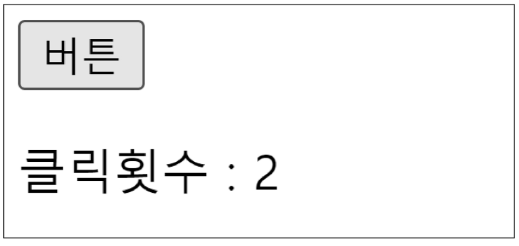

    2. 사용자의 입력 값을 실시간으로 출력하기

        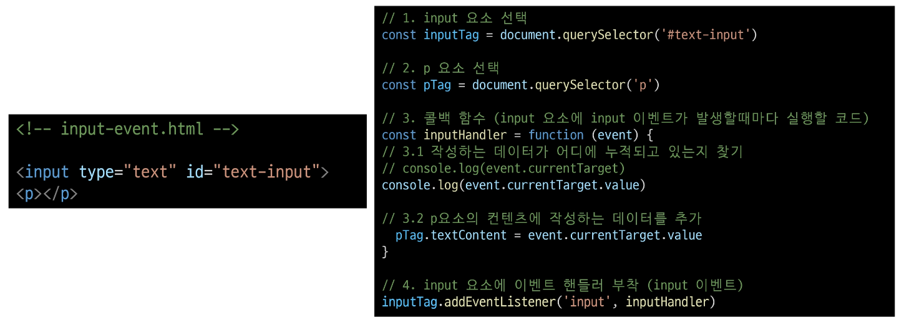

        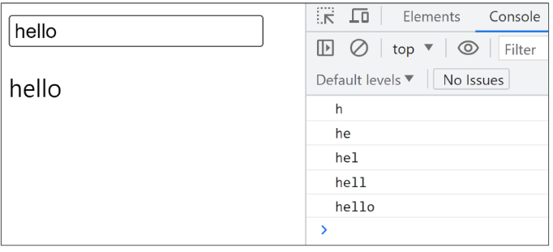

    * `currentTarget` 주의사항
        * `console.log()`로 event 객체를 출력할 경우 `currentTarget` 키의 값은 `null`을 가짐
        * `currentTarget`은 이벤트가 처리되는 동안에만 사용할 수 있기 때문
        * 대신 `console.log(event.currentTarget)`을 사용하여 콘솔에서 확인 가능
        * `currentTarget` 이후의 속성 값들은 **'target'을 참고해서 사용하기**

            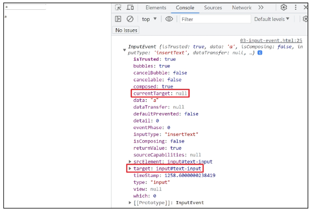

    3. 사용자의 입력 값을 실시간으로 출력 `+`버튼을 클릭하면 출력한 값의 CSS 스타일 변경하기

        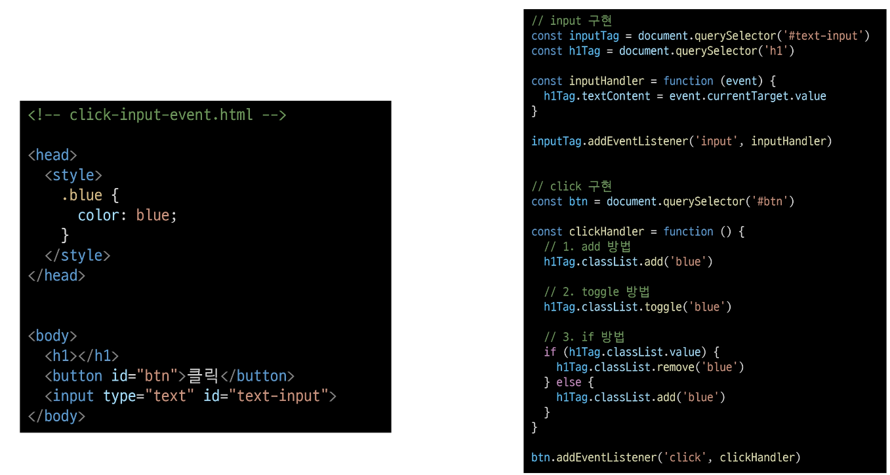

        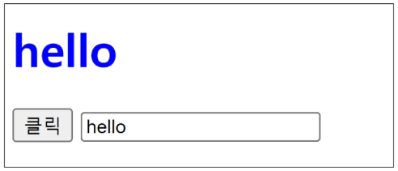

    4. todo 프로그램 구현

        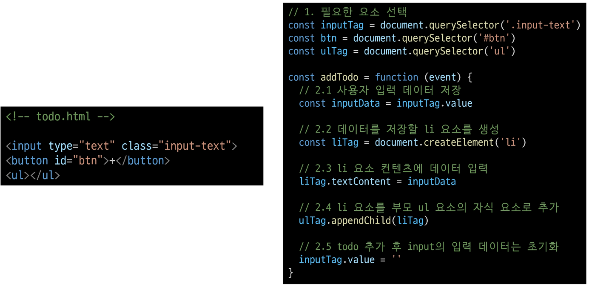

        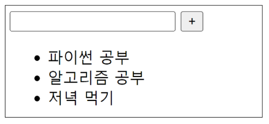

        * todo 추가 기능 구현
            1. 빈 문자열 입력 방지
            2. 입력이 없을 경우 경고 대화상자 띄움

                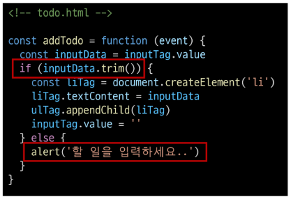

    5. 로또 번호 생성기 구현

        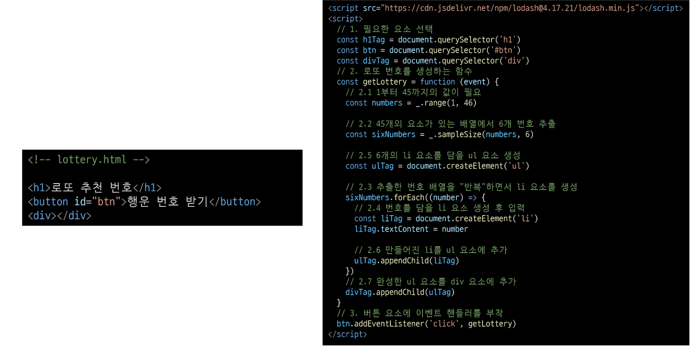

        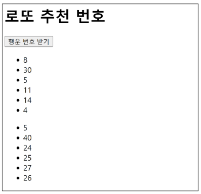

* `lodash`
    * 모듈성, 성능 및 추가 기능을 제공하는 JavaScript 유틸리티 라이브러리
    * array, object 등 자료구조를 다룰 때 사용하는 유용하고 간편한 함수들을 제공
    * [공식 문서](https://lodash.com/)

### 이벤트 기본 동작 취소
* 이벤트의 기본 동작 취소하기
    * HTML의 각 요소가 기본적으로 가지고 있는 이벤트가 때로는 방해가 되는 경우가 있어 이벤트의 기본 동작을 취소할 필요가 있음
    * 예시
        * form 요소의 제출 이베트를 취소하여 페이지 새로고침을 막을 수 있음
        * a 요소를 클릭 할 때 페이지 이동을 막고 추가 로직을 수행할 수 있음
* `.preventDefault()`
    * 해당 이벤트에 대한 기본 동작을 실행하지 않도록 지정
* copy 이벤트 동작 취소
    * 콘텐츠를 복사 하는 것을 방지

        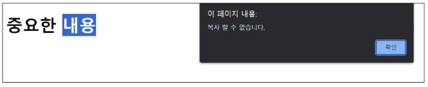

        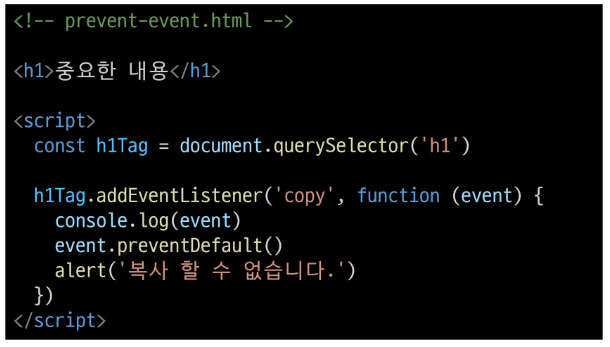

    * form 제출 시 페이지 새로고침 동작 취소
        * form 요소의 submit 동작(action 값으로 요청)을 취소 시킴

            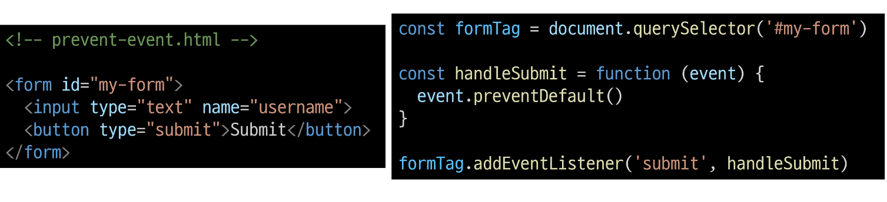

## 참고
* `addEventListener`에서의 화살표 함수 주의사항
    * 화살표 함수는 자신만의 this를 가지지 않기 때문에 자신을 포함하고 있는 함수의 this를 상속 받음
    * this를 사용해야 하는 경우 `addEventListener`에서는 일반 함수로 사용하기

        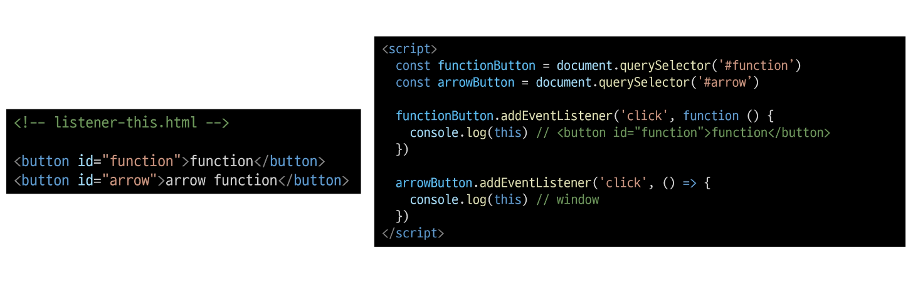