# Asynchronous JavaScript

## 비동기
* Synchronous(동기)
    * 프로그램의 실행 흐름이 순차적으로 진행
    * 하나의 작업이 완료된 후에 다음 작업이 실행되는 방식
* Asynchronous(비동기)
    * 프로그램의 실행 흐름이 순차적이지 않으며, 작업이 완료되기를 기다리지 않고 다음 작업이 실행되는 방식
    * 작업의 완료 여부를 신경 쓰지 않고 **동시에 다른 작업들을 수행할 수 있음**

        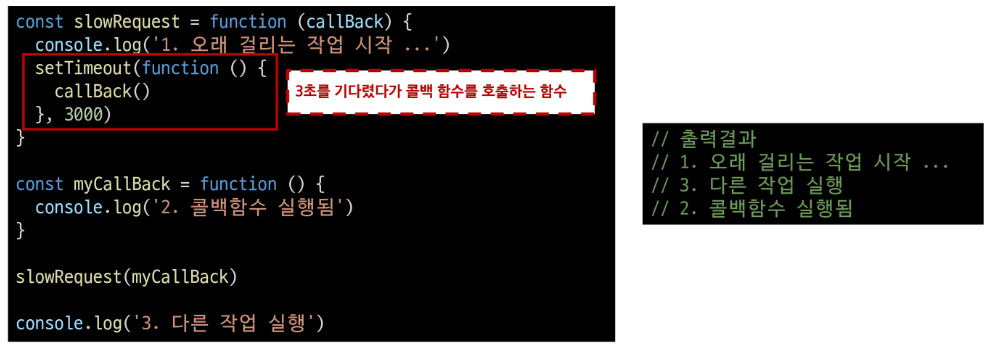

* Asynchronous 특징
    * 병렬적 수행
    * 당장 처리를 완료할 수 없고 시간이 필요한 작업들은 별도로 요청을 보낸 뒤 응답이 빨리 오는 작업부터 처리

## JavaScript와 비동기
* Single Thread 언어, JavaScript
    * Thread : 작업을 처리할 때 실제로 작업을 수행하는 주체, multi-thread라면 업무를 수행할 수 있는 주체가 여러 개라는 의미
* JavaScript는 한번에 여러 일을 수행할 수 없다.
    * JavaScript는 한번에 하나의 일만 수행할 수 있는 Single Thread 언어로 동시에 여러 작업을 처리할 수 없음
    * 즉 JavaScript는 하나의 작업을 요청한 순서대로 처리할 수 밖에 없음
    * 어떻게 Single Thread인 JavaScript가 비동기 처리를 할 수 있을까?
* JavaScript Runtime
    * JavaScript가 동작할 수 있는 환경(Runtime)
    * JavaScript 자체는 Single Thread이므로 비동기 처리를 할 수 있도록 도와주는 환경이 필요
    * JavaScript에서 비동기에 관련한 작업은 "브라우저" 또는 "Node"와 같은 환경에서 처리
* 브라우저 환경에서의 JavaScrip 비동기 처리 관련 요소
    1. JavaScript Engine의 **Call Stack**
    2. **Web API**
    3. **Task Queue**
    4. **Event loop**
* Runtime의 시작적 표현

    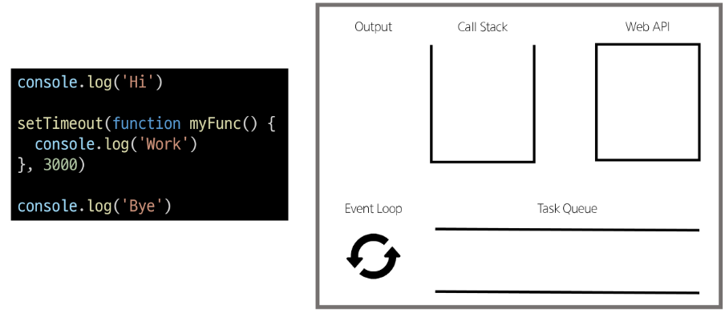

    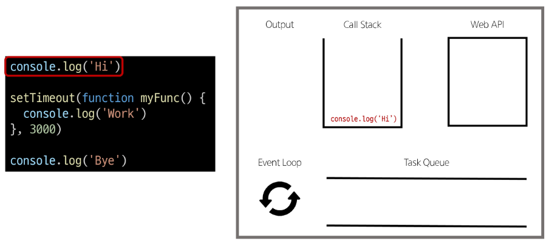

    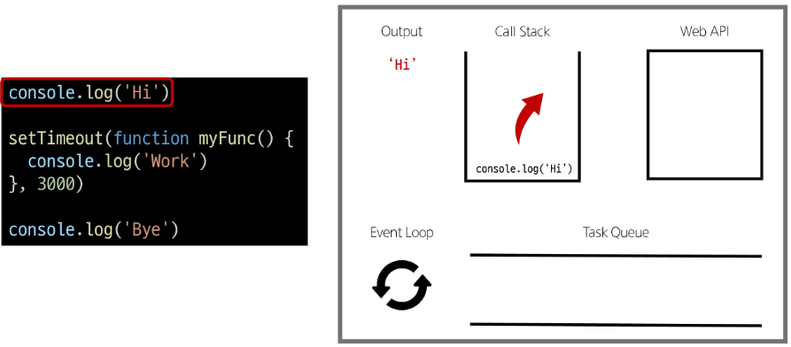

    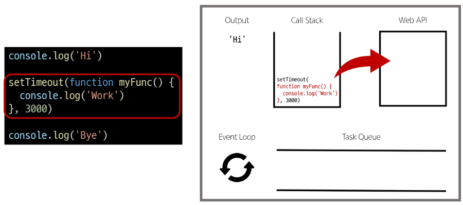

    

    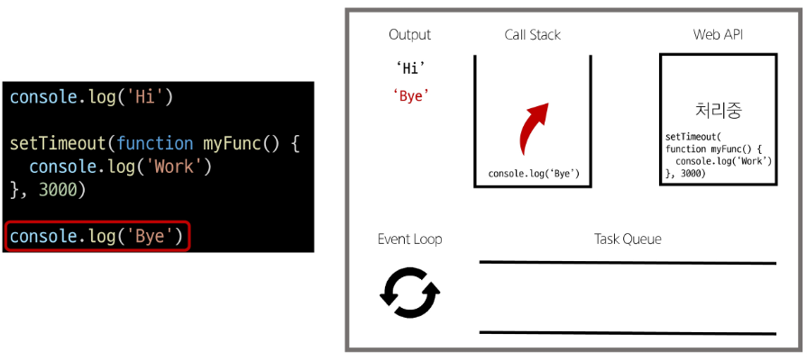

    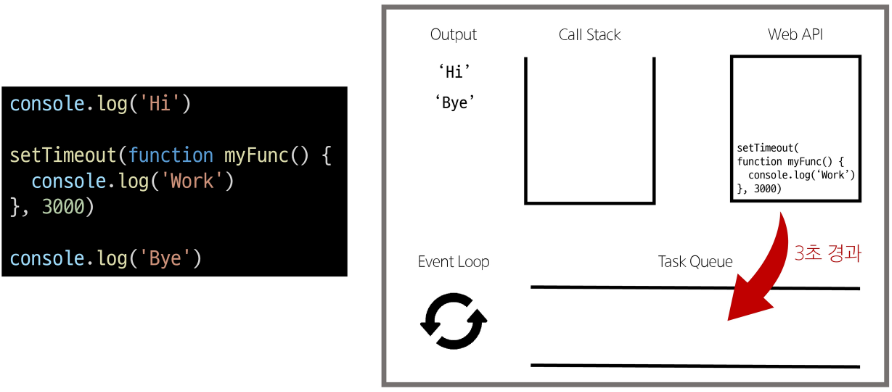

    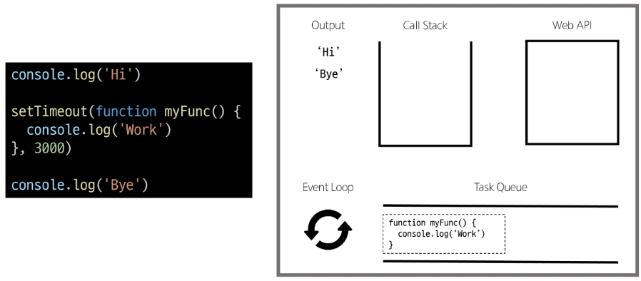

    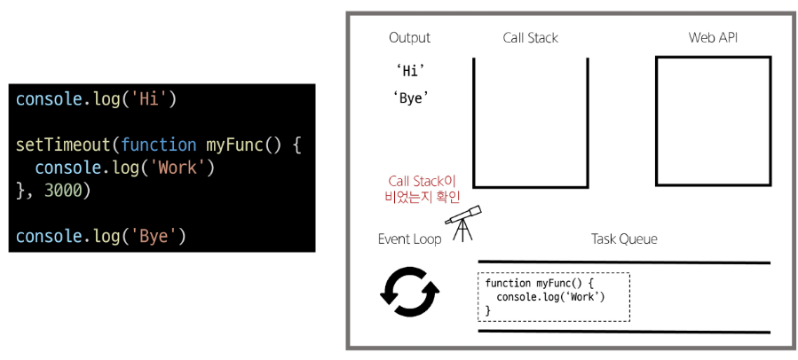

    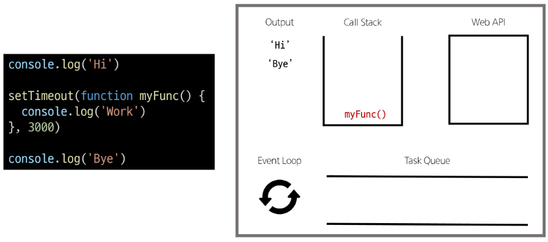

    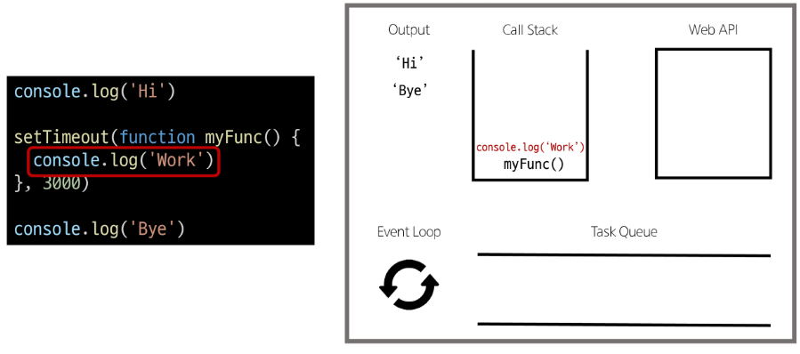

    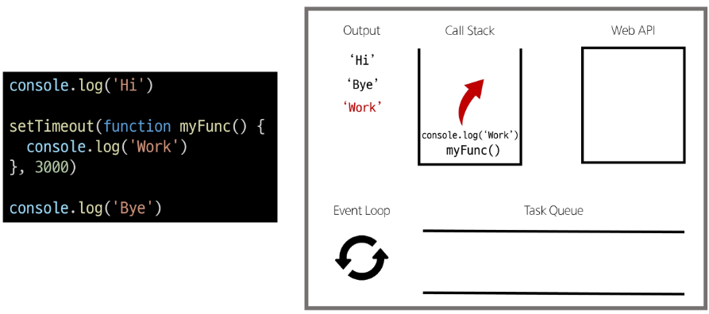

    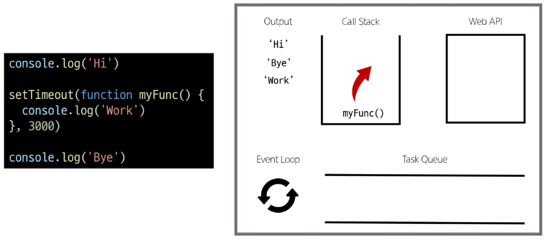

    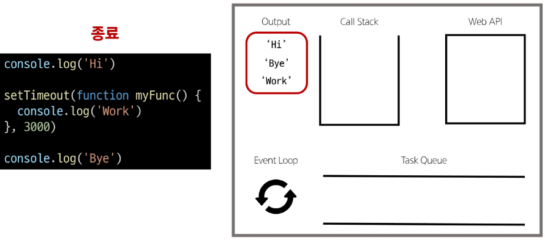

* 브라우저 환경에서의 JavaScript 비동기 처리 동작 방식
    1. 모든 작업은 **Call Stack**(LIFO)으로 들어간 후 처리 된다.
    2. 오래 걸리는 작업이 Call Stack으로 들어오면 **Web API**로 보내 별도로 처리하도록 한다.
    3. Web API에서 처리가 끝난 작업들은 곧바로 Call Stack으로 들어가지 못하고 **Task Queue**(FIFO)에 순서대로 들어간다.
    4. **Event loop**가 Call back이 비어있는 것을 계속 체크하고 Call Stack이 빈다면 Task Queue에서 가장 오래된(가장 먼저 처리되어 들어온) 작업을 Call Stack으로 보낸다.
* 비동기 처리 동작 요소
    1. Call Stack
        * 요청이 들어올 때 마다 순차적으로 처리하는 Stack(LiFO)
    2. Web API
        * JavaScript 엔진이 아닌 브라우저에서 제공하는 runtime 환경
        * 시간이 소요되는 작업을 처리(setTimeout, DOM Event, 비동기 요청 등)
    3. Task Queue(Callback Queue)
        * 비동기 처리된 Callback 함수가 대기하는 Queue(FIFO)
    4. Event Loop
        * task(작업)가 들어오길 기다렸다가 task가 들어오면 이를 처리하고 처리할 task가 없을 경우엔 잠드는, 끊임 없이 돌아가는 JavaScript내 루프
        * Call Stack과 Task Queue를 지속적으로 모니터링
        * Call Stack이 비어 있는지 확인 후 비어 있다면 Task Queue에서 대기 중인 오래된 작업을 Call Stack으로 Push
* Summary
    * JavaScript는 한 번에 하나의 작업을 수행하는 Single Thread 언어로 동기적 처리를 진행
    * 하지만 브라우저 환경에서는 Web API에서 처리된 작업이 지속적으로 Task Queue를 거쳐 Event Loop에 의해 Call Stack에 들어와 순차적으로 실행됨으로써 비동기 작업이 가능한 환경이 된다.

## Ajax
* Ajax = Asynchronous JavaScript and XML
    * XMLHttpRequest 기술을 사용해 복잡하고 동적인 웹 페이지를 구성하는 프로그래밍 방식
    * 비동기적인 웹 어플리케이션 개발을 위한 기술
    * 브라우저와 서버 간의 데이터를 비동기적으로 교환하는 기술
    * Ajax를 사용하면 페이지 전체를 새로고침 하지 않고도 동적으로 데이터를 불러와 화면을 갱신할 수 있음
    * Ajax의 'x'는 XML이라는 데이터 타입을 의미하긴 하지만, 요즘은 더 가벼운 용량과 JavaScript의 일부라는 장점 때문에 'JSON'을 많이 사용
* Ajax 목적
    * 전체 페이지가 다시 로드 되지 않고 HTML 페이지 일부 DOM만 업데이트
    * 웹 페이지 일부가 다시 로드되는 동안에도 코드가 게속 실행되어, 비동기식으로 작업할수 있다.
* XMLHttpRequest 객체 (XHR)
    * 서버와 상호작용할 때 사용하는 객체
    * 페이지의 새로고침 없이도 데이터를 가져올 수 있음
* XMLHttpRequest 특징
    * JavaScript를 사용하여 서버에 HTTP 요청을 할 수 있는 객체
    * 브라우저와 서버 간의 네트워크 요청을 전송할 수 있음
    * 사용자의 작업을 방해하지 않고 페이지의 일부를 업데이트 할 수 있음
    * 이름에 XML이라는 데이터 타입이 들어가긴 하지만 XML 뿐만 아니라 모든 종류의 데이터를 가져올 수 있음
* 기존 기술과의 차이
    * 기존 방식

        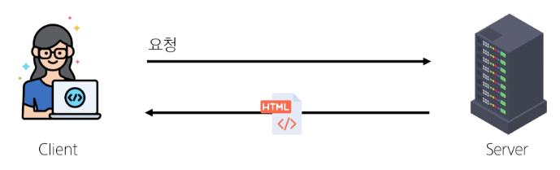

        1. 클라이언트(브라우저)에서 form을 채우고 이를 서버로 제출(submit)
        2. 서버는 요청 내용에 따라 데이터 처리 후 새로운 웹페이지를 작성하여 응답으로 전달
            * 결과적으로 모든 요청에 따라 새로운 페이지를 응답 받기 때문에 계속해서 새로고침이 발생
            * 기존 페이지와 유사한 내용을 가지고 있는 경우 중복된 코드를 다시 전송 받음으로써 대역폭을 낭비하게 되는 경우가 많음
    * Ajax

        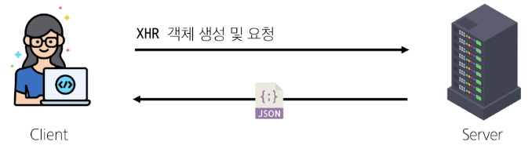

        1. XHR 객체 생성 및 요청
        2. 서버는 새로운 페이지를 응답으로 만들지 않고 필요한 부분에 대한 데이터만 처리 후 응답(JSON 및 기타 데이터)
            * 새로운 페이지를 받는 것이 아닌 필요한 부분의 데이터만 받아 기존 페이지의 일부를 수정(새로고침 X)
            * 서버에서 모두 처리되던 데이터 처리의 일부분이 이제는 클라이언트 쪽에서 처리 되므로 교환되는 데이터량과 처리량이 줄어듦
* 이벤트 핸들러는 비동기 프로그래밍의 한 형태
    * 이벤트가 발생할 때마다 호출되는 함수(콜백 함수)를 제공하는 것
    * HTTP 요청은 응답이 올때까지의 시간이 걸릴 수 있는 작업이라 비동기이며, 이벤트 핸들러를 XHR 객체에 연결해 요청의 진행 상태 및 최종 완료에 대한 응답을 받음

### Axios
* Axios
    * JavaScript에서 사용되는 HTTP 클라이언트 라이브러리
* Axios 정의
    * 클라이언트 및 서버 사이의 HTTP 요청을 만들고 응답을 처리하는 데 사용되지만 JavaScript 라이브러리
    * 서버와의 HTTP 요청과 응답을 간편하게 처리할 수 있도록 도와주는 도구
    * 브라우저를 위한 XHR 객체 생성
    * 간편한 API를 제공하며, Promise 기반의 비동기 요청을 처리
    * 주로 웹 어플리케이션에서 서버와 통신할 때 사용
* Ajax를 활용한 클라이언트 서버 간 동작

    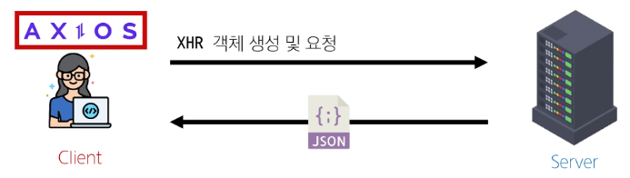

    * Axios를 활용해 XML 객체 생성 및 요청 -> Ajax 요청 처리 -> 응답 데이터 생성 -> JSON 데이터 응답 -> Axios가 Promise 객체로 응답 데이터를 제공 -> 응답 데이터를 활용해 DOM 조작
* Axios 설치
    * CDN 방식으로 사용
    * [문서](https://axios-http.com)

        

* Axios 구조
    * axios 객체를 활용해 요청을 보낸 후 응답 데이터 promise 객체를 반환
    * promise 객체는 then과 catch메서드를 활용해 각각 필요한 로직을 수행

        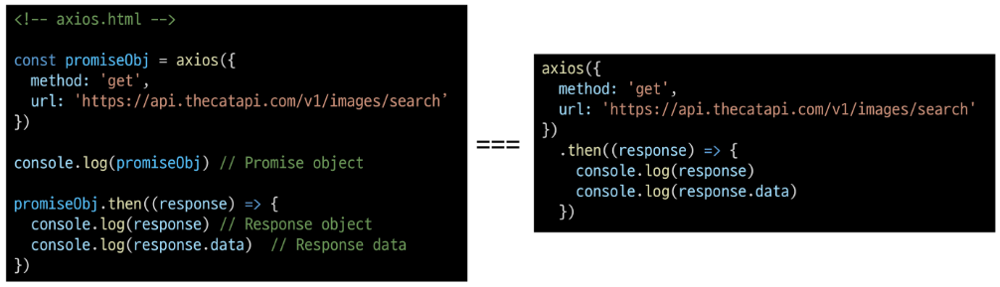

    * **then** 메서드를 사용해서 "성공하면 수행할 로직"을 작성
    * **catch** 메서드를 사용해서 "실패하면 수행할 로직"을 작성

        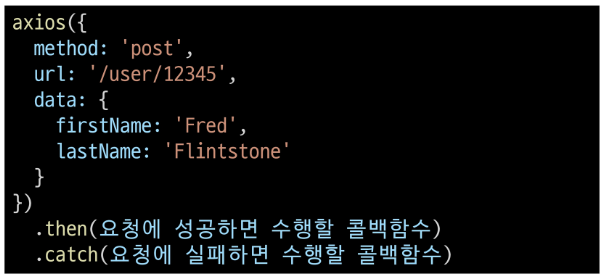

* "Promise" object
    * JavaScript에서 비동기 작업을 처리하기 위한 객체
    * 비동기 작업의 성공 또는 실패와 관련된 결과나 값을 나타냄

        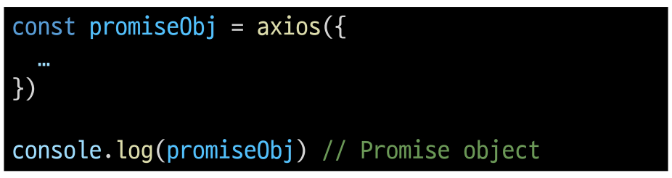

* `then` & `catch`
    * `then(callback)`
        * 요청한 작업이 성공하면 callback 실행
        * callback은 이전 작업의 성공 결과를 인자로 전달 받음
    * `catch(callback)`
        * `then()`이 하나라도 실패하면 callback(남은 then 중단)
        * callback은 이전 작업의 실패 객체를 인자로 전달 받음
* 고양이 사진을 가져오기 practice
    * [The Cat API](https://api.thecatapi.com/v1/images/search)
        * 이미지를 요청해서 가져오는 작업을 비동기로 철
    * response 예시

        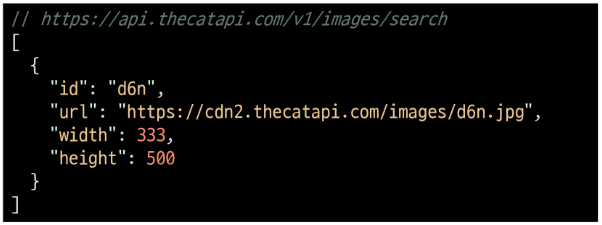

        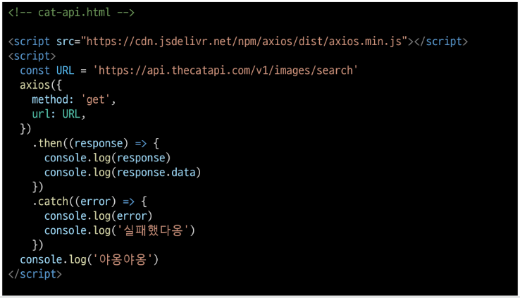

    * 요청 후 cat api로부터 응답을 기다려야 하는 작업은 비동기로 처리하기 때문에 '야옹야옹' 출력 이후 응답 데이터가 출력되는 것을 확인 할 수 있음

        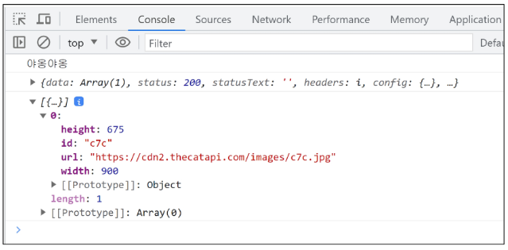

* 고양이 사진을 가져오기 practice - 심화
    1. 버튼을 작성하고 axios 동작을 콜백 함수로 작성 및 이벤트 핸들러 부착

        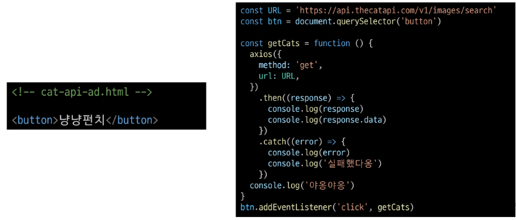

    2. 응답 데이터에서 필요한 이미지 주소 값 찾기

        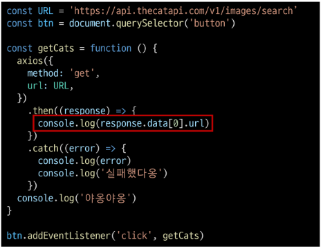

    3. 찾은 이미지 주소를 활용해 HTML img태그 구성하기

        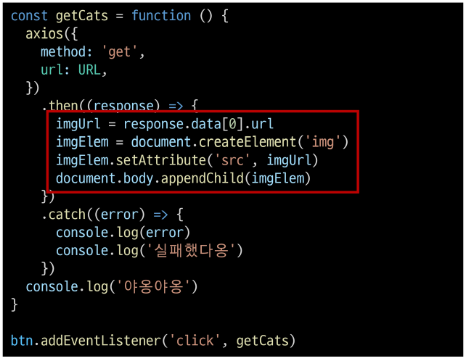

    4. 결과 확인

        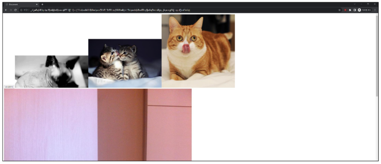

* Summary
    * Ajax
        * 특정한 기술 하나를 의미하는 것이 아니며, 비동기적인 웹 어플리케이션 개발에 사용하는 기술들을 묶어서 지칭
    * Axios
        * 클라이언트 및 서버 사이에 HTTP 요청을 만들고 응답을 처리하는 데 사용되는 자바스크립트 라이브러리(Promise API 지원)
    * 프론트엔드에서 Axios를 활용해 DRF로 만든 API서버로 요청을 보내서 데이터를 받아온 후 처리하는 로직을 작성하게 됨

## Callback과 Promise

### 비동기 콜백
* 비동기 처리의 단점
    * 비동기 처리의 핵심은 Web API로 들어오는 순서가 아니라 **작업이 완료되는 순서에 따라 처리**한다는 것
    * 그런데 이는 개발자 입장에서 **코드의 실행 순서가 불명확**하다는 단점 존재
    * 이와 같은 단점은 실행 결과를 예상하면서 코드를 작성할 수 없게 함
    * -> 콜백 함수를 사용하자!!
* 비동기 콜백
    * 비동기적으로 처리되는 작업이 완료되었을 때 실행되는 함수
    * 연쇄적으로 발생하는 비동기 작업을 **순차적으로 동작**할 수 있게 함
    * 작업의 순서와 동작을 제어하거나 결과를 처리하는 데 사용

        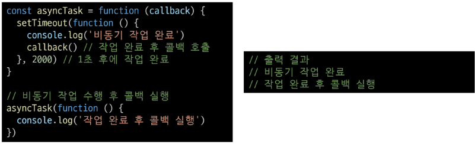

* 비동기 콜백의 한계
    * 비동기 콜백 함수는 보통 어떤 기능의 실행 결과를 받아서 다른 기능을 수행하기 위해 많이 사용됨
    * 이 과정을 작성하다 보면 비슷한 패턴이 계속 발생
        * A를 처리해서 결과가 나오면, 첫번째 callback 함수를 실행하고 첫번째 callback 함수가 종료되면, 두번째 callback 함수를 실행하고 두번째 callback 함수가 종료되면, 세번째 callback 함수를 실행하고 ...
    * **콜백 지옥**발생
* 콜백 지옥(Callback Hell)
    * 비동기 처리를 위한 콜백을 작성할 때 마주하는 문제
    * 코드 작성 형태가 마치 "피라미드와 같다"고 해서 "Pyramid of doom(파멸의 피라미드)"라고도 부름

        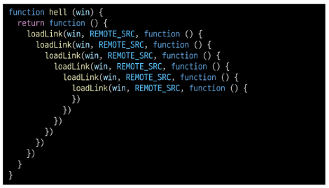

* 콜백 함수 정리
    * 콜백 함수는 비동기 작업을 순차적으로 실행할 수 있게 하는 반드시 필요한 로직
    * 비동기 코드를 작성하다 보면 콜백 함수로 인한 콜백 지옥은 빈번히 나타나는 문제이며 이는 코드의 가독성을 해치고 유지 보수가 어려워짐
    * 지옥에 빠지지 않는 다른 표기 형태가 필요하다!

### 프로미스
* Promise
    * JavaScript에서 비동기 작업의 결과를 나타내는 객체
    * 비동기 작업이 완료되었을 때 결과 값을 반환하거나, 실패 시 에러를 처리할 수 있는 기능을 제공
* "Promise" object
    * 자바스크립트에서 비동기 작업을 처리하기 위한 객체
    * 비동기 작업의 성공 또는 실패와 관련된 결과나 값을 나타냄
    * 콜백 지옥 문제를 해결하기 위해 등장한 비동기 처리를 위한 객체
    * "작업이 끝나면 실행시켜 줄께"라는 약속
    * Promise기반의 HTTP 클라이언트 라이브러리가 바로 Axios
        * 성공에 대한 약속`then()`
        * 실패에 대한 약속`catch()`
* Axios
    * JavaScript에서 사용되는 **Promise 기반** HTTP 클라이언트 라이브러리
* 비동기 콜백 vs Promise

    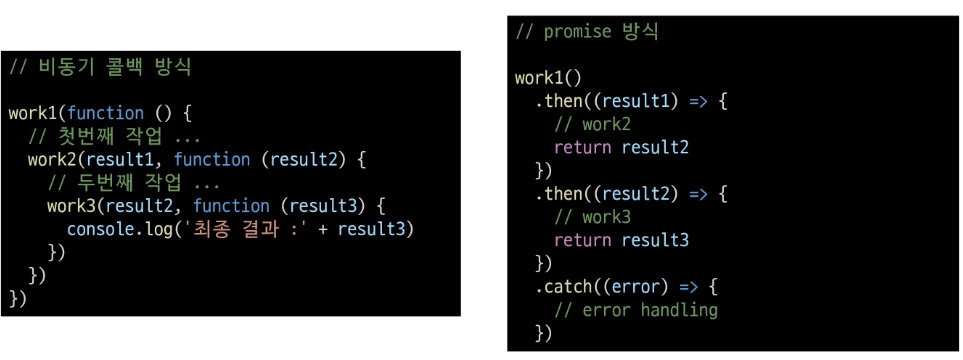

* `then` & `catch`의 chaining
    * axios로 처리한 비동기 로직은 항상 promise 객체를 반환
    * 즉, then과 catch는 모두 항상 promise 객체를 반환
        * 계속해서 **chaining**을 할 수 있음
    * then을 계속 이어 나가면서 작성할 수 있게 됨

        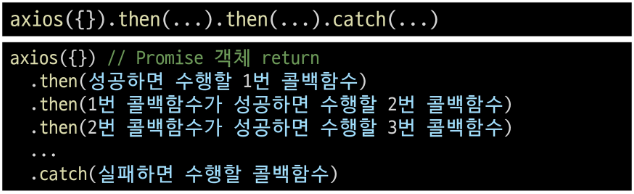

* `then`메서드 chaining의 목적
    * 비동기 작업의 **순차적인** 처리 기능
    * 코드를 보다 직관적이고 가독성 좋게 작성할 수 있도록 도움
* `then`메서드 chaining의 장점
    1. 가독성
        * 비동기 작업의 순서와 의존 관계를 명확히 표현할 수 있어 코드의 가독성이 향상
    2. 에러 처리
        * 각각의 비동기 작업 단계에서 발생하는 에러를 분할에서 처리 가능
    3. 유연성
        * 각 단계마다 필요한 데이터를 가공하거나 다른 비동기 작업을 수행할 수 있어서 더 복잡한 비동기 흐름을 구성할 수 있음
    4. 코드 관리
        * 비동기 작업을 분리하여 구성하면 코드를 관리하기 용이
* `then`메서드 chaining 적용
    * chaining을 활용해 cat api 실습 코드 변경하기

        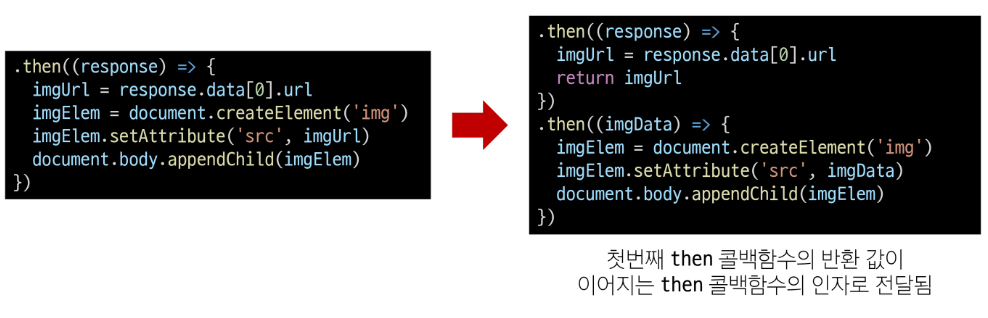

* Promise가 보장하는것(vs 비동기 콜백)
    1. 콜백 함수는 JavaScript의 Event Loop가 현재 실행 중인 Call Stack을 완료하기 이전에는 절대 호출되지 않음
        * 반면 Promise callback 함수는 Event Queue에 배치되는 엄격한 순서로 호출됨
    2. 비동기 작업이 성공하거나 실패한 뒤에 then 메서드를 이용하여 추가한 경우에도 **호출 순서를 보장**하며 동작
    3. then을 여러 번 사용하여 여러 개의 callback 함수를 추가할 수 있음
        * 각각의 callback은 주어진 순서대로 하나하나 실행하게 됨
        * Chaining은 Promise의 가장 뛰어난 장점

## 참고
* 비동기를 사용하는 이유 - "사용자 경험"
    * 예를 들어 아주 큰 데이터를 불러온 뒤 실행되는 앱이 있을 때, 동기식으로 처리한다면 데이터를 모두 불러온 뒤에서야 앱의 실행 로직이 수행되므로 사용자들은 마치 앱이 멈춘 것과 같은 경험을 겪게 됨
    * 즉, 동기식 처리는 특정 로직이 실행되는 동안 다른 로직 실행을 차단하기 때문에 마치 프로그램이 응답하지 않는 듯한 사용자 경험을 만듦
    * 비동기로 처리한다면 먼저 처리되는 부분부터 보여줄 수 있으므로, 사용자 경험에 긍정적인 효과를 볼 수 있음
    * 이와 같은 이유로 많은 웹 기능은 비동기 로직을 사용해서 구현됨