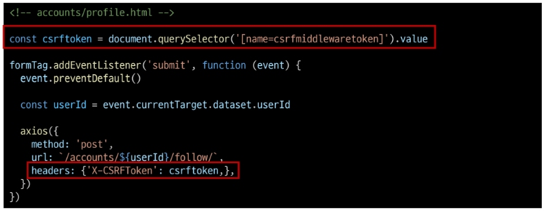

# Ajax with Django

## Ajax와 서버
* Ajax = Asynchronous JavaScript and XML
    * 비동기적인 웹 어플리케이션 개발에 사용하는 기술
* Ajax를 활용한 클라이언트 서버 간 동작

    

    * XML 객체 생성 및 요청 -> Ajax 요청 처리 -> 응답 데이터 생성 -> JSON 데이터 응답 -> Promise 객체 데이터를 활용해 DOM 조작 (웹 페이지의 일부분 만을 다시 로딩)

## Ajax with follow

### 비동기 팔로우 구현
* 사전 준비
    * M:N까지 진행한 Django 프로젝트 준비
    * 가상 환경 생성 및 활성화, 패키지 설치
* Ajax 적용
    * 프로필 페이지에 axios CDN 작성

        

    * form 요소 선택을 위해 id속성 지정 및 선택
    * action과 method 속성은 삭제
        * 요청은 axios로 대체되기 때문

        

    * form 요소에 이벤트 핸들러 할당
    * submit 이벤트의 기본 동작 취소

        

    * axios 요청 작성
        1. `url`에 작성할 `user pk`는 어떻게 작성해야 할까?
        2. `csrf-token`은 어떻게 보내야 할까?

        

    * `url`에 작성할 `user pk` 가져오기 (HTML -> JavaScript)

        

        * `data-*` 속성
            * 사용자 지정 데이터 특성을 만들어 임의의 데이터를 HTML과 DOM사이에서 교환 할 수 있는 방법
            * 사용 예시

                

                * 모든 사용자 지정 데이터는 JavaScript에서 **dataset** 속성을 통해 사용
                * 주의 사항
                    1. 대소문자 여부 상관없이 `xml`문자로 시작 불가
                    2. 세미콜론 포함 불가
                    3. 대문자 포함 불가
                    * [공식 문서](https://developer.mozilla.org/ko/docs/Web/HTML/Global_attributes/data-*)
    * 요청 url 작성 마무리

        

    * 문서상 `input hidden` 타입으로 전재하는 `csrf token`데이터를 이제는 axios로 전송해야 한다.
    * csrf 값을 가진 input  요소를 직접 선택 후 axios에 작성
    * [공식 문서](https://docs.djangoproject.com/en/4.2/howto/csrf)

        

        

    * 팔로우 버튼을 토글하기 위해서는 현재 팔로우 상태인지 언팔로우 상태인지에 대한 상태 확인이 필요 -> Django의 view 함수에서 팔로우 여부를 파악 할 수 있는 변수를 추가로 생성해 JSON 타입으로 응답하기
    * 팔로우 상태 여부를 JavaScript에게 전달할 데이터 작성
    * 응답은 더 이상 HTML 문서가 아닌 JSON 데이터로 응답

        

    * 팔로우 요청 후 Django 서버로부터 받은 데이터 확인하기

        

    * d응답 데이터 `is_followed`에 따라 팔로우 버튼을 토글하기

        

    * 클라이언트와 서버 간 XHR 객체를 주고 받는 것을 확인하기
    * 개발자도구 - Network

        

    * "팔로잉 수와 팔로워 수 비동기 적용"
    * 해당 요소를 선택할 수 있도록 `span`태그와 `id`속성 작성

        

    * 각 span 태그를 선택

        

    * Django view 함수에서 팔로워, 팔로잉 인원 수 연산을 진행하여 결과를 응답 데이터로 전달

        

    * 응답 데이터를 받아 각 태그의 인원수 값 변경에 적용

        

## Ajax with likes

### 비동기 좋아요 구현
* Ajax 좋아요 적용 시 유의 사항
    * 전반적인 Ajax 적용은 팔로우 구현 과정과 모두 동일
    * 단, 팔로우와 달리 좋아요 버튼은 **한 페이지에 여러 개**가 존재
    * 모든 좋아요 버튼에 이벤트 리스터를 할당해야 할까?
* [복습](../JS/04_Controlling_event.md)
    * 버블링
        * 한 요소에 이벤트가 발생하면, 이 요소에 할당된 핸들러가 동작하고, 이어서 부모 요소의 핸들러가 동작하는 현상
        * 가장 최상단의 조상요소(document)를 만날 때까지 이 과정이 반복되면서 요소 각각에 할당된 핸들러가 동작
    * 버블링이 필요한 이유
        * 만약 다음과 같이 각자 다른 동작을 수행하는 버튼이 어러 개가 있다고 가정
        * 각 버튼마다 이벤트핸들러 할당 X => 각 버튼의 **공통 조상인 div 요소에 이벤트 핸들러 단 하나만 할당**하기
* Ajax 적용
    * 모든 좋아요 form 요소를 포함하는 최상위 요소 작성

        

    * 최상위 요소 선택
    * 이벤트 핸들러 할당
    * 하위 요소들의 submit 이벤트를 감지하고 submit 기본 이벤트를 취소

        

    * axios 작성
    * url에 작성해야 하는 article pk는 어떻게 작성해야 할까?

        

    * 각 좋아요 form에 article.pk를 부여 후 HTML의 article.pk 값을 JavaScript에서 참조하기

        

    * [복습](../JS/04_Controlling_event.md)
        * `currentTarget` 속성
            * 현재 요소
            * 항상 이벤트 핸들러가 연결된 요소만을 참조하는 속성
            * `this`와 같음
        * `target` 속성
            * 이벤트가 발생한 가장 안쪽 요소(target)를 참조하는 속성
            * **실제 이벤트가 시작된 요소**
            * 버블링이 진행 되어도 변하지 않음
    * url 완성 후 요청 및 응답 확인

        

    * 좋아요 버튼을 토글하기 위해서는 현재 사용자가 좋아요를 누른 상태인지 누르지 않은 상태인지에 대한 상태 확인 필요
        * Django의 view 함수에서 좋아요 여부를 파악 할 수 있는 변수 추가 생성 -> JSON 타입으로 응답
    * 좋아요 상태 여부를 JavaScript에게 전달할 데이터 작성 및 JSON 데이터 응답

        

    * 응답 데이터 `is_liked`를 받아 `isLiked`변수에 할당

        

    * `isLiked`에 따라 좋아요 버튼 토글하기
        * 어떤 좋아요 버튼을 선택했는지 확인하기 위한 값이 필요

        

    * 문자와 article의 pk값을 혼합하여 id 속성 값을 설정

        

    * 각 좋아요 버튼을 선택 후 `isLiked`에 따라 버튼을 토글

        

* 버블링을 활용하지 않은 경우
    1. `querySelectorAll()`을 사용해 전체 좋아요 버튼을 선택
        * `querySelectorAll()` 선택을 위핸 class 적용

            

    2. `forEach()`를 사용해 전체 좋아요 버튼을 순회하며 진행
        * `forEach()`를 사용해 전체 좋아요 버튼을 순회하면서 진행

            