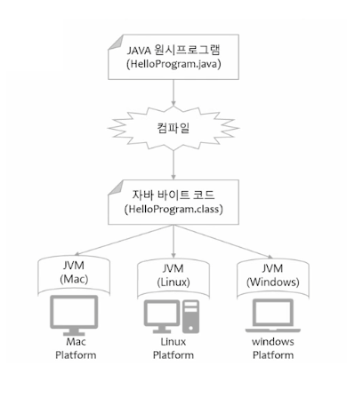

# Java 기본 문법

## Java 기본
* 프로그램(Program)
    * 컴퓨터에서 실행될 때 특정 작업(specific task)을 수행하는 일련의 명령어들의 모음
* 운영체제(Operation System, OS)
    * 시스템 하드웨어를 관리할 뿐 아니라 응용 소프트웨어를 실행하기 위하여 하드웨어 추상화 플랫폼과 공통 시스템 서비스를 제공하는 시스템 소프트 웨어
* 컴퓨터의 자료 표현
    * 비트(Bit)
        * 컴퓨터가 값을 저장하는 최소 단위
        * binary digit(0 or 1)
    * 바이트(Byte)
        * 8bits = 256가지 값을 표현
        * 컴퓨터 정보 처리의 최소 단위
    * 2진수(Binary)
* 자바 가상 머신
    * JVM = Java virtual machine
    * 자바 바이트코드를 실행할 수 있는 주체
    * 자바 바이트코드는 플랫폼에 독립적이며 모든 JVM은 자바 가상 머신 규격에 정의된대로 자바 바이트코드를 실행

        

* main method
    * 실행 명령인 java를 실행 시 가장 먼저 호출 되는 부분
    * 만약, Application에서 `main()` 메서드가 없다면 절대로 실행 될 수 없음
    * Application의 시작 -> 특정 클래스의 `main()` 실행
    * 형태 (고정된 형태)

        ```java
        public static void main(String [ ] args) { }
        ```
* 출력문
    * `print()` : 그대로 출력
    * `println()` : 출력 + 한줄 띄어씀
    * `printf()` : 형식에 맞춰서 출력
        * `%d` : 정수
        * `%f` : 실수
        * `%c` : 문자
        * `%s` : 문자열
    * 출력 예시

        ```java
        System.out.print("Hello World")

        // \n을 사용하면 줄바꿈이 된다.
        System.out.print("Hello World\n")

        System.out.println("Hello World!!!")
        System.out.println("Hello World!!!")

        // \를 1개사용하면 출력되지 않는다 -> 의미를 갖는 기호이기 때문에
        // \는 기호를 출력하기 위해 사용된다.
        System.out.println("\\") // \ 1개 출력
        System.out.println("\"") // " 1개 출력

        // %는 값이 들어갈 자리
        System.out.printf("%d\n", 10) // 정수 10진수
        System.out.printf("%o\n", 10) // 정수 8진수
        System.out.printf("%x\n", 10) // 정수 16진수(소문자)
        System.out.printf("%X\n", 10) // 정수 16진수(대문자)

        System.out.printf("%4d\n", 10) // 4칸을 확보한 뒤 오른쪽부터 차지
        System.out.printf("%-4d\n", 10) // 4칸을 확보한 뒤 왼쪽부터 차지
        System.out.printf("%04d\n", 10) // 4칸을 확보한 뒤 오른쪽부터 차지(남는 부분은 0으로 채워 넣는다.)

        System.out.printf("%f\n", 10.12345) // 실수 6자리까지 출력
        System.out.printf("%.2f\n", 10.12345) // 실수 소수점 아래 2번째까지 출력

        System.out.printf("%s", "싸피")
        System.out.printf("%c", "A")

        /*
        Hello WorldHello World
        Hello World!!!
        Hello World!!!
        \
        "
        10
        12
        a
        A
            10
        10
        0010
        10.123450
        10.12
        싸피A
        */
        ```


## 변수와 자료형


## 연산자


## 제어문(조건문 & 반복문)