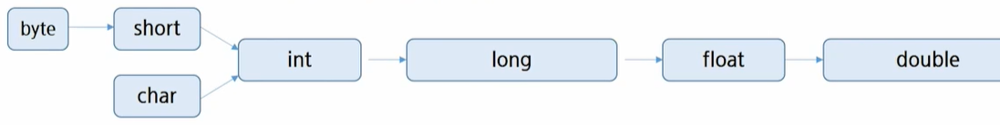
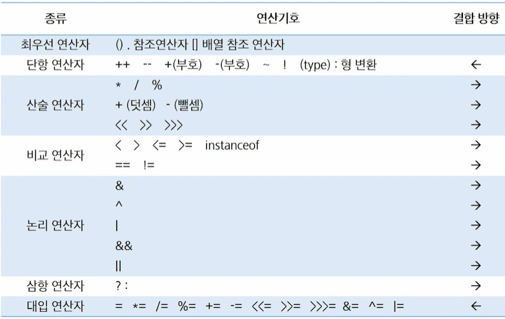

# Java 기본 문법

## Java 기본
* main method
    * 실행 명령인 java를 실행 시 가장 먼저 호출 되는 부분
    * 만약, Application에서 `main()` 메서드가 없다면 절대로 실행 될 수 없음
    * Application의 시작 -> 특정 클래스의 `main()` 실행
    * 형태 (고정된 형태)

        ```java
        public static void main(String [ ] args) { }
        ```
* 출력문
    * `print()` : 그대로 출력
    * `println()` : 출력 + 한줄 띄어씀
    * `printf()` : 형식에 맞춰서 출력
        * `%d` : 정수
        * `%f` : 실수
        * `%c` : 문자
        * `%s` : 문자열
    * 출력 예시

        ```java
        System.out.print("Hello World");

        // \n을 사용하면 줄바꿈이 된다.
        System.out.print("Hello World\n");

        System.out.println("Hello World!!!");
        System.out.println("Hello World!!!");

        // \를 1개사용하면 출력되지 않는다 -> 의미를 갖는 기호이기 때문에
        // \는 기호를 출력하기 위해 사용된다.
        System.out.println("\\"); // \ 1개 출력
        System.out.println("\""); // " 1개 출력

        // %는 값이 들어갈 자리
        System.out.printf("%d\n", 10); // 정수 10진수
        System.out.printf("%o\n", 10); // 정수 8진수
        System.out.printf("%x\n", 10); // 정수 16진수(소문자)
        System.out.printf("%X\n", 10); // 정수 16진수(대문자)

        System.out.printf("%4d\n", 10); // 4칸을 확보한 뒤 오른쪽부터 차지
        System.out.printf("%-4d\n", 10); // 4칸을 확보한 뒤 왼쪽부터 차지
        System.out.printf("%04d\n", 10); // 4칸을 확보한 뒤 오른쪽부터 차지(남는 부분은 0으로 채워 넣는다.)

        System.out.printf("%f\n", 10.12345); // 실수 6자리까지 출력
        System.out.printf("%.2f\n", 10.12345); // 실수 소수점 아래 2번째까지 반올림 하여 출력
        System.out.printf("%.2f\n", 10.125);

        System.out.printf("%s", "싸피"); // 문자열
        System.out.printf("%c", "A"); // 문자

        /*
        Hello WorldHello World
        Hello World!!!
        Hello World!!!
        \
        "
        10
        12
        a
        A
            10
        10
        0010
        10.123450
        10.12
        10.13
        싸피A
        */
        ```


## 변수와 자료형
* 변수(Variable)
    * 데이터를 저장할 메모리의 위치를 나타내는 이름
    * 메모리 상에 데이터를 보관할 수 있는 공간을 확보
    * 적절한 메모리 공간을 확보하기 위해서 변수의 타입 등장
    * `=`를 통해서 CPU에게 연산작업을 의뢰
    * 대소문자를 구분한다.
    * 공백은 허용되지 않는다.
    * 숫자로 시작할수 없다.
    * `$`와 `_`를 변수 이름에 사용할 수 있다. 이외의 특수문자는 허용되지 않는다.
    * 예약어(keyword : 자바문법을 위해서 미리 지정되어 있는 단어)는 사용할 수 없다.
    * 합성어의 경우 주로 camelCase를 활용한다.
    * 한글을 이용한 변수 작명 가능(권장X)
* 자료형 (Data Type)
    1. 기본 자료형 : 미리 정해진 크기의 Memory Size 표현, 변수 자체에 값 저장
    2. 참조 자료형
* 선언
    * `자료형 변수명;`
    * ex) `int age;`, `String name;`
* 저장(할당)
    * `변수명 = 저장할 값;`
    * ex) `age = 30;`, `name='철수';`
* 초기화
    * `자료형 변수명 = 저장할 값;`
    * ex) `int age = 30;`
* 형 변환 (Type Casting)
    * 자동(묵시적, 암묵적) 형변환이 가능한 방향

        

    * 데이터 형 변환
        * 묵시적(암묵적) 형변환 : Implicit Casting
            * 범위가 넓은 데이터 형에 좁은 데이터 형을 대입하는 것
            * ex) `byte b = 100 ; int i = b ;`
        * 명시적 형변환 : Explicit Casting
            * 범위가 좁은 데이터 형에 넓은 데이터 형을 대입하는 것
            * 형 변환 연산자 사용 - `(타입) 값`
            * ex) `int i = 100; byte b = i; (X), byte b = (byte) i;`
    * 예시

        ```java
        // 묵시적 형변환
        int n1 = 10;
        long n2 = n1;

        // 명시적 형변환 : 범위가 큰 자료형 -> 범위가 작은 자료형
        byte b = (byte) n2;
        ```


## 연산자
* 연산자 종류

    

    * 단항 연산자의 우선순위가 제일 높다.

* 단항 연산자
    * 증감 연산자 `++`, `--`
        * 피연산자의 값을 1증가, 감소 시킨다.
        * 전위형(prefix) `++i` : 먼저 값을 증감시키고 그 값을 사용
        * 후위형(postfix) `i++` : 먼저 값을 사용하고 그 값을 증감
    * 부호 연산자 `+`, `-`
        * 숫자가 양수임을 표시 `+`
        * 피연산자의 부호를 반대로 변경한 결과 반환 `-`
    * 논리 부정 연산자 `!`
        * 논리 값을 반전
    * 비트 부정 연산자 `~`
        * 비트 값을 반전
    * 형 변환 연산자 (type)

        ```java
        int a = 5;
        System.out.println(a++); // 5
        // 이후 a = 6
        System.out.println(++a); // 7
        System.out.println(--a); // 6
        System.out.println(a); // 6
        System.out.println(a--); // 6
        // 이후 a = 5
        System.out.println(a++); // 5
        // 이후 a = 6

        System.out.println(-a); // -6
        System.out.println(~a); // -7

        System.out.println(!false); // true
        ```

* 산술 연산자 (이항 연산자)
    * 곱하기 연산자 `*`
    * 나누기 연산자 `/`
    * 나머지 연산자 `%`
    * 더하기 연산자 `+`
    * 빼기 연산자 `-`

    ```java
    int a = 10;
    int b = 6;

    System.out.println(a + b); // 16
    System.out.println(a - b); // 4
    System.out.println(a * b); // 60
    System.out.println(a / b); // 1
    System.out.println(a % b); // 4

    System.out.println(double(a) / b); // 1.666666666666667
    System.out.println(a / double(b)); // 1.666666666666667
    System.out.println(double(a / b)); // 1.0

    double c = 2.3;

    System.out.println(a / c); // 4.347826086956522
    System.out.println(a / (int) c); // 5
    ```

## 제어문(조건문 & 반복문)