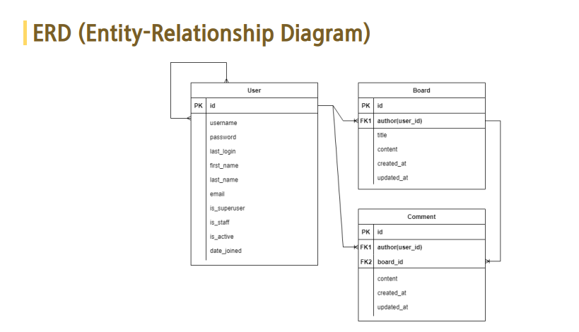
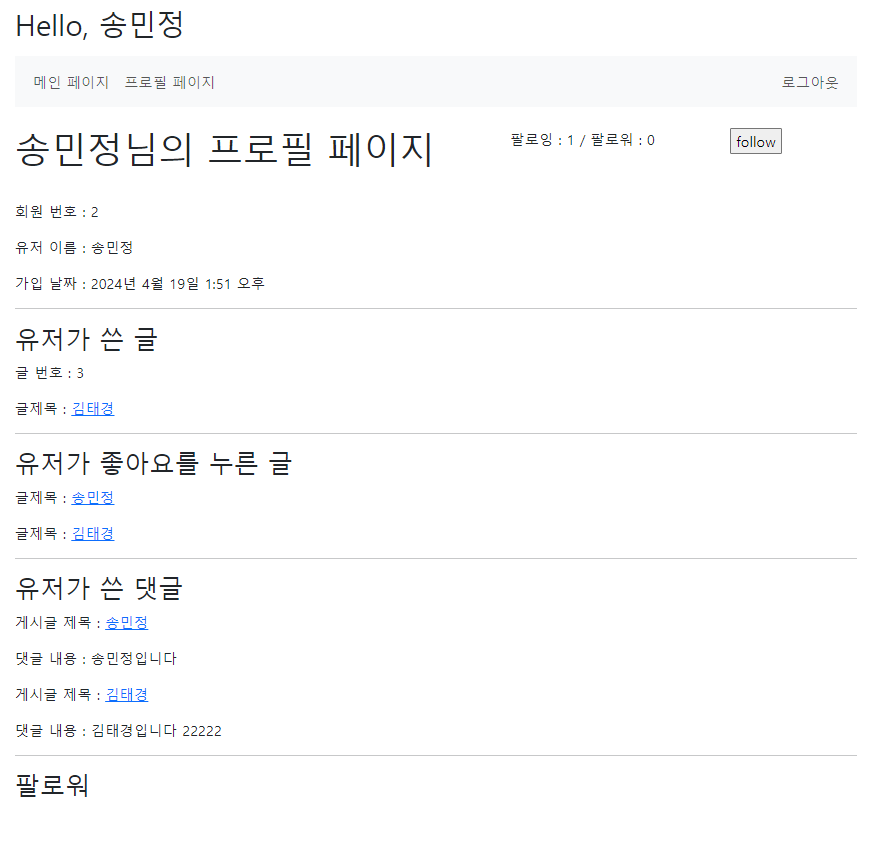

# PJT 06

### 이번 pjt 를 통해 배운 내용


* 지난주 내용 복습 
* 회원 관련 기능이 추가된 게시판 구현
* Usermodel 필드 추가, 웹 페이지 디자인, 조회수, 대댓글 등등 


## Before start...

### [비동기와 동기 방식](https://www.itworld.co.kr/news/245062)

1. 비동기 (Asynchronous)
- 동시에 일어나지 않는다 
- 프로그래밍에서의 비동기란, 작업이 독립적으로 실행되며 다른 작업을 실행할 수 있다. 
- callback, promise, async/await를 사용하여 구현이 가능하다 
- 주로 I/O작업이나 네트워크 요청등 시간이 오래걸리는 작업에 유용하며 한 작업이 완료되기를 기다리는 동안 다른 작업을 할 수 있기 때문에 효율성 부분에서 좋다 
-  비동기 != 멀티스레드 


2. 동기 (Synchronous)
- 동시에 일어난다. 
- 프로그래밍에서의 동기는 작업이 순차적으로 진행되는 것을 의미한다. 
- 호출한 함수나 작업이 반환될 때 까지 실행 흐름이 차단되는 특징이 있다. 

### 싱글스레드와 멀티스레드 

[스레드란?](https://ko.wikipedia.org/wiki/%EC%8A%A4%EB%A0%88%EB%93%9C_(%EC%BB%B4%ED%93%A8%ED%8C%85))
   어떠한 프로그램 내에서 , 특히 프로세스 내에서 실행되는 흐름의 단위를 말한다. 

1. 싱글 스레드 (single Thread)
- JS는 싱글스레드이지만 비동기 처리가 가능하다. 그 이유는 setTimeout같은 비동기 방식의 요청은 웹 API에 던져두는 형태로 처리를 실행하기 때문이다 

2. 멀티 스레드 (multi Thread)
- 하나의 프로세스 내에 여러개의 스레드가 동시에 작업을 수행하는 것. 

### Django로 개발후 배포에 대하여.. 

1. asgi.py : 비동기 서버 게이트웨이 인터페이스
  - 여러개의 비동기 이벤트를 허용한다 
  - 동기, 비동기 모두 허용


2. wsgi.py : 웹 서버 게이트웨이 인터페이스
  - 동기동작을 전제로 하는 표준은 비동기 성능이나 효율성이 떨어진다
  - 웹 소켓과 같은 고급 프로토콜을 효과적으로 처리하지 못한다


### Live 강의 내용

1. [N+1 문제](https://incheol-jung.gitbook.io/docs/q-and-a/spring/n+1)

2. [Seeding](https://github.com/Brobin/django-seed)

- Dummy 데이터를 만드는 라이브러리 

 - Installation
```bash
pip install django-seed
```
  - Configuration

```bash
# settings.py
INSTALLED_APPS = (
    ...
    'django_seed',
)

```

  - Using with command
```bash
# 15개의 임의의 데이터가 만들어진다
$ python manage.py seed api --number=15
```


## A. Model 수정

* 요구 사항  

  1. Board
    - author 필드 추가. User클래스를 참조하는 integer필드
  2. Comment
    - author 필드 추가. User클래스를 참조하는 integer필드
  3. User
    - AbstactUser를 상속받는 User클래스를 추가
    - following 필드 추가. M:N중개 테이블 생성 (user클래스 비대칭 참조)


* 결과 : 

```python 
# boards/models.py

class Board(models.Model):
    author = models.ForeignKey(settings.AUTH_USER_MODEL, on_delete=models.SET_NULL, null=True)
    title = models.CharField(max_length=20)
    content = models.TextField()
    like = models.ManyToManyField(settings.AUTH_USER_MODEL, symmetrical=False, related_name='like_board')
    created_at = models.DateTimeField(auto_now_add=True)
    updated_at = models.DateTimeField(auto_now=True)

class Comment(models.Model):
    author = models.ForeignKey(settings.AUTH_USER_MODEL, on_delete=models.SET_NULL, null=True)
    board = models.ForeignKey(Board, on_delete=models.CASCADE, related_name='comments')
    parent_comment = models.ForeignKey('self', on_delete=models.CASCADE, null=True, blank=True, related_name='replies')
    content = models.CharField(max_length=200)
    created_at = models.DateTimeField(auto_now_add=True)
    updated_at = models.DateTimeField(auto_now=True)


```

  * 내가 생각하는 이 문제의 포인트
    - 1:N, M:N관계를 고려하여 model을 구성할 수 있는가


-----

## B. 게시글 상세 페이지 수정

* 요구 사항  
  1. 댓글
    - 내가 작성한 댓글만 삭제 가능하도록 구현
    - 대댓글의 역참조 부분을 수정하여 댓글로 달리지 않게 만들기.
  2. 상세 페이지 명세
    - 글 번호, 작성자, 글 제목, 글 내용, 작성날짜, 수정 날짜 출력
  3. 좋아요
    - 단일 상세 게시글 조회 페이지에 좋아요 버튼과 좋아요 개수를 표시한다. 
    - 좋아요 버튼을 누른 경우 좋아요 취소 버튼을 표시한다
    - 인증된 사용자만 좋아요 기능을 사용할 수 있도록 한다. 


* 결과 : 


<br>

```html
<!-- boards/detail.html -->

  <form action="" method="POST">
    
    <p>좋아요 수 : {{ board.like.all|length }}</p>
    <input type="submit" value="dislike">
  </form>

  <form action="" method="POST">
    
    <p>좋아요 수 : {{ board.like.all|length }}</p>
    <input type="submit" value="like">
  </form>


```

  * 내가 생각하는 이 문제의 포인트
    - 좋아요 수를 조회하는 방법 => |length

-----


## C. 프로필 페이지

* 요구 사항  
  1. 팔로우/팔로워 수 게시
    - 팔로우 : {{ 팔로우 수 }} /  팔로잉 : {{ 팔로잉 수}}가 나올 수 있도록 구현한다
    - 팔로우 버튼을 누르면 팔로우를 할 수 있도록 기능을 구현한다
    - 자기자신은 팔로우 할 수 없게 한다. 
  2. 프로필 페이지 내용
    - 회원번호, 유저이름, 가입날짜를 띄운다.
    - 유저가 쓴 글, 유저가 쓴 댓글, 유저가 팔로워하는 가입자 목록을 게시한다. 
    - 유저가 쓴 글 아래로 글 번호, 글 제목이 나타나야 하며 글 제목은 단일 게시글 상세 페이지로 이동하게 한다.
    - 유저가 쓴 댓글 아래로 글 제목, 댓글 내용을 출력해야 하며 제목 클릭시 단일 게시글 상세 페이지로 이동하게 한다. 
    - 유저가 팔로우 하고 있는 목록을 출력한다
 


* 결과 : 


  
```python
# accounts/views.py
@login_required
def profile(request, user_pk) :
    persons = get_user_model()
    boards = Board.objects.all()
    person = persons.objects.get(pk=user_pk)
    boards = person.board_set.all()
    comments = person.comment_set.all()
    followers = person.followers.all()
    likes = person.like_board.all()
    context = {
        'person' : person,
        'boards' : boards,
        'comments' : comments,
        'followers' : followers,
        'likes' : likes,
    }
    return render(request, 'accounts/profile.html', context) 
```

```html
<!-- accounts/profile.html -->

<h3>유저가 좋아요를 누른 글</h3>
  <div>
    
      <p>글제목 : <a href="">{{ like.title }}</a></p>
    
  </div>

```

  * 이 문제에서 어려웠던점
    - 좋아요를 누른 글의 제목을 가져올 때 참조, 역참조 방향을 헤멨다. 
  * 내가 생각하는 이 문제의 포인트
    - 참조 역참조 방향을 잘 고려하여 데이터를 넘길 수 있는가?

-----


# 후기

* 아직 덜 익숙하고 공부를 한 기간이 길지 않아서 조금만 지나도 까먹는데 이번 기회에 다시 해보면서 배웠던 것을 복습하면서 종합해볼수 있는 좋은 기회였습니다.
* 장고를 복습할 수 있는 마지막 기회라고 생각했다. 명세를 따라 차근차근 코드를 작성하며 장고 기본기를 다시 공부할 수 있는 시간이었다. 다만 아직도 역참조, 참조 관련하여 많이 헤멨던 것이 아쉬웠다. 추가적인 공부가 필요해보인다. 

(private comments...)
* ㄱㅌㄱ : 담배피고십다...
* ㅊㅂㅈ : 취업하고십다...
* ㅅㅁㅈ : 집가고십다...