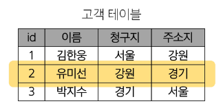

# Relational Database
* 데이터 베이스의 역할 : 데이터를 **저장(구조적 저장)**하고 조작(CRUD)
* 관계형 데이터베이스 : 데이터 간에 **관계**가 있는 데이터 항목들의 모음
    * 테이블, 행, 열의 정보를 구조화하는 방식
    * **서로 연관된 데이터 포인터를 저장**하고 이에 대한 **액세스**를 제공

        

* 관계 : 여러 테이블 간의 (논리적) 연결
    * 관계로 인해 두 테이블을 사용하여 다양한 형식으로 조회할 수 있음
        * 특정 날짜에 구매한 모든 고객 조회
        * 지난 달에 배소일이 지연된 고객 조회
        * 등등 원하는 데이터의 조회가 가능하다.
* 관계형 데이터베이스의 예시
    * 다음과 같이 고객 데이터가 테이블에 저장되어 있다고 가정
        * 고객 데이터 간 비교를 위해서 어떤 값을 활용해야 하는가? (이름, 주소가 동일하다면 어떻게 비교를 해야 하는가?) -> 각 데이터에 고유한 식별 값을 부여 -> **기본 키, Primary Key**

            

        * 다음과 같이 각 고객이 주문한 주문데이터가 테이블에 저장되어 있다고 가정
            * 누가 어떤 주문을 했는지 어떻게 식별할 수 있을까? (고객 이름이 동일하다면 어떻게 비교를 해야 하는가?) -> 주문 정보에 고객의 고유한 식별 값을 저장 -> **외래 키, Foreign Key**

                

* 관계형 데이터 베이스 관련 키워드
    1. `Table` (aka Relation)
        * 데이터를 기록 하는 곳

            

    2. `Field` (aka Colume, Attribute)
        * 각 필드에는 고유한 데이터 형식(타입)이 지정됨

            

    3. `Record` (aka Row, Tuple)
        * 각 레코드에는 구체적인 데이터 값이 저장됨

            

    4. `Database` (aka Schema)
        * 테이블의 집합

            

    5. `Primary Key` (기본 키, PK)
        * 각 레코드의 고유한 값
        * 관계형 데이터베이스에서 **레코드의 식별자**로 활용

            

    6. `Foreign Key` (외래 키, FK)
        * 테이블의 필드 중 다른 테이블의 레코드를 식별할 수 있는 키
        * 다른 테이블의 기본 키를 참조
        * 각 레코드에서 서로 다른 테이블 간의 **관계를 만드는 데** 사용

            

## RDBMS
* DBMS : Database Management System
    * 데이터베이스를 관리하는 소프트웨어 프로그램
    * 데이터 저장 및 관리를 용이하게 하는 시스템
    * 데이터베이스와 사용자 간의 인터페이스 역할
    * 사용자가 데이터 구성, 업데이트, 모니터링, 백업, 복구 등을 할 수 있도록 도움
* RDBMS : Relational Database Management System
    * 관계형 데이터베이스를 관리하는 소프트웨어 프로그램
    * 서비스 종류
        * SQLite : 경량의 오픈 소스 데이터베이스 관리 시스템
            * 컴퓨터나 모바일 기기에 내장되어 간단하고 효율적인 데이터 저장 및 관리를 제공
        * MySQL
        * PostgreSQL
        * Oracle Database
        * 등등
* 데이터베이스 정리
    * Table은 데이터가 기록 되는 곳
    * Table에는 행에서 고유하게 식별 가능한 기본 키라는 속성이 있으며, 외래 키를 사용하여 각 행에서 서로 다른 테이블 간의 관계를 만들 수 있음
    * 데이터는 기본 키 또는 외래 키를 통해 결합(`join`)될 수 있는 여러 테이블에 걸쳐 구조화 된다.