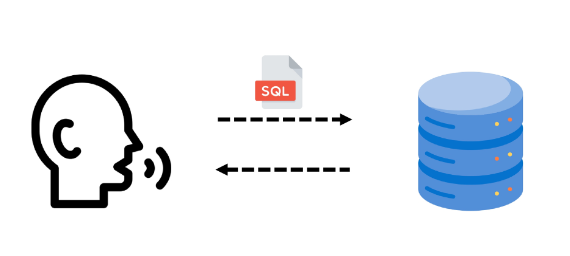

# SQL
* SQL : Structure Query Language
    * 데이터베이스에 정보를 저장하고 처리하기 위한 프로그래밍 언어
    * 테이블의 형태로 구조화(structure)된 관계형 데이터베이스에게 요청을 질의(Query)

        

* SQL Syntax
    ```sql
    SELECT column_name FROM table_name;
    ```
    1. SQL 키워드는 대소문자를 구분하지 않음
        * 하지만 대문자로 작성하는 것을 권장 (명시적 구분)
    2. 각 SQL Statements의 끝에는 세미콜론(`;`)이 필요
        * 세미콜론은 각 SQL Statments를 구분하는 방법 (명령어의 마침표)

## SQL Statements
* SQL Statements : SQL을 구성하는 가장 기본적인 코드 블록
* SQL Statements 예시

    ```sql
    SELECT column_name FROM table_name ;
    ```

    * 해당 예시 코드는 `SELECT` Statement라 부른다.
    * 이 Statement는 `SELECT`, `FROM` 2개의 keyword로 구성된다.
* 수행 목적에 따른 SQL Statements 4가지 유형

    |유형|역할|SQL keyword|
    |:---:|:---:|:---:|
    |DDL (Data Definition Language)|데이터의 기본 구조 및 형식 변경|`CREATE`, `DROP`, `ALTER`|
    |DQL (Data Query Language)|데이터 검색|`SELECT`|
    |DML (Data Manipulation Language)|데이터 조작 (추가, 수정, 삭제)|`INSERT`, `UPDATE`, `DELETE`|
    |DCL (Data Control Language)|데이터 및 작업에 대한 사용자 권한 제어|`COMMIT`, `ROLLBACK`, `GRANT`, `REVOKE`|

* Query
    * "데이터베이스로부터 정보를 요청"하는 것
    * 일반적으로 SQL로 작성하는 코드를 쿼리문(SQL문)이라 함
* SQL 표준
    * SQL은 미국 국립 표준 협회(ANSI)와 국제 표준화 기구(ISO)에 의해 표준이 채택됨
    * 모든 RDBMS에서 SQL표준을 지원
    * 다만 각 RDBMS마다 독자적인 기능에 따라 표준을 벗어나는 문법이 존재하니 주의해야 한다.