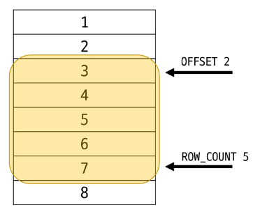

# Single Table Queries
## Querying data
* `SELECT` statement : 테이블에서 데이터를 조회
* `SELECT` syntax
    ```sql
    SELECT
        select_list
    FROM
        table_name ;
    ```
* `SELECT` 키워드 이후 데이터를 선택하려는 필드를 하나 이상 지정
    * 테이블에서 원하는 필드의 모든 데이터를 조회
        ```sql
        -- employees table에서 LastName field의 모든 데이터를 조회한다.
        SELECT
            LastName
        FROM
            employees ;
        ```
        ```sql
        -- employees table에서 LastName, FirstNmae field의 모든 데이터를 조회한다.
        SELECT
            LastName, FirstName
        FROM
            employees ;
        ```
        ```sql
        -- employees table에서 모든 field 데이터를 조회
        SELECT
            *
        FROM
            employees ;
        ```
        ```sql
        -- employees table에서 FirstName field의 모든 데이터를 조회 (단, 조회 시 FirstName이 아닌 '이름'으로 출력 될 수 있도록 변경)
        SELECT
            FirstName AS '이름'
        FROM
            employees ;
        ```
        ```sql
        -- table tracks에서 Name, Milliseconds field의 모든 데이터 조회 (단, Milliseconds field는 60000으로 나눠 분 단위 값으로 출력)
        SELECT
            Name,
            Milliseconds / 60000 AS '재생 시간(분)'
        FROM
            tracks ;
        ```
    * `SELECT` 정리
        * 테이블의 데이터를 조회 및 반환
        * `*`(asterisk)를 사용하여 모든 필드 선택
* `FROM` 키워드 이후 데이터를 선택하려는 테이블의 이름을 지정


## Sorting data
* `ORDER BY` statement : 조회 결과의 레코드를 정렬
* `ORDER BY` syntax
    * `FROM` clause 뒤에 위치
    * 하나 이상의 컬럼을 기준으로 결과를 오름차순(`ASC`, 기본값), 내림차순(`DESC`)으로 정렬
* `ORDER BY` 활용
    ```sql
    -- employees table에서 FirstName field의 모든 데이터를 오름차순으로 조회
    SELECT
        FirstName
    FROM
        employees
    ORDER BY
        FirstName ;
    ```
    ```sql
    -- employees table에서 FirstName field의 모든 데이터를 내림차순으로 조회
    SELECT
        FirstName
    FROM
        employees
    ORDER BY
        FirstName DESC ;
    ```
    ```sql
    -- customers table에서 Country field를 기준으로 내림차순 정렬한 다음 City field 기준으로 오름차순 정렬하여 조회
    SELECT
        Country, City
    FROM
        customers
    ORDER BY
        Country DESC, City ;
    ```
    ```sql
    -- tracks table에서 Milliseconds field를 기준으로 내림차순 정렬한 다음 Name, Milliseconds field의 모든 데이터를 조회 (단, Milliseconds field는 60000으로 나눠 분 단위 값으로 출력)
    SELECT
        Name, Milliseconds / 60000 AS '재생 시간(분)'
    FROM
        tracks
    ORDER BY
        Milliseconds DESC ;
    ```
* 정렬에서의 `NULL`
    ```sql
    -- `NULL`값이 존재할 경우 오름차순 정렬 시 결과에 `NULL`이 먼저 출력
    SELECT
        ReportsTo
    FROM
        employees
    ORDER BY
        ReportsTo ;
    ```

    

* `SELECT` statement 실행 순서
    1. 테이블에서 `FROM`
    2. 조회하여 `SELECT`
    3. 정렬 `ORDER BY`


## Filtering data
* Filtering data 관련 keywords
    * Clause
        * `DISTINCT` : 조회 결과에서 중복된 레코드를 제거
            ```sql
            SELECT DISTINCT
                select_list
            FROM
                table_name ;
            ORDER BY
                Country ;
            ```
            * `SELECT` keyword 바로 뒤에 작성
            * `SELECT DISTINCT` keyword 다음에 고유한 값을 선택하려는 하나 이상의 field를 지정
        * `WHERE` : 조회 시 특정 검색 조건을 지정
            ```sql
            SELECT
                select_list
            FROM
                table_name
            WHERE
                search_condition ;
            ```
            * `FROM` clause 뒤에 위치
            * `search_condition`은 비교연산자 및 논리연산자(`AND`, `OR`, `NOT` 등)를 사용하는 구문이 사용됨
            ```sql
            -- City가 'Prague'인 데이터의 LastName, FirstName, City 조회
            SELECT
                LastName, FirstName, City
            FROM
                customers
            WHERE
                City = 'Prague' ;
            ```
            ```sql
            -- City가 'Prague'가 아닌 데이터의 LastName, FirstName, City 조회
            SELECT
                LastName, FirstName, City
            FROM
                customers
            WHERE
                City != 'Prague' ;
            ```
            ```sql
            -- Company가 비어있지 않으면서 Country가 'USA'인 데이터의 LastName, FirstName, Company, Country 조회
            SELECT
                LastName, FirstName, Company, Country
            FROM
                customers
            WHERE
                Company IS NULL
                AND Country = 'USA' ;
            ```
            ```sql
            -- Company가 비어있지 않거나 Country가 'USA'인 데이터의 LastName, FirstName, Company, Country 조회
            SELECT
                LastName, FirstName, Company, Country
            FROM
                customers
            WHERE
                Company IS NULL
                OR Country = 'USA' ;
            ```
            ```sql
            -- Bytes가 100,000 이상 500,000 이하인 데이터의 Name, Bytes 조회
            SELECT
                Name, Bytes
            FROM
                tracks
            WHERE
                Bytes BETWEEN 100000 AND 500000 ;
            --WHERE
            --    Bytes >= 100000
            --    AND Bytes <= 500000 ;
            ```
            ```sql
            -- Bytes가 100,000 이상 500,000 이하인 데이터의 Name, Bytes 조회, 단 Bytes를 기준으로 오름차순으로 조회
            SELECT
                Name, Bytes
            FROM
                tracks
            WHERE
                Bytes BETWEEN 100000 AND 500000 ;
            ORDER BY
                Bytes;
            ```
            ```sql
            -- Country가 ('Canada', 'Germany', 'France')에 포함된 데이터의 LastName, FirstName, Country 조회
            SELECT
                LastName, FirstName, Country
            FROM
                customers
            WHERE
                Country IN ('Canada', 'Germany', 'France')
            -- WHERE
            --    Country = 'Canada'
            --    OR Country = 'Germany'
            --    OR Country = 'France'
            ```
            ```sql
            -- Country가 ('Canada', 'Germany', 'France')에 포함되지 않은 데이터의 LastName, FirstName, Country 조회
            SELECT
                LastName, FirstName, Country
            FROM
                customers
            WHERE
                Country NOT IN ('Canada', 'Germany', 'France')
            ```
            ```sql
            -- LastName의 field값이 'son'으로 끝나는 데이터 조회
            SELECT
                LastName, FirstName
            FROM
                customers
            WHERE LastName Like '%son';
            ```
            ```sql
            -- FirstName의 field값이 4자리 면서 'a'로 끝나는 데이터의 LastName, FirstName 조회
            SELECT
                LastName, FirstName
            FROM
                customers
            WHERE LastName Like '___a';
            ```
        * `LIMIT` : 조회하는 레코드 수를 제한
            ```sql
            -- `LIMIT` syntax
            -- 하나 또는 두 개의 인자를 사용 (0 또는 양의 정수)
            -- row_count는 조회하는 최대 레코드 수를 지정
            SELECT
                select_list
            FROM
                table_name
            LIMIT [offset,] row_count ;
            ```
            ```sql
            SELECT
                ..
            FROM
                ..
            LIMIT 2, 5 ;
            ```

            

            ```sql
            -- 테이블 tracks에서 TrackId, Name, Bytes field 데이터를 Bytes 기준 내림차순으로 7개만 조회
            SELECT
                TrackId, Name, Bytes
            FROM
                tracks
            ORDER BY Bytes DESC
            LIMIT 7 ;
            ```
            ```sql
            -- 테이블 tracks에서 TrackId, Name, Bytes field 데이터를 Bytes 기준 내림차순으로 4번째 부터 7번째 데이터만 조회
            SELECT
                TrackId, Name, Bytes
            FROM
                tracks
            ORDER BY Bytes DESC
            LIMIT 3, 4 ;
            -- LIMIT 4, OFFSET 3 ;
            ```
    * Operator
        * `BETWEEN`
        * `IN` : 값이 특정 목록 안에 있는지 확인
        * `LIKE` : 값이 특정 패턴에 일치하는지 확인 (Wildcards와 함께 사용)
            * Wildcard Charactor
                * `%` : **0개 이상의 문자열**과 일치하는지 확인
                * `_` : **단일 문자**와 일치하는지 확인
        * `Comparison` : 비교 연산자
            * `=`, `<=`, `>=`, `!=`, `IS`, `LIKE`, `IN`, `BETWEEN`, ..
        * `Logical` : 논리 연산자
            * `AND`(`&&`), `OR`(`||`), `NOT`(`!`)


## Grouping data
* `GROUP BY` clause : 레코드를 그룹화하여 요약본 생성 ('집계 함수'와 함께 사용)
* Aggregation Function : 집계 함수
    * 값에 대한 계산을 수행하고 단일한 값을 반환하는 함수 : `SUM`, `AVG`, `MAX`, `MIN`, `COUNT`
* `GROUP BY` syntax
    ```sql
    SELECT
        c1, c2, ... cn, aggregate_function(ci)
    FROM
        table_name
    GROUP BY
        c1, c2, ..., cn
    ```
    * `FROM`및 `WHERE`절 뒤에 배치
    * `GROUP BY` 절 뒤에 그룹화 할 필드 목록 생성
        1. Country 필드를 그룹화
            ```sql
            SELECT
                Country
            FROM
                customers
            GROUP BY
                Country ;
            ```
        2. COUNT 함수가 각 그룹에 대한 집계된 값을 계산 -> `LIMIT`과의 차이점
            ```sql
            SELECT
                Country, COUNT(*)
            FROM
                customers
            GROUP BY
                Country ;
            ```

            

* `GROUP BY`활용
    ```sql
    -- 테이블 tracks에서 Composer 필드를 그룹화하여 각 그룹에 대한 Bytes의 평균 값을 내림차순 조회
    SELECT
        Composer, AVG(Bytes)
    FROM
        tracks
    GROUP BY
        Composer
    ORDER BY
        AVG(Bytes) DESC ;
    ```
    ```sql
    -- SELECT에서 AS를 통하여 이름을 지정해주면 이후 지정한 이름으로 조건문 등을 작성 가능하다.
    SELECT
        Composer, AVG(Bytes) AS avg0fBytes
    FROM
        tracks
    GROUP BY
        Composer
    ORDER BY
        avg0fBytes DESC ;
    ```
    ```sql
    -- SELECT에서 AS를 통하여 이름을 지정해주면 이후 지정한 이름으로 조건문 등을 작성 가능하다.
    SELECT
        Composer, AVG(Milliseconds / 60000) AS avg0fBytes
    FROM
        tracks
    WHERE
        avg0fBytes < 10
    GROUP BY
        Composer ;
    -- 에러 발생 : Invalid use of group function -> HAVING절 사용
    ```
* `HAVING` clause
    * 집계 항목에 대한 세부 조건을 지정
    * 주로 `GROUP BY`와 함께 사용되며 `GROUP BY`가 없다면 `WHERE`처럼 동작
    ```sql
    SELECT
        Composer, AVG(Milliseconds / 60000) AS avg0fBytes
    FROM
        tracks
    GROUP BY
        Composer
    HAVING
        avg0fBytes < 10 ;
    ```
* `SELECT` statement 실행 순서
p.154