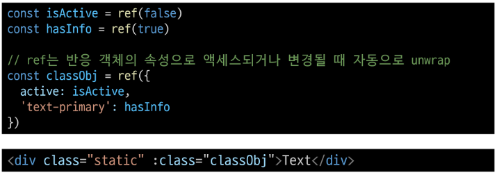
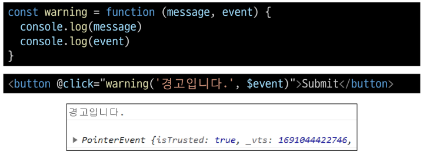
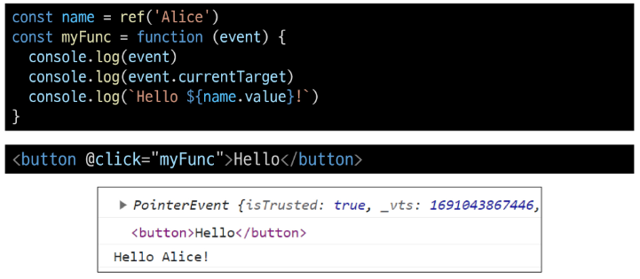
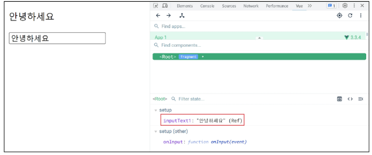
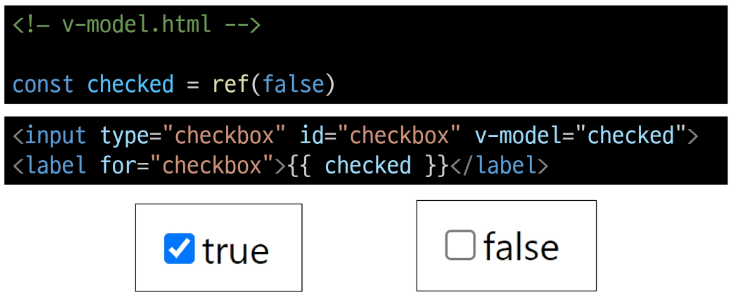
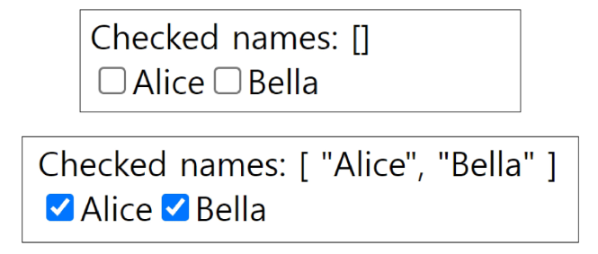
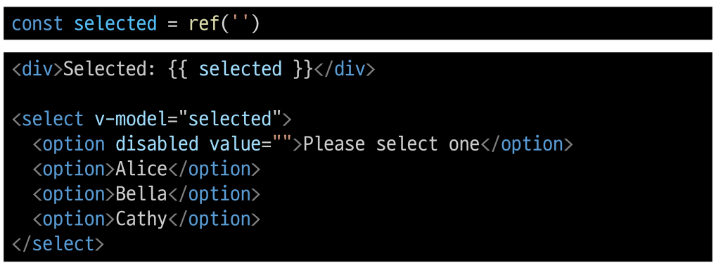

# Basic Syntax 1

## Template Syntax
* Template Syntax
    * DOM을 기본 구성 요소 인스턴스의 데이터에 <a>선언적으로 바인딩(Vue Instance와 DOM을 연결)</a>할 수 있는 HTML 기반 <a>템플릿 구문(확장된 문법 제공)</a>을 사용
* Template Syntax 종류
    1. Text Interpolation
        ```js
        <p>Message: {{ msg }}</p>
        ```
        * 데이터 바인딩의 가장 기본적인 형태
        * 이중 중괄호 구문 (콧수염 구문)을 사용
        * 콧수염 구문은 해당 구성 요소 인스턴스의 msg 속성 값으로 대체
        * msg 속성이 변경될 때마다 업데이트 됨
    2. Raw HTML
        ```js
        <div v-html="rawHtml"></div>
        ```
        ```js
        const rawHtml = ref('<span style="color:red">This should be red.<>/span')
        ```

        
        
        * 콧수염 구문은 데이터를 일반 텍스트로 해석하기 때문에 실제 HTML을 출력하려면 v-html을 사용해야 함
    3. Attribute Bindings
        ```js
        <div v-bind:id="dynamicId"></div>
        ```
        ```js
        const dynamicId = ref('my-id')
        ```

        

        * 콧수염 구문은 HTML 속성 내에서 사용할 수 없기 때문에 v-bind를 사용
        * HTML의 id 속성 값을 vue의 dynamicId 속성과 동기화 되도록 함
        * 바인딩 값이 `null`이나 `undefined`인 경우 렌더링 요소에서 제거됨
    4. JavaScript Expressions

        

        * Vue는 모든 데이터 바인딩 내에서 JavaScript 표현식의 모든 기능을 지원
        * Vue 템플릿에서 JavaScript 표현식을 사용할 수 있는 위치
            1. 콧수염 구문 내부
            2. 모든 directive의 속성값(`v-`로 시작하는 특수 속성)
        * Expression 주의사항
            * 각 바인딩에는 하나의 단일 표현식만 포함될 수 있음
                - 표현식은 값으로 평가할 수 있는 코드 조각(return 뒤에 사용할 수 있는 코드여야 한다.)
            * 작동하지 않는 경우
                ```js
                // 표현식이 아닌 선언식
                {{ const number = 1 }}

                // 제어문은 삼항 표현식을 사용해야 함
                {{ if (ok) { return message } }}
                ```

### Directive
* Directive
    * `v-` 접두사가 있는 특수 속성
    * 특징
        * Directive의 속성 값은 단일 JavaScript 표현식이어야 함(`v-for`, `v-on` 제외)
        * 표현식 값이 변경될 때 DOM에 반응적으로 업데이트를 적용
        * 예시

            ```js
            <p v-if="seen">Hi There</p>
            ```
* Directive 전체 구문

    

    * Arguments
        * 일부 directive는 directive 뒤에 콜론(`:`)으로 표시되는 인자를 사용할 수 있음
        * 아래 예시의 href는 HTML `<a>` 요소의 href 속성 값을 myUrl값에 바인딩하도록 하는 v-bind의 인자

            ```js
            <a v-bind:href="myUrl">Link</a>
            ```

        * 아래 예시의 click은 이벤트 수신할 이벤트 이름을 작성하는 `v-on`의 인자

            ```js
            <button v-on:click="doSomething">Button</button>
            ```

    * Modifiers
        * `.(dot)`으로 표시되는 특수 접미사로, directive가 특별한 방식으로 바인딩되어야 함을 나타냄
        * 아래 예시의 `.prevent`는 발생한 이벤트에서 `event.preventDefault()`를 호출하도록 `v-on`에 지시하는 modifier

            ```js
            <form v-on:submit.prevent="onSubmit">...</form>
            ```

* Built-in Directives
    * `v-text`
    * `v-show`
    * `v-if`
    * `v-for`
    * ...
    * [공식 문서](https://vuejs.org/api/built-in-directives.html)


## Dynamically data binding

### v-bind
* `v-bind`
    * 하나 이상의 속성 또는 컴포넌트 데이터를 표현식에 동적으로 바인딩
* `v-bind`사용처
    1. Attribute Bindings
    2. Class and Style Bindings

### Attribute Bindings
* HTML의 속성 값을 Vue의 상태 속성 값과 동기화 되도록 함
    ```js
    // v-bind.html
    
    <a v-bind:href="myUrl">Move to url</a>
    ```
* v-bind shorthand(약어)
    - `:`(colon)
    ```js
    
    <a :href="myUrl">Move to url</a>
    ```
* Dynamic attribute name (동적 인자 이름)
    * 대괄호([])로 감싸서 directive argument에 JavaScript 표현식을 사용할 수도 있음
    * JavaScript 표현식에 따라 동적으로 평가된 값이 최종 argument값으로 사용됨

        ```js
        <button :[key]="myValue"></button>
        // 대괄호 안에 작성하는 이름은 반드시 소문자로만 구성가능
        // 브라우저가 속성 이름을 소문자로 강제 변환하기 때문에
        ```
* 예시

    

    


### Class and Style Bindings
* class와 style은 모두 HTML 속성이므로 다른 속성과 마찬가지로 v-bind를 사용하여 동적으로 문자열 값을 할당할 수 있음
* Vue는 class 및 style 속성 값을 v-bind로 사용할 때 <a>객체</a> 또는 <a>배열</a>을 활용하여 작성할 수 있도록 함
    * 단순히 문자열 연결을 사용하여 이러한 값을 생성하는 것은 번거롭고 오류가 발생하기 쉽기 때문
* Class and Style Bindings가 가능한 경우
    1. Bindings HTML Classes
        1. Binding to Objects
            * 객체를 `:class`에 전달하여 클래스를 동적으로 전환할 수 있음
            * 예시 1 : `isActive`의 Boolean 값에 의해 active 클래스의 존재가 결정됨

                

            * 객체에 더 많은 필드를 포함하여 여러 클래스를 전환할 수 있음
            * 예시 2 : `:class` directive를 일반 클래스 속성과 함께 사용 가능

                

            * 반드시 inline 방식으로 작성하지 않아도 됨
            * 반응형 변수를 활용해 객체를 한번에 작성하는 방법

                

        2. Binding to Arrays
            * `:class`를 배열에 바인딩하여 클래스 목록을 적용할 수 있음
            * 예시 1

                

            * 배열 구문 내에서 객체 구문을 사용하는 경우
            * 예시 2

                

    2. Bindings Inline Styles
        * 2.1 Binding to Objects
            * `:style`은 JavaScript 객체 값에 대한 바인딩을 지원(HTML style 속성에 해당)
            * 예시 1

                

            * 실제 CSS에서 사용하는 것처럼 `:style`은 kebab-cased 키 문자열도 지원(단, camelCase 작성을 권장)
            * 예시 2

                

            * 반드시 inline 방식으로 작성하지 않아도 됨
            * 반응형 변수를 활용해 객체를 한번에 작성하는 방법
            * 예시 3

                

        * 2.2 Binding to Arrays
            * 여러 스타일 객체를 배열에 작성해서 `:style`을 바인딩할 수 있음
            * 작성한 객체는 병합되어 동일한 요소에 적용
            * 예시

                

* [v-bind 종합](https://vuejs.org/api/built-in-directives.html#v-bind)


## Event Handling

### v-on
* v-on
    * DOM 요소에 이벤트 리스너를 연결 및 수신
* v-on 구성

    ```js
    v-on:event="handler"
    ```

    * handler 종류
        1. Inline handlers : 이벤트가 트리거 될 때 실행 될 JavaScript 코드
            * Inline handlers는 주로 간단한 상황에 사용

                

            * Inline Handlers에서의 메서드 호출
                * 메서드 이름에 직접 바인딩하는 대신 Inline Handlers에서 메서드를 호출할 수도 있음
                * 이렇게 하면 기본 이벤트 대신 사용자 지정 인자를 전달할 수 있음

                

            * Inline Handlers에서의 event 인자에 접근하기
                * Inline Handlers에서 원래 DOM 이벤트에 접근하기
                * `$event`변수를 사용하여 메서드에 전달

                

        2. Method handlers : 컴포넌트에 정의된 메서드 이름
            * Inline handlers로는 불가능한 대부분의 상황에서 사용

                

            * Method Handlers는 이를 트리거하는 기본 DOM Event 객체를 자동으로 수신

                

    * v-on shorthand(약어)
        - `@`

        ```js
        @event="handler"
        ```
* Event Modifiers
    * Vue는 `v-on`에 대한 Event Modifiers를 제공해 `event.preventDefault()`와 같은 구문을 메서드에서 작성하지 않도록 함
    * `stop`, `prevent`, `self`등 다양한 modifiers를 제공
    * 메서드는 DOM 이벤트에 대한 처리보다는 데이터에 관한 논리를 작성하는 것에 집중할 것

        

* Key Modifiers
    * Vue는 키보드 이벤트를 수신할 때 특정 키에 관한 별도 modifiers를 사용할 수 있음
    * 예시
        - key가 Enter 일 때만 onSubmit 이벤트를 호출하기

        

* [v-on 종합](https://vuejs.org/api/built-in-directives.html#v-on)


## Form Input Bindings

### v-model
* Form Input Bindings
    * form을 처리할 때 사용자가 input에 입력하는 값을 실시간으로 JavaScript 상태에 동기화해야 하는 경우(<a>양방향 바인딩</a>)
    * 양방향 바인딩 방법
        1. v-bind와 v-on을 함께 사용
            1. v-bind를 사용하여 input 요소의 value 속성 값을 입력 값으로 사용
            2. v-on을 사용하여 input 이벤트가 발생할 때마다 input요소의 value 값을 별도 반응형 변수에 저장하는 핸들러를 호출

                

                

        2. v-model 사용 : form input 요소 또는 컴포넌트에서 양방향 바인딩을 만듦
            * v-model을 사용하여 사용자 입력 데이터와 반응형 변수를 실시간 동기화
            * IME가 필요한 언어(한국어, 중국어, 일본어 등)의 경우 v-model이 제대로 업데이트 되지 않음
            * 해당 언어에 대해 올바르게 응답하려면 v-bind와 v-on 방법을 사용해야 한다.

                

### v-model 활용
* v-model과 다양한 입력(input) 양식
    * v-model은 단순 Text input 뿐만 아니라 Checkbox, Radio, Select 등 다양한 타입의 사용자 입력 방식과 함께 사용 가능
1. 단일 체크박스와 boolean 값 활용

    

2. 여러 체크박스와 배열 활용
    * 해당 배열에는 현재 선택된 체크박스의 값이 포함됨

        

        

* Select활용
    * Select에서 v-model 표현식의 초기 값이 어떤 option과도 일치하지 않는 경우 select 요소는 "선택되지 않은(unselected)" 상태로 렌더링 됨

        

        

* [v-model 종합](https://vuejs.org/api/built-in-directives.html#v-model)


## 참고
* `$`접두어가 붙은 변수
    * Vue 인스턴스 내에서 제공되는 내부 변수
    * 사용자가 지정한 반응형 변수나 메서드와 구분하기 위함
    * 주로 Vue 인스턴스 내부 상태를 다룰 때 사용
* IME(Input Method Editor)
    * 사용자가 입력 장치에서 기본적으로 사용할 수 없는 문자(비영어권 영어)를 입력할 수 있도록 하는 운영 체제 구성 프로그램
    * 일반적으로 키보드 키보다 자모가 더 많은 언어에서 사용해야 함
    * IME가 동작하는 방식과 Vue의 양방향 바인딩(v-model) 동작 방식이 상충하기 때문에 한국어 입력 시 예상대로 동작하지 않았던 것