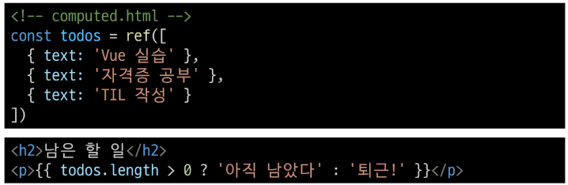
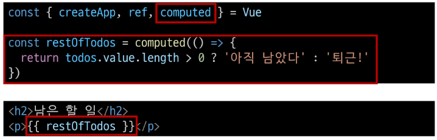
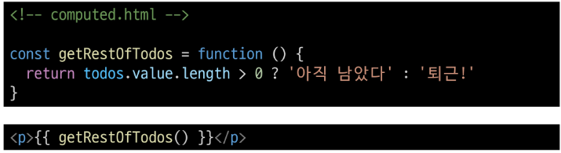
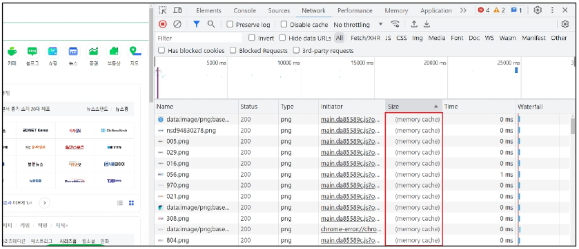
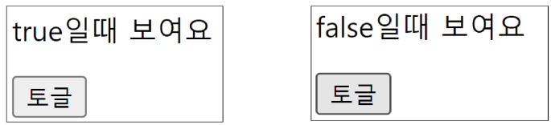
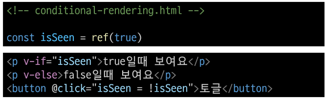
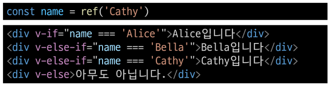
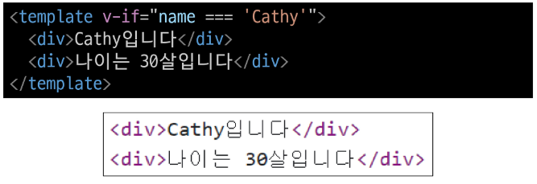

# Basic Syntax 2

## Computed Property

### Computed
* `computed()`
    * "계산된 속성"을 정의하는 함수
    * 미리 계산된 속성을 사용하여 템플릿에서 표현식을 단순하게 하고 불필요한 반복 연산을 줄임
* 예시
    * 할 일이 남았는지 여부에 따라 다른 메세지를 출력하기

        

    * 템플릿이 복잡해지며 todos에 따라 계산을 수행하게 됨
    * 만약 이 계산을 템플릿에 여러 번 사용하는 경우에는 반복이 발생
    * `computed()` 적용
    * 반응형 데이터를 포함하는 복잡한 로직의 경우 computed를 활용하여 미리 값을 계산하여 계산된 값을 사용

        

* computed 특징
    * 반환되는 값은 computed ref이며 일반 refs와 유사하게 계산된 결과를 `.value`로 참조 할 수 있음 (템플릿에서는 .value 생략 가능)
    * computed 속성은 의존된 반응형 데이터를 <a>자동으로 추적</a>
    * 의존하는 데이터가 변경될 때만 재평가
        * rest0Todos의 계산은 todos에 의존하고 있음
        * 따라서 <a>todos가 변경될 때만 rest0Todos가 없데이트</a> 됨

### Computed vs. Methods
* computed와 동일한 로직을 처리할 수 있는 method
    * computed 속성 대신 method로도 동일한 기능을 정의할 수 있음

        

* computed vs. method
    * computed 속성은 <a>의존된 반응형 데이터를 기반으로 캐시(cached)</a>된다.
    * 의존하는 데이터가 변경된 경우에만 재평가됨
    * 즉, 의존된 반응형 데이터가 변경되지 않는 한 이미 계산된 결과에 대한 여러 참조는 다시 평가할 필요 없이 이전에 계산된 결과를 즉시 반환
    * 반면, method 호출은 다시 렌더링이 발생할 때마다 항상 함수를 실행
* Cache(캐시)
    * 데이터나 결과를 일시적으로 저장해두는 임시 저장소
    * 이후에 같은 데이터나 결과를 다시 계산하지 않고 빠르게 접근할 수 있도록 함
    * 예시
        * "웹 페이지의 캐시 데이터"
            - 과거 방문한 적이 있는 페이지에 다시 접속할 경우
            - 페이지 일부 데이터를 브라우저 캐시에 저장 후 같은 페이지에 다시 요청 시 모든 데이터를 다시 응답 받는 것이 아닌 일부 캐시 된 데이터를 사용하여 더 빠르게 웹 페이지를 렌더링

            

* computed와 method의 적절한 사용처
    * computed
        * 의존하는 데이터에 따라 결과가 바뀌는 계산된 속성을 만들 때 유용
        * 동일한 의존성을 가진 여러 곳에서 사용할 때 계산 결과를 캐싱하여 중복 계산 방지
    * method
        * 단순히 특정 동작을 수행하는 함수를 정의할 때 사용
        * 데이터에 의존하는지 여부와 관계없이 항상 동일한 결과를 반환하는 함수
* computed와 method 정리
    * computed
        * 의존된 데이터가 변경되면 자동으로 업데이트
    * method
        * 호출해야만 실행됨
    * 무조건 computed만 사용하는 것이 아니라 사용 목적과 상황에 맞게 computed와 method를 적절히 조합하여 사용

## Conditional Rendering

### v-if
* `v-if`
    * 표현식 값의 true/false를 기반으로 요소를 조건부로 렌더링
* 예시
    * `v-else` directive를 사용하여 `v-if`에 대한 `else` 블록을 나타낼 수 있음

        

    * `v-else` directive를 사용하여 `v-if`에 대한 `else` 블록을 나타낼 수 있음

        

    * `v-else-if` directive를 사용하여 `v-if`에 대한 `else if`블록을 나타낼 수 있음

        

* 여러 요소에 대한 `v-if` 적용
    * HTML template 요소에 `v-if`를 사용하여 하나 이상의 요소에 대해 적용할 수 있음(`v-else`, `v-else-if` 모두 적용 가능)

        

* HTML template element
    * 페이지가 로드 될 때 렌더링 되지 않지만 JavaScript를 사용하여 나중에 문서에서 사용할 수 있도록 하는 HTML을 보유하기 위한 메커니즘
    * 보이지 않는 wrapper 역할

### v-if vs v-show

## List Rendering

### v-for

### v-for with key

### v-for with v-if

## Watchers

### watch

### computed vs. watch

## Lifecycle Hooks

## Vue Style Guide