# Router

## Routing
* Routing : 네트워크에서 경로를 선택하는 프로세스
    * 웹 어플리케이션에서 다른 페이지 간의 전환과 경로를 관리하는 기술
* SSR에서의 Routing

    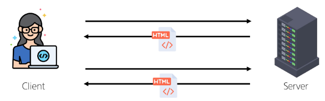

    * SSR에서 routing은 서버 측에서 수행
    * 서버가 사용자가 방문한 URL 경로를 기반으로 응답을 전송
    * 링크를 클릭하면 브라우저는 서버로부터 HTML 응답을 수신하고 새 HTML로 전체 페이지를 다시 로드
* CSR에서의 Routing

    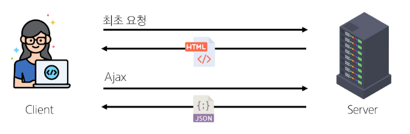

    * CSR에서 routing은 <a>클라이언트 측</a>에서 수행
    * 클라이언트 측 JavaScript가 새 데이터를 동적으로 가져와 전체 페이지를 다시 로드 하지 않음
* SPA에서 Routing이 없다면
    * 유저가 URL을 통한 페이지의 변화를 감지할 수 없음
    * 페이지가 무엇을 렌더링 중인지에 대한 상태를 알 수 없음
        * URL이 1개이기 때문에 새로 고침 시 처음 페이지로 되돌아감
        * 링크를 공유할 시 첫 페이지만 공유 가능
    * 브라우저의 뒤로 가기 기능을 사용할 수 없음
    * 페이지는 1개이지만, 주소에 따라 여러 컴포넌트를 새로 렌더링하여 마치 여러 페이지를 사용하는 것처럼 보이도록 해야 함

## Vue Router
* Vue Router
    * Vue 공식 라우터 (The official Router for Vue.js)
* 사전 준비
    * Vite로 프로젝트 생성시 Router 추가

        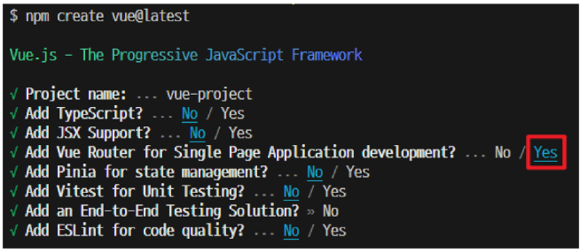

    * 서버 실행 후 Router로 인한 프로젝트 변화 확인
    * Home, About 링크에 따라 변경되는 URL과 새로 렌더링 되는 화면

        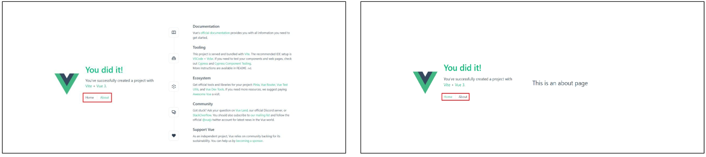

* Vue 프로젝트 구조 변화

    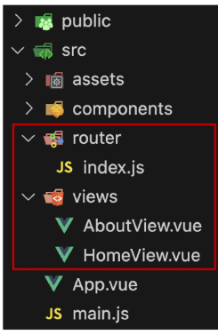

    1. App.vue 코드 변화
        * `RouterLink`

            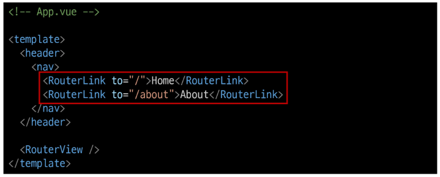

            * 페이지를 다시 로드 하지 않고 URL을 변경하여 URL 생성 및 관련 로직을 처리
            * HTML의 `<a>`태그를 렌더링
        * `RouterView`

            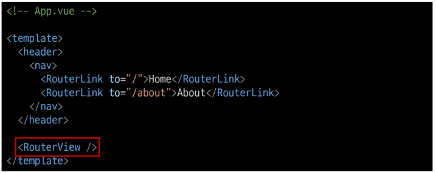

            * `RouterLink` URL에 해당하는 컴포넌트를 표시
            * 원하는 곳에 배치하여 컴포넌트를 레이아웃에 표시할 수 있음
        * `RouterLink`와 `RouterView`

            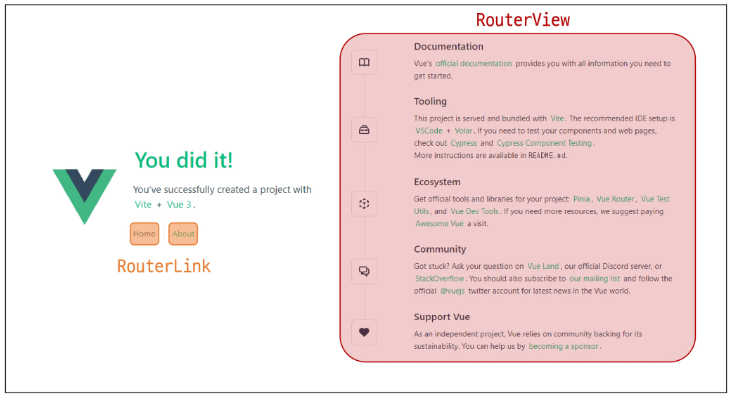

    2. router 폴더 신규 생성
        * `router/index.js`

            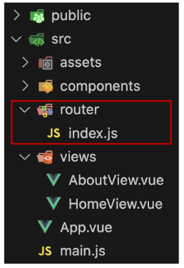

            * 라우팅에 관련된 정보 및 설정이 작성되는 곳
            * router에 URL과 컴포넌트를 매핑
    3. views 폴더 신규 생성
        * `views`

            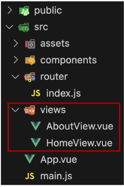

            * `RouterView`위치에 렌더링 할 컴포넌트를 배치
            * 기존 components 폴더와 기능적으로 다른 것은 없으며 단순 분류의 의미로 구성됨
            * <a>일반 컴포넌트와 구분하기 위해 컴포넌트 이름을 View로 끝나도록 작성하는 것을 권장</a>

### Basic Routing
* 라우팅 기본
    1. `index.js`에 라우터 관련 설정 작성(주소, 이름, 컴포넌트)

        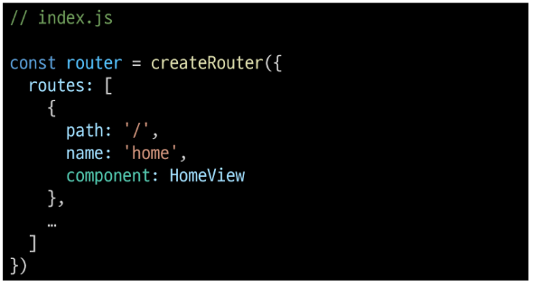

    2. `RouterLink`의 `to`속성으로 `index.js`에서 정의한 주소값(path)을 사용

        

    3. `RouterLink` 클릭 시 경로와 일치하는 컴포넌트가 `RouterView`에서 렌더링 됨

        

### Named Routes
* Named Routes
    * 경로에 이름을 지정하는 라우팅
    * [공식문서](https://router.vuejs.org/guide/essentials/named-routes.html)
* Named Routes 예시

    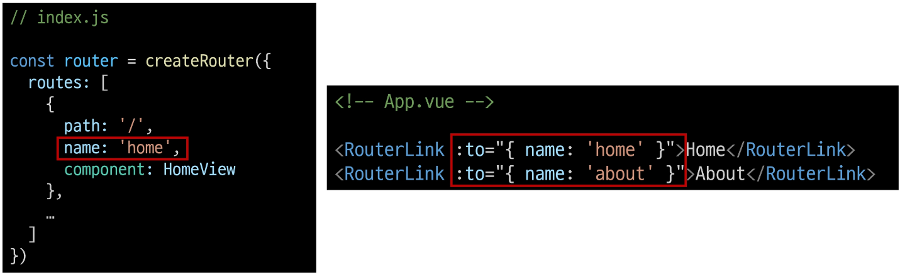

    * name 속성 값에 경로에 대한 이름을 지정
    * 경로에 연결하려면 `RouterLink`에 `v-bind`를 사용해 `to` props 객체로 전달
* Named Routes 장점
    * 하드 코딩 된 URL을 사용하지 않아도 된다.
    * URL 입력 시 오타 방지

### Dynamic Route Matching
* Dynamic Route Matching
    * URL의 일부를 변수로 사용하여 경로를 동적으로 매칭
    * [공식 문서](https://router.vuejs.org/guide/essentials/dynamic-matching.html)
* 매개변수를 사용한 동적 경로 매칭
    * 주어진 패턴 경로를 동일한 컴포넌트에 매핑 해야 하는 경우 활용
    * 예를 들어 모든 사용자의 ID를 활용하여 프로필 페이지 URL을 설계한다면
        - user/1
        - user/2
        - user/3
        - 일정한 패턴의 URL 작성을 반복해야 함
* 매개변수를 사용한 동적 경로 매칭 활용
    * `views` 폴더 내 `UserView` 컴포넌트 작성

        

    * 매개 변수는 콜런(`:`)으로 표기 -> `UserView` 컴포넌트 라우트 등록

        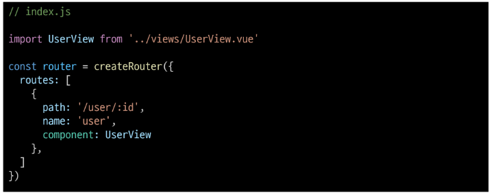

    * 매개변수는 객체의 params 속성의 객체 타입으로 전달
    * 단, 객체의 key 이름과 index.js에서 지정한 매개변수 이름이 같아야 함 -> `UserView` 컴포넌트로 이동하기 위한 `RouterLink` 작성

        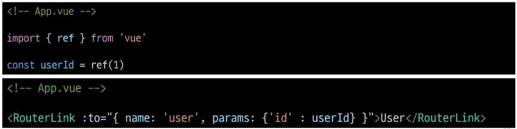

    * 경로가 일치하면 라우트의 매개변수는 컴포넌트에서 <a>$route.params</a>로 참조 가능 -> 현재 사용자의 id를 출력하기

        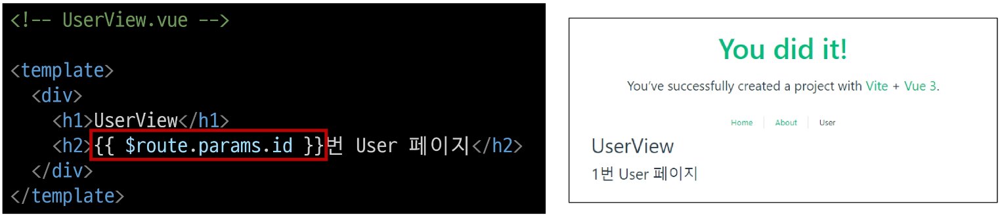

    * `useRoute()`함수를 사용해 스크립트 내에서 반응형 변수에 할당 후 템플릿에 출력하는 것을 권장
    * 템플릿에서 `$route`를 사용하는 것과 동일

        

### Nested Routes

### Programmatic Navigation

## Navigation Guard

### Globally Guard

### Per-route Guard

### In-component Guard