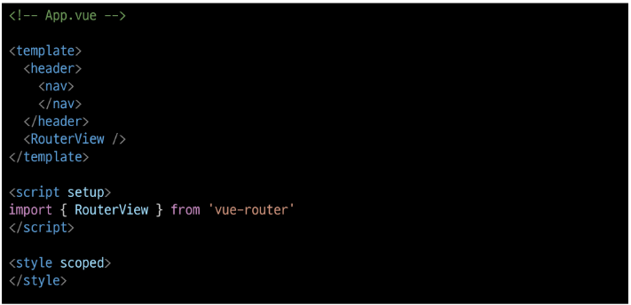
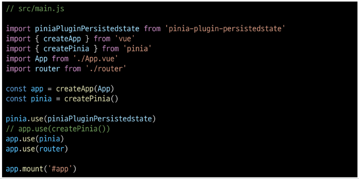
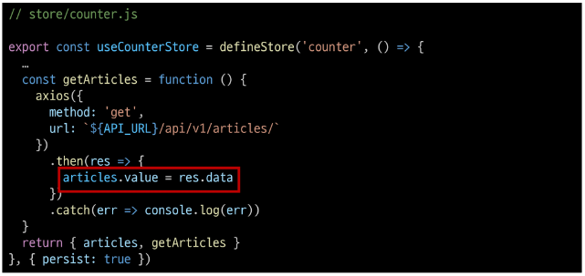

# Vue with DRF 1

## 프로젝트 개요
* Vue with DRF 1, 2에서 할 일
    * Vue with DRF 1
        - Vue와 DRF 간 기본적인 요청과 응답
    * Vue with DRF 2
        - Vue와 DRF에서의 인증 시스템

### DRF 프로젝트 안내
* 스켈레톤 프로젝트 django-pjt 제공
* 외부 패키지 및 라이브러리는 requirements.txt에 작성되어 있음
    *  DRF 프로젝트는 "주석을 해제"하며 진행
* skeleton code
    * Model 클래스 확인

        

    * URL 확인

        

    * Serializers 확인

        

    * views.py의 import 부분 확인

        

    * view 함수 확인

        

    * settings.py 확인

        

        

    * Fixtures 확인

        

    * 가상 환경 생성 및 활성화

        ```python
        $ python -m venv venv
        $ source venv/Scripts/activate
        ```

    * 패키지 설치

        ```python
        $ pip install -r requirements.txt
        ```

    * Migration 진행

        ```python
        $ python manage.py makemigrations
        $ python manage.py migrate
        ```

    * Fixtures 데이터 로드

        ```python
        python manage.py loaddata articles.json
        ```

    * Django 서버 실행 후, 전체 게시글 조회 요청

        


### Vue 프로젝트 안내
* 스켈레톤 프로젝트 vue-pjt 제공
* Vite를 사용해 Pinia 및 Vue Router가 추가 되어있음
* pinia-plugin-persistedstate가 설치 및 등록 되어있음
* Vue 프로젝트는 "직접 코드를 작성"하며 진행
* 컴포넌트 구조

    

* 프로젝트 구조

    

* skeleton code
    * App 컴포넌트

        

    * route에 등록된 컴포넌트 (Article, Create, Detail, LogIn, SignUp)

        

    * ArticleList 컴포넌트

        

    * ArticleListItem 컴포넌트

        

    * routes 현황

        

    * store 현황

        

    * main.js 현황

        

    * 패키지 설치

        ```python
        $npm install
        ```

    * 서버 실행

        ```python
        $npm run dev
        ```


## 메인 페이지 구현
* 무결점 프로젝트를 만드는 것이 목표가 아님
* frontend 프레임워크와 backend 프레임워크 간의 요청과 응답, 그 과정에서 등장하는 새로운 개념과 문제를 해결하면서 하나의 웹 어플리케이션 서비스를 구현하는 과정에 집중할 것

### 게시글 목록 출력
* ArticleView 컴포넌트에 ArticleList 컴포넌트와 ArticleListItem 컴포넌트 등록 및 출력하기
* ArticleList와 ArticleListitem은 각각 게시글 출력을 담당
* 게시글 목록 출력
    * ArticleView의 route 관련 주석 해제

        

    * App 컴포넌트에 ArticleView 컴포넌트로 이동하는 RouterLink 작성

        

    * ArticleView 컴포넌트에 ArticleList 컴포넌트 등록

        

    * store에 임시 데이터 articles 배열 작성하기

        

    * ArticleList 컴포넌트에서 게시글 목록 출력, store의 articles 데이터 참조, v-for를 활용하여 하위 컴포넌트에서 사용할 article 단일 객체 정보를 props로 전달

        

    * ArticleListItem 컴포넌트는 내려 받은 props를 정의 후 출력

        

    * 메인 페이지에서 게시글 목록 출력 확인

        


### DRF와의 요청과 응답
* DRF로부터 응답 데이터 받기
    * 이제는 임시 데이터가 아닌 DRF 서버에 요청하여 데이터를 응답 받아 store에 저장 후 출력하기
* DRF와의 요청과 응답
    * DRF 서버로의 AJAX 요청을 위한 axios 설치 및 관련 코드 작성

        

    * DRF 서버로 요청을 보내고 응답 데이터를 처리하는 getArticles 함수

        

    * ArticleView 컴포넌트가 마운트 될 때 getArticles 함수가 실행되도록 한다.
    * 해당 컴포넌트가 렌더링 될 때 항상 최신 게시글 목록을 불러오기 위함

        

    * Vue와 DRF 서버를 모두 실행한 후 응답 데이터 확인 -> 에러 발생

        

    * 그런데 DRF 서버 측에서는 문제 없이 응답(200 OK) -> 서버는 응답했으나 브라우저 측에서 거절한 것

        

    * 브라우저가 거절한 이유 - 'localhost:5173'에서 '127.0.0.1:8000/api/v1/articles/'의 XMLHttpRequest'에 대한 접근이 <a>CORS policy</a>에 의해 차단되었다.

        


## CORS Policy

### CORS Policy
* SOP : Same-origin policy
    * 어떤 출처(Origin)에서 불러온 문서나 스크립트가 다른 출처에서 가져온 리소스와 상호 작용하는 것을 제한하는 보안 방식
    * "다른 곳에서 가져온 자료는 일단 막는다."
    * 웹 어플리케이션의 도메인이 다른 도메인의 리소스에 접근하는 것을 제어하여 사용자의 개인 정보와 데이터의 보안을 보호하고, 잠재적인 보안 위협을 방지
    * 잠재적으로 해로울 수 있는 문서를 분리함으로써 공격받을 수 있는 경로를 줄임
    * [공식 문서](https://developer.mozilla.org/en-US/docs/Web/Security/Same-origin_policy)
* Origin (출처)
    * URL의 Protocol, Host, Port를 모두 포함하여 "출처"라고 부름
    * Same Origin 예시
        - 아래 <a>세 영역이 일치하는 경우에만 동일 출처(Same-origin)</a>로 인정

        
    * Same origin 예시
        - 'https://localhost:3000/articles/3/'을 기준으로 동일 출처 여부를 비교

        

* CORS policy의 등장
    * 기본적으로 웹 브라우저는 같은 출처에서만 요청하는 것을 허용하며, 다른 출처로의 요청은 보안상의 이유로 차단됨
        - SOP에 의해 다른 출처의 리소스와 상호작용 하는 것이 기본적으로 제한되기 때문
    * 하지만 현대 웹 어플리케이션은 다양한 출처로부터 리소스를 요청하는 경우가 많기 때문에 CORS 정책이 필요하게 되었음
    * <a>CORS</a>는 웹 서버가 리소스에 대한 서로 다른 출처 간 접근을 허용하도록 선택할 수 있는 기능을 제공
* CORS (Cross-Origin Resource Sharing)
    * 특정 출처에서 실행 중인 웹 어플리케이션이 <a>다른 출처의 자원에 접근할 수 있는 권한을 부여</a>하도록 브라우저에 알려주는 체제
    * 만약 다른 출처의 리소스를 가져오기 위해서는 이를 제공하는 서버가 브라우저에게 다른 출처지만 접근해도 된다는 사실을 알려야 함
    * "CORS policy(교차 출처 리소스 공유 정책)"
* CORS Policy (Cross-Origin Resource Sharing Policy)
    * 다른 출처에서 온 리소스를 공유하는 것에 대한 정책
    * 서버에서 설정되며, 브라우저가 해당 정책을 확인하여 요청이 허용되는지 여부를 결정
    * 다른 출처의 리소스를 불러오려면 그 다른 출처에서 올바른 <a>CORS header를 포함한 응답을 반환</a>해야 함
    * [공식 문서](https://developer.mozilla.org/ko/docs/Web/HTTP/CORS)
* CORS 적용 방법

    

* CORS policy 정리
    * 웹 어플리케이션이 다른 도메인에 있는 리소스에 안전하게 접근할 수 있도록 허용 또는 차단하는 보안 메커니즘
    * 서버가 약속된 CORS Header를 포함하여 응답한다면 브라우저는 해당 요청을 허용
    * 서버에 CORS Header를 만들어야 한다.
    * [공식 문서](https://developer.mozilla.org/ko/docs/WEB/HTTP/CORS)

### CORS Headers 설정
* CORS Headers 설정
    * Django에서는 django-cors-headers 라이브러라 활용
    * 손쉽게 응답 객체에 CORS header를 추가해주는 라이브러리
    * [공식 문서](https://github.com/adamchainz/django-cors-headers)
* django-cors-headers 사용하기
    * 설치(requirements.txt로 인해 사전에 설치되어 있음)

        ```python
        $pip install django-cors-headers
        ```

    * 관련 코드 주석 해제

        

    * CORS를 허용할 Vue 프로젝트의 Domain 등록

        

* CORS 처리 결과
    * 메인 페이지에서 DRF 응답 데이터 재확인

        

        

    * 응답 객체에서 'Access-Control-Allow-Origin' Header 확인
        - 개발자도구-Network-Fetch/XHR

            


## Article CR 구현

### 전체 게시글 조회
* 응답 받은 데이터에서 각 게시글의 데이터 구성 확인(id, title, content)

    

* store에 게시글 목록 데이터 저장

    

* store에 저장된 게시글 목록 출력 확인
    - pinia-plugin-persistedstate에 의해 브라우저 Local Storage에 저장됨

    


### 단일 게시글 조회
* DetailVue 관련 route 주석 해제

    

* ArticleListItem에 DetailView 컴포넌트로 가기 위한 RouterLink

    

* DetailView가 마운트 될 때 특정 게시글을 조회하는 AJAX 요청 진행

    

* 응답 데이터 확인

    

* 응답 데이터 저장 후 출력

    

* 결과 확인

    


### 게시글 작성
* CreateView 관련 route 주석 해제

    

* ArticleView에 CreateView 컴포넌트로 가기 위한 RouterLink 작성

    

* v-model을 사용해 사용자 입력 데이터를 양방향 바인딩, v-model의 trim 수식어를 사용해 사용자 입력 데이터의 공백을 제거

    

* 양방향 바인딩 데이터 입력 확인

    

* 게시글 생성 요청을 담당하는 createArticle 함수 작성, 게시글 생성이 성공한다면 ArticleView 컴포넌트로 이동

    

* submit 이벤트가 발생하면 createArticle 함수를 호출, v-on의 prevent 수식어를 사용해 submit 이벤트의 기본 동작 취소

    

* 게시글 생성 결과 확인

    

* 서버 측 DB 확인

    