# Vue with DRF 2

## Authentication with DRF
* 시작하기 전에
    * 인증 로직 진행을 위해 User 모델 관련 코드 활성화, user ForeignKey 주석 해제

        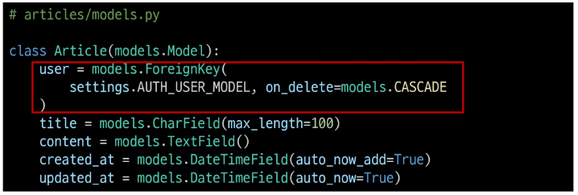

    * serializers의 read_only_fields 주석 해제

        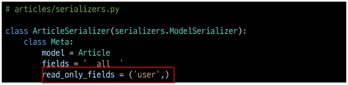

    * article_list view 함수에서 게시글 생성 시 user 정보도 저장될 수 있도록 주석 해제

        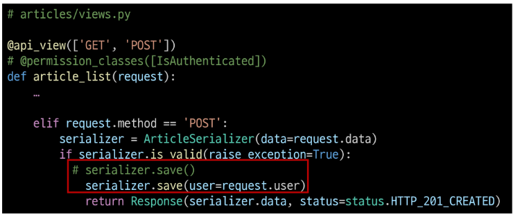

    * 추가로 할것
        1. DB 초기화
            - db.sqlite3 삭제
            - migrations 파일 삭제
        2. Migration 과정 재진행

### 인증
* Authentication(인증)
    * 수신된 요청을 해당 요청의 사용자 또는 자격 증명과 연결하는 메커니즘
    * 누구인지를 확인하는 과정
* Permissions(권한)
    * 요청에 대한 접근 허용 또는 거부 여부를 결정
* 인증과 권한
    * 순서상 인증이 먼저 진행되며 수신 요청을 해당 요청의 사용자 또는 해당 요청이 서명된 토큰(token)과 같은 자격 증명 자료와 연결
    * 그런 다음 권한 및 제한 정책은 인증이 완료된 해당 자격 증명을 사용하여 요청을 허용해야 하는 지를 결정
* DRF에서의 인증
    * 인증은 항상 view 함수 시작 시, 권한 및 제한 확인이 발생하기 전, 다른 코드의 진행이 허용되기 전에 실행됨
    * 인증 자체로는 들어오는 요청을 허용하거나 거부할 수 없으며, <a>단순히 요청에 사용된 자격 증명만 식별</a>한다는 점에 유의
    * [공식 문서](https://www.django-rest-framework.org/api-guide/authentication/)
* 승인되지 않은 응답 및 금지된 응답
    * 인증되지 않은 요청이 권한을 거부하는 경우 해당되는 두 가지 오류 코드
        1. `HTTP 401 Unauthorized`
            - 요청된 리소스에 대한 유효한 인증 자격 증명이 없기 때문에 클라이언트 요청이 완료되지 않았음을 나타냄(누구인지를 증명할 자료가 없음)
        2. `HTTP 403 Forbidden` (Permission Denied)
            - 서버에 요청이 전달되었지만, 권한 때문에 거절되었다는 것을 의미
            - 401과 다른 점은 서버는 클라이언트가 누구인지 알고 있음

### 인증 체계 설정
* 인증 체계 설정 방법 2가지
    1. 전역 설정
        * `DEFAULT_AUTHENTICATION_CLASSES`를 사용

            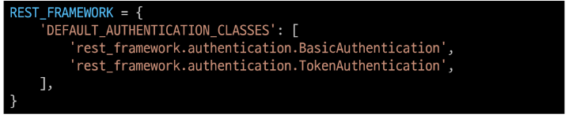

    2. View 함수 별 설정
        * `authentication_classes` 데코레이터를 사용

            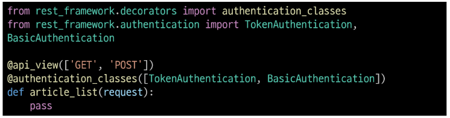

* DRF가 제공하는 인증 체계
    1. `BasicAuthentication`
    2. `TokenAuthentication`
    3. `SessionAuthentication`
    4. `RemoteUserAuthentication`
* `TokenAuthentication`
    * token 기반 HTTP 인증 체계
    * 기본 데스크톱 및 모바일 클라이언트와 같은 클라이언트-서버 설정에 적합
    * 서버가 인증된 사용자에게 토큰을 발급하고 사용자는 매 요청마다 발급받은 토큰을 요청과 함께 보내 인증 과정을 거침
    * [공식 문서](https://www.django-rest-framework.org/api-guide/authentication/#tokenauthentication)

### Token 인증 설정
* `TokenAuthentication`적용 과정
    1. 인증 클래스 설정
        * `TokenAuthentication` 활성화 코드 주석 해제
        * 기본적으로 모든 view 함수가 토큰 기반 인증이 진행될 수 있도록 설정 하는 것

            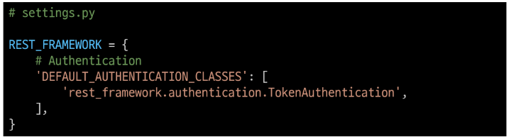

    2. INSTALLED_APPS 추가
        * rest_framework.authtoken 주석 해제

            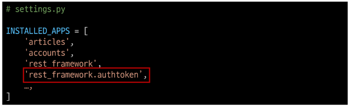

    3. Migrate 진행
        * Migrate

            ```python
            $ python manage.py migrate
            ```

    4. 토큰 생성 코드 작성
        * accounts/signals.py 주석 해제
        * 인증된 사용자에게 자동으로 토큰을 생성해주는 역할

            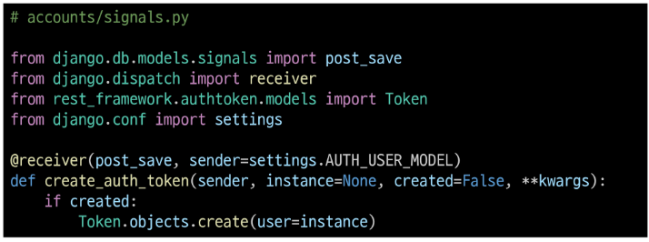


### Dj-Rest-Auth 라이브러리
* Dj-Rest-Auth
    * 회원가입, 인증(소셜미디어 인증 등), 비밀번호 재설정, 사용자 세부 정보 검색, 회원 정보 수정 등 다양한 인증 관련 기능을 제공하는 라이브러리
    * [공식 문서](https://github.com/iMerica/dj-rest-auth)
* Dj-Rest-Auth 설치 및 적용
    * 설치 (사전에 설치되어 있음)

        ```python
        $ pip install dj-rest-auth
        ```

    * 추가 App 주석 해제

        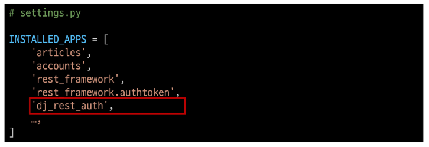

    * 추가 URL 주석 해제

        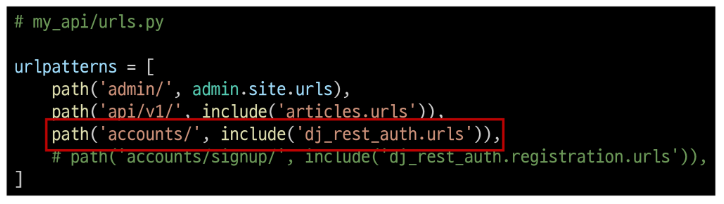

* Dj-Rest-Auth의 Registration(등록) 기능 추가 설정
    1. 패키지 추가 설치 (사전에 설치되어 있음)

        ```python
        $ pip install 'dj-rest-auth[with_social]'
        ```

    2. 추가 App 등록 : 추가 App 주석 해제, 관련 설정 코드 주석 해제

        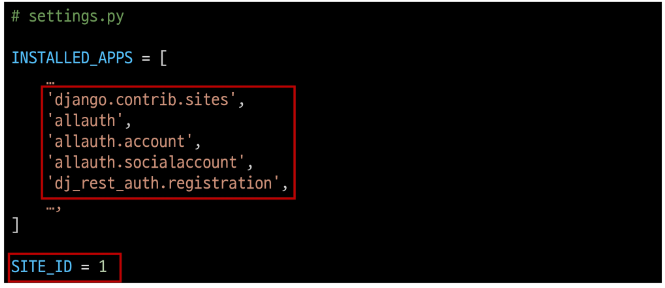

        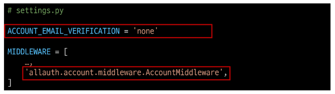

    3. 추가 URL 등록 : 추가 URL 주석 해제

        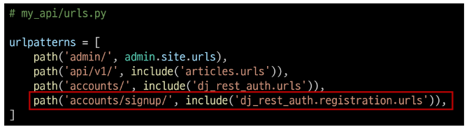

    4. Migrate

        ```python
        $ python manage.py migrate
        ```

    * [공식 문서](https://dj-rest-auth.readthedocs.io/en/latest/installation.html#registration-optional)

### Token 발급 및 활용
* Token 발급
    * 회원 가입 및 로그인을 진행하여 토큰 발급 테스트하기
    * 라이브러리 설치로 인해 추가 된 URL 목록 확인

        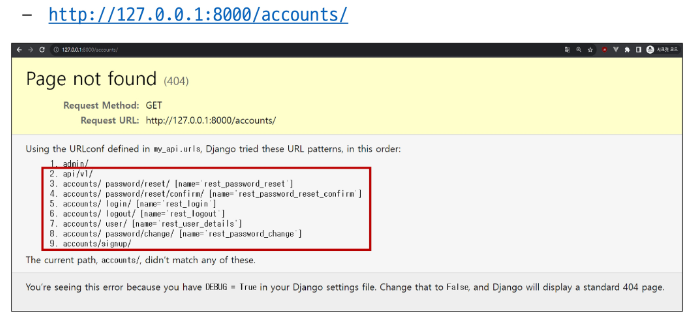

    * 회원 가입 진행 (DRF 페이지 하단 회원 가입 form 사용)

        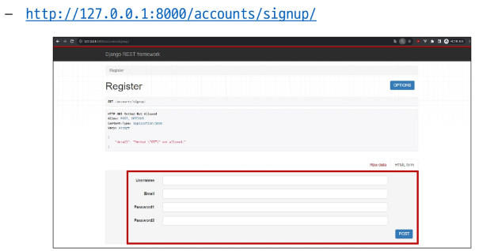

    * 로그인 진행 (DRF 페이지 하단 로그인 Form 사용)

        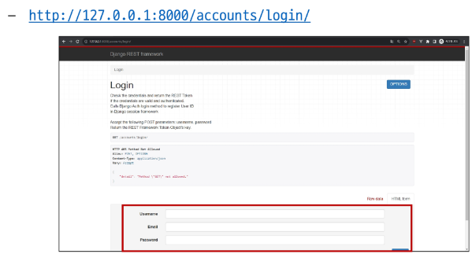

    * 로그인 성공 후 DRF로 부터 발급 받은 Token 확인, <a>이제 이 Token을 Vue에서 별도로 저장하여 매 요청마다 함께 보내야 함</a>

        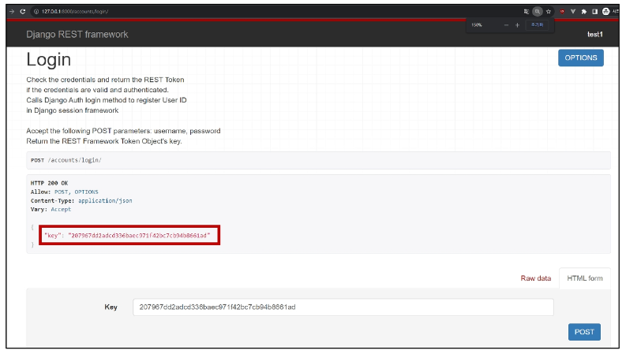

* Token 활용
    * 게시글 작성 과정을 통해 Token 사용 방법 익히기
    * Postman을 활용해 게시글 작성 요청 - `http://127.0.0.1:8000/api/v1/articles/`
    * Body에 게시글 제목과 내용 입력

        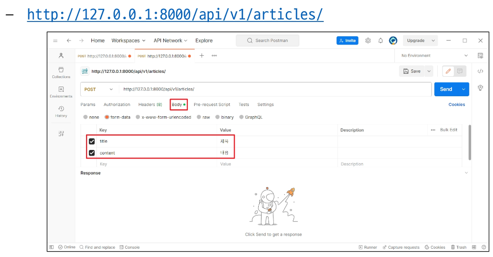

    * Headers에 발급받은 Token 작성 후 요청 성공 확인
        - `Key: "Authorization`
        - `Value: "Token 토큰 값`

        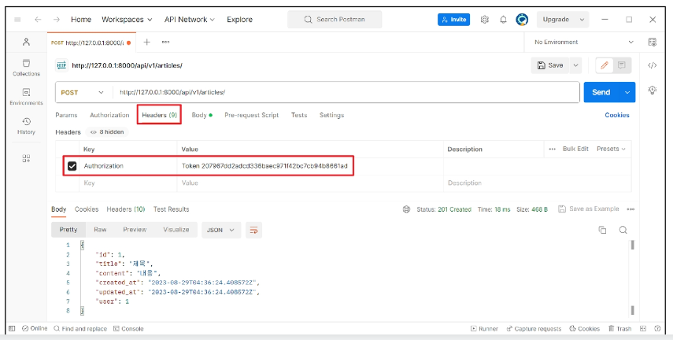

* 클라이언트가 Token으로 인증 받는 방법

    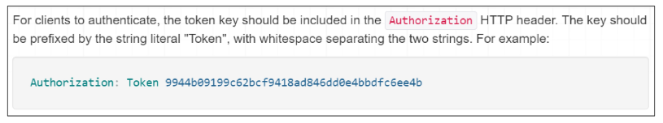

    1. <a>"Authorization"</a> HTTP Header에 포함
    2. 키 앞에는 문자열 <a>"Token"</a>이 와야 하며 <a>"공백"으로 두 문자열을 구분해야 함</a>
    * <a>발급 받은 Token을 인증이 필요한 요청마다 함께 보내야 함</a>
    * [공식 문서](https://www.django-rest-framework.org/api-guide/authentication/#tokenauthentication)

### 권한 정책 설정
* 권한 설정 방법
    1. 전역 설정
        * `DEFAULT_PERMISSION_CLASSES` 를 사용

            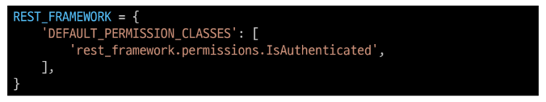

        * 지정하지 않을 경우 이 설정은 기본적으로 무제한 액세스를 허용

            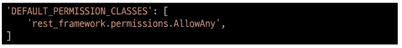

    2. View 함수 별 설정
        * `permission_classes` 데코레이터를 사용

            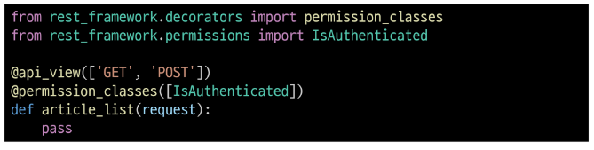

* DRF가 제공하는 권한 정책
    1. `IsAuthenticated`
    2. `IsAdminUser`
    3. `IsAuthenticatedOrReadOnly`
    4. ...
    * [공식 문서](https://www.django-rest-framework.org/api-guide/permissions/#api-reference)
* `IsAuthenticated` 권한
    * 인증되지 않은 사용자에 대한 권한을 거부하고 그렇지 않은 경우 권한을 허용
    * 등록된 사용자만 API에 액세스할 수 있도록 하려는 경우에 적합

### IsAuthenticated 권한 설정
* `IsAuthenticated` 권한 설정
    * `DEFAULT_PERMISSION_CLASSES` 주석 해제 -> 기본적으로 모든 View 함수에 대한 접근을 허용

        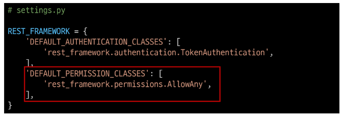

    * permission_classes 관련 코드 주석 해제 -> 전체 게시글 조회 및 생성시에만 인증된 사용자만 진행 할 수 있도록 권한 설정

        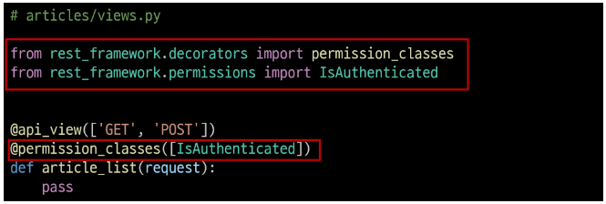

* 권한 활용
    * 만약 관리자만 전체 게시글 조회가 가능한 권한이 설정 되었을 때, 인증된 일반 사용자가 조회 요청을 할 경우 어떻게 되는지 응답 확인하기
    * 테스트를 위해 임시로 관리자 관련 권한 클래스 IsAdminUser로 변경

        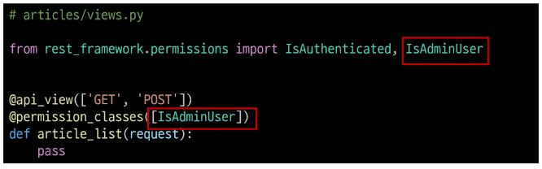

    * 전체 게시글 조회 요청 -> 403 Forbidden 응답 확인

        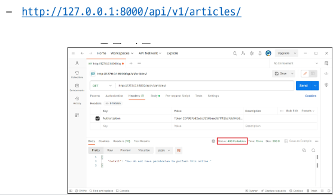

    * `IsAdminUser` 삭제 후 `IsAuthenticated` 권한으로 복구

        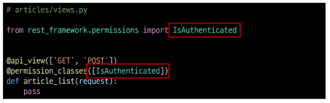


## Authentication with Vue
* 시작하기 전에
    * 정상 작동하던 게시글 전체 조회가 작동하지 않음 -> 401 status code 확인
    * 게시글 조회 요청 시 인증에 필요한 수단(token)을 보내자 않고 있으므로 게시글 조회가 불가능해진 것

        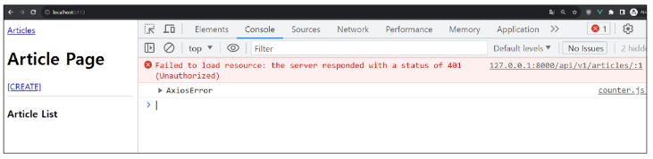


### 회원가입
* SignUpView route 관련 코드 주석 해제

    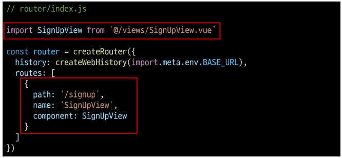

* App 컴포넌트에 SignupView 컴포넌트로 이동하는 RouterLink 작성

    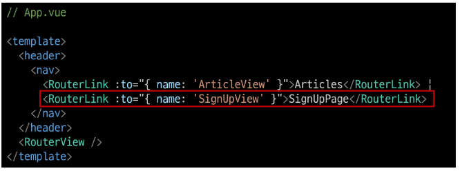

* 회원가입 form 작성

    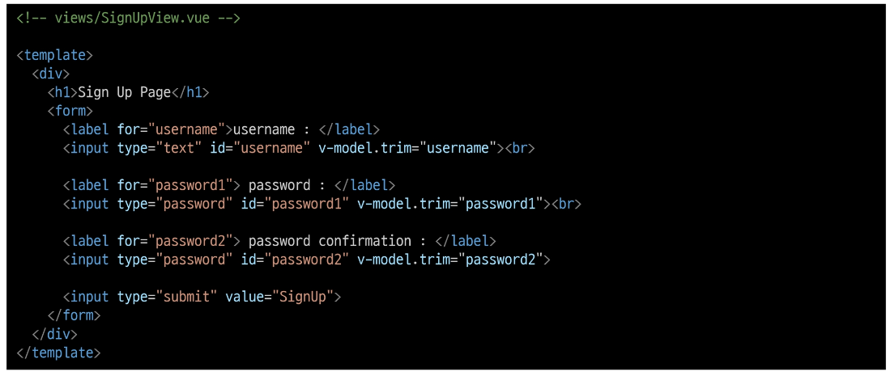

* 사용자 입력 데이터와 바인딩 될 반응형 변수 작성

    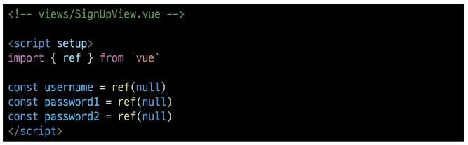

* SignUpView 컴포넌트 출력 확인

    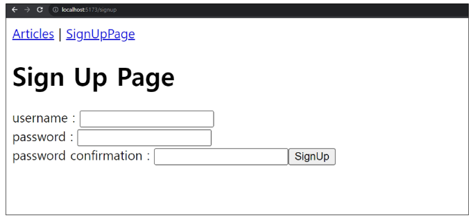

* 회원가입 요청을 보내기 위한 signUp 함수가 해야 할 일 -> 사용자 입력 데이터를 받아 서버로 회원가입 요청을 보냉

    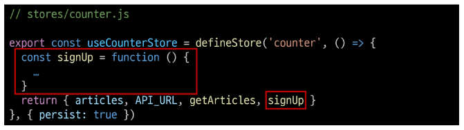

* 컴포넌트에 사용자 입력 데이터를 저장 후 store의 signUp 함수를 호출하는 함수 작성

    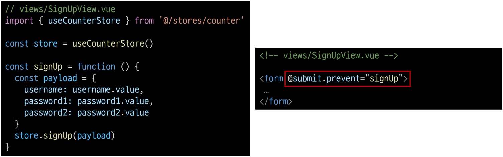

* 실제 회원가입 요청을 보내는 store의 signUp 함수 작성

    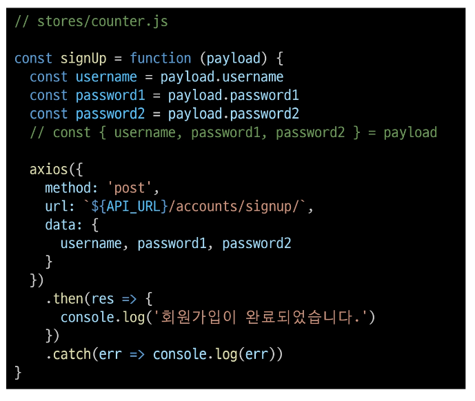

* 회원가입 테스트

    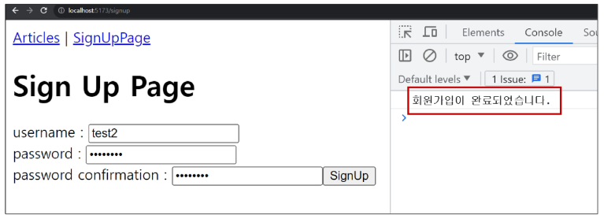

* Django DB 확인

    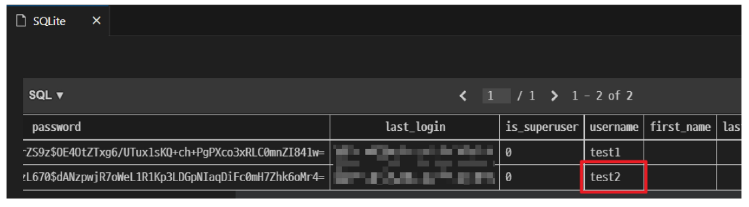


### 로그인
* LogInView route 관련 코드 주석 해제

    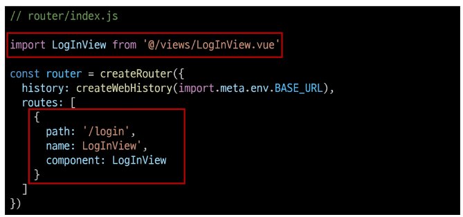

* App 컴포넌트에 LogInView 컴포넌트로 이동하는 RouterLink 작성

    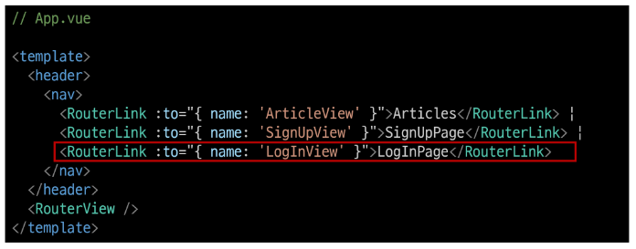

* 로그인 form 작성

    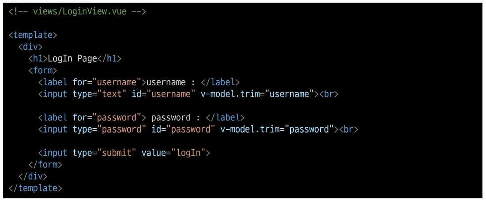

* 사용자 입력 데이터와 바인딩 될 반응형 변수 작성

    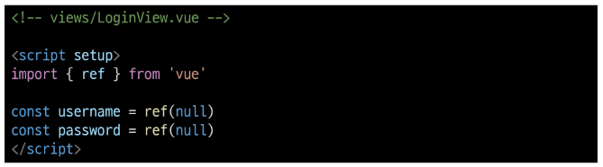

* LogInView 컴포넌트 출력 확인

    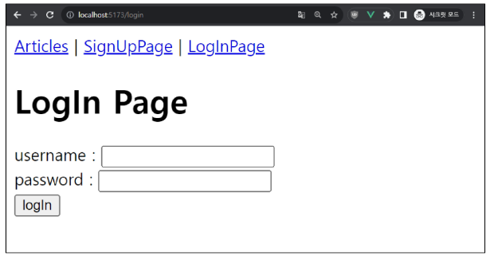

* 로그인 요청을 보내기 위한 logIn 함수가 해야 할 일 -> 사용자 입력 데이터를 받아 서버로 로그인 요청 및 응답 받은 <a>토큰 저장</a>

    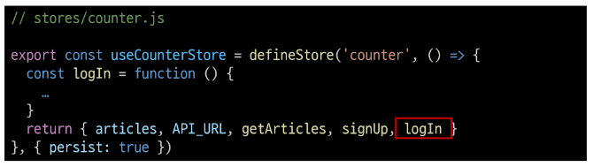

* 컴포넌트에 사용자 입력 데이터를 저장 후 store의 logIn 함수를 호출하는 함수 작성

    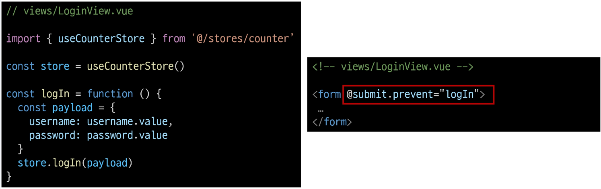

* 실제 로그인 요청을 보내는 store의 logIn 함수 작성

    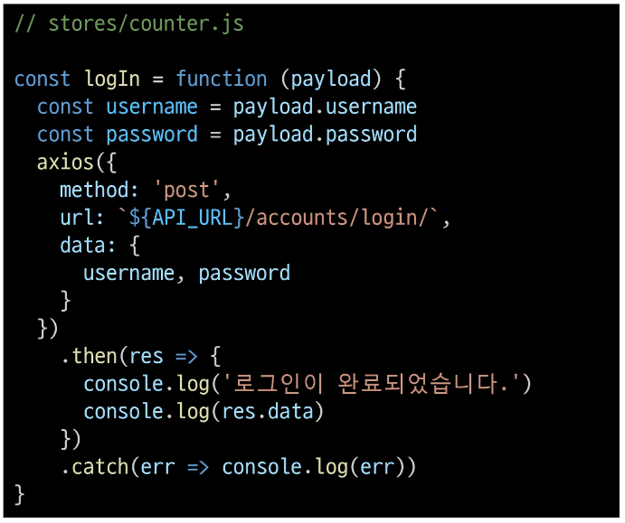

* 로그인 테스트, 응답 객체 안에 Django가 발급한 Token이 함께 온 것을 확인

    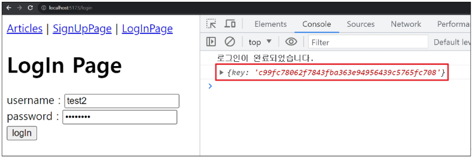


### 요청과 토큰
* <a>Token을 store에 저장하여 인증이 필요한 요청마다 함께 보낸다.</a>
* 반응형 변수 token 선언 및 token 저장

    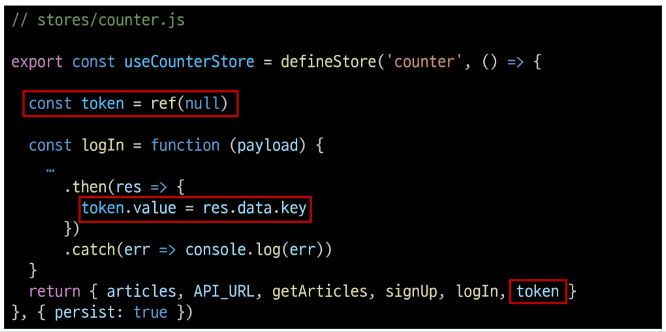

* 다시 로그인 요청 후 store에 저장된 토큰 확인

    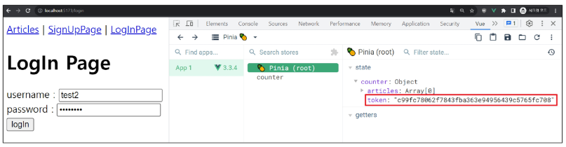

* 토큰이 필요한 요청
    * 게시글 전체 목록 조회 시
        * 게시글 전체 목록 조회 요청 함수 `getArticles`에 token 추가

            

        * 401 상태 코드가 사라지고 게시글이 정상적으로 출력되는 것을 확인

            

    * 게시글 작성 시
        * 게시글 전체 목록 조회 요청 함수 `getArticles`에 token 추가

            

        * 게시글 작성 확인

            


### 인증 여부 확인
* 사용자의 인증(로그인) 여부에 따른 추가 기능 구현
    1. 인증 되지 않은 사용자 -> 메인 페이지 접근 제한
    2. 인증 된 사용자 -> 회원가입 및 로그인 페이지에 접근 제한

### 기타 기능 구현