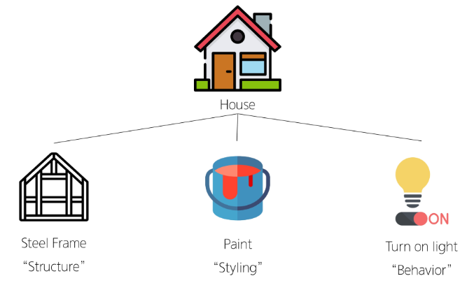
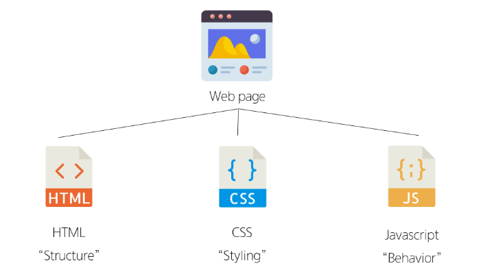
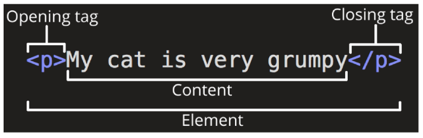
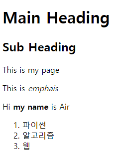
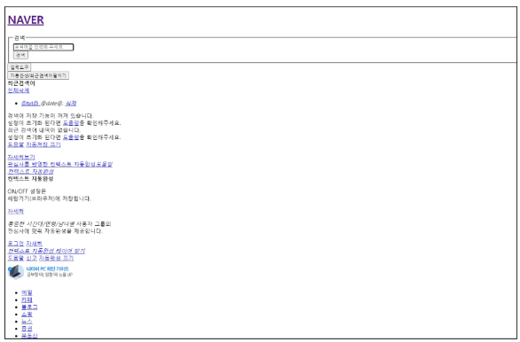
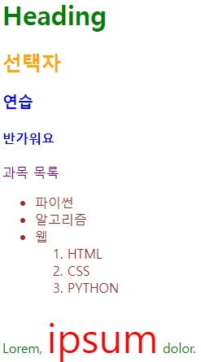
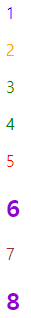
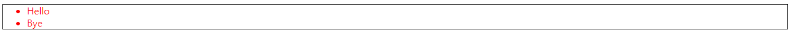

# 웹
* world wide web : 인터넷으로 연결된 컴퓨터들이 정보를 공유하는 거대한 정보 공간
* web : web site, web application 등을 통해 사용자들이 정보를 검색하고 상호 작용하는 기술
* web site : 인터넷에서 여러 개의 **web page**가 모인 것으로, 사용자들에게 정보나 서비스를 제공하는 공간
* web page : HTML, CSS 등의 웹 기술을 이용하여 만들어진, **"web site"를 구성하는 하나의 요소**
* web page 구성 요소






## 웹 구조화
### HTML
* HyperText Markup Language
* 웹 페이지의 **의미**와 **구조**를 정의하는 언어
* HyperText
    * 웹 페이지를 다른 페이지로 연결하는 링크
    * 참조를 통해 사용자가 한 문서에서 다른 문서로 즉시 접근할 수 있는 텍스트
* Markup Language
    * 태그 등을 이용하여 문서나 데이터의 구조를 명시하는 언어
    * ex) HTML, Markdown
* html 작성후에 "Alt + B"를 하면 chrome을 통해서 구현한 페이지가 열린다.
* F12를 이용하여 내가 chrome에서 내가 작성한 html문서를 열수 있다.

### structure of HTML
* HTML의 구조
    * `<!DOCTYPE html>` : 해당 문서가 html 문서라는 것을 나타냄
    * `<html></html>` : 전체 페이지의 콘텐츠를 포함
    * `<title></title>` : 브라우저 탭 및 즐겨찾기 시 표시되는 제목으로 사용
    * `<head></head>` : HTML 문서에 관련된 설명, 설정 등과 관련된 코드를 작성한다. 단 사용자에게 보여지지는 않는다.
    * `<body></body>` : 페이지에 표시되는 모든 콘텐츠

    ```html
    <!DOCTYPE html>
    <html lang="en">
    <head>
      <meta charset="UTF-8">
      <title>My page</title>
    </head>
    <body>
      <p>This is my page</p>
    </body>
    </html>
    ```

* HTML Element(요소)
    * 하나의 요소는 여는 태그와 닫는 태그 그리고 그 안의 내용으로 구성
    * 닫는 태그는 태그 이름 앞에 슬래시가 포함되며 닫는 태그가 없는 태그도 존재

    

* HTML Attributes(속성)
    * 규칙
        * 속성은 요소 이름과 속성 사이에 공백이 있어야 한다.
        * 하나 이상의 속성들이 있는 경우엔 속성 사이에 공백으로 구분한다.
        * 속성 값은 열고 닫는 따옴표로 감싸야 한다.
    * 목적
        * 나타내고 싶지 않지만 **추가적인 기능, 내용**을 담고 싶을 때 사용
        * CSS에서 해당 **요소를 선택**하기 위한 값으로 활용

    

    * `<p class="editor-note">` : class가 속성이름, "editor-note"가 속성 값이다.

* html 구조
    ```html
    <!DOCTYPE html>
    <html lang="en">
    <head>
      <meta charset="UTF-8">
      <title>My page</title>
    </head>
    <body>
      <p>My page</p>
      <!-- Anchor (hypertext) -->
      <a href="https://www.google.co.kr">Google</a>
      <!-- 닫는 태그가 없음 -> 컨텐츠가 없음을 의미
      이미지의 경우 글과 다르게 그림 그자체로 컨텐츠 종료라고 생각해도 무방
      즉 이미지의 경우에는 속성값만 존재하며 닫는 태그가 없다 -->
      
      
    </body>
    </html>
    ```

### Text Structure
* HTML Text Structure
    * HTML의 주요 목적 중 하나는 **텍스트 구조와 의미**를 제공하는 것
* HTML
    * 웹 페이지의 **의미**와 구조를 정의하는 언어
* `<h1>Heading</h1>` : 예를들어 h1요소는 단순히 텍스트를 크게 만드는 것이 아닌 현재 **문서의 최상위 제목**이라는 의미를 부여하는 것 -> 하나만 만드는 것을 추천
* 대표적인 HTML Text structure
    * Heading & Paragraphs
        * `h1~h6, p`
    * Lists
        * `ol, ul, li`
    * Emphasis & Importance
        * `em, strong`
* HTML 예시
    ```html
    <!DOCTYPE html>
    <html lang="en">
    <head>
      <meta charset="UTF-8">
      <meta name="viewport" content="width=device-width, initial-scale=1.0">
      <title>Document</title>
    </head>
    <body>
      <h1>Main Heading</h1>
      <h2>Sub Heading</h2>
      <!-- br은 enter key 역할 -->
      <p>text<br>text</p>
      <p>This is my page</p>
      <p>This is <em>emphais</em></p>
      <p>Hi <strong>my name</strong> is Air</p>
      <ol>
        <li>파이썬</li>
        <li>알고리즘</li>
        <li>웹</li>
      </ol>
    </body>
    </html>
    ```

    


## 웹 스타일링
### CSS
* Cascading Style Sheet
* 웹 페이지의 **디자인**과 **레이아웃**을 구성하는 언어

    

* CSS 구문
    ```css
    /* 선언 */
    /* 선택자 */
    h1 {
      color: red;
      /* 속성(property): 값(value) */
      font-size: 30px;
    }```
* CSS 적용방법
    1. inline style : HTML 요소 안에 `style` 속성 값으로 작성
    2. internal style : `head` 태그 안에 `style` 태그에 작성
    3. external style : 별도의 CSS파일 생성 후 HTML `link`태그를 사용하여 불러오기

    ```html
    <!-- html 문서에서 열면 색 문양도 생기기 때문에
    반드시 한번 옮겨서 열어볼 것 -->
    <!DOCTYPE html>
    <html lang="en">
    <head>
      <meta charset="UTF-8">
      <meta name="viewport" content="width=device-width, initial-scale=1.0">
      <title>Document</title>
      <!-- external style -->
      <link rel="stylesheet" href="style.css">
      <!-- internal style -->
      <style>
        h2 {
          color: red;
        }
      </style>
    </head>
    <body>
      <!-- inline style -->
      <h1 style="color: blue; background-color: yellow;">Inline Style</h1>
      <h2>Internal Style</h2>
      <h3>External Style</h3>
    </body>
    </html>
    ```

### CSS 선택자
* CSS Selectors : HTML 요소를 선택하여 스타일을 적용할 수 있도록 하는 선택자
* 종류
    * 기본 선택자
        * 전체(`*`) 선택자
            * HTML 모든 요소를 선택
        * 요소(tag) 선택자
            * 지정한 모든 태그를 선택
        * 클래스(`class`) 선택자(`.`(dot))
            * 주어진 클래스 속성을 가진 모든 요소를 선택
        * 아이디(id) 선택자(`#`)
            * 주어진 아이디 속성을 가진 요소 선택
            * 문서에는 주어진 아이디를 가진 요소가 하나만 있어야 한다.
        * 속성(attr) 선택자 등
    * 결합자(Combinators)
        * 자손 결합자(" " (space))
            * 첫 번째 요소의 자손 요소들 선택
            * ex) `p span`은 <P>안에 있는 모든 <span>을 선택 (하위 레벨 상관 없음)
        * 자식 결합자(`>`)
            * 첫 번째 요소의 직계 자식(한 단계 아래 - 들여쓰기 한번 된 곳에만)만 선택
            * ex) `ul` > `li`는 <ul>안에 있는 모든 <li>를 선택 (한단계 아래 자식들만)
* CSS Selector 예시

    ```html
    <!DOCTYPE html>
    <html lang="en">

    <head>
    <meta charset="UTF-8">
    <meta http-equiv="X-UA-Compatible" content="IE=edge">
    <meta name="viewport" content="width=device-width, initial-scale=1.0">
    <title>Document</title>
    <style>
        /* 전체 선택자 */
        * {
        color: red;
        }
        /* 타입 선택자 */
        h2 {
        color: orange;
        }

        h3, 
        h4 {
        color: blue;
        }
        /* 클래스 선택자 */
        .green {
        color: green;
        }
        /* id 선택자 */
        #purple {
        color: purple;
        }
        /* 자식 결합자 */
        .green > span {
        font-size: 50px;
        }
        /* 자손 결합자 */
        .green li {
        color: brown;
        }
    </style>
    </head>

    <body>
    <h1 class="green">Heading</h1>
    <h2>선택자</h2>
    <h3>연습</h3>
    <h4>반가워요</h4>
    <p id="purple">과목 목록</p>
    <ul class="green">
        <li>파이썬</li>
        <li>알고리즘</li>
        <li>웹
        <ol>
            <li>HTML</li>
            <li>CSS</li>
            <li>PYTHON</li>
        </ol>
        </li>
    </ul>
    <p class="green">Lorem, <span>ipsum</span> dolor.</p>
    </body>

    </html>
    ```

    


### 명시도
* Specificity(명시도) : 결과적으로 요소에 적용할 CSS 선언을 결정하기 위한 알고리즘
* CSS Selector에 가중치를 계산하여 어떤 스타일을 적용할지 결정
    * 동일한 요소를 가리키는 2개 이상의 CSS 규칙이 있는 경우, 가장 높은 명시도를 가진 selector가 승리하여 스타일이 적용된다.\
* CSS : Cascading Style Sheet, 웹 페이지의 디자인과 레이아웃을 구성하는 언어
* Cascading : 계단식, 한 요소에 **동일한 가중치**를 가진 선택자가 적용될 때, CSS에서 **마지막에 나오는 선언**이 사용됨 -> 가중치가 동일할 경우에는 마지막에 나오는 선언이 적용되기 때문에 이때는 순서가 중요하다.

    ```css
    /* 다음과 같은 경우 h1 태그 내용의 색은 purple이 적용된다 */
    h1 {
      color: red;
    }

    h1 {
      color: purple;
    }
    ```
    ```css
    /* 동일한 h1태그에 다음과 같이 스타일이 작성된다면
    h1 태그 내용의 색은 red가 적용된다. */
    .make-red {
      color: red;
    }
    
    h1 {
      color: purple;
    }
    ```
* 명시도가 높은 순서
    1. importance : `!important`
        * 다른 우선순위 규칙보다 우선하여 적용하는 키워드
        * cascade의 구조를 무시하고 강제로 스타일을 적용하는 방식이므로 권장하지 않는다.
    2. inline style
    3. 선택자 : id 선택자 > class 선택자 > 요소 선택자
    4. 소스 코드 선언 순서

    ```html
    <!-- 결과 예측해보기 -->
    <!DOCTYPE html>
    <html lang="en">

    <head>
    <meta charset="UTF-8">
    <meta http-equiv="X-UA-Compatible" content="IE=edge">
    <meta name="viewport" content="width=device-width, initial-scale=1.0">
    <title>Document</title>
    <style>
        h2 {
        color: darkviolet !important;
        }

        p {
        color: blue;
        }

        .orange {
        color: orange;
        }

        .green {
        color: green;
        }

        #red {
        color: red;
        }
    </style>
    </head>

    <body>
    <p>1</p>
    <p class="orange">2</p>
    <p class="green orange">3</p>
    <p class="orange green">4</p>
    <p id="red" class="orange">5</p>
    <h2 id="red" class="orange">6</h2>
    <p id="red" class="orange" style="color: brown;">7</p>
    <h2 id="red" class="orange" style="color: brown;">8</h2>
    </body>

    </html>
    ```

    

* 관련 사이트
    * 그림으로 보는 명시도
        * [명시도](https://specifishity.com/)
    * 명시도 계산기
        * [명시도](https://specificity.keegan.st/)

### 상속
* CSS 상속
    * 기본적으로 CSS는 상속을 통해 부모 요소의 속성을 자식에게 상속해 재사용성을 높인다.
* CSS 속성 분류
    * 상속 되는 속성 : Text 관련 요소(font, color, text-align), opacity, visibility 등
    * 상속되지 않는 속성 : box model 관련 요소(width, height, border, box-sizing...), position 관련 요소(position, top/right/bottom/left, z-index) 등

        ```html
        <!DOCTYPE html>
        <html lang="en">

        <head>
        <meta charset="UTF-8">
        <meta name="viewport" content="width=device-width, initial-scale=1.0">
        <title>Document</title>
        <style>
            .parent {
            /* 상속 가능 */
            color: red;
            /* 상속 불가능 */
            border: 1px solid black;
            }
        </style>
        </head>

        <body>
        <ul class="parent">
            <li class="child">Hello</li>
            <li class="child">Bye</li>
        </ul>
        </body>

        </html>
        ```

        

* CSS 상속 여부는 MDN 문서에서 확인이 가능하다
    * MDN 각 속성별 문서 하단에서 상속 여부를 확인할 수 있다.


## 참고 사항
* HTML 관련 참고 사항
    * 요소(태그) 이름은 대소문자를 구분하지 않지만 **소문자**사용을 권장
    * 속성의 따옴표는 작은 따옴표와 큰 따옴표를 구분하지 않지만 **큰 따옴표** 권장
    * HTML은 프로그래밍 언어와 달리 에러를 반환하지 않기 때문에 작성시 주의
* CSS 관련 참고 사항
    * CSS inline style은 사용하지 말 것
        * CSS와 HTML 구조 정보가 혼합되어 작성되기 때문에 코드를 이해하기 어렵게 만든다.
    * CSS의 모든 속성을 외우는 것은 아니다
        * 자주 사용되는 속성은 그리 많지 않고 주로 활용하는 속성 위주로 사용하다 보면 자연스럽게 익히게 된다.
        * 그 외 속성들은 개발하며 필요할 때마다 검색해서 학습 후 사용한다.
    * 속성은 되도록 `class`만 사용할 것
        * id, 요소 선택자 등 여러 선택자들과 함께 사용할 경우 우선순위 규칙에 따라 예기치 못한 스타일 규칙이 적용되어 전반적인 유지보수가 어려워지기 때문이다.
        * 문서에서 단 한번 유일하게 적용될 스타일의 경우에만 id 선택자 사용을 고려할만 하다.