# CSS

## CSS Box Model
* 원으로 표현되는 것은 네모 박스를 깎은 것

    

* 박스 요소들로 구조화 된 웹 페이지

    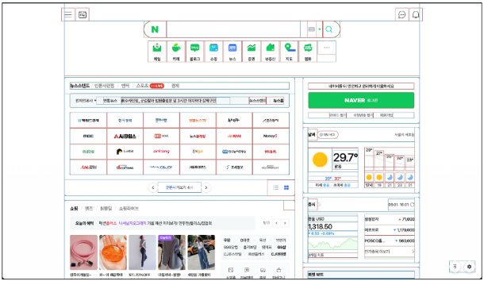


### 구성 요소
* CSS Box Model
    * 모든 HTML 요소를 사각형 박스로 표현하는 개념
        * 내용(content), 안쪽 여백(padding), 테두리(border), 외부 간격(margin)으로 구성되는 개념

    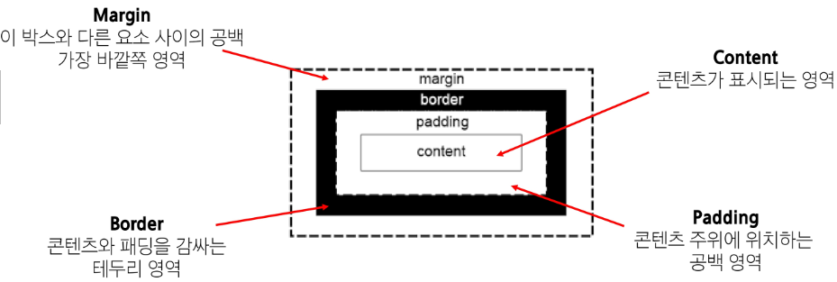

    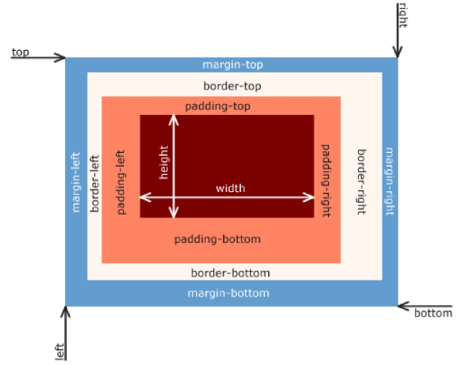

    ```html
    <!-- box html의 예시 -->
    <!DOCTYPE html>
    <html lang="en">
    <head>
        <meta charset="UTF-8">
        <meta name="viewport" content="width=device-width, initial-scale=1.0">
        <title>Document</title>
        <style>
            .box1 {
                width: 200px;
                padding-left: 25px;
                padding-bottom: 25px;
                margin-left: 25px;
                margin-top: 50px;
                border-width: 3px;
                border-style: solid;
                border-color: black;
            }

            .box2 {
                width: 200px;
                padding: 25px 50px;
                margin: 25px auto;
                border: 1px dashed black;
            }
        </style>
    </head>
    <body>
        <div class="box1">box1</div>
        <div class="box2">box2</div>
    </body>
    </html>
    ```

    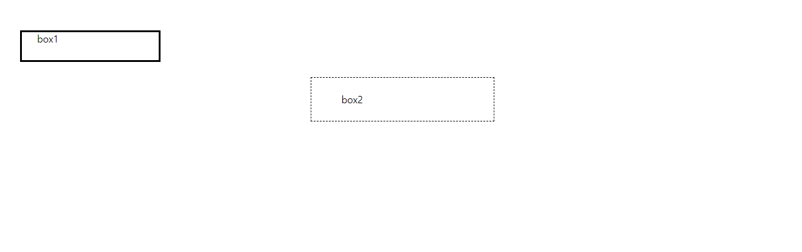

* width & height 속성
    * 요소의 너비와 높이를 지정
    * 이때 지정되는 요소의 너비와 높이는 content 영역을 대상으로 한다.
* CSS가 width값을 계산하는 기준
    * CSS는 border가 아닌 content의 크기를 width값으로 지정 -> 기본값
    * 당연히 border로 지정 가능하다 -> 지정하지 않으면 content로 적용됨

    

* 예시
    ```html
    <!DOCTYPE html>
    <html lang="en">

    <head>
        <meta charset="UTF-8">
        <meta http-equiv="X-UA-Compatible" content="IE=edge">
        <meta name="viewport" content="width=device-width, initial-scale=1.0">
        <title>Document</title>
        <style>
            .box {
                width: 100px;
                border: 2px solid black;
                padding: 10px;
                margin: 20px;
                background-color: yellow;
            }
            /* content-box : 내용물의 box로 생각
            "124 * 45" => 왜 124px인지 생각해보기
            -> because of border line = 2px */
            .content-box {
                box-sizing: content-box;
            }
            /* border-box : 내용물이 아닌 전체 box로 생각
            "100 * 66" */
            .border-box {
                box-sizing: border-box;
            }
        </style>
    </head>
    <body>
        <div class="box content-box">content-box</div>
        <div class="box border-box">border-box</div>
    </body>

    </html>
    ```

    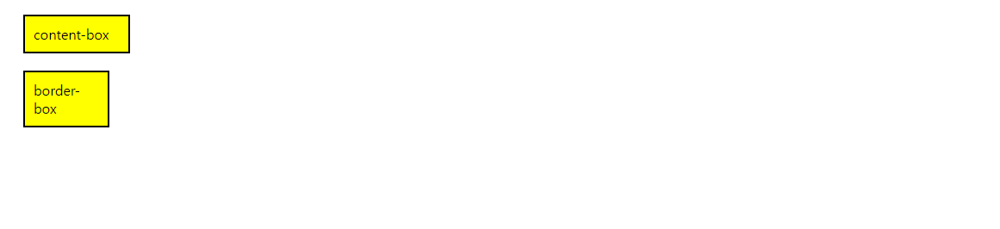


### 박스 타입
* Normal flow
    * CSS를 적용하지 않았을 경우 웹페이지 요소가 기본적으로 배치되는 방향
    * 기본적으로 좌즉에서 우측으로, 위에서 아래로 배치된다.
* box type
    * block : 지정한 만큼만 box처리가 된다.
        * 항상 새로운 행으로 나뉨
        * width와 height속성을 사용하여 너비와 높이 지정 가능
        * 기본적으로 width 속성을 지정하지 않으면 box는 inline방향으로 사용 가능한 공간을 모두 차지한다. (너비를 사용가능한 공간의 100%로 채우는 것)
        * 대표적인 block type tag : h1~6, p, div
    * inline : 줄 전체가 box처리가 된다.
        * 새로운 행으로 나뉘지 않음
        * width와 height 속성을 사용할 수 없음
        * 수직 방향 : padding, margins, borders가 적용되지만 다른 요소를 밀어낼 수는 없음
        * 수평 방향 : padding, margins, borders가 적용되어 다른 요소를 밀어낼 수 있다.
        * 대표적인 inline type tag : a, img, span
* box type 예시
    ```html
    <!DOCTYPE html>
    <html lang="en">

    <head>
        <meta charset="UTF-8">
        <meta http-equiv="X-UA-Compatible" content="IE=edge">
        <meta name="viewport" content="width=device-width, initial-scale=1.0">
        <title>Document</title>
        <style>
            a,
            span,
            img {
                border: 3px solid red;
            }

            h1,
            p,
            div {
                border: 1px solid blue;
            }
        </style>
    </head>

    <body>
        <h1>Normal flow</h1>
        <p>Lorem, ipsum dolor sit amet consect explicabo</p>
        <div>
            <p>block 요소는 기본적으로 부모 요소의 너비 100%를 차지하며, 자식 콘텐츠의 최대 높이를 취한다.</p>
            <p>block 요소의 총 너비와 총 높이는 content + padding + border width/height다.</p>
        </div>
        <p>block 요소는 서로 margins로 구분된다.</p>
        <p>inline 요소는 <span>이 것처럼</span> 자체 콘텐츠의 너비와 높이만 차지한다.
            그리고 inline 요소는 <a href="#">width나 height 속성을 지정 할 수 없다.</a>
        </p>
        <p>
            물론 이미지도  인라인 요소다.
            단, 이미지는 다른 inline 요소와 달리 width나 height로 크기를 조정할 수 있다.
        </p>
        <p>
            만약 inline 요소의 크기를 제어하려면 block 요소로 변경하거나 inline-block 요소로 설정해주어야 한다.
        </p>
    </body>
    </html>
    ```

    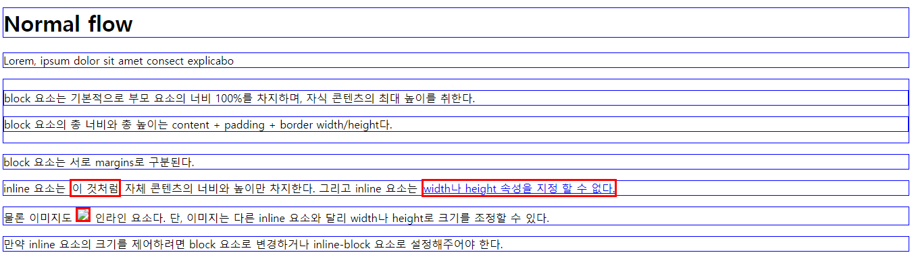

* 속성에 따른 수평 정렬

    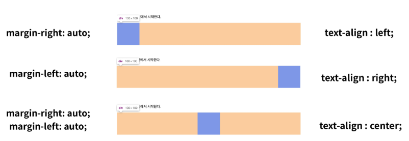


### 기타 display 속성
* 기타 display 속성
    * inline-block
        * inline과 block 요소 사이의 중간 지점을 제공하는 display 값
        * block 요소의 특징을 갖는다
            * width 및 height 속성 사용가능
            * padding, margin, border로 인해 다른 요소가 밀려난다.
        * 요소가 줄 바꿈 되는 것을 원하지 않으면서 너비와 높이를 적용하고 싶은 경우에 사용
        ```html
        <!DOCTYPE html>
        <html lang="en">

        <head>
            <meta charset="UTF-8">
            <meta http-equiv="X-UA-Compatible" content="IE=edge">
            <meta name="viewport" content="width=device-width, initial-scale=1.0">
            <title>Document</title>
            <style>
                span {
                    margin: 20px;
                    padding: 20px;
                    width: 80px;
                    height: 50px;
                    background-color: lightblue;
                    border: 2px solid blue;
                    display: inline-block;
                }

                ul>li {
                    background-color: crimson;
                    padding: 10px 20px;
                    display: inline-block;
                }

                /* 위와 아래의 차이가 무엇일까 /// 가운데 정렬을 열어놨지만 가운데 정렬이 되지 않음 그 이유는??? */
                .box {
                    /* display: inline-block; */
                    width: 100px;
                    height: 100px;
                    background-color: #4CAF50;
                    margin: 10px;
                }

                .container {
                    text-align: center;
                }
            </style>
        </head>
        <body>
            <!-- 1. 이제 다른 요소를 밀어낼 수 있는 span -->
            <p>Lorem ipsum dolor sit amet <span>consectetur</span> adipisicing elit. Animi iusto enim officia exercitationem dolorque, quasi velit, dolores, tempora illum odio necessitatibus. Fugit, cumque eligendi!</p>

            <!-- 2. 리스트 요소를 가로로 정렬 -->
            <ul>
                <li><a href="#">link</a></li>
                <li><a href="#">link</a></li>
                <li><a href="#">link</a></li>
            </ul>

            <!-- 3. div 요소를 가로로 정렬 -->
            <div class="container">
                <div class="box"></div>
                <div class="box"></div>
                <div class="box"></div>
            </div>
        </body>
        </html>
        ```

        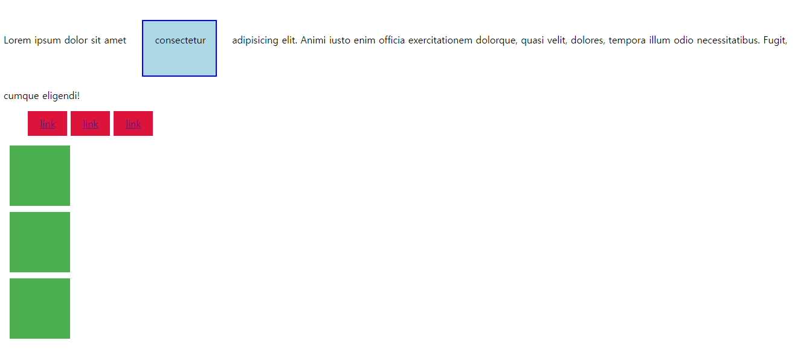

    * none
        * 요소를 화면에 표시하지 않고, 공간조차 부여되지 않음
        ```html
        <!DOCTYPE html>
        <html lang="en">

        <head>
            <meta charset="UTF-8">
            <meta name="viewport" content="width=device-width, initial-scale=1.0">
            <title>Document</title>
            <style>
                .box {
                    width: 100px;
                    height: 100px;
                    background-color: red;
                    border: 2px solid black;
                }

                .none {
                    display: none;
                }
            </style>
        </head>

        <body>
            <div class="box"></div>
            <div class="box none"></div>
            <div class="box"></div>
        </body>
        </html>
        ```

        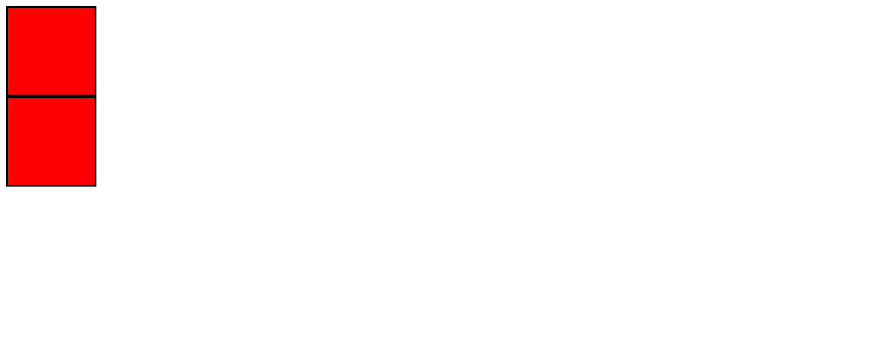


### 참고
* shorthand 속성 - `border`
    ```css
    .box {
        /* 작성 순서는 영향을 주지 않는다 */
        border: 2px solid black;
    }
    ```
* shorthand 속성 - `margin` & `padding`
    * 4방향의 속성을 각각 지정하지 않고 한번에 지정할 수 있는 속성

    ```css
    box1 {
        /* 4개 - 상/우/하/좌 - 시계방향 */
        margin: 10px 20px 30px 40px;
        padding: 10px 20px 30px 40px;
    }

    box2 {
        /* 3개 - 상/좌우/하 */
        margin: 10px 20px 30px;
        padding: 10px 20px 30px;
    }

    box3 {
        /* 2개 - 상하/좌우 */
        margin: 10px 20px;
        padding: 10px 20px;
    }

    box4 {
        /* 4개 - 공통 */
        margin: 10px;
        padding: 10px;
    }
    ```
* margin collapsing(마진 상쇄)
    * 두 block 타입 요소의 margin top과 bottom이 만나 더 큰 margin으로 결합되는 현상
    * 웹 개발자가 레이아웃을 더욱 쉽게 관리할 수 있도록 도와준다
    * 각 요소에 대한 상/하 margin을 각각 설정하지 않고 한 요소에 대해서만 설정하기 위함

    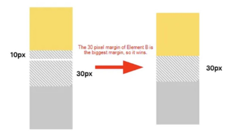

    * 다음과 같은 경우에서 '10px + 30px = 40px'가 되는 것이 아닌 10px가 30px에 합쳐져 총 30px가 되는 것이다.


## CSS Position
* CSS Layout
    * 각 요소의 **위치**와 **크기를 조정**하여 웹 페이지의 디자인을 결정하는 것
    * display, position, float, flexbox 등
* CSS Position
    * 요소를 Normal Flow에서 제거하여 다른 위치로 배치하는 것
    * 다른 요소 위에 올리기, 화면의 특정 위치에 고정시키기 등
    * position 이동 방향
        * top, right, bottom, left : 각각 상, 우, 하, 좌
        * z axis : box들이 겹치는 경우 어떤 것을 위에 둘 것인지를 결정
* position 유형
    1. static
        * 기본값
        * 요소를 Normal Flow에 따라 배치
    2. relative
        * 요소를 Normal Flow에 따라 배치
        * 자기 자신을 기준으로 이동
        * 요소가 차지갛는 공간은 static일 때와 같음
    3. absolute
        * 요소를 Normal Flow에서 제거 -> 따르지 않음
        * 가장 가까운 relative 부모 요소를 기준으로 이동
        * 문서에서 요소가 차지하는 공간이 없어짐
    4. fixed
        * 요소를 Normal Flow에서 제거 -> 따르지 않음
        * 현재의 화면 영역(viewprot)을 기준으로 이동
        * 문서에서 요소가 차지하는 공간이 없어짐
    5. sticky
        * 요소를 Normal Flow에 따라 배치
        * 요소가 일반적인 문서 흐름에 따라 배치되다가 스크롤이 **특정 임게점**에 도달하면 그 위치에 고정됨(fixed)
        * 만약 다음 sticky요소가 
    ```html
    <!DOCTYPE html>
    <html>

    <head>
        <meta charset="UTF-8">
        <meta http-equiv="X-UA-Compatible" content="IE=edge">
        <meta name="viewport" content="width=device-width, initial-scale=1.0">
        <title>CSS Position</title>
        <style>
            * {
                box-sizing: border-box;
            }

            body {
                height: 1500px;
            }

            .container {
                position: relative;
                height: 300px;
                width: 300px;
                border: 1px solid black;
            }

            .box {
                height: 100px;
                width: 100px;
                border: 1px solid black;
            }

            .static {
                position: static;
                background-color: lightcoral;
            }

            .absolute {
                position: absolute;
                background-color: lightgreen;
                top: 100px;
                left: 100px;
            }

            .relative {
                position: relative;
                background-color: lightblue;
                top: 100px;
                left: 100px;
            }

            .fixed {
                position: fixed;
                background-color: gray;
                top: 0;
                right: 0;
            }
        </style>
    </head>

    <body>
        <div class="container">
            <div class="box static">Static</div>
            <div class="box absolute">Absolute</div>
            <div class="box relative">Relative</div>
            <div class="box fixed">Fixed</div>
        </div>
    </body>

    </html>
    ```

    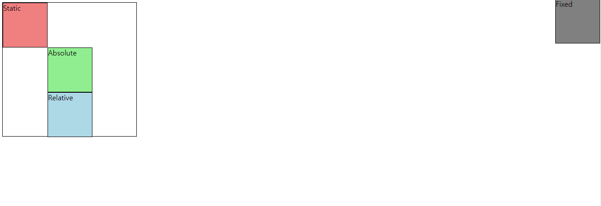

    ```html
    <!DOCTYPE html>
    <html lang="en">

    <head>
        <meta charset="UTF-8">
        <meta http-equiv="X-UA-Compatible" content="IE=edge">
        <meta name="viewport" content="width=device-width, initial-scale=1.0">
        <title>Document</title>
        <style>
            body {
                height: 1500px;
            }

            .sticky {
                position: sticky;
                top: 0;
                background-color: lightblue;
                padding: 20px;
                border: 2px solid black;
            }
        </style>
    </head>

    <body>
        <h1>Sticky positioning</h1>
        <div>
            <div class="sticky">첫 번째 Sticky</div>
            <div>
                <p>내용1</p>
                <p>내용2</p>
                <p>내용3</p>
            </div>
            <div class="sticky">두 번째 Sticky</div>
            <div>
                <p>내용4</p>
                <p>내용5</p>
                <p>내용6</p>
            </div>
            <div class="sticky">세 번째 Sticky</div>
            <div>
                <p>내용7</p>
                <p>내용8</p>
                <p>내용9</p>
            </div>
        </div>
    </body>

    </html>
    ```

    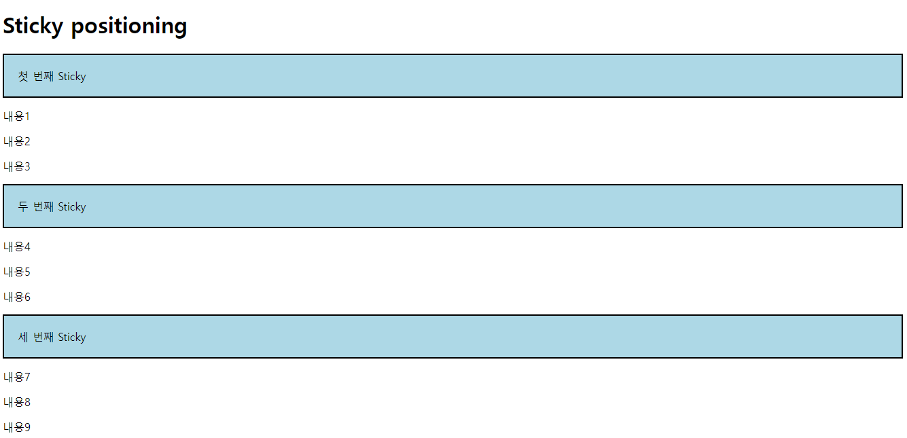
    
    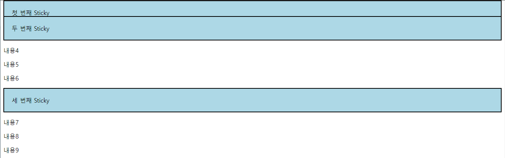

    ```html
    <!DOCTYPE html>
    <html lang="en">

    <head>
        <meta charset="UTF-8">
        <meta name="viewport" content="width=device-width, initial-scale=1.0">
        <title>Document</title>
        <style>
            .card {
                /* position: relative; */
                width: 300px;
                height: 200px;
                border: 1px solid black;
            }

            .card-content {
                padding: 10px;
            }

            .badge {
                /* position: absolute; */
                /* top: 0; */
                /* right: 0; */
                background-color: red;
                color: white;
                padding: 5px 10px;
            }
        </style>
    </head>

    <body>
        <div class="card">
            <div class="card-content">
                <h3>Card Title</h3>
                <p>Lorem ipsum dolor sit amet, consectetur adipiscing elit.</p>
                <span class="badge">New</span>
            </div>
        </div>
    </body>
    </html>
    ```

    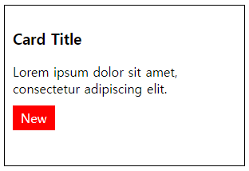

* z-index : 요소가 겹쳤을 때 어떤 요소 순으로 위에 나타낼 지 결정
    * 정수 값을 사용해 z축 순서를 지정
    * 더 큰 값을 가진 요소가 작은 값의 요소를 덮음
    ```html
    <!DOCTYPE html>
    <html lang="en">

    <head>
        <meta charset="UTF-8">
        <meta http-equiv="X-UA-Compatible" content="IE=edge">
        <meta name="viewport" content="width=device-width, initial-scale=1.0">
        <title>Document</title>
        <style>
            .container {
                position: relative;
            }

            .box {
                position: absolute;
                width: 100px;
                height: 100px;
            }

            .red {
                background-color: red;
                top: 50px;
                left: 50px;
                z-index: 3;
            }

            .green {
                background-color: green;
                top: 100px;
                left: 100px;
                z-index: 2;
            }

            .blue {
                background-color: blue;
                top: 150px;
                left: 150px;
                z-index: 1;
            }
        </style>
    </head>

    <body>
        <div class="container">
            <div class="box red"></div>
            <div class="box green"></div>
            <div class="box blue"></div>
        </div>
    </body>
    </html>
    ```

    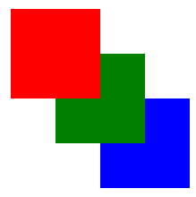

* position의 역할
    * 전체 페이지에 대한 레이아웃을 구성하는 것이 아닌 **페이지 특정 항목의 위치를 조정**하는 것


## CSS Flexbox
* CSS Flexbox : 요소를 행과 열 형태로 배치하는 1차원 레이아웃 방식
    * '공간 배열' & '정렬'
    * 요소를 행과 열 형태로 배치하는 1차원 레이
    아웃 방식
    
    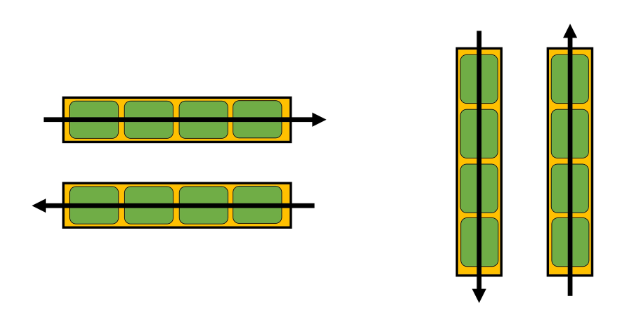

### 구성 요소
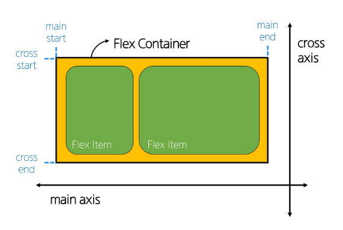

* main axis(주 축)
    * flex item들이 배치되는 기본 축
    * main start에서 시작하여 main end방향으로 배치(기본값)
* cross axis(교차 축)
    * main axis에 수직인 축
    * cross start에서 시작하여 cross end방향으로 배치(기본값)
* flex container
    * `display: flex;` 혹은 `inline-flex;`가 설정된 부모 요소
    * 이 컨테이너의 1차 자식 요소들이 flex item이 됨
    * flexbox 속성 값들을 사용하여 자식 요소 flex item들을 배치하는 주체
* flex item
    * flex container 내부에 레이아웃 되는 항목

### 레이아웃 구성
1. flex container 지정
    * flex item은 기본적으로 행(주 축의 기본값인 가로 방향)으로 나열
    * flex item은 주 축의 시작 선에서 시작
    * flex item은 교차 축의 크기를 채우기 위해 늘어남
2. flex-direction
    * flex item이 나열되는 방향을 지정
    * column으로 지정할 경우 주 축이 변경됨
    * `-reverse`로 지정하면 flex item 배치의 시작선과 끝선이 서로 바뀜
3. flex-wrap
    * flex item 목록이 flex container의 한 행에 들어가지 않을 경우 다른 행에 배치할지 여부 설정
4. justify-content
    * 주 축을 따라 flex item과 주위에 공간을 부내
5. align-content
    * 교차 축을 따라 flex item과 주위에 공간을 분배
        * flex-wrap이 wrap 또는 wrap-reverse로 설정된 여러 행에만 적용됨
        * 한 줄 짜리 행에는 효과 없음(flex-wrap이 nowrap으로 설정된 경우)
6. align-items
    * 교차 축을 따라 flex item 행을 정렬
7. align-self
    * 교차 축을 따라 개별 flex item을 정렬
8. flex-grow
    * **남은 행 여백**을 비율에 따라 각 flex item에 분배
        * 아이템이 컨테이너 내에서 확장하는 비율을 지정
    * `flex-grow`의 반대는 `flex-shrink`
9. flex-basis
    * flex item의 초기 크기 값을 지정
    * flex-basis와 width값을 동시에 적용한 경우 flex-basis가 우선

```html
<!-- 하나씩 돌려보면서 충분히 눈으로 직접 확인하고 왜 그런지 생각해보기 -->

<!-- 이 예시는 너무 많은 종류의 image가 나오기 때문에 주석에 걸려있는 것들을 모두 하나씩 풀어보면서 어떻게 돌아가는지 알아보는것이 좋을 것 같다. -->

<!-- 1~7 -->

<!DOCTYPE html>
<html lang="en">

<head>
  <meta charset="UTF-8">
  <meta http-equiv="X-UA-Compatible" content="IE=edge">
  <meta name="viewport" content="width=device-width, initial-scale=1.0">
  <title>Document</title>
  <style>
    .container {
      height: 500px;
      border: 1px solid black;
      /* display: flex; */
      /* flex-direction: row; */
      /* flex-direction: row-reverse; */
      /* flex-direction: column; */
      /* flex-direction: column-reverse; */
      /* flex-wrap: nowrap; */
      /* flex-wrap: wrap; */
      /* justify-content: center; */
      /* justify-content: flex-start; */
      /* justify-content: flex-end; */
      /* align-content: flex-start; */
      /* align-content: center; */
      /* align-content: flex-end; */
    }

    .post {
      background-color: grey;
      border: 1px solid black;
      margin: 0.5rem;
      padding: 0.5rem;
    }

    .item1 {
      /* align-self: flex-start; */
    }

    .item2 {
      /* align-self: flex-end; */
    }
  </style>
</head>

<body>
  <div class="container">
    <div class="post item1">
      <h2>Post Title 1</h2>
      <p>Post Content 1</p>
    </div>
    <div class="post item2">
      <h2>Post Title 2</h2>
      <p>Post Content 2</p>
    </div>
    <div class="post">
      <h2>Post Title 3</h2>
      <p>Post Content 3</p>
    </div>
    <div class="post">
      <h2>Post Title 4</h2>
      <p>Post Content 4</p>
    </div>
  </div>
</body>
</html>
```
```html
<!-- flex grow -->
<!DOCTYPE html>
<html lang="en">
<head>
  <meta charset="UTF-8">
  <meta http-equiv="X-UA-Compatible" content="IE=edge">
  <meta name="viewport" content="width=device-width, initial-scale=1.0">
  <title>Document</title>
  <style>
    .container {
      width: 100%;
      display: flex;
    }

    .item {
      height: 100px;
      color: white;
      font-size: 3rem;
    }

    .item-1 {
      background-color: red;
      flex-grow: 1;
    }

    .item-2 {
      background-color: green;
      flex-grow: 2;
    }

    .item-3 {
      background-color: blue;
      flex-grow: 3;
    }
  </style>
</head>

<body>
  <div class="container">
    <div class="item item-1">1</div>
    <div class="item item-2">2</div>
    <div class="item item-3">3</div>
  </div>
</body>
</html>
```

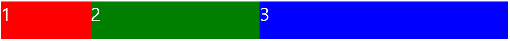

```html
<!-- flexbox basis -->
<!DOCTYPE html>
<html lang="en">

<head>
  <meta charset="UTF-8">
  <meta http-equiv="X-UA-Compatible" content="IE=edge">
  <meta name="viewport" content="width=device-width, initial-scale=1.0">
  <title>Document</title>
  <style>
    .container {
      width: 100%;
      display: flex;
    }

    .item {
      height: 100px;
      color: white;
      font-size: 3rem;
    }

    .item-1 {
      background-color: red;
      flex-basis: 200px;
    }

    .item-2 {
      background-color: green;
      flex-basis: 400px;
    }

    .item-3 {
      background-color: blue;
      flex-basis: 200px;
    }
  </style>
</head>

<body>
  <div class="container">
    <div class="item item-1">1</div>
    <div class="item item-2">2</div>
    <div class="item item-3">3</div>
  </div>
</body>
</html>
```

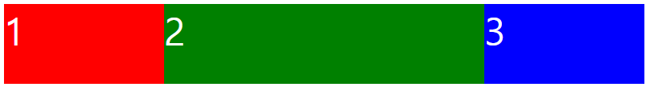

* flexbox 속성
    * flex container 관련 속성
        * `display`, `flex-direction`, `flex-wrap`, `justify-content`, `align-items`, `align-content`
    * flex item 관련 속성
        * `align-self`, `flex-grow`, `flex-basis`, `order`
* 목적에 따른 속성 분류
    * 배치
        * `flex-direction`, `flex-wrap`
    * 공간 분배
        * `justify-content`, `align-content`
    * 정렬
        * `align-items`, `align-self`
* 속성명 tip
    * justify : 주 축
    * align : 교차 축

### flex-wrap 응용
* 반응형 레이아웃 : 다양한 디바이스와 화면 크기에 자동으로 적응하여 콘텐츠를 최적으로 표시하는 웹 레이아웃 방식
* `flex-wrap`을 사용해 반응형 레이아웃 작성 (`flex-grow` & `flex-basis`활용)

```html
<!DOCTYPE html>
<html lang="en">

<head>
  <meta charset="UTF-8">
  <meta http-equiv="X-UA-Compatible" content="IE=edge">
  <meta name="viewport" content="width=device-width, initial-scale=1.0">
  <title>Document</title>
  <style>
    .card {
      width: 80%;
      border: 1px solid black;
      display: flex;
      flex-wrap: wrap;
    }

    img {
      width: 100%;
    }

    .thumbnail {
      flex-basis: 700px;
      flex-grow: 1;
    }

    .content {
      flex-basis: 300px;
      flex-grow: 2;
    }
  </style>
</head>

<body>
  <div class="card">
    
    <div class="content">
      <h2>Heading</h2>
      <p>Lorem, ipsum dolor sit amet consectetur adipisicing elit. Perspiciatis minus sed expedita ut nihil tempora
        neque autem odio eos, repudiandae blanditiis, molestiae consequatur. Adipisci illo dolor repellat alias
        maiores.
        Aut?</p>
    </div>
  </div>
</body>
</html>
```

### 정리
* 코드로 보고 분석하는 것도 좋지만 직접 눈으로 결과값(image)를 보면서 이해하는것이 더 빠른 이해와 도움이 될 것이다.
* `flex-direction`
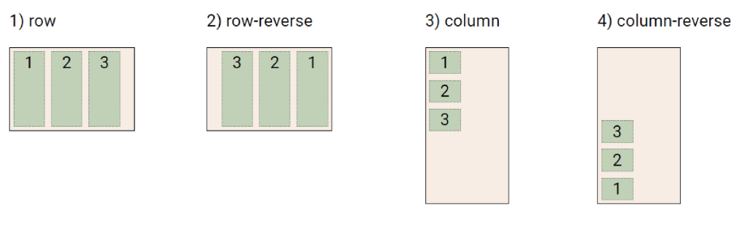
* `flex-wrap`

* `justify-content`
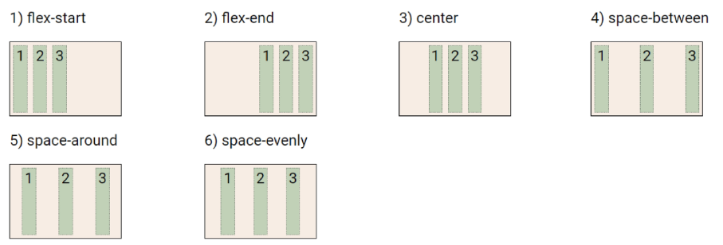
* `align-content`
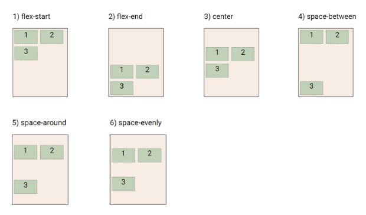
* `align-items`
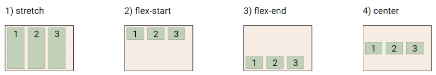
* `align-self`
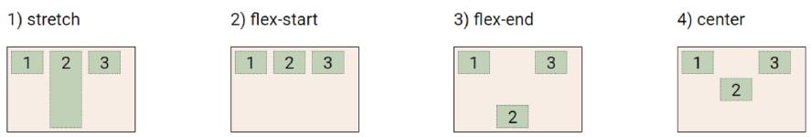

### 참고
* `justify-items` 및 `justify-self` 속성이 없는이유
    * 결과적으로 필요가 없기 때문이다
    * `margin auto`를 통해 정렬 및 배치가 가능
* shorthand - "flex-flow"
    ```css
    .container {
        flex-flow: flex-direction flex-wrap;
    }
    ```
* shorthand - "flex"
    ```html
    <!-- one value, unitless number: flex-grow -->
    flex: 2;

    <!-- one value, length or percentage: flex-basis -->
    flex: 10rem;
    flex: 30%;

    <!-- Two values: flex-grow | flex-basis -->
    flex: 1 30px;

    <!-- Two values: flex-grow | flex-shrink -->
    flex: 2 2;

    <!-- Three values: flex-grow | flex-shrink | flex-basis -->
    flex: 2 2 10%;
    ```
* content, items, self의 차이
    * content : 여러 줄
    * items : 한 줄
    * self : 요소 한개