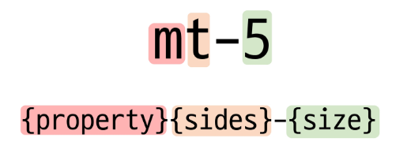
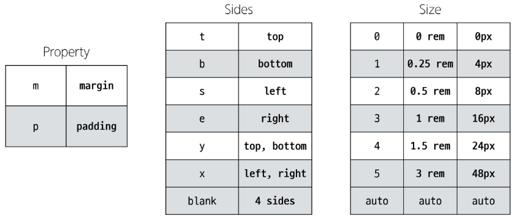

# Bootstrap

## Bootstrap
* Bootstrap : CSS 프론트엔드 프레임 워크(Toolkit)
    *  미리 만들어진 다양한 디자인 요소들을 제공하여 웹 사이트를 빠르고 쉽게 개발할 수 있도록 함.
* Bootstrap 사용
    1. Bootstrap 공식 문서 접속
        * [Bootstrap](https://getbootstrap.com/)
    2. Docs -> introduction -> Quick start
    3. "include Bootstrap's CSS and JS" 코드 확인 및 가져오기
        * head와 body에 bootstrap CDN이 포함된 코드 블록
* snippet-generator를 통해서 vscode등의 프로그램 사용시 bootstrap을 편하게 불러올 수 있다. [snippets site](https://snippet-generator.app/?description=&tabtrigger=&snippet=&mode=vscode) 
    * vscode기준
        1. 상단 file 클릭
        2. preference 클릭
        3. configure user snippets
        4. new global snippets file
        5. 작성하여 내장함수 처럼 사용
            * description : 설명
            * Tab trigger : 단축키

    ```json
    {
        // Place your global snippets here. Each snippet is defined under a snippet name and has a scope, prefix, body and 
        // description. Add comma separated ids of the languages where the snippet is applicable in the scope field. If scope 
        // is left empty or omitted, the snippet gets applied to all languages. The prefix is what is 
        // used to trigger the snippet and the body will be expanded and inserted. Possible variables are: 
        // $1, $2 for tab stops, $0 for the final cursor position, and ${1:label}, ${2:another} for placeholders. 
        // Placeholders with the same ids are connected.
        // Example:
        // "Print to console": {
        // 	"scope": "javascript,typescript",
        // 	"prefix": "log",
        // 	"body": [
        // 		"console.log('$1');",
        // 		"$2"
        // 	],
        // 	"description": "Log output to console"
        // }

        "bootstrap": {
            "prefix": "!b",
            "body": [
            "<!DOCTYPE html>",
            "<html lang=\"en\">",
            "<head>",
            "  <meta charset=\"UTF-8\">",
            "  <meta name=\"viewport\" content=\"width=device-width, initial-scale=1.0\">",
            "  <title>Document</title>",
            "  <link href=\"https://cdn.jsdelivr.net/npm/bootstrap@5.3.3/dist/css/bootstrap.min.css\" rel=\"stylesheet\" integrity=\"sha384-QWTKZyjpPEjISv5WaRU9OFeRpok6YctnYmDr5pNlyT2bRjXh0JMhjY6hW+ALEwIH\" crossorigin=\"anonymous\">",
            "</head>",
            "<body>",
            "  <div class=\"container\">",
            "    $0",
            "  </div>",
            "  <script src=\"https://cdn.jsdelivr.net/npm/bootstrap@5.3.3/dist/js/bootstrap.bundle.min.js\" integrity=\"sha384-YvpcrYf0tY3lHB60NNkmXc5s9fDVZLESaAA55NDzOxhy9GkcIdslK1eN7N6jIeHz\" crossorigin=\"anonymous\"></script>",
            "</body>",
            "</html>"
            ],
            "description": "bootstrap"
        }
    }
    ```

* CDN : content delivery network
    * 지리적 제약 없이 빠르고 안전하게 콘텐츠를 전송할 수 있는 전송 기술
    * 서버와 사용자 사이의 물리적인 거리를 줄여 콘텐츠 로딩에 소요되는 시간을 최소화 (웹페이지 로드 속도를 높임)
    * 지리적으로 사용자와 가까운 CDN 서버에 콘텐츠를 저장해서 사용자에게 전달
* Bootstrap CDN
    1. Bootstrap 홈페이지 - Download - "Compiled CSS and JS" 다운로드
    2. CDN을 통해 가져오는 bootstrap css와 js파일 확인
    3. bootstrap.css 파일 참고
        * 온라인 CDN 서버에 업로드 된 css 및 js파일을 불러와서 사용하는 것
* bootstrap 사용법

    ```html
    <p class = "mt-5">Hello, world!</p>
    ```

    

    

* bootstrap에는 특정한 규칙이 있는 클래스 이름으로 스타일 및 레이아웃이 미리 작성되어 있음

### Reset CSS
* Reset CSS
    * 모든 HTML 요소 스타일을 일관된 기준으로 재설정하는 간결하고 압축된 규칙 세트
        * HTML Element, Table, List 등의 요소들에 일관성 있게 스타일을 적용 시키는 기본 단계
* Reset CSS를 사용하는 이유
    * 모든 브라우저는 각자의 'user agent stylesheet'를 가지고 있음
        * 웹사이트를 보다 편하게 읽기 위해
    * 이 설정이 브라우저마다 상이함 -> 문제 발생
    * 모든 브라우저에서 웹사이트를 동일하게 보이게 만들어야 하는 개발자에게 매우 귀찮은 일 -> 모두 똑같은 스타일 상태로 만들고 스타일 개발을 시작하자는 마인드
* Normalize CSS
    * Reset CSS 방법 중 대표적인 방법
    * 웹 표준 기준으로 브라우저 중 하나가 불일치 한다면 차이가 있는 브라우저를 수정하는 방법
    * bootstrap은 'bootstrap-reboot.css'라는 파일명으로 normalize.css를 자체적으로 커스텀하여 사용


## Bootstrap 활용

### Typography
* Typography : 제목, 본문 텍스트, 목록 등
* display headings : 기존 heading보다 더 눈에 띄는 제목이 필요할 경우
* inline text elements : HTML inline 요소에 대한 스타일
* List : HTML list 요소에 대한 스타일

```html
<!doctype html>
<html lang="en">
<head>
  <meta charset="utf-8">
  <meta name="viewport" content="width=device-width, initial-scale=1">
  <title>Bootstrap demo</title>
  <link href="https://cdn.jsdelivr.net/npm/bootstrap@5.3.3/dist/css/bootstrap.min.css" rel="stylesheet" integrity="sha384-QWTKZyjpPEjISv5WaRU9OFeRpok6YctnYmDr5pNlyT2bRjXh0JMhjY6hW+ALEwIH" crossorigin="anonymous">
</head>
<body>
  <h1>Hello, world!</h1>
  <!-- Display heading -->
  <h1 class="display-1">Display 1</h1>
  <h1 class="display-2">Display 2</h1>
  <h1 class="display-3">Display 3</h1>
  <h1 class="display-4">Display 4</h1>
  <h1 class="display-5">Display 5</h1>
  <h1 class="display-6">Display 6</h1>

  <!-- inline text -->
  <p>You can use the mark tag to <mark>highlight</mark> text.</p>
  <p><del>This line of text is meant to be treated as deleted text.</del></p>
  <p><s>This line of text is meant to be treated as no longer accurate.</s></p>
  <p><ins>This line of text is meant to be treated as an addition to the document.</ins></p>
  <p><u>This line of text will render as underlined.</u></p>
  <p><small>This line of text is meant to be treated as fine print.</small></p>
  <p><strong>This line rendered as bold text.</strong></p>
  <p><em>This line rendered as italicized text.</em></p>

  <!-- list -->
  <ul>
    <li>This is a list.</li>
    <li>It appears completely unstyled.</li>
    <li>Structurally, it's still a list.</li>
    <li>However, this style only applies to immediate child elements.</li>
    <li>Nested lists:
      <ul>
        <li>are unaffected by this style</li>
        <li>will still show a bullet</li>
        <li>and have appropriate left margin</li>
      </ul>
    </li>
    <li>This may still come in handy in some situations.</li>
  </ul>

  <script src="https://cdn.jsdelivr.net/npm/bootstrap@5.3.3/dist/js/bootstrap.bundle.min.js" integrity="sha384-YvpcrYf0tY3lHB60NNkmXc5s9fDVZLESaAA55NDzOxhy9GkcIdslK1eN7N6jIeHz" crossorigin="anonymous"></script>
</body>
</html>
```


### Colors
* bootstrap color system : bootstrap이 지정하고 제공하는 색상 시스템
* text, border, background 및 다양한 요소에 사용하는 bootstrap의 색상 키워드

```html
<!DOCTYPE html>
<html lang="en">
<head>
  <meta charset="UTF-8">
  <meta http-equiv="X-UA-Compatible" content="IE=edge">
  <meta name="viewport" content="width=device-width, initial-scale=1.0">
  <title>Document</title>
  <link href="https://cdn.jsdelivr.net/npm/bootstrap@5.3.3/dist/css/bootstrap.min.css" rel="stylesheet" integrity="sha384-QWTKZyjpPEjISv5WaRU9OFeRpok6YctnYmDr5pNlyT2bRjXh0JMhjY6hW+ALEwIH" crossorigin="anonymous">
</head>

<body>
  <!-- text colors -->
  <p class="text-primary">.text-primary</p>
  <p class="text-primary-emphasis">.text-primary-emphasis</p>
  <p class="text-secondary">.text-secondary</p>
  <p class="text-secondary-emphasis">.text-secondary-emphasis</p>
  <p class="text-success">.text-success</p>
  <p class="text-success-emphasis">.text-success-emphasis</p>
  <p class="text-danger">.text-danger</p>
  <p class="text-danger-emphasis">.text-danger-emphasis</p>
  <p class="text-warning bg-dark">.text-warning</p>
  <p class="text-warning-emphasis">.text-warning-emphasis</p>
  <p class="text-info bg-dark">.text-info</p>
  <p class="text-info-emphasis">.text-info-emphasis</p>
  <p class="text-light bg-dark">.text-light</p>
  <p class="text-light-emphasis">.text-light-emphasis</p>
  <p class="text-dark bg-white">.text-dark</p>
  <p class="text-dark-emphasis">.text-dark-emphasis</p>

  <!-- background colors -->
  <div class="p-3 mb-2 bg-primary text-white">.bg-primary</div>
  <div class="p-3 mb-2 bg-primary-subtle text-primary-emphasis">.bg-primary-subtle</div>
  <div class="p-3 mb-2 bg-secondary text-white">.bg-secondary</div>
  <div class="p-3 mb-2 bg-secondary-subtle text-secondary-emphasis">.bg-secondary-subtle</div>
  <div class="p-3 mb-2 bg-success text-white">.bg-success</div>
  <div class="p-3 mb-2 bg-success-subtle text-success-emphasis">.bg-success-subtle</div>
  <div class="p-3 mb-2 bg-danger text-white">.bg-danger</div>
  <div class="p-3 mb-2 bg-danger-subtle text-danger-emphasis">.bg-danger-subtle</div>
  <div class="p-3 mb-2 bg-warning text-dark">.bg-warning</div>
  <div class="p-3 mb-2 bg-warning-subtle text-warning-emphasis">.bg-warning-subtle</div>
  <div class="p-3 mb-2 bg-info text-dark">.bg-info</div>
  <div class="p-3 mb-2 bg-info-subtle text-info-emphasis">.bg-info-subtle</div>
  <div class="p-3 mb-2 bg-light text-dark">.bg-light</div>
  <div class="p-3 mb-2 bg-light-subtle text-light-emphasis">.bg-light-subtle</div>
  <div class="p-3 mb-2 bg-dark text-white">.bg-dark</div>
  <div class="p-3 mb-2 bg-dark-subtle text-dark-emphasis">.bg-dark-subtle</div>
  <div class="p-3 mb-2 bg-body-secondary">.bg-body-secondary</div>
  <div class="p-3 mb-2 bg-body-tertiary">.bg-body-tertiary</div>
  <div class="p-3 mb-2 bg-body text-body">.bg-body</div>
  <div class="p-3 mb-2 bg-black text-white">.bg-black</div>
  <div class="p-3 mb-2 bg-white text-dark">.bg-white</div>
  <div class="p-3 mb-2 bg-transparent text-body">.bg-transparent</div>

  <script src="https://cdn.jsdelivr.net/npm/bootstrap@5.3.3/dist/js/bootstrap.bundle.min.js" integrity="sha384-YvpcrYf0tY3lHB60NNkmXc5s9fDVZLESaAA55NDzOxhy9GkcIdslK1eN7N6jIeHz" crossorigin="anonymous"></script>
</body>
</html>
```

* 너비와 높이가 모두 200px인 정사각형을 bootstrap을 이용하여 작성

    ```html
    <!DOCTYPE html>
    <html lang="en">

    <head>
        <meta charset="UTF-8">
        <meta http-equiv="X-UA-Compatible" content="IE=edge">
        <meta name="viewport" content="width=device-width, initial-scale=1.0">
        <title>Document</title>
        <link href="https://cdn.jsdelivr.net/npm/bootstrap@5.3.3/dist/css/bootstrap.min.css" rel="stylesheet" integrity="sha384-QWTKZyjpPEjISv5WaRU9OFeRpok6YctnYmDr5pNlyT2bRjXh0JMhjY6hW+ALEwIH" crossorigin="anonymous">
        <style>
            .box {
            width: 200px;
            height: 200px;
            }
        </style>
    </head>

    <body>
        <div class="box bg-info border border-dark"></div>
        <script src="https://cdn.jsdelivr.net/npm/bootstrap@5.3.3/dist/js/bootstrap.bundle.min.js" integrity="sha384-YvpcrYf0tY3lHB60NNkmXc5s9fDVZLESaAA55NDzOxhy9GkcIdslK1eN7N6jIeHz" crossorigin="anonymous"></script>
    </body>v
    </html>
    ```

### Component
* bootstrap component : bootstrap에서 제공하는 UI관련 요소
    * 버튼, 네비게이션 바, 카드, 폼, 드롭다운 등
* 이점 : 일관된 디자인을 제공하여 웹 사이트의 구성 요소를 구축하는 데 유용하게 활용
* bootstrap을 사용하는 이유
    * 가장 많이 사용되는 CSS 프레임워크
    * 사전에 디자인된 다양한 컴포넌트 및 기능
        * 빠른 개발과 유지 보수
    * 손쉬운 반응형 웹 디자인 구현
    * 커스터마이징(customizing)이 용이
    * 크로스 브라우징(cross browsing) 지원
        * 모든 주요 브라우저에서 작동하도록 설계되어 있음
* 대표적인 component
    * Alerts
    * Badges
    * Buttons
    * Cards
    * Navbar

    ```html
    <!DOCTYPE html>
    <html lang="en">

    <head>
        <meta charset="UTF-8">
        <meta http-equiv="X-UA-Compatible" content="IE=edge">
        <meta name="viewport" content="width=device-width, initial-scale=1.0">
        <title>Document</title>
        <link href="https://cdn.jsdelivr.net/npm/bootstrap@5.3.3/dist/css/bootstrap.min.css" rel="stylesheet" integrity="sha384-QWTKZyjpPEjISv5WaRU9OFeRpok6YctnYmDr5pNlyT2bRjXh0JMhjY6hW+ALEwIH" crossorigin="anonymous">
    </head>

    <body>
        <!-- alerts -->
        <div class="alert alert-primary" role="alert">
            A simple primary alert—check it out!
        </div>
        <div class="alert alert-secondary" role="alert">
            A simple secondary alert—check it out!
        </div>
        <div class="alert alert-success" role="alert">
            A simple success alert—check it out!
        </div>
        <div class="alert alert-danger" role="alert">
            A simple danger alert—check it out!
        </div>
        <div class="alert alert-warning" role="alert">
            A simple warning alert—check it out!
        </div>
        <div class="alert alert-info" role="alert">
            A simple info alert—check it out!
        </div>
        <div class="alert alert-light" role="alert">
            A simple light alert—check it out!
        </div>
        <div class="alert alert-dark" role="alert">
            A simple dark alert—check it out!
        </div>


        <!-- badges -->
        <span class="badge text-bg-primary">Primary</span>
        <span class="badge text-bg-secondary">Secondary</span>
        <span class="badge text-bg-success">Success</span>
        <span class="badge text-bg-danger">Danger</span>
        <span class="badge text-bg-warning">Warning</span>
        <span class="badge text-bg-info">Info</span>
        <span class="badge text-bg-light">Light</span>
        <span class="badge text-bg-dark">Dark</span>


        <!-- Buttons -->
        <button type="button" class="btn btn-primary">Primary</button>
        <button type="button" class="btn btn-secondary">Secondary</button>
        <button type="button" class="btn btn-success">Success</button>
        <button type="button" class="btn btn-danger">Danger</button>
        <button type="button" class="btn btn-warning">Warning</button>
        <button type="button" class="btn btn-info">Info</button>
        <button type="button" class="btn btn-light">Light</button>
        <button type="button" class="btn btn-dark">Dark</button>
        <button type="button" class="btn btn-link">Link</button>


        <!-- Cards -->
        <div class="card" style="width: 18rem;">
            
            <div class="card-body">
            <h5 class="card-title">Card title</h5>
            <p class="card-text">Some quick example text to build on the card title and make up the bulk of the card's content.</p>
            <a href="#" class="btn btn-primary">Go somewhere</a>
            </div>
        </div>

        <!-- navbar -->
        <nav class="navbar navbar-expand-lg bg-body-tertiary">
            <div class="container-fluid">
            <a class="navbar-brand" href="#">Navbar</a>
            <button class="navbar-toggler" type="button" data-bs-toggle="collapse" data-bs-target="#navbarSupportedContent" aria-controls="navbarSupportedContent" aria-expanded="false" aria-label="Toggle navigation">
                <span class="navbar-toggler-icon"></span>
            </button>
            <div class="collapse navbar-collapse" id="navbarSupportedContent">
                <ul class="navbar-nav me-auto mb-2 mb-lg-0">
                <li class="nav-item">
                    <a class="nav-link active" aria-current="page" href="#">Home</a>
                </li>
                <li class="nav-item">
                    <a class="nav-link" href="#">Link</a>
                </li>
                <li class="nav-item dropdown">
                    <a class="nav-link dropdown-toggle" href="#" role="button" data-bs-toggle="dropdown" aria-expanded="false">
                    Dropdown
                    </a>
                    <ul class="dropdown-menu">
                    <li><a class="dropdown-item" href="#">Action</a></li>
                    <li><a class="dropdown-item" href="#">Another action</a></li>
                    <li><hr class="dropdown-divider"></li>
                    <li><a class="dropdown-item" href="#">Something else here</a></li>
                    </ul>
                </li>
                <li class="nav-item">
                    <a class="nav-link disabled" aria-disabled="true">Disabled</a>
                </li>
                </ul>
                <form class="d-flex" role="search">
                <input class="form-control me-2" type="search" placeholder="Search" aria-label="Search">
                <button class="btn btn-outline-success" type="submit">Search</button>
                </form>
            </div>
            </div>
        </nav>


        <script src="https://cdn.jsdelivr.net/npm/bootstrap@5.3.3/dist/js/bootstrap.bundle.min.js" integrity="sha384-YvpcrYf0tY3lHB60NNkmXc5s9fDVZLESaAA55NDzOxhy9GkcIdslK1eN7N6jIeHz" crossorigin="anonymous"></script>
    </body>

    </html>
    ```
    ```html
    <!-- carousel : 클릭하면 옆으로 넘어가는 형식을 만드는 것 -->
    <!DOCTYPE html>
    <html lang="en">

    <head>
        <meta charset="UTF-8">
        <meta http-equiv="X-UA-Compatible" content="IE=edge">
        <meta name="viewport" content="width=device-width, initial-scale=1.0">
        <link href="https://cdn.jsdelivr.net/npm/bootstrap@5.3.0-alpha1/dist/css/bootstrap.min.css" rel="stylesheet"
            integrity="sha384-GLhlTQ8iRABdZLl6O3oVMWSktQOp6b7In1Zl3/Jr59b6EGGoI1aFkw7cmDA6j6gD" crossorigin="anonymous">
    </head>

    <body>
        <!-- carousel의 id 값과 각 버튼의 data-bs-target이 일치 하는지를 잘 봐야 한다. -->
        <div class="container">
            <div id="carouselExample" class="carousel slide">
            <div class="carousel-inner">
                <div class="carousel-item active">
                
                </div>
                <div class="carousel-item">
                
                </div>
                <div class="carousel-item">
                
                </div>
            </div>
            <button class="carousel-control-prev" type="button" data-bs-target="#carouselExample" data-bs-slide="prev">
                <span class="carousel-control-prev-icon" aria-hidden="true"></span>
                <span class="visually-hidden">Previous</span>
            </button>
            <button class="carousel-control-next" type="button" data-bs-target="#carouselExample" data-bs-slide="next">
                <span class="carousel-control-next-icon" aria-hidden="true"></span>
                <span class="visually-hidden">Next</span>
            </button>
            </div>
            <hr>
            <div id="carouselExample2" class="carousel slide">
            <div class="carousel-inner">
                <div class="carousel-item active">
                
                </div>
                <div class="carousel-item">
                
                </div>
                <div class="carousel-item">
                
                </div>
            </div>
            <button class="carousel-control-prev" type="button" data-bs-target="#carouselExample2" data-bs-slide="prev">
                <span class="carousel-control-prev-icon" aria-hidden="true"></span>
                <span class="visually-hidden">Previous</span>
            </button>
            <button class="carousel-control-next" type="button" data-bs-target="#carouselExample2" data-bs-slide="next">
                <span class="carousel-control-next-icon" aria-hidden="true"></span>
                <span class="visually-hidden">Next</span>
            </button>
            </div>
        </div>

        <script src="https://cdn.jsdelivr.net/npm/bootstrap@5.3.0-alpha1/dist/js/bootstrap.bundle.min.js"
            integrity="sha384-w76AqPfDkMBDXo30jS1Sgez6pr3x5MlQ1ZAGC+nuZB+EYdgRZgiwxhTBTkF7CXvN"
            crossorigin="anonymous"></script>
    </body>

    </html>
    ```
    ```html
    <!-- modal : 클릭하면 background가 어두워지고 팝업창이 뜨는것 -->
    <!DOCTYPE html>
    <html lang="en">

    <head>
        <meta charset="UTF-8">
        <meta http-equiv="X-UA-Compatible" content="IE=edge">
        <meta name="viewport" content="width=device-width, initial-scale=1.0">
        <link href="https://cdn.jsdelivr.net/npm/bootstrap@5.3.0-alpha1/dist/css/bootstrap.min.css" rel="stylesheet"
            integrity="sha384-GLhlTQ8iRABdZLl6O3oVMWSktQOp6b7In1Zl3/Jr59b6EGGoI1aFkw7cmDA6j6gD" crossorigin="anonymous">
    </head>

    <body>
        <!-- modal id 값과 버튼의  data-bs-target이 각각 올바르게 일치하는지 확인 -->
        <!-- 주의사항 -->
        <!-- 1. modal 코드와 button 코드가 반드시 함께 다닐 필요는 없다. -->
        <!-- 2. modal 코드가 다른 코드 안쪽에 중첩되어 들어가버리면 modal이 켜졌을때 회색 화면 뒤로 감춰질 수 있음 -->
        <!-- 3. modal 코드는 주로 body 태그가 닫히는 곳에 모아두는 것을 권장 -->

        <!-- Button trigger modal -->
        <button type="button" class="btn btn-primary" data-bs-toggle="modal" data-bs-target="#exampleModal">
            Launch demo modal
        </button>

        <hr>

        <!-- Button trigger modal -->
        <button type="button" class="btn btn-primary" data-bs-toggle="modal" data-bs-target="#exampleModal2">
            Launch demo modal
        </button>

        <!-- Modal -->
        <div class="modal fade" id="exampleModal2" tabindex="-1" aria-labelledby="exampleModalLabel" aria-hidden="true">
            <div class="modal-dialog">
            <div class="modal-content">
                <div class="modal-header">
                <h1 class="modal-title fs-5" id="exampleModalLabel">Modal title</h1>
                <button type="button" class="btn-close" data-bs-dismiss="modal" aria-label="Close"></button>
                </div>
                <div class="modal-body">
                2번 모달
                </div>
                <div class="modal-footer">
                <button type="button" class="btn btn-secondary" data-bs-dismiss="modal">Close</button>
                <button type="button" class="btn btn-primary">Save changes</button>
                </div>
            </div>
            </div>
        </div>


        <!-- Modal -->
        <div class="modal fade" id="exampleModal" tabindex="-1" aria-labelledby="exampleModalLabel" aria-hidden="true">
            <div class="modal-dialog">
            <div class="modal-content">
                <div class="modal-header">
                <h1 class="modal-title fs-5" id="exampleModalLabel">Modal title</h1>
                <button type="button" class="btn-close" data-bs-dismiss="modal" aria-label="Close"></button>
                </div>
                <div class="modal-body">
                1번 모달
                </div>
                <div class="modal-footer">
                <button type="button" class="btn btn-secondary" data-bs-dismiss="modal">Close</button>
                <button type="button" class="btn btn-primary">Save changes</button>
                </div>
            </div>
            </div>
        </div>

        <script src="https://cdn.jsdelivr.net/npm/bootstrap@5.3.0-alpha1/dist/js/bootstrap.bundle.min.js"
            integrity="sha384-w76AqPfDkMBDXo30jS1Sgez6pr3x5MlQ1ZAGC+nuZB+EYdgRZgiwxhTBTkF7CXvN"
            crossorigin="anonymous"></script>
    </body>

    </html>
    ```


## Semantic Web
* 웹 데이터를 의미론적으로 구조화된 형태로 표현하는 방식

### Semantic in HTML
* HTML 요소가 의미를 가진다는 것
    * 단순히 제목처럼 보이게 큰 글자로 만드는 것
        * `<p style="font-size: 30px";>Heading</p>`
    * "페이지 내 최상위 제목"이라는 의미를 제공하는 요소 h1
        * 브라우저에 의해 스타일이 지정됨
        * `<h1>Heading</h1>`
* HTMl Semantic Element
    * 기본적인 모양과 기능 이외에 의미를 가지는 HTML 요소
        * 검색 엔진 및 개발자가 웹 페이지 콘텐츠를 이해하기 쉽도록
    * 대표적인 Semantic Element
        * header
        * nav
        * main
        * article
        * section
        * aside
        * footer
* 사용 예시
    ```html
    <!DOCTYPE html>
    <html lang="en">

    <head>
        <meta charset="UTF-8">
        <meta http-equiv="X-UA-Compatible" content="IE=edge">
        <meta name="viewport" content="width=device-width, initial-scale=1.0">
        <title>Document</title>
    </head>

    <body>
        <header>
            <h1>Header</h1>
        </header>

        <nav>
            <ul>
            <li><a href="#">Home</a></li>
            <li><a href="#">About Us</a></li>
            <li><a href="#">Contact</a></li>
            </ul>
        </nav>

        <main>
            <article>
            <h2>Article Title</h2>
            <p>Article content goes here...</p>
            </article>
            <aside>
            <h3>Aside</h3>
            <ol>
                <li><a href="#">Lorem, ipsum.</a></li>
                <li><a href="#">Lorem, ipsum.</a></li>
                <li><a href="#">Lorem, ipsum.</a></li>
            </ol>
            </aside>
        </main>

        <footer>
            <p>&copy; All rights reserved.</p>
        </footer>
    </body>
    </html>
    ```

### Semantic in CSS
* CSS 방법론
    * CSS를 효율적이고 유지 보수가 용이하게 작성하기 위한 일련의 가이드 라인
* OOCSS : Object Oriented CSS
    * 객체 지향적 접근법을 적용하여 CSS를 구성하는 방법론
    * 기본 원칙
        1. 구조와 스킨을 분리
            * 구조와 스킨을 분리함으로써 재사용 가능성을 높인다.
            * 모든 버튼의 **공통** 구조를 정의 + **각각**의 스킨(배경색과 폰트 색상)을 정의
                ```css
                /* bad */
                .blue-button {
                    border: none;
                    font-size: 1em;
                    padding: 10px 20px;
                    background-color: blue;
                    color: white;
                }

                /* good */
                .button {
                    border: none;
                    font-size: 1em;
                    padding: 10px 20px;
                }

                .button-blue {
                    background-color: blue;
                    color: white;
                }

                .button-red {
                    background-color: red;
                    color: white;
                }
                ```
        2. 컨테이너와 콘텐츠를 분리
            * 객체에 직접 적용하는 대신 객체를 둘러싸는 컨테이너에 스타일을 적용
            * 스타일을 정의할 때 위치에 의존적인 스타일을 사용하지 않도록 한다.
            * 콘텐츠를 다른 컨테이너로 이동시키거나 재배치 할 때 스타일이 깨지는 것을 방지
            ```css
            /* bad */
            /* .header와 .footer 클래스가 폰트 크기와 색 둘 다 영향을 주고 있음 */
            .header h2 {
                font-size: 24px;
                color: white;
            }

            .footer h2 {
                font-size: 24px;
                color: black;
            }

            /* good */
            /* .container .title은 폰트 크기를 탐당(콘텐츠 스타일)
            .header와 .footer는 폰트 색 담당(컨테이너 스타일) */
            .container .title {
                font-size: 24px;
            }

            .header {
                color: white;
            }

            .footer {
                color: black;
            }
            ```
### 책임과 역할
* HTML vs CSS
    * HTML : 콘텐츠의 구조와 의미
    * CSS : 레이아웃과 디자인
* 의미론적인 마크업이 필요한 이유
    * 검색엔진 최적화(SEO)
        * 검색 엔진이 해당 웹 사이트를 분석하기 쉽게 만들어 검색 순위에 영향을 준다.
    * 웹 접근성(Web Accessibility)
        * 웹 사이트, 도구, 기술이 고령자나 장애를 가진 사용자들이 사용할 수 있도록 설계 및 개발하는 것
        * 예를 들어 스크린 리더를 통해 전맹 시각장애 사용자에게 웹의 글씨를 읽어준다