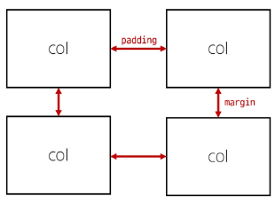
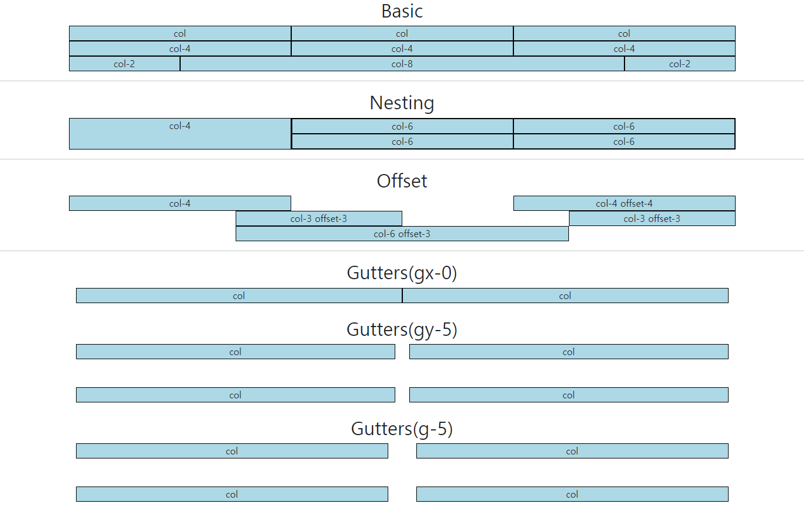
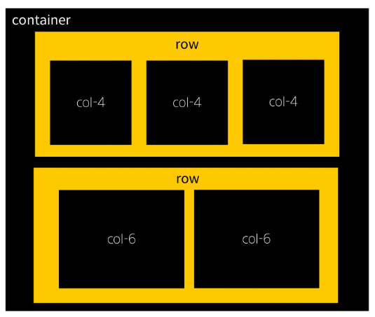
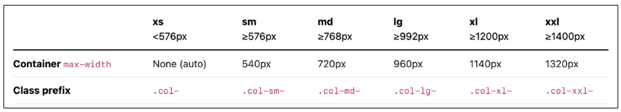
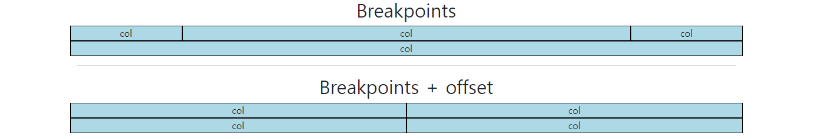
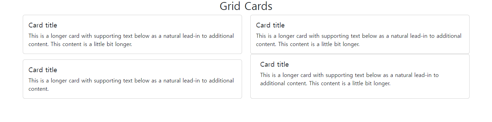
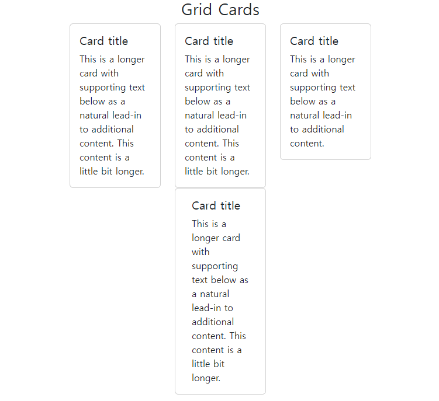

# Bootstrap Grid system

## Bootstrap Grid system
* Bootstrap Grid system
    * 웹 페이지의 레이아웃을 조정하는 데 사용되는 **12개의 컬럼**으로 구성된 시스템
    * 12개인 이유 : 수가 크지 않고 약수가 많아 동일한 크기로 나누어 사용하기 용이하기 때문이다.
* Grid system 목적
    * 반응형 디자인을 지원해 웹 페이지를 모바일, 태블릿, 데스크탑 등 다양한 기기에서 적절하게 표시할 수 있도록 도움
* 반응형 웹 디자인 : Resposive Web Design
    * 디바이스 종류나 화면 크기에 상관없이, 어디서든 일관된 레이아웃 및 사용자 경험을 제공하는 디자인 기술

### Grid system 구조
* grid system 기본 요소
    1. container
        * column들을 담고 있는 공간
    2. column
        * 실제 컨텐츠를 포함하는 부분
    3. gutter
        * column과 column 사이의 여백 영역
            * x축 : padding
            * y축 : margin

            

    * 1개의 row안에 12개의 column 영역이 구성
        * 각 요소는 12개 중 몇 개를 차지할 것인지를 지정
        

```html
<!DOCTYPE html>
<html lang="en">

<head>
  <meta charset="UTF-8">
  <meta name="viewport" content="width=device-width, initial-scale=1.0">
  <link href="https://cdn.jsdelivr.net/npm/bootstrap@5.3.3/dist/css/bootstrap.min.css" rel="stylesheet"
    integrity="sha384-QWTKZyjpPEjISv5WaRU9OFeRpok6YctnYmDr5pNlyT2bRjXh0JMhjY6hW+ALEwIH" crossorigin="anonymous">
  <style>
    .box {
      border: 1px solid black;
      background-color: lightblue;
      text-align: center;
    }
  </style>
</head>

<body>
  <h2 class="text-center">Basic</h2>
  <!-- class container를 지정하면 양쪽 side에 여백이 생김 -->
  <!-- container는 모든 것을 한줄의 box로 만든다 -->
  <div class="container">
    <div class="row">
      <!-- class box -> box col로 변경시 자동으로 나눠진다 -->
      <!-- 하지만 col로만 입력하지 않고 나누는 column의 개수를 지정해주는것을 추천 -->
      <!-- box col -> box col-4 -->
      <div class="box col-4">col</div>
      <div class="box col-4">col</div>
      <div class="box col-4">col</div>
    </div>
    <div class="row">
      <div class="box col-4">col-4</div>
      <div class="box col-4">col-4</div>
      <div class="box col-4">col-4</div>
    </div>
    <!-- row의 경우에는 줄이 나누어져 있더라도 하나의 줄로 합쳐준다 -->
    <div class="row">
      <div class="box col-2">col-2</div>
      <div class="box col-8">col-8</div>
      <div class="box col-2">col-2</div>
    </div>
  </div>

  <hr>
  <!-- Nesting(중첩) -->
  <h2 class="text-center">Nesting</h2>
  <div class="container">
    <div class="row">
      <div class="box col-4">col-4</div>
      <div class="box col-8">
        <div class="row">
          <div class="box col-6">col-6</div>
          <div class="box col-6">col-6</div>
          <div class="box col-6">col-6</div>
          <div class="box col-6">col-6</div>
        </div>
      </div>
    </div>
  </div>

  <hr>
  <!-- offset(상쇄) -->
  <h2 class="text-center">Offset</h2>
  <div class="container">
    <div class="row">
      <div class="box col-4">col-4</div>
      <!-- 쓰는 순서는 col-4 offset-4 이지만
      출력은 offset-4가 먼저 나오고 그다음 col-4가 나온다 -->
      <div class="box col-4 offset-4">col-4 offset-4</div>
    </div>
    <div class="row">
      <div class="box col-3 offset-3">col-3 offset-3</div>
      <div class="box col-3 offset-3">col-3 offset-3</div>
    </div>
    <div class="row">
      <div class="box col-6 offset-3">col-6 offset-3</div>
    </div>
  </div>

  <hr>
  <!-- Gutters - 1 -->
  <h2 class="text-center">Gutters(gx-0)</h2>
  <div class="container">
    <!-- gutter값은 row에서 조절한다 -->
    <div class="row gx-0">
      <div class="col-6">
        <div class="box">col</div>
      </div>
      <div class="col-6">
        <div class="box">col</div>
      </div>
    </div>
  </div>

  <br>
  <!-- Gutters - 2 -->
  <h2 class="text-center">Gutters(gy-5)</h2>
  <div class="container">
    <div class="row gy-5">
      <div class="col-6">
        <div class="box">col</div>
      </div>
      <div class="col-6">
        <div class="box">col</div>
      </div>
      <div class="col-6">
        <div class="box">col</div>
      </div>
      <div class="col-6">
        <div class="box">col</div>
      </div>
    </div>
  </div>

  <br>
  <!-- Gutters - 3 -->
  <h2 class="text-center">Gutters(g-5)</h2>
  <div class="container">
    <div class="row g-5">
      <div class="col-6">
        <div class="box">col</div>
      </div>
      <div class="col-6">
        <div class="box">col</div>
      </div>
      <div class="col-6">
        <div class="box">col</div>
      </div>
      <div class="col-6">
        <div class="box">col</div>
      </div>
    </div>
  </div>

  <script src="https://cdn.jsdelivr.net/npm/bootstrap@5.3.3/dist/js/bootstrap.bundle.min.js"
    integrity="sha384-YvpcrYf0tY3lHB60NNkmXc5s9fDVZLESaAA55NDzOxhy9GkcIdslK1eN7N6jIeHz"
    crossorigin="anonymous"></script>
</body>
</html>
```



### 참고
* The Grid System
    * CSS가 아닌 편집 디자인에서 나온 개념으로 구성 요소를 잘 배치해서 시각적으로 좋은 결과물을 만들기 위함
    * 기본적으로 안쪽에 있는 요소들의 오와 열을 맞추는 것에서 기인
    * 정보 구조와 배열을 체계적으로 작성하여 정보의 질서를 부여하는 시스템




## Grid system for resposive web
* Responsive Web Design
    * 디바이스 종류나 화면 크기에 상관없이, 어디서든 일관된 레이아웃 및 사용자 경험을 제공하는 디자인 기술
    * bootstrap gird system에서는 12개 column과 **6개 breakpoints**를 사용하여 반응형 웹 디자인을 구현

### Grid system Breakpoints
* Grid system Breakpoints
    * 웹 페이지를 다양한 화면 크기에서 적절하게 배치하기 위한 분기점
        * 화면 너비에 따라 6개의 분기점 제공(xs, sm, md, lg, xl, xxl)
    * 각 breakpoints마다 설정된 최대 너비 값 **이상으로** 화면이 커지면 grid system 동작이 변경됨

        

```html
<!DOCTYPE html>
<html lang="en">

<head>
  <meta charset="UTF-8">
  <meta name="viewport" content="width=device-width, initial-scale=1.0">
  <link href="https://cdn.jsdelivr.net/npm/bootstrap@5.3.3/dist/css/bootstrap.min.css" rel="stylesheet"
    integrity="sha384-QWTKZyjpPEjISv5WaRU9OFeRpok6YctnYmDr5pNlyT2bRjXh0JMhjY6hW+ALEwIH" crossorigin="anonymous">
  <style>
    .box {
      border: 1px solid black;
      background-color: lightblue;
      text-align: center;
    }
  </style>
</head>

<body>
  <h2 class="text-center">Breakpoints</h2>
  <div class="container">
    <div class="row">
      <!-- 화면이 줄어들면 2줄->4줄이 된다
      너비 576기준 (너비 기준은 sm위치에 어떤것이 들어가느냐에 따라) -->
      <!-- 기준을 전부 지정해줘야 한다 -->
      <div class="box col-12 col-sm-6 col-md-2">
      col
      </div>
      <div class="box col-12 col-sm-6 col-md-8">
        col
      </div>
      <div class="box col-12 col-sm-6 col-md-2">
        col
      </div>
      <div class="box col-12 col-sm-6 col-md-12">
        col
      </div>
    </div>

    <hr>

    <h2 class="text-center">Breakpoints + offset</h2>
    <div class="row">
      <div class="box col-12 col-sm-4 col-md-6">
        col
      </div>
      <div class="box col-12 col-sm-4 col-md-6">
        col
      </div>
      <div class="box col-12 col-sm-4 col-md-6">
        col
      </div>
      <!-- 이전 offset이 남아있다면 계속 유지가 되기 때문에 이후 바꾸기 위해서는 재설정 필요
      sm은 576이상(이하의 조건이 없음)의 조건을 가지기 때문 -->
      <div class="box col-12 col-sm-4 offset-sm-4 col-md-6 offset-md-0">
        col
      </div>
    </div>
  </div>

  <script src="https://cdn.jsdelivr.net/npm/bootstrap@5.3.3/dist/js/bootstrap.bundle.min.js"
    integrity="sha384-YvpcrYf0tY3lHB60NNkmXc5s9fDVZLESaAA55NDzOxhy9GkcIdslK1eN7N6jIeHz"
    crossorigin="anonymous"></script>
</body>
</html>
```



* Media Query로 작성된 Grid System의 breakpoints
```css
/* 이상인 경우만 나타내기 때문에
한번 설정하고 그 이후 조정을 위해선
다시한번 breakpoints를 설정해줘야 한다 */

/* Small devices (landscape phones, 576px and up) */
@media (min-width: 576px) {
    ...
}
/* Medium devices (tablets, 768px and up) */
@media (min-width: 768px) {
    ...
}
/* Large devices (desktops, 992px and up) */
@media (min-width: 992px) {
    ...
}
/* X-Large devices (large desktops, 1200px and up) */
@media (min-width: 1200px) {
    ...
}
/* XX-Large devices (larger desktops, 1400px and up) */
@media (min-width: 1400px) {
    ...
}
```

* Grid system은 화면 크기에 따라 12개의 칸을 각 요소에 나누어 주는것


## CSS Layout 종합 정리
* 각각의 기술은 용도와 장단점이 있다
* 각 기술은 독립적인 용도를 가지지 않으며, 어떤 기술이 적합한 도구가 될지는 특정 상황에 따라 다르다
* 이를 파악하기 위해서는 충분한 개발 경험이 필요하다
* instagram의 경우가 가장 분석하기 쉬운 형태이다.

### 참고
* grid cards
    * `row-cols` 클래스를 사용하여 행당 표시할 열(카드) 수를 손쉽게 제어할 수 있다

```html
<!DOCTYPE html>
<html lang="en">

<head>
  <meta charset="UTF-8">
  <meta name="viewport" content="width=device-width, initial-scale=1.0">
  <link href="https://cdn.jsdelivr.net/npm/bootstrap@5.3.3/dist/css/bootstrap.min.css" rel="stylesheet"
    integrity="sha384-QWTKZyjpPEjISv5WaRU9OFeRpok6YctnYmDr5pNlyT2bRjXh0JMhjY6hW+ALEwIH" crossorigin="anonymous">
</head>

<body>
  <h2 class="text-center">Grid Cards</h2>
  <div class="container">
    <div class="row row-cols-1 row-cols-sm-3 row-cols-md-2 gy-3">
      <div class="col">
        <div class="card">
          <div class="card-body">
            <h5 class="card-title">Card title</h5>
            <p class="card-text">This is a longer card with supporting text below as a natural lead-in to additional
              content. This content is a little bit longer.</p>
          </div>
        </div>
      </div>
      <div class="">
        <div class="card">
          <div class="card-body">
            <h5 class="card-title">Card title</h5>
            <p class="card-text">This is a longer card with supporting text below as a natural lead-in to additional
              content. This content is a little bit longer.</p>
          </div>
        </div>
      </div>
      <div class="">
        <div class="card">
          <div class="card-body">
            <h5 class="card-title">Card title</h5>
            <p class="card-text">This is a longer card with supporting text below as a natural lead-in to additional
              content.</p>
          </div>
        </div>
      </div>
      <div class="row offset-sm-4 offset-md-0">
        <div class="card">
          <div class="card-body">
            <h5 class="card-title">Card title</h5>
            <p class="card-text">This is a longer card with supporting text below as a natural lead-in to additional
              content. This content is a little bit longer.</p>
          </div>
        </div>
      </div>
    </div>
  </div>

  <script src="https://cdn.jsdelivr.net/npm/bootstrap@5.3.3/dist/js/bootstrap.bundle.min.js"
    integrity="sha384-YvpcrYf0tY3lHB60NNkmXc5s9fDVZLESaAA55NDzOxhy9GkcIdslK1eN7N6jIeHz"
    crossorigin="anonymous"></script>
</body>
</html>
```





### 알아두면 유용한 단축키들
* html 작성시 유용한 단축키들
    * ctrl + l : 한줄
    * ctrl + d : 동일한 키워드 연속 선택
    * ctrl + alt + 화살표 : 멀티커서
    * alt + click : 멀티 커서
    * alt + 화살표 : 선택한 라인 끌고 가기
    * alt + shift + 화살표 : 선택한 라인 복사