# PJT 08

### 이번 pjt 를 통해 배운 내용

* Locust를 사용해 서버 부하 테스트를 진행한다.

* 파이썬 언어로 테스트 시나리오를 작성하고 접속자에 따른 응답 시간을 확인한다.

## A. CSV 데이터를 DataFrame으로 변환 후 반환

* 요구 사항
  * 제공된 데이터를 Django에서 읽어온다. 
    * 프로젝트 경로와 동일한 폴더에 data 폴더를 저장한다.
  * Numpy 혹은 Pandas의 CSV를 읽어오는 함수를 활용해 완성한다.
  * DataFrame 생성 시 columns 옵션을 적절히 활용한다.
  * [참고] DataFrame은 아래 방법을 사용하여 반환할 수 있다.

    ```python
    # records : 리스트 원소를 각각 하나의 레코드로 만들기 위해 주는 옵션
    data = df.to_dict('records')
    
    # JSON 형태로 응답
    return JsonResponse({'data' : data})
    ```

* 결과
  
  ```python
  @api_view(['GET'])
  def csv_to_df(request):
    df = pd.read_csv('./data/test_data.CSV',encoding='cp949',usecols=['나이'])
    data = df.to_dict('records')
    
    return JsonResponse({'data' : data})  
  ```
  
  * 이 문제에서 어려웠던점
    * 없음
  * 내가 생각하는 이 문제의 포인트 
    * Pandas에서 `read_csv`를 사용하여 원하는 데이터를 불러와 JSON으로 가공하는 것이 포인트였다.

-----

## B. 결측치 처리 후 데이터 반환
* 요구 사항
  * Pandas 라이브러리의 특정 값 반환 함수를 활용한다.
  * <a>비어 있는 값을 "NULL" 문자열로 치환</a> 후 DataFrame을 반환한다.


* 결과
  
  ```python
  @api_view(['GET'])
  def dropna(request):
    df = pd.read_csv('./data/test_data_has_null.CSV',encoding='cp949',usecols=['나이'])
    df_new = df.fillna('NULL', inplace=True)
    data = df_new.to_dict('records')
    return JsonResponse({'data' : data})  
  ```
  
  * 이 문제에서 어려웠던점
    * 없음
  * 내가 생각하는 이 문제의 포인트
    * 빈 값들을 `NULL` 문자열로 치환하여 데이터의 결측치를 처리 후 반환하는 함수 `fillna('NULL', inplace=True)`를 사용하는 것이 포인트였다.

-----

## C. 알고리즘 구현하기(평균 나이와 가장 비슷한 10명)

* 요구 사항
  * DataFrame의 "나이" 필드를 활용한다.
  * 평균 나이와 가장 비슷한 나이인 10개 행을 새로운 DataFrame으로 만들어 반환한다.
  * "나이" 필드에 대해 <a>평균값을 구할 수 있도록 DataFrame을 전역 변수로 선언</a>하여 문제 해결에 활용한다.
  * "나이" 필드의 데이터 중, 결측치를 제외한 데이터들에 대하여 평균을 계산한다.

* 결과 : 10명의 사람에게 보내지 않으면 ....
  
  ```python
  @api_view(['GET'])
  def age_nearest(request):
    df = pd.read_csv('./data/test_data_has_null.CSV',encoding='cp949',usecols=['나이'])
    df_new = df.dropna(axis=0)
    df_nearest = df_new.iloc[(df_new['나이']-df_new['나이'].mean()).abs().argsort()[:10]]
    data = df_nearest.to_dict('records')
    return JsonResponse({'data' : data})
  ```
  
  * 이 문제에서 어려웠던점
    * `df_nearest = df_new.iloc[(df_new['나이']-df_new['나이'].mean()).abs().argsort()[:10]]`
    * `df_new['나이'].mean()` : 평균값 계산
    * `(df_new['나이']-df_new['나이'].mean()).abs()` : (나이-평균나이)의 절댓값 계산
    * `.argsort()[:10]` : 절댓값이 작은 순서대로 정렬후 작은 순서대로 10개의 데이터를 출력
    * `iloc` : index값을 이용하여 데이터에 접근하는 함수
  * 내가 생각하는 이 문제의 포인트
    * `argsort()` vs `sort()`
      * `sort()` : 오름차순 정렬이 default이며 원본 행렬은 그대로 유지한 채 원본 행렬의 정렬된 행렬을 반환한다. 
      * `argsort()` : 원본 행렬이 정렬되었을 때 원본 행렬의 원소에 대한 인덱스를 필요로할 때 이용한다. 정렬된 행렬의 원본 행렬의 인덱스를 얻을 수 있다.
    * `loc` vs `iloc`
      * `loc` : 데이터 프레임의 행이나 컬럼에 label이나 boolean array로 접근한다. location의 약어로, 인간이 읽을 수 있는 label값으로 데이터에 접근한다.
      * `iloc` : 데이터프레임의 행이나 컬럼에 인덱스 값으로 접근한다. integer location의 약어로 컴퓨터가 읽을 수 있는 indexing 값으로 데이터에 접근한다.

-----

## D. Locust를 활용한 알고리즘 성능 측정
* 요구 사항
  * `C`번에서 구현한 함수를 활용한다.
  * `C`번의 함수를 테스트 할 수 있도록 Locust 스크립트 파일을 작성한다.
  * 총 접속자 수와 동시 접속자 수를 변경하여 여러 번 성능 테스트를 시도한다.
  * 다른 사람들이 구현한 알고리즘과 나의 알고리즘을 비교한다.
    * PC 성능에 따라 다른 결과가 나올 수 있으므로, 코드를 전달 받도록 한다.
    * 내 PC에서 다른 사람들의 알고리즘을 동작 시켜보고, 결과를 기록한다.
  * 나의 알고리즘과 성능 차이가 나는 이유를 분석한다.

* 결과
  * First result(총 접속자 : 100, 동시 접속자 : 10)
    * 총 접속자(100)

      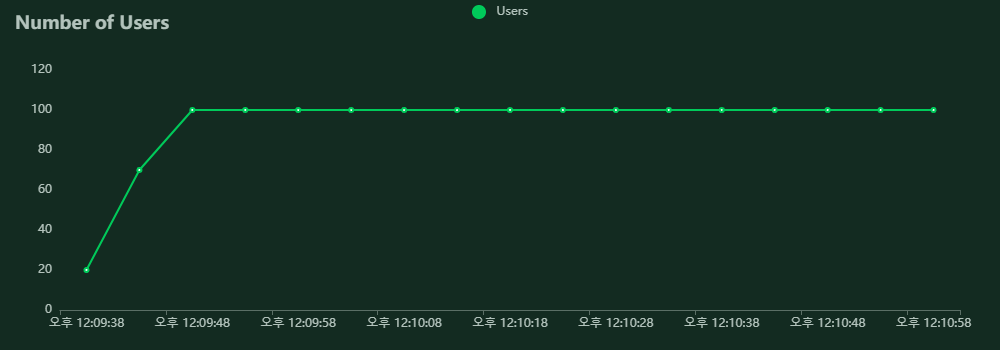
    
    * 동시 접속자(10)

      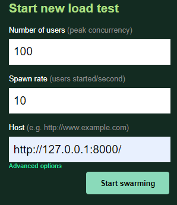

    * 응답 시간(54ms)

      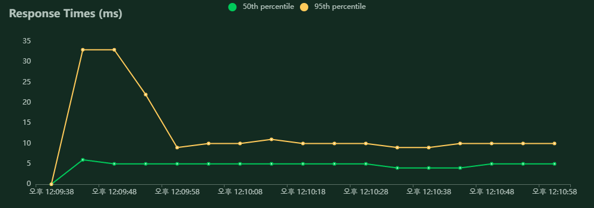

      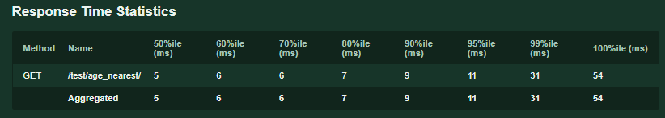

    * RPS(47.9)

      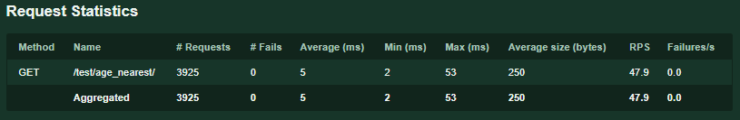

  * second result(총 접속자 : 500, 동시 접속자 : 100)
    * 총 접속자(500)

      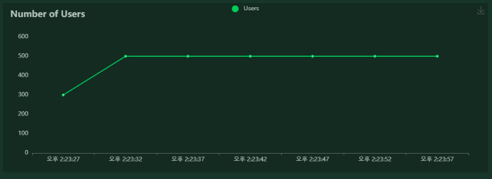

    * 동시 접속자(100)

      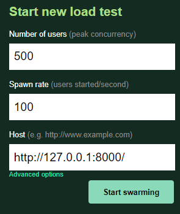

    * 응답 시간(2300ms)

      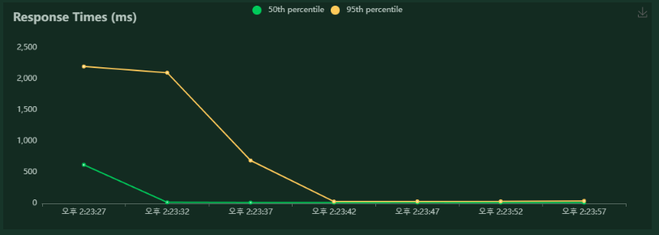

      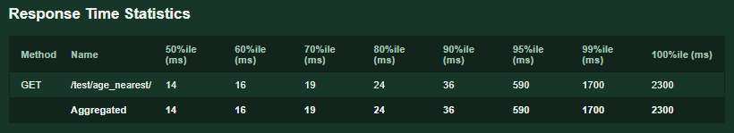

    * RPS(232.2)

      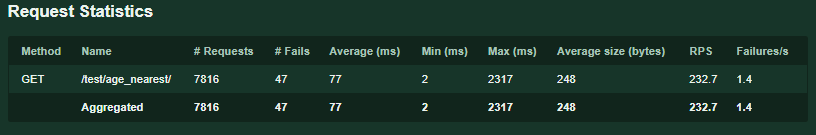
    
* comparison result
  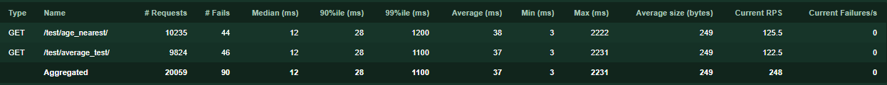

  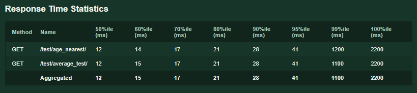

  * 이 문제에서 어려웠던점 : 없음
  * 내가 생각하는 이 문제의 포인트
    * Locust에서 제공하는 UI를 통해 서버 응답을 확인한다.

-----

....


# 후기

* Locust를 사용해 예상되는 동시접속자 수에 대해 서버가 정상적으로 응답할 수 있는지 확인하는 방법을 배웠다.
* 프로젝트에서도 적용해 안정적인 서버와 알고리즘 구축에 활용해야겠다.

