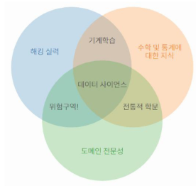

# 데이터 사이언스 (data science)
* 다양한 data로부터 새로운 지식과 정보를 추출하기 위해 과학적 방법론, 프로세스, 알고리즘, 시스템을 동원하는 융합 분야
* 컴퓨터 과학, 통계학, 수학 등 다양한 학몬의 원리와 기술을 활용
* 수 많은 뎅터를 모아서, 필요한 정보만을 이용해서 내가 원하는 정보 혹은 새로운 지식을 알아내는 과학 분야
* 

## 데이터 사이언스 프로세스
* 필요한 정보를 추출하는 5가지 단계
    1. 문제 정의 : 해결하고자 하는 문제 정의
        * 구굴의 주식은 오늘도 오를까?
    2. 데이터 수집 : 문제 해결에 필요한 데이터 수집
        * 관련기사, 구글의 동향, 구글의 이전 주가 등
    3. 데이터 전처리(정제) : 실질적인 분석을 수행하기 위해 데이터를 가공하는 단계
        * 수집한 데이터의 오류 제거(결측치, 이상치), 데이터의 형식 변환 등
        * 주가를 숫자로 변경, 월별로 정리
    4. 데이터 분석 : 전처리가 완료된 데이터에서 필요한 정보를 추출하는 단계
        * 오늘의 예상 주가
    5. 결과 해석 및 공유 : 의사 결정에 활용하기 위해 결과를 해석하고 시각화 후 공유하는 단계ㄴ
        * 만약 결과가 도출되지 않거나 명확하지 않다면 2단계로 돌아가 다시 시작한다.

## data 수집
* Web Scraping (웹 스크래핑) : 웹 페이지에서 데이터를 추출하는 기술
* Web Crawling (웹 크롤링) : 웹 페이지를 자동으로 탐색하고 데이터를 수집하는 기술
* Open API : 공개된 API를 통해 데이터를 수집
* 데이터 공유 플랫폼 활용 : 다양한 사용자가 데이터를 공유하고 활용할 수 있는 온라인 플랫폼
    * 종류 : kaggle(캐글), Data world, Dacon(데이콘), 공공데이터포털 등

### data 수집 - kaggle
* 데이터 분석 경진대회 플랫폼 
* 기업 및 단체에서 데이터와 해결 과제를 등록하면, 데이터 과학자들이 이를 해결하는 방법을 개발하고 경쟁할 수 있는 플랫폼
* 경진 대회, 데이터셋 공유, 토론 등의 기능이 가능하며 많은 데이터 과학자와 분석가들이 활용함
* 실습을 위해 캐글의 구글 주가 데이터를 다운로드 받아 활용한다.