# 배열 1 (Array 1)
* 1차원 배열

## Algorithm
* 유한한 단계를 통해 문제를 해결하기 위한 절차나 방법
* 주로 컴퓨터용어로 쓰이며, 컴퓨터가 어떤 일을 수행하기 위한 단계적 방법
    * 어떤 문제를 해결하기 위한 절차
* 알고리즘을 표현하는 방법
    1. 의사코드(슈도코드)
        * 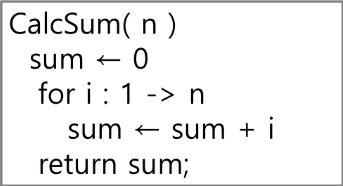
    2. 순서도
        * 
* 알고리즘의 성능
    1. 정확성
    2. 작업량
    3. 메모리 사용량
    4. 단순성
    5. 최적성

### 시간 복잡도
* 빅오 표기법(Big-O Notation)

## 배열 Array
* 일정한 자료형의 변수들을 하나의 이름으로 열거하여 사용하는 자료 구조
* python에서는 list, 자료 구조에서는 배열(array)라고 말하지만 혼용하여 사용하기도 한다.
* 배열의 필요성
    * 프로그램 내에서 여러 개의 변수가 필요할 때, 일일이 다른 변수명을 이용하여 자료에 접근하는 것은 매우 비효율적일 수 있다.
    * 배열을 사용하면 하나의 선언을 통해서 둘 이상의 변수를 선언할 수 있다.
    * 단순히 다수의 변수 선언을 의미하는 것이 아니라, 다수의 변수로는 하기 힘든 작업을 배열을 활용해 쉽게 할 수 있다.
* 1차원 배열의 선언
    * 별도의 선언방법이 없으면 변수에 처음 값을 할당할 때 생성
    * index 하나로 접근 가능
    * 이름 : 프로그램에서 사용할 배열의 이름
        * `Arr = list()`, `Arr = []`, `Arr = [1, 2, 3]`, `Arr = [0] * 10` 등
    * 1차원 배열의 접근
        * `Arr[0] = 10` : Arr의 0번째 index에 10을 저장 


## Bubble Sort

### 정렬
* 2개 이상의 자료를 특정 기준에 의해 오름차순 또는 내림차순으로 재배열하는 것
* 대표적인 정렬 방식
    * 버블 정렬 Bubble Sort
    * 카운팅 정렬 Counting Sort
    * 선택 정렬 Selection Sort
    * 퀵 정렬 Quick Sort
    * 삽입 정렬 Insertino Sort
    * 병합 정렬 Merge Sort

### 버블 정렬 Bubble Sort
* 인접한 두 개의 원소를 비교하며 자리를 계속 교환하는 방식

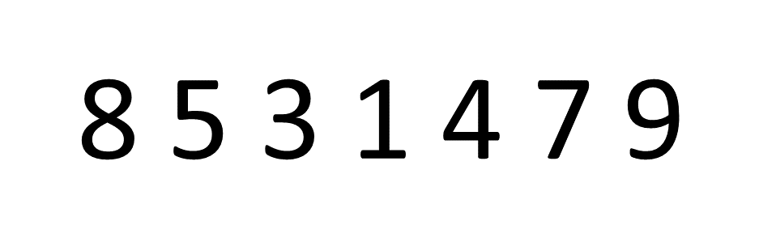

* 정렬 과정
    1. 첫 번째 원소부터 인접한 원소끼리 계속 자리를 교환하면서 맨 마지막 자리까지 이동한다.
    2. 한 단계가 끝나면 가장 큰 원소가 마지막 자리로 정렬된다.
* 교환하며 자리를 이동하는 모습이 물위에 올라온 거품 모양과 같다고 하여 버블 정렬이라고 부른다.
* 중요한 것은 정렬을 완료한 곳은 또다시 돌지 않는 것!
* 시간 복잡도 `O(n**2)`
* 배열을 활용한 버블 정렬
    ```python
    # while문을 이용햔 bubble sort
    lst = [8, 5, 3, 1, 4, 7, 9]
    num = len(lst)

    while num > 0 :
        for i in range(num-1) :
            if lst[i] > lst[i+1] :
                lst[i], lst[i+1] = lst[i+1], lst[i]
        num -= 1

    print(lst) # [1, 3, 4, 5, 7, 8, 9]

    # 이중 for문을 이용한 bubble sort
    lst = [8, 5, 3, 1, 4, 7, 9]

    for i in range(len(lst)-1) :
        for j in range(0, i) :
            if lst[j] > lst[j+1] :
                lst[j], lst[j+1] = lst[j+1], lst[j]

    print(lst) # [1, 3, 4, 5, 7, 8, 9]
    ```


## Counting Sort
* 항목들의 순서를 결정하기 위해 집합에 각 항목이 몇 개씩 있는지 세는 작업을 하여 선행 시간에 정렬하는 효율적인 알고리즘
* 제한 사항
    * 정수나 정수로 표현할 수 있는 자료에 대해서만 적용 가능. 각 항목의 발생 횟수를 기록하기 위해, 정수 항목으로 인덱스 되는 카운트들의 배열을 사용하기 때문
    * 카운트들을 위한 충분한 공간을 할당하려면 집합 내의 가장 큰 정수를 알아야 한다.
* 시간 복잡도
    * `O(n+k)` : n은 list의 길이, k는 정수의 최대값


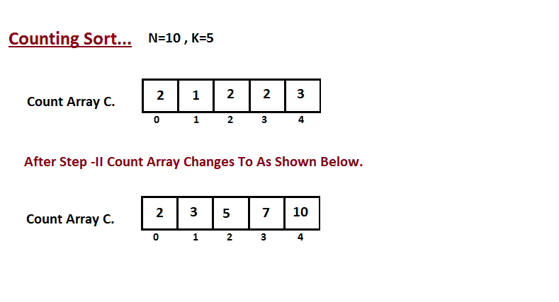

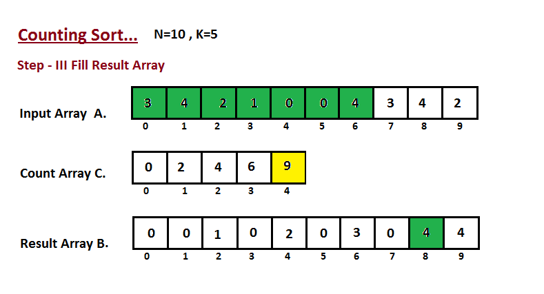


    ```python
    N = 6 # input 길이
    K = 9 # input의 최댓값
    data = [7, 2 ,4, 5, 1, 3]
    counts = [0] * (K+1)
    temp = [0] * K

    for x in data : # 정렬1번
        counts[x] += 1

    for i in range(1, K+1) : # 정렬2번
        counts[i] = counts[i-1] + counts[i]

    for i in range(N-1, -1, -1) : # 정렬3번
        counts[data[i]] -= 1
        temp[counts[data[i]]] = data[i]

    print(*temp)
    ```

* 위에서 이해가 안됐다면 아래 그림을 통해 이해해 보자

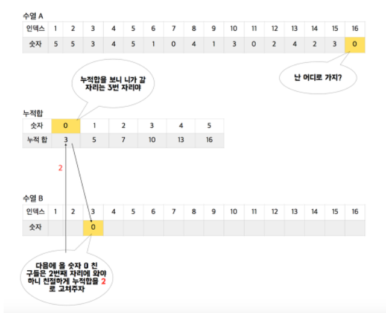

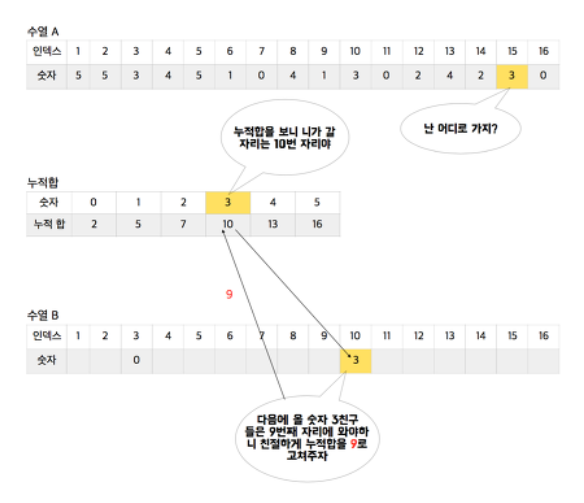

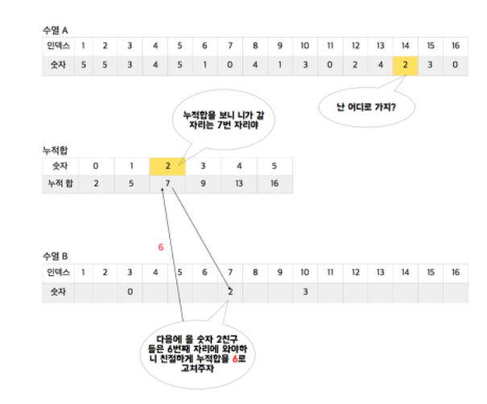

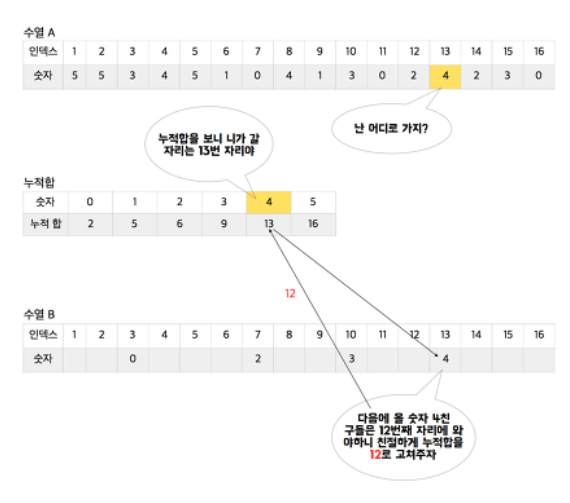

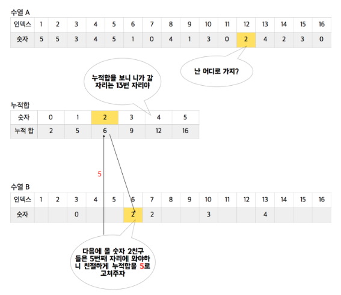

* 시간 복잡도 비교
    * 카운트 정렬 오타 : 'k가 비교적 작을때만 가능'이다. (비고란)

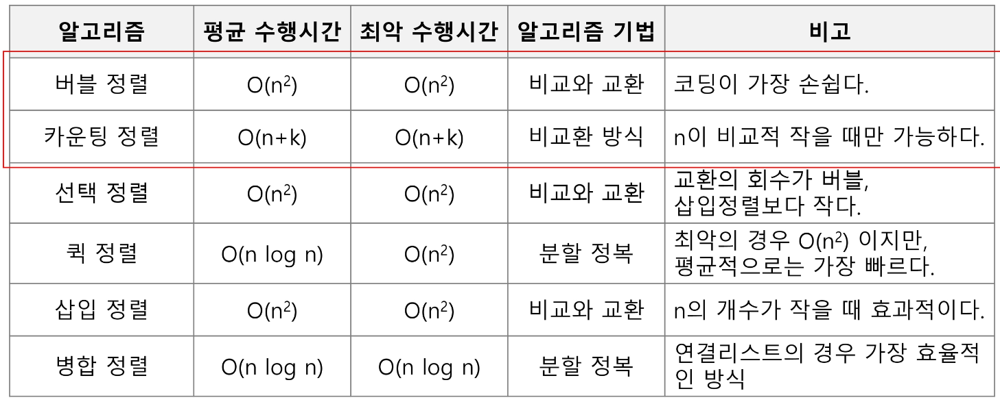


## 완전 검색
* 문제의 해법으로 생각할 수 있는 모든 경우의 수를 나열하고 확인하는 기법
* 모든 경우의 수를 전부 찾아 확인하는 방법이기 때문에 Brute-force 또는 generate-and-test 기법이라고 불리기도 한다.
* 모든 경우의 수를 테스트하고, 최종 해법을 찾는다.
* 일반적으로 경우의 수가 상대적으로 작을 때 유용하다.
* 모든 경우의 수를 생성하고 테스트 하기 때문에 수행속도는 느리지만 정답을 찾아내지 못할 확률은 매우 작다.

### baby-gin 문제
* 0~9 까지의 수 중에서 중복 포함하여 6개의 숫자를 뽑을 때 6장의 카드 전부 run 또는 triplet이면 된다. (run : 3개의 수가 연속인 경우, triplet : 3장의 수가 같은 경우)
* 완전탐색의 경우 6자리 수를 입력 받으면 6자리로 만들수 있는 모든 경우의 수를 생각하고 그 때 각각 3자리씩 나누어 run 또는 triplet인지를 확인해야 한다.

## Greedy Algorithm
* 그리디, 탐욕 알고리즘
* 최적해를 구하는데 사용되는 근시안적인 방법
* 여러 경우 중 하나를 결정해야 할 때마다 그 순간에 최적이라고 생각되는 것을 선택해 나가는 방식으로 진행하여 최종적인 해답에 도달
* 각 선택의 시점에서 이루어지는 결정은 지역적으로는 최적이지만, 그 선택들을 게속 수집하여 최종적인 해답을 만들었다고 하여, 그것이 최적이라는 보장은 없다.
* 일반적으로 머릿속에 떠오르는 생각을 검증없이 바로 구현하면 Greedy접근이 된다.
* greedy 동작 과정
    1. 해 선택 : 현재 상태에서 부분 문제의 최적 해를 구한 뒤, 이를 부분해 집합에 추가한다.
    2. 실행 가능성 검사 : 새로운 부분해 집합이 실행 가능한지를 확인한다. 곧 문제의 제약 조건을 위반하지 않는지를 검사한다.
    3. 해 검사 : 새로운 부분해 집합이 문제의 해가 되는지를 확인한다. 아직 전체 문제의 해가 완성되지 않았다면 1번 과정부터 다시 시작한다.

### baby-gin 문제

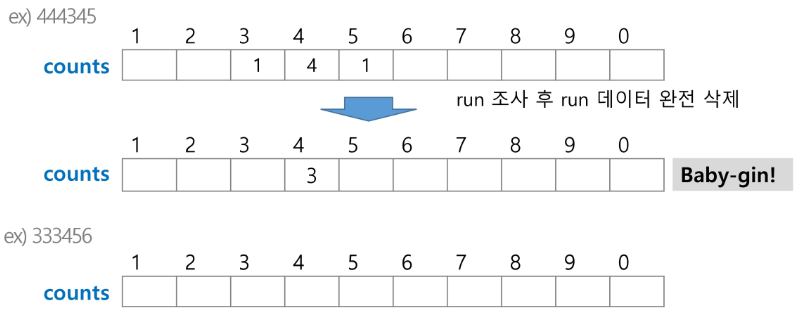

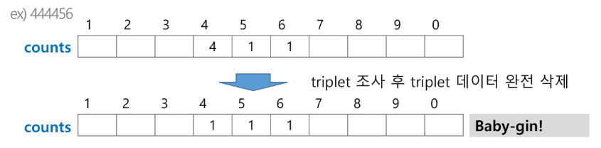

* baby-gin 문제를 greedy로 풀어보기
    ```python
    num = 456789 # Baby Gin을 확인할 6자리

    # 6자리 수로부터 각 자리수를 추출하여 개수를 누적할 list
    # 0~9지만 12칸을 만드는 이유는 '7이하'라는 조건을 빼는 대신 -> why?
    c = [0] * 12

    for i in range(6) :
        c[num % 10] += 1
        num //= 10

    i = 0
    tri = run = 0
    while i < 10 : # triplete 조사 후 데이터 삭제
        if  c[i] >= 3 :
            c[i] -= 3
            tri += 1
            continue

        # run 조사 후 데이터 삭제
        if c[i] >= 1 and c[i+1] >= 1 and c[i+2] >= 1 :
            c[i] -= 1
            c[i+1] -= 1
            c[i+2] -= 1
            run += 1
            continue

        i += 1

    if run + tri == 2 :
        print("Baby Gin")
    else : print("Lose")
    ```