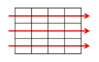
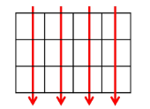
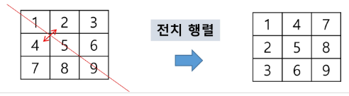
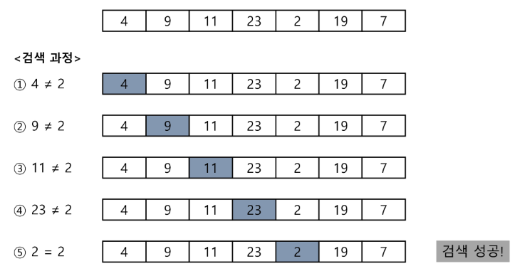
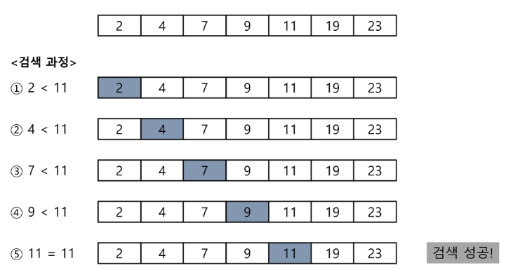
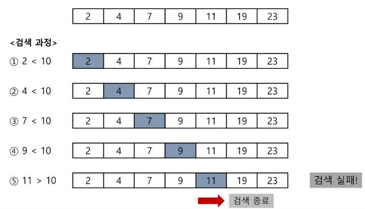
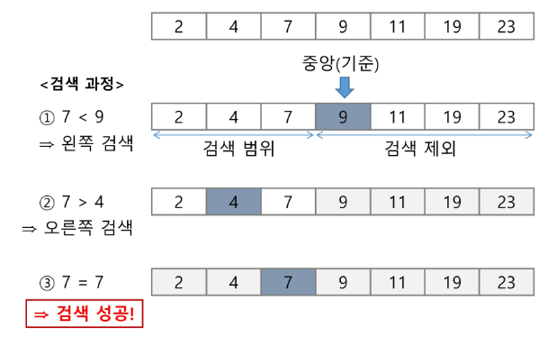
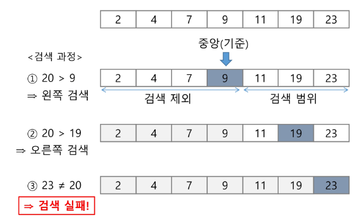

# 배열 2 (Array 2)
* 2차원 배열

## 배열 : 2차원 배열
* 2차원 배열의 선언
    * 1차원 list를 묶어놓은 list
    * 2차원 이상의 다차원 list는 차원에 따라 index를 선언
    * 2차원 list의 선언 : 행의 개수, 열의 개수를 필요
    * python에서는 data 초기화를 통해 변수 선언과 초기화가 가능
    ```python
    # 2행 4열의 2차원 list
    arr = [[0, 1, 2, 3],
           [4, 5, 6, 7]] 
    ```
* 배열 순회
    * (n * m)배열의 (n*m)개의 모든 원소를 빠짐없이 조사하는 방법
    * 행 우선 순회
    
        

        ```python
        # i 행의 좌표
        # j 열의 좌표
        for i in range(n) :
            for j in range(m) :
                f(array[i][j]) # 필요한 연산 수행
        ```
    * 열 우선 순회
        
        
        
        ```python
        # i 행의 좌표
        # j 열의 좌표
        for j in range(m) :
            for i in range(n) :
                f(array[i][j]) # 필요한 연산 수행
        ```
    * 지그재그 순회
        
        

        ```python
        # i 행의 좌표
        # j 열의 좌표
        for i in range(n) :
            for j in range(m) :
                f(array[i][j + (m-1-2*j)*(i%2)])
        ```
* 델타를 이용한 2차 배열 탐색
    * 2차 배열의 한 좌표에서 4방향의 인접 배열 요소를 탐색하는 방법
    * index (i, j)인 칸의 상하좌우칸 (ni, nj)

        

        ```python
        # 방향별로 더할 값
        di = [0, 1, 0, -1]
        dj = [1, 0, -1, 0]

        for k in [0, 1, 2, 3] :
            i += di[k]
            j += dj[k]
        ```
* 전치 행렬

    

    ```python
    # i 행의 좌표
    # j 열의 좌표
    arr  [[1, 2, 3][4, 5, 6][7, 8, 9]]

    for i in range(3) :
        for j in range(3) :
            if i < j :
                arr[i][j], arr[j][i] = arr[j][i], arr[i][j]
    ```


## 부분집합 생성
* 부분집합
    * 집합의 원소가 n개일 때, 공집합을 포함한 부분집합의 개수는 `2**n`개이다.
    * 각 원소를 포함하거나 포함하지 않는 2가지 경우를 모든 원소에 적용시킨 결과이다.
    * 각 원소가 부분집합에 포함되어 있는지 loop를 이용하여 확인하고 부분집합을 생성하는 방법
        ```python
        bit = [0, 1, 2, 3]
        for i in range(2) :
            bit[0] = i : # 0번 원소
            for j in range(2) :
                bit[1] = j # 1번 원소
                for k in range(2) :
                    bit[2] = k # 2번 원소
                    for l in range(2) :
                        bit[3]  l # 3번 원소
                        print_subset(bit) # 생성된 부분집합 출력
        ```
* bit의 이해
    * 기본 이해 : 리스트 A가 존재할 때, 리스트의 인덱스를 2의 거듭제곱으로 나타낸다. 이때 인덱스의 합을 기준으로 부분집합을 나타내는 방식으로 이해를 하면 된다. 2의 거듭제곱의 합으로 숫자를 나타내는 방법은 유일하기 때문에 숫자 한개당 부분집합을 표현하는 방법이 유일하다.
        * 이때 index의 지수(2의 거듭제곱의 지수)가 실제 python에서의 index가 된다.
    * 응용 이해 :똑같은 방식으로 거꾸로 사용하여 원하는 값만 가져오는 것 또한 가능하다. 내가 원하는 부분집합의 원소들의 index를 합쳐서 하나의 2진법 수로 나타낸다면 그것은 유일한 부분집합을 나타내는 경우다.
    * 이렇게 생각해도 부분집합은 원소가 n개 일 때, `2**n`의 부분집합을 갖는다.
    ```python
    # 기본 이해
    
    # 원소 리스트
    my_list = [a, b, c, d]
    # 원소의 index를 2의 거듭제곱으로 생각
    my_indx = [1, 2, 4, 8]
    # 순서는 2의 거듭제곱, 이때 거듭제곱의 지수가 실제 python에서의 index와 동일하다.

    # 14 = 2 + 4 + 8 => 1110(2) : 14
    # [b, c, d]를 나타내는 수가 14가 된다. (2진법 기준)
    ```
    ```python
    # 응용 이해

    # 원소의 개수가 n개라면 0~(2**n-1)까지 부분집합을 의미하는 숫장이다.
    # 하나의 숫자로 원하는 배열을 가져올 수 있다.

    # 원소 리스트
    my_list = [a, b, c, d]
    # 원소의 index를 2의 거듭제곱으로 생각
    my_indx = [1, 2, 4, 8]

    # 14 = 8 + 4 + 2 = 1110(2)
    # 따라서 이 경우 부분집합은 [b, c, d]를 나타낸다.
    ```
    * '기본 이해'의 경우 내가 부분집합을 전부 원한다면 전부 만들어두고 생각하는데 용이하다. '응용 이해'는 내가 원하는 부분집합을 뽑고 싶다면 그것을 숫자로 나타내거나 처음부터 전부 만들 필요가 없고 바로 호출 하면 된다.
* bit 연산자
    * `&` : bit 단위로 AND 연산을 한다.
        * `i&(1<<j)` : i의 j번째 비트가 1인지 아닌지를 검사한다.
    * `|` : bit 단위로 OR 연산을 한다.
    * `<<` : 피연산자의 bit 열을 왼쪽으로 이동시킨다.
        * `1<<n` : 2**n 즉, 원소가 n개일 경우의 모든 부분집합 수를 의미한다.
        * `a<<b` : `a * (2**b)` 를 의미한다.
    * `>>` : 피연산자의 bit 열을 오른쪽으로 이동시킨다.
        * `a>>b` : `a * (0.5**b)` 를 의미한다.
* bit를 이용하여 간결하게 부분집합을 생성하는 방법
    ```python
    arr = [3, 6, 7, 1, 5, 4]

    n = len(arr) # 원소의 개수

    for i in range(1<<n) : # 1<<n : 부분집합의 개수
        for j in range(n) : # 원소의 수만큼 비트를 비교
            if i & (1<<j) : # i의 j번 비트가 1인경우
                print(arr[j], end=" ") # j번 원소 출력
        print()
    print()
    ```


## 바이너리 서치 (Binary Search)
* 검색(Search)
    * 저장되어 있는 자료 중에서 원하는 항목을 찾는 작업
    * 목적하는 탐색 키를 가진 항목을 찾는것
        * 탐색 키(search key) : 자료를 구별하여 인식할 수 있는 키
* 검색의 종류
    * 순차 검색(sequential serach)
    * 이진 검색(binary search)
    * 해쉬(hash)

### 순차 검색(Sequential Search)
* 가장 간단하고 직관적인 검색 방법
* 배열이나 연결 리스트 등 순차구조로 구현된 자료구조에서 원하는 항목을 찾을 때 유용함
* 알고리즘이 단순하여 구현이 쉽지만 검색 대상의 수가 많은 경우에는 수행시간이 급격히 증가하여 비효율적임
* 검색 과정 - 정렬이 되어 있지 않은 경우
    1. 첫 번째 원소부터 순서대로 검색 대상과 키 값이 같은 원소가 있는지 비교하며 찾는다.
    2. 키 값이 동일한 원소를 찾으면 그 원소의 인덱스를 반환한다.
    3. 자료구조의 마지막에 이를 때까지 검색 대상을 찾지 못하면 검색 실패
        ```python
        def sequential_search(a, n, key) :
            i = 0
            while i < n and a[i] != key :
                i += 1
            if i < n :
                return i
            else :
                return -1
        ```

        

        

    * 시간 복잡도 : O(n)
* 검색 과정 - 정렬이 되어 있는 경우
    1. 자료가 오름차순으로 정렬된 상태에서 검색을 실시한다고 가정하면
    2. 자료를 순차적으로 검색하면서 key값을 비교하며 원소의 key값이 검색 대상의 key값보다 크면 찾는 원소가 없는 것으로 검색 종료
        ```python
        def sequential_search(a, n, key) :
            i = 0
            while i < n and a[i] < key :
                i += 1
            if i < n and a[i] == key :
                return i
            else :
                return -1
        ```

        

        

### 이진 검색 (Binary Search)
* 자료의 가운데에 있는 항목의 키 값과 비교하여 다음 검색의 위치를 결정하고 검색을 계속 진행하는 방법
    * 목적 키를 찾을 때까지 이진 검색을 순환적으로 반복 수행함으로써 검색 범위를 반으로 줄여가면서 보다 빠르게 검색을 수행함
* 이진 검색을 위해서는 **정렬된** 상태의 자료여야 한다.
* 검색 과정
    1. 자료의 중앙에 있는 원소를 찾는다.
    2. 중앙 원소의 값과 찾고자 하는 목표 값을 비교한다.
    3. 목표 값이 중앙 원소의 값보다 작으면 자료의 왼쪽 반에 대해서 새로 수행하고, 크다면 자료의 오른쪽 반에 대해서 새로 검색을 수행한다.
    * 찾고자 하는 값을 찾을 때까지 반복한다.
        ```python
        def binary_search(a, n, key) :
            start = 0
            end = n-1
            while start <= end :
                middle = (start + end) // 2
                if a[middle] == key : # 검색 성공
                    return True
                elif a[middle] > key :
                    end = middle -1
                else :
                    start = middle + 1
            return False # 검색 실패
        ```
        ```python
        # 재귀함수 이용
        def binary_search(a, low, high, key) :
            if low > high : # 검색 실패
                return False
            else :
                middle = (low + high) // 2
                if key == a[middle] : # 검색 성공
                    return True
                elif key < a[middle] :
                    return binary_search(a, low, middle - 1, key)
                elif a[middle] < key :
                    return binary_search(a, middle + 1, high, key)
        ```

        

        

### 이진 검색과 순차 검색의 차이


## 선택 정렬 (Selection Sort)
* 주어진 자료들 중 가장 작은 값의 원소부터 차례대로 선택하여 위치를 교환하는 방식
* 정렬 과정
    1. 주어진 list중에서 최소값을 찾는다.
    2. 그 값을 리스트의 맨 앞에 위치한 값과 교환한다.
    3. 맨 처음 위치를 제외한 나머지 리스트를 대상으로 위 과정을 반복한다.
        ```python
        def selection(a, N) :
            for i in range(N-1) :
                minidx = i
                for j in range(i+1, N) :
                    if a[minidex] > a[j] :
                        minidx = j # 최솟값의 index를 찾는다.
                # 최솟값을 (i+1, N)범위의 index의 list에서 i+1의 값과 교환한다.
                a[i], a[minidx] = a[minidx], a[i]
        ```
* 시간 복잡도 :O(n**2)


## 셀렉선 알고리즘 (Selection Algorithm)
* 저장되어 있는 자료로부터 k번째로 큰 혹은 작은 원소를 찾는 방법을 selection algorithm이라고 한다.
    * 최대값, 최소값, 중간값 등을 찾는 algorithm을 의미하기도 한다.
* 선택 과정
    1. 정렬 알고리즘을 이용하여 자료를 정리한다.
    2. 원하는 순서에 있는 원소 가져오기
* k번째로 작는 원소를 찾는 알고리즘
    * 1~k번째까지 작은 원소들을 찾아 배열의 앞쪽으로 이동시키고, 배열의 k번째를 반환한다.
    * k가 비교적 작을 때 유용하며 O(kn)의 수행시간을 필요로 한다.
        ```python
        def select(arr, k) :
            for i in range(0, k) :
                minindex = i
                for j in range(i+1, len(arr)) :
                    if arr[minindex] > arr[j] :
                        minindex = j
                arr[i], arr[minindex] = arr[minindex], arr[i]
            return arr[k-1]
        ```