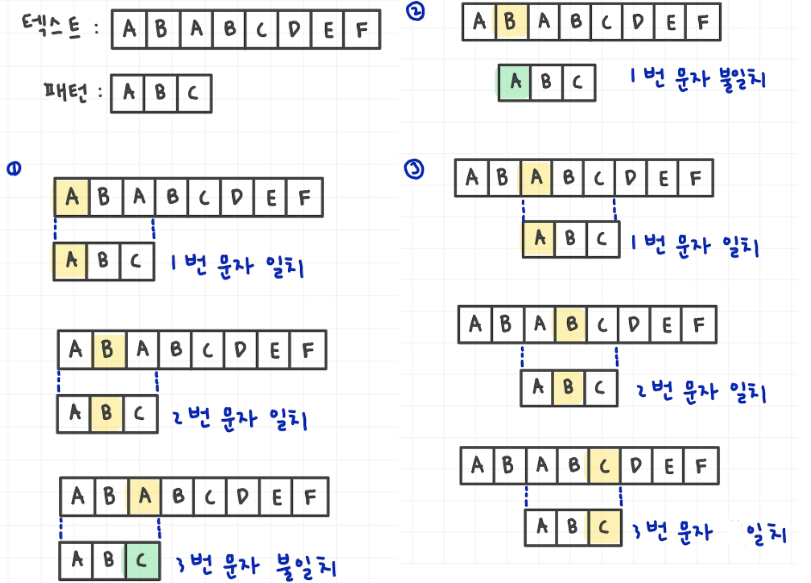
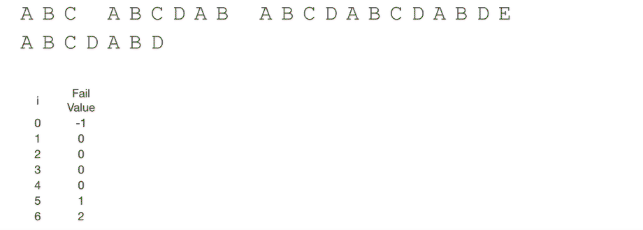

# string (문자열)

### 아스키 코드
* 개발자에 따라 표현방식이 바뀌는 것을 방지하기 위해 표준안을 만들었다.
* 1967년 미국에서 ASCII라는 문자 인코딩 표준이 제정되었다.
    * American Standard Code for Information Interchange
* 아스키 코드(7bit - 128개)


* 확장 아스키 코드는 1bit을 추가하여 총 8bit으로 총 256개를 표현 가능하게 했다.
* 아스키 코드의 사용
    * 문자 -> 숫자
        ```python
        print(ord'A') # 65
        print(ord'B') # 66
        print(ord'C') # 67
        ```
    * 숫자 -> 문자
        ```python
        print(chr(65)) # A
        print(chr(66)) # B
        print(chr(67)) # C
        ```

### 유니 코드
* 인터넷이 전 세계로 발전하면서 ASCII를 만들었을 때의 문제와 같은 문제가 국가간 발생 -> 각 국가별로 ASCII 코드와 같은 표준안이 필요 -> 유니코드
* 유니코드도 다시 Charactre Set으로 분류한다.
    * UCS-2(Universal Character Set 2)
    * UCS-4(Universal Character Set 4)
    * 유니코드를 저장하는 변수의 크기를 정의
    * but, bite 순서에 대해서 표준화하지 못함.
    * 파일 인식 시 이 파일이 UCS-2인지 UCS-4인지 인식하고 각 경우를 구분해서 다르게 구현해야 하는 문제 발생 -> 외부 인코딩 필요


## 문자열
* 문자열 뒤집기 : 방법이 매우 많음
    ```python
    # 문자열 자체를 뒤집는 방법
    s = 'algorithm'
    s = s[::-1]
    print(s) # mhtirogla
    ```
    ```python
    # 문자열을 list로 변환후 뒤집는 방법
    s = 'algorithm'
    s = list(s)
    s.reverse()
    s = ''.join(s)
    print(s) # mhtirogla
    ```
    ```python
    # for문으로 index로 뒤집는 방법
    s = 'algorithm'
    s = list(s)
    n = len(s)
    for i in range(n//2) :
        s[i], s[n//2-1-i] = s[n//2-1-i], s[i]
    s = ''.join(s)
    print(s) # mhtirogla
    ```


## 패턴 매칭

### Brute Force(브루트 포스)
* 본문 문자열을 처음부터 끝까지 차례대로 순회하면서 패턴 내의 문자들을 일일이 비교하는 방식으로 동작
* brute force 비교과정
    1. T : 원본 문자열, P : 찾고자 하는 문자열
    2. T, P 모두 첫 문자부터 비교를 시작하므로 검색 인덱스를 맨 처음 인덱스로 설정
    3. 각각의 검색 인덱스부터 하나씩 문자를 비교
        * 비교 문자가 동일하다면 T, P 인덱스 모두 뒤로 한 칸씩 이동
        * 비교 문자가 다르면 T의 인덱스는 한 칸 뒤로 이동, P의 인덱스는 맨 처음 인덱스도 돌아간다.
    4. 3번 과정을 검색이 끝날 때까지 반복한다.

    

* 시간 복잡도 : O(mn)
    * m은 문자열의 길이, n은 총 문자열의 길이
* 장점 : 구현이 쉬운 편이며 100% 정답을 출력한다.
* 단점 : 모든 자료를 탐색하기 때문에 시간이 매우 비효율적이다.
```python
def BruteForce(p, t) :
    i = 0 # t의 검색 index
    j = 0 # p의 검색 index
    
    while i < len(t) and j < len(p) :
        if t[i] != p[j] :
            i -= j
            j = -1
        i += 1
        j += 1
    
    if j == len(p) :
        return i - len(p) # 검색 성공
    else :
        return -1 # 검색 실패
    
pattern = 'python'
text = 'hello python world'
# text에서 몇번째 index부터 pattern이 나오는지 출력
print(BruteForce(pattern, text)) # 6
```

### KMP 알고리즘
* Knuth-Morris-Pratt 알고리즘
* 불일치가 발생한 텍스트 스트링의 앞 부분에 어떤 문자가 있는지를 미리 알고 있으므로, 불일치가 발생한 앞 부분에 대하여 다시 비교하지 않고 매칭을 수행
* 패턴을 전처리하여 배열 next[M]을 구해서 잘못된 시작을 최소화함
    * next[M] : 불일치가 발생했을 경우 이동할 다음 위치
* 시간 복잡도 : O(M+N)
* KMP 알고리즘 비교 과정
    1. text에서 abcdabc까지는 매치되고, e에서 실패한 상황
    2. 맨 앞의 abc와 실패 직전의 abc는 동일함을 이용할 수 있다.
    3. 실패한 문자와 텍스트 P[4]를 비교한다.

    

```python
# KMP 알고리즘을 수행하기 전, 패턴을 처리하는 함수
# 패턴의 테이블 생성
def kmp(t, p):
    n = len(t)
    m = len(p)
    lps = [0] * (m+1)

    # preprocessing
    j = 0 # 일치한 개수 == 비교할 패턴 위치
    lps[0] = -1

    for i in range(1, m) :
        lps[i] = j # p[i]이전에 일치한 개수
        if p[i] == p [j] :
            j += 1
        else :
            j = 0
    lps[m] = j

    # search
    i = 0 # 비교할 택스트 위치
    j = 0 # 비교할 패턴 위치
    while i < n and j <= m :
        if j == -1 or t[i] == p[j] : # 첫글자가 불일치 했거나 일치할 경우
            i += 1
            j += 1
        else : # 불일치
            j = lps[j]

        if j == m : # 패턴을 찾을 겨웅
            print(i-m, end = ' ') # 패턴의 인덱스 출력
            j = lps[j]
    
    print()
    return

t = 'zzzabcdabcdabcefabcd'
p = 'abcdabcef'
kmp(t, p) # 7
t = 'AABAACAADAABAABA'
p = 'AABA'
kmp(t, p) # 0 9 12
t = 'AAAAABAAABA'
p = 'AAAA'
kmp(t, p) # 0 1
t = 'AAAAABAAABA'
p = 'AA'
kmp(t, p) # 0 1 2 3 6 7
```

### 보이어-무어 알고리즘
* 동작 원리
    * 패턴의 끝부터 텍스트를 검사하여 일치하지 않는 문자가 나타나는 경우, 패턴을 끝에서부터 미루어 이동시키는 원리를 동작한다. 이를 통해 패턴을 찾기 위해 많은 비교를 수행하는 것을 방지하고 검색 속도를 향상시킬 수 있다.
    * 패턴의 오른쪽 끝과 텍스트의 왼쪽 끝에서부터 비교 후 일치하지 않으면 패턴을 오른쪽으로 이동. 이때 이동 거리는 미리 계산된 휴리스틱 함수에 의해 결정된다.



```python
def boyer_moore(text, pattern):
    text_length = len(text)
    pattern_length = len(pattern)
    skip = []

    # 휴리스틱 함수 계산
    for i in range(256):
        skip.append(pattern_length)
    for i in range(pattern_length - 1):
        skip[ord(pattern[i])] = pattern_length - i - 1

    # 검색
    i = pattern_length - 1
    while i < text_length:
        j = pattern_length - 1
        while text[i] == pattern[j]:
            if j == 0:
                return i
            i -= 1
            j -= 1
        i += max(skip[ord(text[i])], pattern_length - j)

    return -1

text = "ABABCABABABAABCABAB"
pattern = "BAABCABAB"

result = boyer_moore(text, pattern)
if result != -1:
    print("패턴이 텍스트에서 발견되었습니다. 인덱스:", result)
else:
    print("패턴이 텍스트에 존재하지 않습니다.")

# 패턴이 텍스트에서 발견되었습니다. 인덱스: 10
```