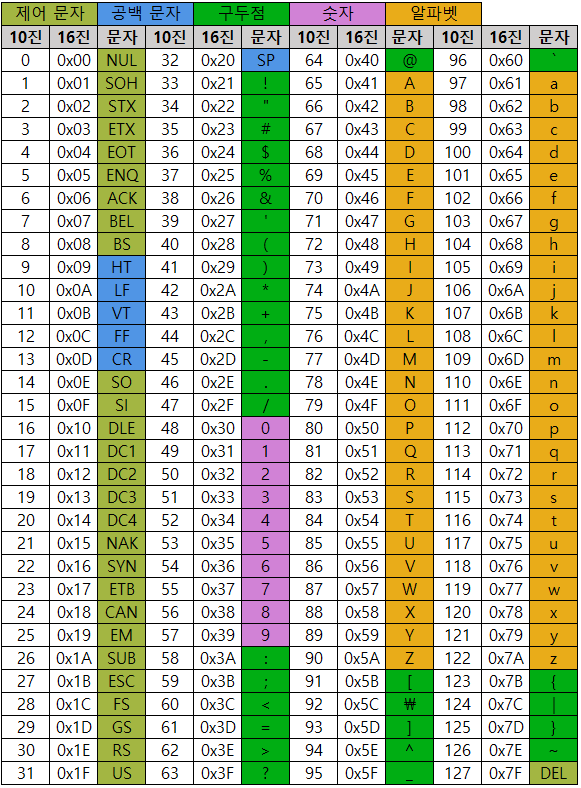

# string (문자열)

### 아스키 코드
* 개발자에 따라 표현방식이 바뀌는 것을 방지하기 위해 표준안을 만들었다.
* 1967년 미국에서 ASCII라는 문자 인코딩 표준이 제정되었다.
    * American Standard Code for Information Interchange
* 아스키 코드(7bit - 128개)



* 확장 아스키 코드는 1bit을 추가하여 총 8bit으로 총 256개를 표현 가능하게 했다.
* 아스키 코드의 사용
    * 문자 -> 숫자
        ```python
        print(ord'A') # 65
        print(ord'B') # 66
        print(ord'C') # 67
        ```
    * 숫자 -> 문자
        ```python
        print(chr(65)) # A
        print(chr(66)) # B
        print(chr(67)) # C
        ```

### 유니 코드
* 인터넷이 전 세계로 발전하면서 ASCII를 만들었을 때의 문제와 같은 문제가 국가간 발생 -> 각 국가별로 ASCII 코드와 같은 표준안이 필요 -> 유니코드
* 유니코드도 다시 Charactre Set으로 분류한다.
    * UCS-2(Universal Character Set 2)
    * UCS-4(Universal Character Set 4)
    * 유니코드를 저장하는 변수의 크기를 정의
    * but, bite 순서에 대해서 표준화하지 못함.
    * 파일 인식 시 이 파일이 UCS-2인지 UCS-4인지 인식하고 각 경우를 구분해서 다르게 구현해야 하는 문제 발생 -> 외부 인코딩 필요


## 문자열
* 문자열 뒤집기 : 방법이 매우 많음
    ```python
    # 문자열 자체를 뒤집는 방법
    s = 'algorithm'
    s = s[::-1]
    print(s) # mhtirogla
    ```
    ```python
    # 문자열을 list로 변환후 뒤집는 방법
    s = 'algorithm'
    s = list(s)
    s.reverse()
    s = ''.join(s)
    print(s) # mhtirogla
    ```
    ```python
    # for문으로 index로 뒤집는 방법
    s = 'algorithm'
    s = list(s)
    n = len(s)
    for i in range(n//2) :
        s[i], s[n//2-1-i] = s[n//2-1-i], s[i]
    s = ''.join(s)
    print(s) # mhtirogla
    ```


## 패턴 매칭


## 문자열 암호화


## 문자열 압축