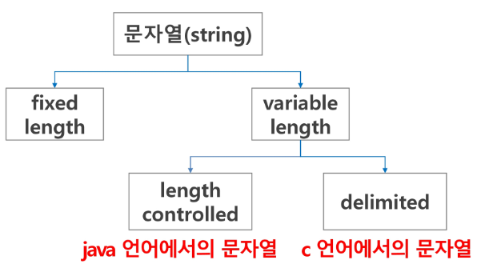

# string (문자열)
* 개발자에 따라 표현방식이 바뀌는 것을 방지하기 위해 표준안을 만들었다.
* 1967년 미국에서 ASCII라는 문자 인코딩 표준이 제정되었다.
    * American Standard Code for Information Interchange
* 아스키 코드(7bit - 128개)

* 확장 아스키 코드는 1bit을 추가하여 총 8bit으로 총 256개를 표현 가능하게 했다.
* 인터넷이 전 세계로 발전하면서 ASCII를 만들었을 때의 문제와 같은 문제가 국가간 발생 -> 각 국가별로 ASCII 코드와 같은 표준안이 필요 -> 유니코드

## 문자열
* 문자열의 분류

## 패턴 매칭

## 문자열 암호화

## 문자열 압축