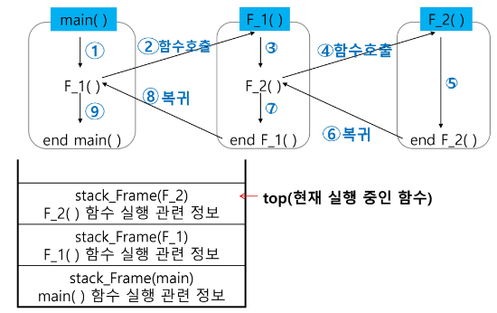
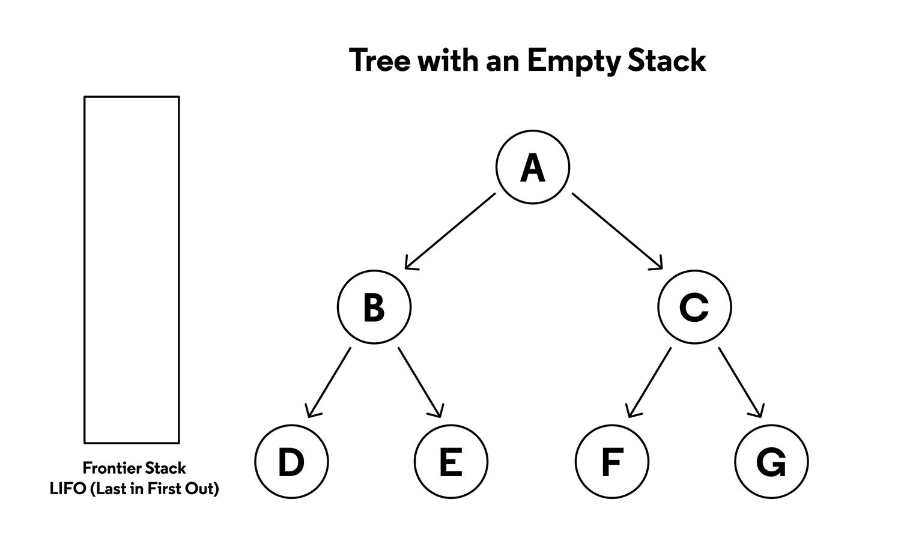

# 스택

## stack
* 스택의 특성
    * 물건을 쌓아 올리듯 자료를 쌓아 올린 형태의 자료구조이다.
    * 스택에 저장된 자료는 **선형구조**이다.
        * 선형 구조 : 자료 간의 관계가 1대 1의 관계를 갖는다.
        * 비선형 구조 : 자료 간의 관계가 1대 N의 관계를 갖는다. (ex. 트리)
    * 스택에 자료를 삽입하거나 스택에서 자료를 꺼낼 수 있다.
    * 마지막에 삽입한 자료를 가장 먼저 꺼낸다. 후입선출(LIFO, Last-In-First-Out)이라고 부른다.
        * 예를 들어 1, 2, 3 순으로 자료를 삽입한 후 꺼내면 역순으로 3, 2, 1 순으로 꺼낼수 있다.
* 스택을 프로그램에서 구현하기 위해서 필요한 자료구조와 연산
    * 자료구조 : 자료를 선형으로 저장할 저장소
        * 배열을 사용할 수 있다.
        * 저장소 자체를 스택이라고 부르기도 한다.
        * 스택에서 마지막 삽입된 원소의 위치를 top이라고 부른다.
    * 연산
        * 삽입 : 저장소에 자료를 저장한다. 보통 push라고 한다.
        * 삭제 : 저장소에서 자료를 꺼낸다. 꺼낸 자료는 삽입한 자료의 역순으로 꺼낸다. 보통 pop이라고 부른다.
        * 스택이 공백인지 아닌지를 확인하는 연산 : isEmpty
        * 스택의 top에 있는 item(원소)을 반환하는 연산 : peek
        * 스택이 가득찼는지 확인하는 연산 : isFull
* 스택의 삽입/삭제 과정

    

* 스택 구현 고려 사항
    * 1차원 배열을 사용하여 구현할 경우 구현이 용이하다는 장점이 있지만 스택의 크기를 변경하기가 어렵다는 단점이 있다.
    * 이를 해결하기 위한 방법으로 저장소를 동적으로 할당하여 스택을 구현하는 방법이 있다. 동적 연결리스트를 이용하여 구현하는 방법을 의미한다. 구현이 복잡하다는 단점이 있지만 메모리를 효율적으로 사용한다는 장점을 가진다.

* function call
    * 프로그램에서의 함수 호출과 복귀에 따른 수행순서를 관리
        * 가장 마지막에 호출된 함수가 가장 먼저 실행을 완료하고 복귀하는 후입선출 구조이므로, 후입선출 구조의 스택을 이용하여 수행 순서 관리
        * 함수 호출이 발생하면 호출한 함수 수행에 필요한 지역변수, 매개변수 및 수행 후 복귀할 주소 등의 정보를 스택 프레임에 저장하여 시스템 스택에 삽입
        * 함수의 실행이 끝나면 시스템 스택의 top원소(스택 프레임)를 삭제(pop)하면서 프레임에 저장되어 있던 복귀주소를 확인하고 복귀
        * 함수 호출과 복귀에 따라 이 과정을 반복하여 전체 프로그램 수행이 종료되면 시스템 스택은 공백 스택이 된다.

    


## 재귀호출
* 필요한 함수가 자신과 같은 경우 자신을 다시 호출하는 구조
* 함수에서 실행해야 하는 작업의 특성에 따라 일반적인 호출방식보다 재귀 호출 방식을 사용하여 함수를 만들면 프로그램의 크기를 줄이고 간단하게 작성 가능
```python
# factorial - for구문
fac = 1
if n == 0 :
    print(1) # 0! == 1
else : # n != 0
    for i in range(1, n+1) :
        fac *= i
    print(fac) # n!

# factorial - 재귀
def factorial(n) :
    global fac
    if n == 0 :
        return 1
    elif n == 1 :
        return fac
    else : # n != 0
        fac *= n
        return factorial(n-1)
fac = 1
print(factorial(5)) # 120
```
```python
# 피보나치 수열 - 재귀
def fino(n) :
    if n < 2 :
        return n
    else : # n >= 2
        return fibo(n-1) + fibo(n-2)
```


## Memoization
* 재귀함수로 피보나치 수열을 구현할 경우 **엄청난 중복 호출이 존재**한다는 문제가 발생한다.
* memoization은 컴퓨터 프로그램을 실행할 때 이전에 계산한 값을 메모리에 저장해서 매번 다시 계산하지 않도록 하여 전체적인 실행속도를 빠르게 하는 기술이다.
```python
# 피보나치 수열 - memoization
n = int(input()) # n == 5

def fibo(n) :
    global memo
    if n >= 2 and memo[n] == 0 :
        memo[n] = fibo(n-1) + fibo(n-2)
    return memo[n]

memo = [0] * (n+1)
memo[0] = 0
memo[1] = 1
print(fibo(n)) # 5
```


## DP
* Dynamic Programming = 동적 계획
* 동적 계획 알고리즘은 그리디 알고리즘과 같이 **최적화 문제**를 해결하는 알고리즘 이다.
* DP는 입력 크기가 작은 부분 문제들을 모두 해결한 후에 그 해들을 이용하여 보다 큰 크기의 문제들을 해결하여 최종적으로 원래 주어진 입력의 문제를 해결하는 알고리즘이다.
* DP의 과정
    1. 문제를 부분문제로 분할한다.
    2. 부분 문제로 나누는 일을 끝냈다면 가장 작은 부분 문제부터 해를 구한다.
    3. 그 결과를 저장하고, 저장된 부분 문제의 해를 이용하여 상위 문제의 해를 구한다.
* DP의 조건
    * 작은 문제가 **반복**적으로 일어나는 경우
        * Divide and Conquer(분할정복)와 다른 부분은 동일하지만 DP는 반복적으로 일어난다는 차이점이 있다.
    * 같은 문제는 구할 때마다 정답이 같다.
* memoization을 반복적 구조로 DP를 구현하는 것이 성능면에서 효율적이다.


## DFS BFS
* 비선형 구조인 그래프 구조는 그래프로 표현된 모든 자료를 빠짐없이 검색하는 것이 중요하다.
    * BFS = Breadth First Search 너비 우선 탐색
    * DFS = Depth First Search 깊이 우선 탐색

    

* 입력되는 graph의 차이는 노드의 방향이 있는지 없는지에 따라 바뀌게 된다.

    

    1. 노드의 방향이 없는 경우
        ```python
        graph = [[],
            [2, 3],
            [1, 4, 5],
            [1, 6],
            [2],
            [2],
            [3]
            ]
        ```
    2. 노드의 방향이 있는 경우 - ex.위에서 아래로 방향이 있는 경우
        ```python
        graph = [[],
            [2, 3],
            [4, 5],
            [6],
            [],
            [],
            []
            ]
        ```

* DFS의 특징
    * 그래프의 깊은 부분을 우선적으로 탐색하는 알고리즘(세로 탐색)
    * 스택 자료구조를 사용하여 그래프의 가장 깊은 곳까지 방문한 뒤, 다시 돌아가 다른 경로 탐색
* DFS 동작 과정
    1. 탐색 시작 노드를 스택에 삽입하고 방문 처리 (이미 방문(탐색)했던 노드를 재방문 하지 않기 위해서)
    2. 스택의 최상단 노드에 방문하지 않은 인접 노드가 있다면 그 노드를 스택에 넣고 방문 처리. 만약 방문하지 않은 인접 노드가 없으면 스택에서 최상단 노드를 꺼냄.
    3. 2번의 과정을 더 이상 수행할 수 없을 때까지 반복
* BFS의 특징
    * 그래프의 인접한 부분을 우선적으로 탐색하는 알고리즘(가로 탐색)
    * 인접 노드를 계속 큐에 넣어가며 큐에 들어온 순서대로 탐색을 시작하기에 시작 노드에서부터 가까운 노드들부터 탐색
* BFS 동작 과정
    1. 탐색 시작 노드를 큐에 삽입하고 방문 철
    2. 큐에서 노드를 꺼내 해당 노드를 방문하지 않은 모든 인접 노드를 모두 큐에 삽입하고 방문 처리
    3. 2번 과정을 더 이상 수행할 수 없을 때까지 반복
* DFS, BFS의 장단점
    |DFS|BFS|
    |:---:|:---:|
    |스택 또는 재귀함수|큐|
    |최적 해라는 보장 없음|항상 최적 해임을 보장|
    |그래프 큐모가 클 때|그래프 규모가 작을 때|
    |특정 목표 노드를 찾을 때|최단 경로를 찾을 때|
    * DFS 장점
        * 현 경로상의 노드들만 기억하기 때문에 적은 메모리 사용
        * 목표 노드가 깊은 단계에 있는 경우 BFS보다 빠르게 탐색 가능
    * DFS 단점
        * 해가 없는 경로를 탐색할 경우 단계가 끝날때 까지 (현 경로의 가장 끝까지) 탐색함
            * 답이 아닌 경로가 매우 깊다면 그 경로에 깊이 빠지게 됨
            * 여러 경로 중 무한한 길이를 가지는 경로가 존재하고 해가 다른 경로에 존재하는 경우, 무한한 길이의 경로에서 빠져나오지 못해 영원히 종료하지 못함
            * 효율성을 높이기 위해서 미리 지정한 임의 깊이까지만 탐색하고, 해를 발견하지 못하면 빠져나와 다른 경로를 탐색하는 방법을 사용해야 한다. (재귀로 구현한다면 재귀 호출 횟수를 제한하는 등의 방법 사용)
    * BFS 장점
        * 모든 경로를 탐색하기에 여러 해가 있을 경우에도 최단 경로임을 보장함
        * 최단 경로가 존재하면 깊이가 무한정 깊어진다고 해도 답을 찾을 수 있음
            * 여러 경로 중 무한한 길이를 가지는 경로가 존재하더라도, 모든 경로를 동시에 탐색을 진행하기 때문에 탐색 가능
        * 노드의 수가 적고, 깊이가 얕은 해가 존재할 때 유리함
            * 탐색하는 트리 또는 그래프의 크기에 비례하는 시간 복잡도를 가짐
    * BFS 단점
        * 노드의 수가 많을수록 탐색 가지가 급격히 증가함에 따라 보다 많은 메모리를 필요로 하게 된다.
            * 메모리 상의 확장된 노드들을 저장할 필요가 있기에 탐색하는 트리 또는 그래프에 크기에 비례하는 메모리를 가진다.

* DFS BFS code - 탐색 순서 출력하기
    * index number와 node number의 혼동을 피하기 위해서 graph 및 방문을 했는지 확인하는 list(뒤에서 나오는 'visited')에서 실제 node의 수보다 1개 더 크게 만든다.

    

```python
# graph
graph = [[], # index == 0 이기에 비워둔다.
    [2, 3], # 1번 node와 연결된 node
    [1, 4, 5], # 2번 node와 연결된 node
    [1, 6], # 3번 node와 연결된 node
    [2], # 4번 node와 연결된 node
    [2], # 5번 node와 연결된 node
    [3] # 6번 node와 연결된 node
    ]
```
```python
# DFS - 재귀
n = int(input()) # n = 6

visited = [False] * (n+1) # index == 0 인 부분 포함
ans = []

def dfs(graph, v, visited) :
    ans.append(v)
    visited[v] = True
    for i in graph[v] :
        if not visited[i] :
            dfs(graph, i, visited)

dfs(graph, 1, visited)
print(*ans) # 1, 2, 4, 5, 3, 6
```

```python
# DFS - stack(큰번호 순서)
n = int(input()) # n = 6

def dfs(start):
    visited = []
    stack = [start]
    while stack :
        v = stack.pop()
        if v not in visited :
            visited.append(v)
            for w in graph[v] :
                stack.append(w)
    return visited

print(*dfs(1))
```
```python
# DFS - stack(작은 번호 순서)
n = int(input()) # n = 6

def dfs(start):
    visited = []
    stack = [start]
    while stack :
        v = stack.pop()
        if v not in visited :
            visited.append(v)
            # graph가 작은 순서로 정렬되어 있기 때문에 뒤집어 줘야 한다.
            for w in graph[v][::-1] :
                stack.append(w)
    return visited

print(*dfs(1))
```

```python
# BFS - queue
from collections import deque

n = int(input()) # n = 6

visited = [False] * (n+1)
ans = []

def bfs(graph, start, visited) :
    ans.append(start)
    queue = deque([start])
    visited[start] = True
    while queue :
        v = queue.popleft()
        for i in graph[v] :
            if not visited[i] :
                ans.append(i)
                queue.append(i)
                visited[i] = True

bfs(graph, 1, visited)
print(*ans) # 1 2 3 4 5 6
```