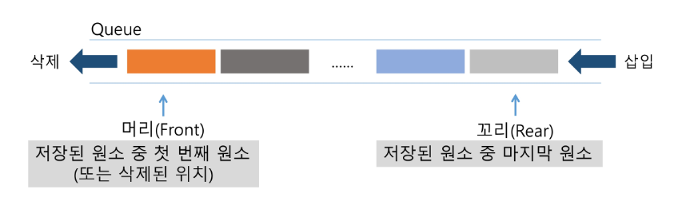
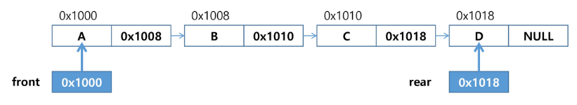
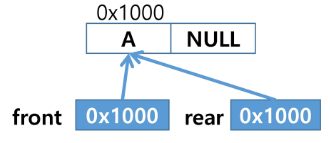
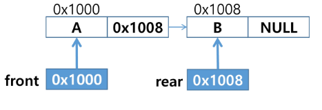
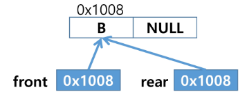

# 큐(Queue)
* 큐의 특성
    * 스택과 마찬가지로 삽입과 삭제의 위치가 제한적인 자료 구조
        * 큐의 뒤에서는 삽입만 하고, 큐의 앞에서는 삭제만 이루어지는 구조
    * 선입선출 구조(FIFO : First In First Out)
        * 큐에 삽입한 순서대로 원소가 저장되어, 가장 먼저 삽입된 원소는 가장 먼저 삭제된다.
    
    


* 큐의 주요 연산
    * `enQueue(item)` : 큐의 뒤쪽(rear 다음)에 원소를 삽입하는 연산
    * `deQueue()` : 큐의 앞쪽(front)에서 원소를 삭제하고 반환하는 연산
    * `createQueue()` : 공백 상태의 큐를 생성하는 연산
    * `isEmpty()` : 큐가 공백상태인지를 확인하는 연산
    * `isFull()` : 큐가 포화상태인지 확인하는 연산
    * `Qpeek()` : 큐의 앞쪽(front)에서 원소를 삭제 없이 변환하는 연산


## 선형큐
* 1차원 배열을 이용한 큐
    * 큐의 크기 = 배열의 크기
    * front : 저장된 첫 번째 원소의 인덱스
    * rear : 저장된 마지막 원소의 인덱스
* 상태 표현
    * 초기 상태 : front = rear = -1
    * 공백 상태 : front == rear
    * 포화 상태 : rear == n-1 (n : 배열 크기, n-1 : 배열의 마지막 index)
* 선형 큐의 구현
    * `enQueue(item)` : 큐의 뒤쪽(rear 다음)에 원소를 삽입하는 연산
        ```python
        def enQueue(item) :
            global rear
            if isFull() :
                print("Queue is full")
            else :
                rear += 1
                Q[rear] = item
        ```
    * `deQueue()` : 큐의 앞쪽(front)에서 원소를 삭제하고 반환하는 연산
        ```python
        def deQueue() :
            if isEmpty() :
                print("Queue is Empty")
            else :
                front += 1
                return Q[front]
        ```
    * `createQueue()` : 공백 상태의 큐를 생성하는 연산
    * `isEmpty()` : 큐가 공백상태인지를 확인하는 연산
        ```python
        def isEmpty() :
            return front == rear
        ```
    * `isFull()` : 큐가 포화상태인지 확인하는 연산
        ```python
        def isFull() :
            return rear == len(Q) - 1
        ```
    * `Qpeek()` : 큐의 앞쪽(front)에서 원소를 삭제 없이 변환하는 연산
        ```python
        def Qpeek() :
            if isEmpty() :
                print("Queue is Empty")
            else :
                return Q[front + 1]
        ```

* 문제점 & 해결방법
    * 문제점 : 잘못된 포화 상태의 인식
        * 선형큐를 이용하여 원소의 삽입과 삭제를 계속할 경우, 배열의 앞부분에 활용할 수 있는 공간이 있음에도 불구하고, rear = n-1인 상태 즉 포화상태로 인식하여 더 이상의 삽입을 수행하지 않게 된다.
    * 해결방법 1
        * 매 연산이 이루어질 때마다 저장된 원소들을 배열의 앞부분으로 모두 이동시킴
        * 원소 이동에 많은 시간이 소요되어 큐의 효율성이 급격하게 떨어짐
    * 해결방법 2
        * 1차원 배열을 사용하되, 논리적으로 배열의 처음과 끝이 연결되어 원형 형태의 큐를 이용한다고 가정하고 사용

## 원형큐
* 초기 공백 상태 : `front = rear = 0`
* index의 순환
    * front와 rear의 위치가 배열의 마지막 인덱스인 n-1을 가리킨 후, 그 다음에는 논리적 순환을 이루어 배열의 처음 인덱스인 0으로 이동해야 함
    * 이를 위해 나머지 연산자 mod를 사용함
* front 변수
    * 공백 상태와 포화상태를 구분하기 쉽게 하기 위해 front가 있는 자리를 사용하지 않고 항상 빈자리로 둔다.
* 삽입 위치 및 삭제 위치

    ||삽입 위치|삭제 위치|
    |---|---|---|
    |선형큐|rear = rear + 1|front = front+1|
    |원형큐|rear = (rear+1) mod n|front = (front+1) mod n|

* 초기 공백 큐 생성
    * 크기가 n인 1차원 배열 생성
    * front와 rear를 0으로 초기화
* 원형 큐의 구현
    * 공백 상태 및 포화 상태 검사 : isEmpty(), isFull()
        * 공백 상태 : front == rear
        * 포화 상태 : 삽입할 rear의 다음위치 == 현재 front
            * 포화/공백 상태를 구분하기 위해 **front자리를 비워두기 때문**
        
        ```python
        def isEmpty() :
            return front == rear
        
        def isFull() :
            return (rear+1) % len(cQ) == front
        ```
    * 삽입
        ```python
        def enQueue(item) :
            global rear
            if isFull() :
                print("Queue is Full")
            else :
                rear = (rear+1) % len(cQ)
                cQ[rear] = item
        ```
    * 삭제
        ```python
        def deQueue() :
            global front
            if isEmpty() :
                print("Queue is Empty")
            else :
                front = (front + 1) % len(cQ)
                return cQ[front]
        ```


## 연결 큐
* 단순 연결리스트(Linked List)를 이용한 큐
    * 큐의 원소 : 단순 연결 리스트의 노드
    * 큐의 원소 순서 : 노드의 연결 순서. 링크로 연결되어 있음
    * front : 첫 번째 노드를 가리키는 링크
    * rear : 마지막 노드를 가리키는 링크




* 상태 표현
    * 초기 상태 : front = rear = null
    * 공백 상태 : front = rear = null
* 연결 큐의 연산 과정
    1. 공백 큐 생성 : `createLinkedQueue() :`

        

    2. 원소 A, B 삽입 : `enQueue(A)`

        

        

    3. 원소 삭제 : `deQueue()`

        

        

* [참고] deque(덱)
    * 컨테이너 자료형 중 하나
        ```python
        # collections에서 deque을 가져오면 된다.
        from collections import deque
        ```
    * deque 객체 : 양쪽 끝에서 빠르게 추가와 삭제를 할 수 있는 리스트류 컨테이너
    * 연산
        * `d.append(item)` : 추가
        * `d.popright()` : 제일 오른쪽 삭제 및 반환
        * `d.popleft()` : 제일 왼쪽 삭제 및 반환


## 우선순위 큐
* 우선순위 큐의 특성
    * 우선순위를 가진 항목들을 저장하는 큐
    * FIFO 순서가 아니라 우선순위가 높은 순서대로 먼저 나가게 된다.
* 우선순위 큐의 적용 분야
    * 시뮬레이션 시스템
    * 네트워크 트래픽 제어
    * 운영체제의 디스크 테이줄링
* 우선순위 큐의 구현
    * array를 이용한 우선순위 큐
        * 배열을 이용하여 자료 저장
        * 원소를 삽입하는 과정에서 우선순위를 비교하여 적절한 위치에 삽입한는 구조
        * 가장 앞에 최고 우선순위의 원소가 위치하게 된다.
        * 문제점
            * 배열을 사용하므로 삽입이나 삭제 연산이 일어날 때 원소의 재배치가 발생한다.
            * 이에 소요되는 시간이나 메모리 낭비가 크다.
    * list를 이용한 우선순위 큐


## 큐의 활용 : 버퍼
* 버퍼(Buffer)
    * 데이터를 한 곳에서 다른 한 곳으로 전송하는 동안 일시적으로 그 데이터를 보관하는 메모리 영역
    * 버퍼링 : 버퍼를 활용하는 방식 또는 버퍼를 채우는 동작을 의미한다.
* 버퍼의 자료구조
    * 버퍼는 일반적으로 입출력 및 네트워크와 관련된 기능에서 이용된다.
    * 순서대로 입력/출력/전달 되어야 하므로 FIFO방식의 자료구조인 큐가 활용된다.


## BFS
* 그래프를 탐색하는 방법
    * DFS(Depth First Search, 깊이 우선 탐색)
    * BFS(Breadth First Search, 너비 우선 탐색)

* 너비 우선탐색은 탐색 시작점의 인접한 정점들을 먼저 모두 차례로 방문한 후에, 방문했던 정점을 시작점으로 하여 다시 인접한 정점들을 차례로 방문하는 방식
* 인접한 정점들에 대해 탐색을 한 후, 차례로 다시 너비우선탐색을 진행해야 하므로, 선입선출 형태의 자료구조인 큐를 활용함
```python
# graph, 탐색 시작점 v를 인자로 받는다.
def bfs(graph, v) :
    visited = [0] *(n+1) # n : 노드의 수
    queue = [] # 큐 생성
    queue.append(v) # 시작점 v를 큐에 삽입
    while queue :
        t = queue.pop(0)
        for i in graph(t)
            if not visited[t] :
                visited[t] = True
                queue.append(v)
```
* 앞에서 DFS BFS를 다뤘기 때문에 pass