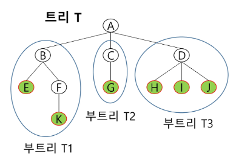
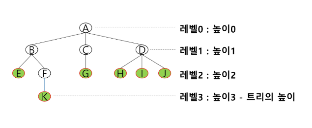
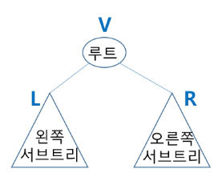
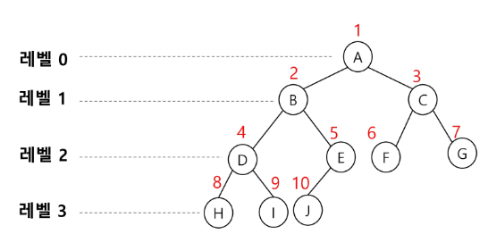
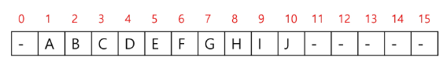
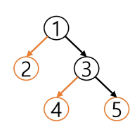
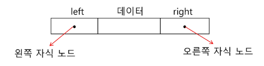
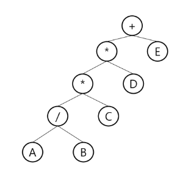

# 트리
* 비선형 구조
* 원소들 간에 1:n 관계를 가지는 자료구조
* 원소들 간에 계층관계를 가지는 계층형 자료구조
* 상위 원소에서 하위 원소로 내려가면서 확장되는 트리 모양의 구조
* 한 개 이상의 노드로 이루어진 유한 집합이며 다음 조건을 만족한다.
    * 노드 중 취상위 노드를 루트(root)라 한다.
    * 나머지 노드들은 n(>=0)개의 분리집합(T1, T2, .. ,Tn)으로 분리될 수 있다.
    * 분리집합은 각각 하나의 트리가 되며(재귀적 정의) 루트의 부트리(subtree)라고 한다.

        

* 노드(node) - 트리의 원소
    * 트리 T의 노드 : A, B, C, D, E, F, G, H, I, J, K
* 간선 - 노드를 연결하는 선. 부모 노드와 자식 노드를 연결
* 루트 노드(root node) - 트리의 시작 노드
    * 트리 T의 루트노드 : A
* 형제 노드(sibling node) - 같은 부모 노드의 자식 노드들
    * B, C, D는 형제 노드
* 조상 노드 - 간선을 따라 루트 노드까지 이르는 경로에 있는 모든 노드들
    * K의 조상 노드 : F, B, A
* 서브 트리(subtree) - 부모 노드와 연결된 간선을 끊었을 때 생성되는 트리
* 자손 노드 - 서브 트리에 있는 하위 레벨의 노드들
    * B의 자손 노드 : E, F, K
* 차수(degree)
    * 노드의 차수 : 노드에 연결된 자식 노드의 수
        * B의 차수 == 2, C의 차수 == 1
    * 트리의 차수 : 트리에 있는 노드 차수 중에서 가장 큰 값
        * 트리 T의 차수 == 3
    * 단말 노드(리프 노드) : 차수가 0인 노드. 자식 노드가 없는 노드
* 높이
    * 노드의 높이 : 루트에서 노드에 이르는 간선의 수, 노드의 레벨
        * B의 높이 == 1, F의 높이 == 2
    * 트리의 높이 : 트리에 있는 노드의 높이 중에서 가장 큰 값, 최대 레벨
        * 트리 T의 높이 == 3




## 이진 트리
* 모든 노드들이 2개의 서브 트리를 갖는 특별한 형태의 트리
* 각 노드가 자식 노드를 최대한 2개 까지만 가질 수 있는 트리
    * 왼쪽 자식 노드(left child node)
    * 오른쪽 자식 노드(right child node)
* 이진 트리의 특성
    * 레벨 i에서의 노드의 최대 개수는 2**i개
    * 높이가 h인 이진 트리가 가질 수 있는 노드의 최소 개수는 (h+1)개가 되며, 최대 개수는 (2**(h+1)-1)개가 된다.
* 이진 트리의 종류
    1. 포화 이진 트리(Full Binary Tree)
        * 모든 레벨에 노드가 포화상태로 차 있는 이진 트리
        * 높이가 h일 때, 최대의 노드 개수인 (2**(h+1)-1)개의 노드를 가진 이진 트리
            * 높이 3일 때 총 15개의 노드
        * 루트를 1번으로 하여 (2**(h+1)-1)까지 정해진 위치에 대한 노드 번호를 갖는다.
    2. 완전 이진 트리(Complete Binary Tree)
        * 높이가 h이고 노드 수가 n개 일 때(단, `2**h <= n <= 2**(h+1)-1`), 포화 이진 트리의 노드 번호 1번부터 n번까지 빈 자리가 없는 이진 트리
    3. 편향 이진 트리(Skewed Binary Tree)
        * 높이 h에 대한 최소 개수의 노드를 가지면서 한쪽 방향의 자식 노드만을 가진 이진 트리
            * 왼쪽 편향 이진 트리
            * 오른쪽 편향 이진 트리

## 이진 트리의 순회(traversal)
* 순회란 트리의 각 노드를 중복되지 않게 전부 방문하는 것을 말하는데 트리는 비 선형 구조이기 때문에 선형구조에서와 같이 선후 연결 관계를 알 수 없다. -> 특별한 방법 필요
* 순회 : 트리의 노드들을 체계적으로 방문하는 것
* 3가지 기본적인 순회방법

    

    1. 전위순회(preorder traversal) : VLR
        * 부모 노드 방문 후, 자식 노드를 좌, 우 순서로 방문한다.
    2. 중위순회(inorder traversal) : LVR
        * 왼쪽 자식노드, 부모노드, 오른쪽 자식노드 순으로 방문한다.
    3. 후위순회(postorder traversal) : LRV
        * 자식 노드를 좌우 순서로 방문한 후, 부모 노드로 방문한다.
* 순회 알고리즘
    1. 전위순회
        ```python
        def preorder_traversal(T) : # 전위순회
            if T : # T is not None
                visit(T) # print(T.item)
                preorder_traversal(T.left)
                preorder_traversal(T.right)
        ```
    2. 중위순회
        ```python
        def inorder_traversal(T) : # 중위순회
            if T : # T is not None
                inorder_traversal(T.left)
                visit(T) # print(T.item)
                inorder_traversal(T.right)
        ```
    3. 후위순회
        ```python
        def postorder_traversal(T) : # 후위순회
            if T : # T is not None
                postorder_traversal(T.left)
                postorder_traversal(T.right)
                visit(T) # print(T.item)
            ```

## 이진 트리의 표현
### 배열을 이용한 이진 트리의 표현
* 이진 트리에 각 노드 번호를 다음과 같이 부여
* 루트의 번호를 1로 함
* 레벨 n에 있는 노드에 대하여 왼쪽부터 오른쪽으로 `2**n` 부터 `2**n-1`까지 번호를 차례로 부여

    

* 노드 번호의 성질
    * 노드 번호가 i인 노드의 부모 노드 : `i//2`
    * 노드 번호가 i인 노드의 왼쪽 자식 노드 번호 : `2*i`
    * 노드 번호가 i인 노드의 오른쪽 자식 노드 번호 : `2*i+1`
    * 레벨 n의 노드 번호 시작 번호 : 2**n
* 높이가 h인 이진 트리를 위한 배열의 크기
    * 최대 노드 수 : `2**i` -> 배열은 총 `2**(i+1)`

        


### 이진 트리의 저장



1. 부모 번호를 인덱스로 자식 번호를 저장
    ```python
    for i in range(1, n+1) :
        if c1[p] == 0 :
            c1[p] = c
        else :
            c2[p] = c
    # c1 = [0, 2, 0, 4, 0, 0]
    # c2 = [0, 3, 0, 5, 0, 0]
    ```
    ```python
    for i in range(1, n+1) :
        if lst[i][0] == 0 :
            lst[i][0] = c
        else :
            lst[i][1] = c
    # c = [[1], [2, 3], [0], [4, 5], [0], [0]]
    ```
2. 자식 번호를 인덱스로 부모 번호를 저장
    ```python
    for i in range(1, n+1) :
        par[c] = p
    # par = [0, 0, 1, 1, 3, 3]
    ```
* 루트 찾기, 조상 찾기
    ```python
    # 5번 노드의 조상 찾기
    c = 5
    while par[c] != 0 : # 루트인지 확인
        c = a[c]
        anc.append(c) # anc는 조상 목록
    root = c
    ```
* 배열을 이용한 이진 트리의 표현의 단점
    * 편향 이진 트리의 경우에 사용하지 않는 배열 원소에 대한 메모리 공간 낭비 발생
    * 트리의 중간에 새로운 노드를 삽입하거나 기존의 노드를 삭제할 경우 배열의 크기 변경이 어려워 비효율적이다.
* 연결리스트 - 이진트리의 표현
    * 배열을 이용한 이진 트리의 표현의 단점을 보완하기 위해 연결리스트를 이용하여 트리를 표현할 수 있다.
    * 연결 자료구조를 이용한 이진트리의 표현
        * 이진 트리의 모든 노드는 최대 2개의 자식 노드를 가지므로 일정한 구조의 단순 연결 리스트 노드를 사용하여 구현

            

* 수식 트리
    * 수식을 표현하는 이진 트리
    * 수식 이진트리(expression binary tree)라고 부르기도 함
    * 연산자는 루트 노드이거나 가지 노드
    * 피연산자는 모두 잎 노드

        

    * 순회 방법에 따른 표기법 차이
        * 전위 순회 : +**/ABCDE (식의 전위 표기법)
        * 중위 순회 : A/B*C*D+E (식의 중위 표기법)
        * 후위 순회 : AB/C*D*E+ (식의 후위 표기법)

## 이진탐색 트리
* 탐색작업을 효율적으로 하기 위한 자료구조
* 모든 원소는 서로 다른 유일한 키를 갖는다.
* key(왼쪽 서브트리) < key(루트 노드) < key(오른쪽 서브트리)
* 왼쪽 서브트리와 오른쪽 서브트리도 이진 탐색 트리다
* 중우 ㅣ순회하면 오름차순으로 정렬된 값을 얻을 수 있다.
* 탐색 연산
    * 루트에서 시작
    * 탐색할 키 값X를 루트 노드의 키 값과 비교한다.
        - (키값 x = 루트노드의 키 값)인 경우 : 원하는 원소를 찾았으므로 탐색 연산 성공
        - (키값 x < 루트노드의 키값)인 경우 : 루트 노드의 왼쪽 서브트리에 대해서 탐색 연산 수행
        - (키값 x > 루트노드의 키값)인 경우 : 루트 노드의 오른쪽 서브트리에 대해서 탐색 연산 수행
        * 서브트리에 대해서 순환적으로 탐색 연산을 반복한다.
* 삽입 연산
    1. 먼저 탐색 연산을 수행
        - 삽입할 원소와 같은 원소가 트리에 있으면 삽입할 수 없으므로, 같은 원소가 트리에 있는지 탐색하여 확인한다.
        - 탐색에서 탐색 실패가 결정되는 위치가 삽입 위치가 된다.
    2. 탐색 실패한 위치에 원소를 삽입한다.
* 성능
    * 탐색(searching), 삽입(insertion), 삭제(deletion) 시간은 트리의 높이 만큼 시간이 걸린다.
        * O(h), h : BST의 깊이(height)
    * 평균의 경우
        * 이진 트리가 균형적으로 생성되어 있는 경우
        * O(logn)
    * 최악의 경우
        * 한쪽으로 치우친 경사 이진트리의 경우
        * O(n)
        * 순차탐색과 시간복잡도가 같다.
* 검색 알고리즘의 비교
    * 배열에서의 순차 검색 : O(n)
    * 정렬된 배열에서의 순차 검색 : O(n)
    * 정렬된 배열에서의 이진 탐색 : O(logn)
        - 고정 배열 크기와 삽입, 삭제 시 추가 연산 필요
    * 이진 탐색 트리에서의 평균 : O(logn)
        - 최악의 경우 : O(n)
        - 완전 이진 트리 또는 균형트리로 바꿀 수 있다면 최악의 경우를 없앨 수 있다.
            * 새로운 원소를 삽입할 때 삽입 시간을 줄인다.
            * 평균과 최악의 시간이 같다.: O(logn)
    * 해쉬 검색 : O(1)
        - 추가 저장 공간 필요

## 힙
* 완전 이진 트리에 있는 노드 중에서 키값이 가장 큰 노드나 키값이 가장 작은 노드를 찾기 위해서 만든 자료구조
* 최대 힙(max heap)
    * 키값이 가장 큰 노드를 찾기 위한 완전 이진 트리
    * 부모 노드의 키값 > 자식 노드의 키값
    * 루트 노드 : 키값이 가장 큰 노드
* 최소 힙(min heap)
    * 키값이 가장 작은 노드를 찾기 위한 완전 이진 트리
    * 부모 노드의 키값 < 자식 노드의 키값
    * 루트 노드 : 키값이 가장 작은 노드