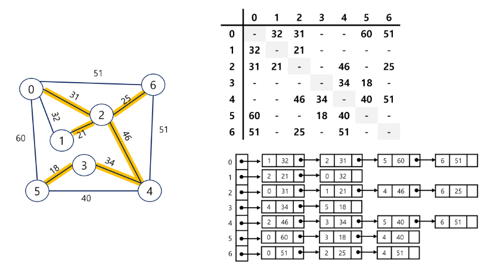
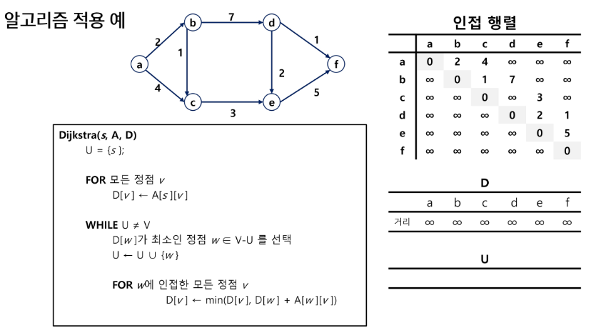
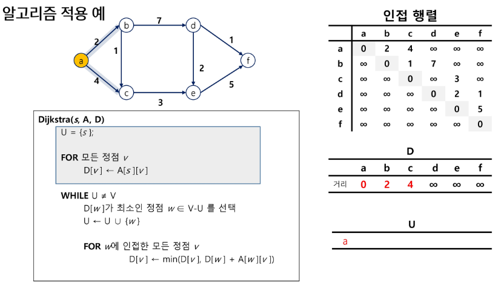
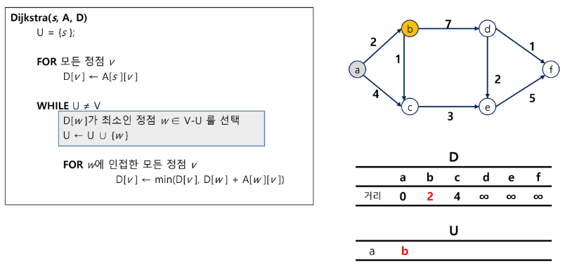
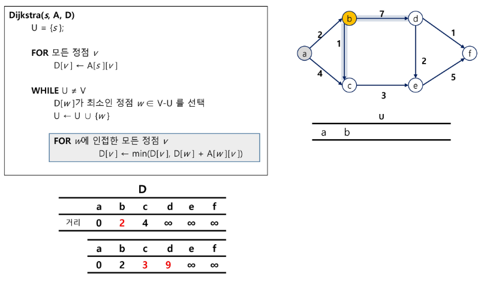
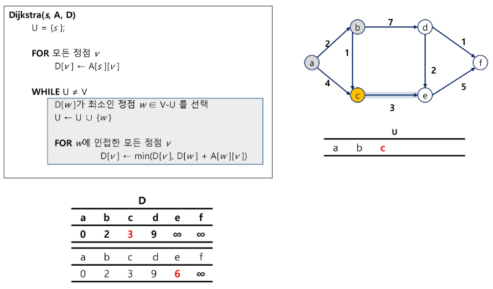
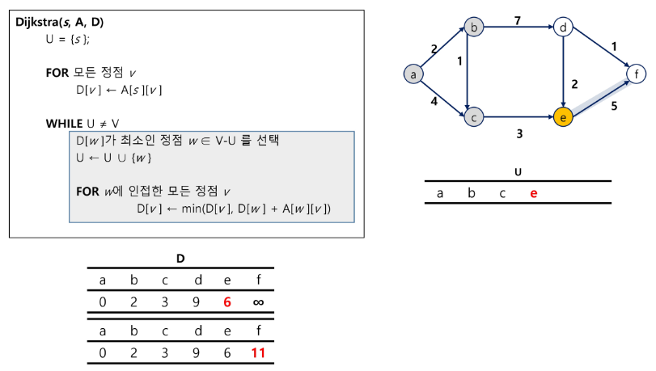
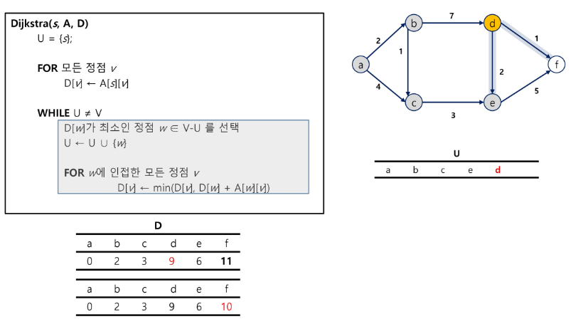
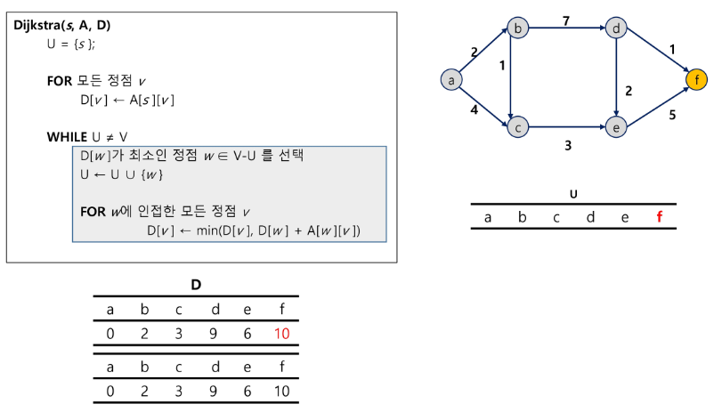
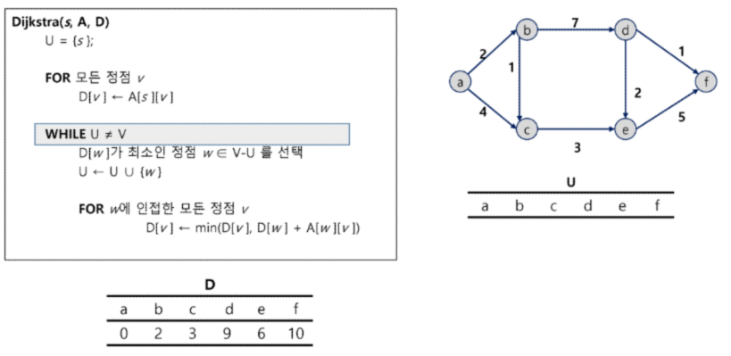

# Prim 알고리즘, Kruskal 알고리즘, Dijkstra

## 최소 비용 신장트리(MST)
* 신장 트리
    * 그래프 상에서 모든 노드가 사이클 없이 연결된 부분 그래프
    * 간선의 개수를 최소화, 모든 정점을 연결
    * 여러가지 방법이 존재
    * cycle이 발생하지 않는다.
    * 노드가 v개라면 간선은 (v-1)개이다.
* 최소 비용 신장 트리
    * 간선에 비용이 존재한다면 합이 제일 적은 신장 트리를 선택하는 방법

        

### Prim 알고리즘
* 최소 신장 트리를 구하는 그리디 알고리즘 중 하나
* 하나의 정점에서 연결된 간선들 중에 하나씩 선택하면서 MST를 만들어 가는 방식
    1. 임의의 정점을 하나 선택하여 시작
    2. 선택한 정점과 인접하는 정점들 중의 최소 비용의 간선이 존재하는 정점을 선택
    3. 모든 정점이 선택될 때 까지 1, 2과정을 반복
* 서로소인 2개의 집합(2 disjoint-sets) 정보를 유지
    * 트리 정점들(tree vertices) : MST를 만들기 위해 선택된 정점들
    * 비트리 정점들(nontree vertices) : 선택되지 않은 정점들

### Kruskal 알고리즘
* 최소 신장 트리를 구하는 그리디 알고리즘 중 하나
* 간선을 하나씩 선택해서 MST를 찾는 알고리즘
    1. 최초, 모든 간선을 가중치에 따라 오름차순으로 정렬
    2. 가중치가 가장 낮은 간선부터 선택하면서 트리를 증가시킨다.
        * cycle이 존재하면 다음으로 가중치가 낮은 간선 선택
    3. n-1개의 간선이 선택될 때 까지 2번 과정 반복


## Dijkstra : 최단 경로
* 최단 경로
    * 간선의 가중치가 있는 그래프에서 두 정점 사이의 경로들 중에 간선의 가중치의 합이 최소인 경로
    * 최단 경로를 구하는 알고리즘
        * 하나의 시작 정점에서 끝 정점까지의 최단 경로
            * 다익스트라(dijkstra) 알고리즘 : 음의 가중치를 허용하지 않음
            * 벨만-포드(Vellman-Ford) 알고리즘 : 음의 가중치 허용
        * 모든 정점들에 대한 최단 경로
            * 플로이드-워셜(Floyd-Warshall) 알고리즘
* Dijkstra 알고리즘
    * 시작 정점에서 거리가 최소인 정점을 선택해 나가면서 최단 경로를 구하는 방식
    * 시작 정점(s)에서 끝정점(t) 까지의 최단 경로에 정점 x가 존재한다
    * 이때, 최단경로는 s->x까지의 최단 경로와 x->t까지의 최단 경로로 구성된다.
    * 그리디를 사용한 알고리즘으로 MST의 prime알고리즘과 유사하다.
    * 반드시 머리속으로 그려보고 돌아가는 방식을 알아둬야 코드를 짤수 있다..!!!

        

        

        

        

        

        

        

        

        


# 수정하고 공부해보기
```python
"""
7 11
0 1 32
0 2 31
0 5 60
0 6 51
1 2 21
2 4 46
2 6 25
3 4 34
3 5 18
4 5 40
4 6 51
"""

from heapq import heappush, heappop

def prim(start) :
    pq = []
    visited = [0] * v

    # 최소 비용
    sum_cost = 0

    # 시작점 추가
    # 기존 bfs에서는 노드 번호만 관리
    # prim에서는 우선 순위가 가중치에 따라 정렬 되어야 한다
    # 관리해야할 데이터 : 가중치, 노드 번호 (두 가지)
    # -> 1. class로 관리 , 2. tuple로 관리
    # 두개까지는 tuple로 관리하는것이 용이, but 3개 이상부턴 class 관리가 효율적이다.
    heappush(pq, (0, start))

    while pq :
        cost, now = heappop(pq)

        # 이미 기존에 더 짧은 거리로 방문했다면 continue
        if visited[now] :
            continue

        # 방문처리
        visited[now] = 1
        # 누적합 추가
        sum_cost += cost

        # 갈수 있는 노드들을 보면서
        for to in graph[now] :
            # 갈수 없다면, 이미 방문했다면 pass
            if graph[now][to] == 0 or visited[to] :
                continue

            heappush(pq, (graph[now][to], to))
    
    print(f'최소비용 : {sum_cost}')


v, e = map(int, input().split())

graph = [[] for _ in range(v+1)]

# 인접 행렬로 저장
# 가중치 그래프로 저장
for _ in range(e) :
    start, end, cost = map(int, input().split())
    graph[start].append(end)
    graph[end].append(start)

prim(0)


#########################################################################
#########################################################################
#########################################################################
#########################################################################
#########################################################################


def find_set(x) :
    if parents[x] == x :
        return x
    
    # 경로 압축
    parents[x] = find_set(parents[x])
    return parents[x]


def union(x, y) :
    x = find_set(x)
    y = find_set(y)

    # 같은 집합이면 pass
    if x == y :
        return
    
    if x < y :
        parents[y] = x
    else :
        parents[x] = y


v, e = map(int, input().split())
edges = [] #  간선 정보들을 모두 저장
for _ in range(e) :
    start, end, cost = map(int, input().split())
    edges.append([start, end, cost])
edges.sort(key = lambda x: x[2]) # 가중치를 기준으로 정렬
parents = [i for i in range(v)] # 대표자 배열 (자기자신을 바라봄)

# MST를 완성했는지 확인하는 변수 -> 간선의 수가 v-1이 되는 경우
cnt = 0

sum_cost = 0

# 간선들을 모두 확인
for start, end, cost in edges :
    # cycle이 발생하면 pass
    # -> 이미 같은 집합에 속해 있다면 pass
    if find_set(start) == find_set(end) :
        continue

    cnt += 1

    # cycle이 없다면 통과
    union(start, end)
    sum_cost += cost

    if cnt == v-1 : # MST완성
        break

print(f'최소비용 : {sum_cost}')


#########################################################################
#########################################################################
#########################################################################
#########################################################################
#########################################################################

from heapq import heappush, heappop

inf = int(1e9)

v, e = map(int, input().split())
start = 0 # 시작 노드 번호

# 인접 리스트
graph = [[] for _ in range(v)]

# 누적 거리를 지정할 변수
distance = [inf] * v

# 간선 정보 저장
for _ in range(e) :
    start, end, cost = map(int, input().split())
    graph[start].append([cost, end])

def dijkstra(start) :
    pq = []

    # 시작점의 cost, node 번호를 한번에 저장
    heappush(pq, (0, start))
    # 시작 노드 초기화
    distance[start] = 0

    while pq :
        # 최단 거리 노드에 대한 정보
        dist, now = heappop(pq)

        # pq의 특성 때문에 더 긴거리가 미리 저장되어 있음
        # now가 이미 더 짧은 거리로 온적이 있다면 pass
        if distance[now] < dist :
            continue

        # now 에서 인접한 다른 노드 확인
        for to in graph[now] :
            next_dist = to[0]
            next_node = to[1]

            # 누적 거리 계산
            new_dist = dist + next_dist

            # 이미 더 짧은 거리로 간 경우 pass
            if new_dist >= distance[next_node] :
                continue

            # 누적 거리를 최단 거리로 갱신
            distance[next_node] = new_dist
            # next_node의 인접 노드들을 pq에 추가
            heappush(pq, (new_dist, next_node))

dijkstra(0)
print(distance)
```